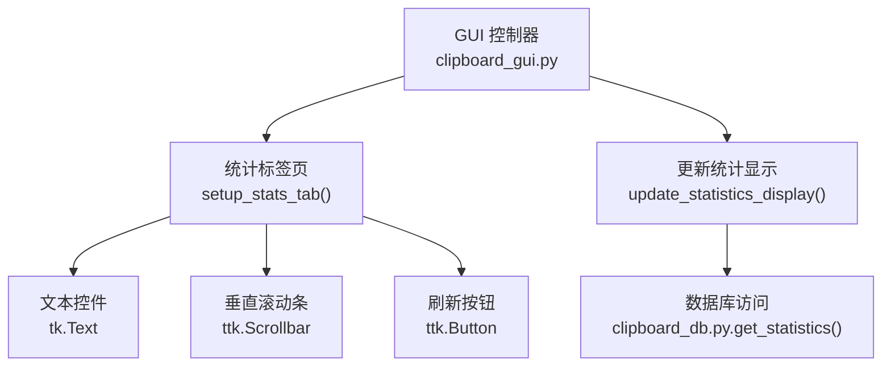
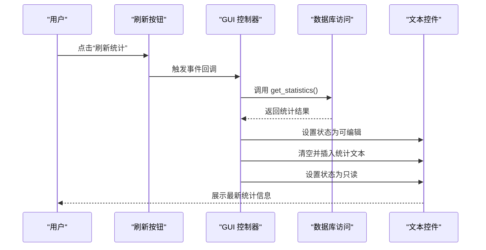
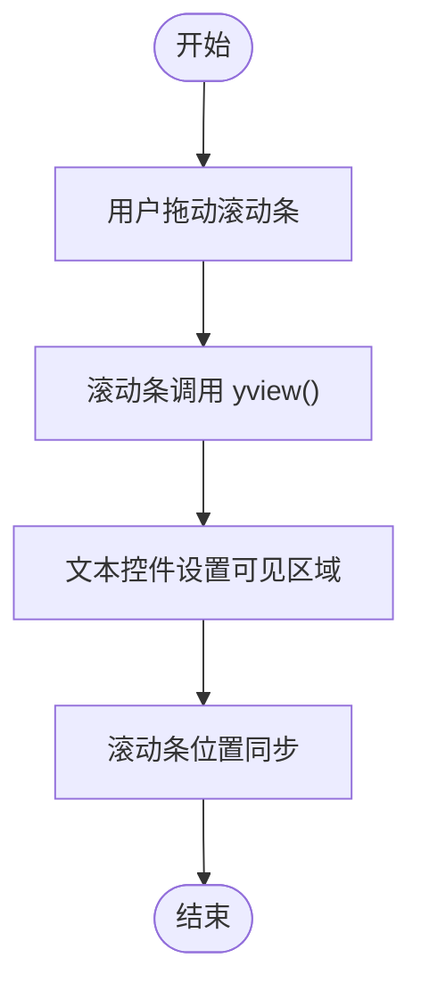
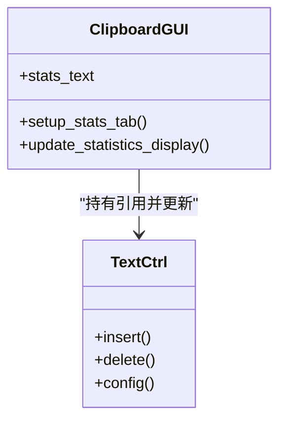
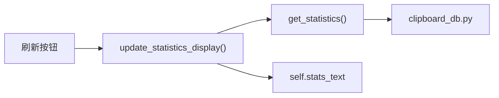

# 统计标签页界面

<cite>
**本文引用的文件**
- [clipboard_gui.py](file://clipboard_gui.py)
- [clipboard_db.py](file://clipboard_db.py)
</cite>

## 目录
1. [简介](#简介)
2. [项目结构](#项目结构)
3. [核心组件](#核心组件)
4. [架构总览](#架构总览)
5. [详细组件分析](#详细组件分析)
6. [依赖分析](#依赖分析)
7. [性能考虑](#性能考虑)
8. [故障排查指南](#故障排查指南)
9. [结论](#结论)

## 简介
本文件围绕统计标签页的界面构建与交互展开，重点说明以下方面：
- 统计标签页UI结构：tk.Text组件的文本换行配置与填充策略
- 垂直滚动条与文本控件的联动机制
- 刷新按钮的布局设计与其与update_statistics_display方法的事件绑定关系
- stats_text类属性的引用保存机制，以便后续动态更新统计信息
- 界面元素间距(padx/pady)设置的最佳实践示例

## 项目结构
统计标签页位于主界面的“统计”标签页中，由GUI控制器负责创建与更新。其核心文件如下：
- GUI控制器：clipboard_gui.py
- 数据访问层：clipboard_db.py（提供统计数据查询）

图表来源
- [clipboard_gui.py](file://clipboard_gui.py#L309-L327)
- [clipboard_gui.py](file://clipboard_gui.py#L555-L580)
- [clipboard_db.py](file://clipboard_db.py#L316-L332)

章节来源
- [clipboard_gui.py](file://clipboard_gui.py#L309-L327)
- [clipboard_gui.py](file://clipboard_gui.py#L555-L580)
- [clipboard_db.py](file://clipboard_db.py#L316-L332)

## 核心组件
- 统计标签页容器：ttk.Frame，作为统计页的根容器
- 文本控件：tk.Text，用于展示统计信息文本
- 垂直滚动条：ttk.Scrollbar，与文本控件联动
- 刷新按钮：ttk.Button，触发统计信息更新
- 类属性引用：self.stats_text，保存文本控件引用，便于后续动态更新

章节来源
- [clipboard_gui.py](file://clipboard_gui.py#L309-L327)

## 架构总览
统计标签页的构建与更新遵循“界面创建—事件绑定—数据驱动”的模式：
- 界面创建：在setup_stats_tab中创建文本控件、滚动条与刷新按钮，并将文本控件引用保存到self.stats_text
- 事件绑定：刷新按钮绑定到update_statistics_display方法
- 数据驱动：update_statistics_display通过数据库接口获取统计数据，构造文本并写入文本控件

图表来源
- [clipboard_gui.py](file://clipboard_gui.py#L309-L327)
- [clipboard_gui.py](file://clipboard_gui.py#L555-L580)
- [clipboard_db.py](file://clipboard_db.py#L316-L332)

## 详细组件分析

### 统计标签页UI结构与布局
- 文本控件配置
  - 文本换行：wrap=tk.WORD，确保长文本按单词边界换行，避免破坏单词
  - 填充策略：fill=tk.BOTH，expand=True，使文本控件随父容器大小变化而扩展
  - 边距：padx=10，pady=10，为文本控件四周留出统一间距
- 垂直滚动条
  - 方向：orient=tk.VERTICAL
  - 命令绑定：command=stats_text.yview，将滚动条动作映射到文本控件垂直滚动
  - 位置：pack(side=tk.RIGHT, fill=tk.Y)，紧贴文本控件右侧并沿Y轴填充
- 文本控件与滚动条联动
  - 文本控件配置：yscrollcommand=stats_scrollbar.set，使文本滚动时同步更新滚动条位置
- 刷新按钮
  - 容器：ttk.Frame，用于集中放置按钮并控制底部边距
  - 事件绑定：command=self.update_statistics_display，点击后触发统计更新
  - 位置：pack(pady=(0, 10))，上边距0，下边距10，形成与文本控件的视觉分隔

章节来源
- [clipboard_gui.py](file://clipboard_gui.py#L309-L327)

### 垂直滚动条与文本控件的联动机制
- 单向联动链路
  - 滚动条 -> 文本控件：滚动条的command接收文本控件的yview回调，实现滚动条位置与文本视图同步
  - 文本控件 -> 滚动条：文本控件的yscrollcommand将滚动事件反馈给滚动条，保持滚动条位置正确
- 作用效果
  - 用户拖动滚动条或使用鼠标滚轮时，文本内容与滚动条位置保持一致
  - 当文本内容超出可视范围时，滚动条提供精确的定位与导航

图表来源
- [clipboard_gui.py](file://clipboard_gui.py#L309-L327)

### 刷新按钮的布局设计与事件绑定
- 布局设计
  - 刷新按钮置于独立的ttk.Frame中，便于控制整体边距
  - pack(pady=(0, 10))设置按钮与上方文本控件的间距，形成清晰的层次感
- 事件绑定
  - command=self.update_statistics_display，点击后立即执行统计更新流程
  - 该绑定在setup_stats_tab中完成，保证按钮创建后即可响应用户操作

章节来源
- [clipboard_gui.py](file://clipboard_gui.py#L309-L327)

### stats_text类属性的引用保存机制
- 保存位置：在setup_stats_tab中创建stats_text后，将其赋值给self.stats_text
- 用途：update_statistics_display通过self.stats_text直接访问文本控件，实现动态更新
- 更新流程
  - 设置状态为可编辑，清空旧内容，插入新统计文本
  - 设置状态为只读，防止用户手动编辑统计文本
- 优势
  - 避免重复查找控件，提升更新效率
  - 降低耦合度，便于后续扩展其他统计展示逻辑

图表来源
- [clipboard_gui.py](file://clipboard_gui.py#L309-L327)
- [clipboard_gui.py](file://clipboard_gui.py#L555-L580)

章节来源
- [clipboard_gui.py](file://clipboard_gui.py#L309-L327)
- [clipboard_gui.py](file://clipboard_gui.py#L555-L580)

### 界面元素间距(padx/pady)最佳实践示例
- 文本控件：padx=10，pady=10
  - 作用：为文本内容提供内边距，避免文字紧贴边框
  - 影响：提升可读性与视觉舒适度
- 刷新按钮容器：pack(pady=(0, 10))
  - 作用：与上方文本控件形成10像素的下边距，避免按钮与文本内容粘连
  - 影响：改善界面层次与呼吸感
- 其他建议
  - 同一布局中尽量采用一致的padx/pady值，保持视觉平衡
  - 在容器内部嵌套小部件时，外层使用较大的padx/pady，内层使用较小的padx/pady，形成递进式留白

章节来源
- [clipboard_gui.py](file://clipboard_gui.py#L309-L327)

## 依赖分析
- 统计标签页依赖关系
  - GUI控制器依赖数据库访问层提供的统计数据
  - 文本控件依赖滚动条提供滚动能力
  - 刷新按钮依赖GUI控制器的更新方法
- 数据流
  - 用户点击刷新按钮 -> GUI控制器调用数据库接口 -> 返回统计数据 -> GUI控制器更新文本控件

图表来源
- [clipboard_gui.py](file://clipboard_gui.py#L309-L327)
- [clipboard_gui.py](file://clipboard_gui.py#L555-L580)
- [clipboard_db.py](file://clipboard_db.py#L316-L332)

章节来源
- [clipboard_gui.py](file://clipboard_gui.py#L309-L327)
- [clipboard_gui.py](file://clipboard_gui.py#L555-L580)
- [clipboard_db.py](file://clipboard_db.py#L316-L332)

## 性能考虑
- 文本控件状态切换
  - 更新前设置为可编辑，更新后设置为只读，减少不必要的渲染开销
- 文本批量更新
  - 先清空再一次性插入，避免多次插入导致的闪烁与重绘
- 滚动条联动
  - 仅在必要时更新滚动条位置，避免频繁刷新造成卡顿

## 故障排查指南
- 统计文本未显示
  - 检查self.stats_text是否成功保存与引用
  - 确认update_statistics_display是否被调用且未抛出异常
- 滚动条无效
  - 确认滚动条command与文本控件yview绑定正确
  - 确认文本控件yscrollcommand与滚动条set绑定正确
- 刷新按钮无响应
  - 检查按钮事件绑定是否在setup_stats_tab中完成
  - 确认update_statistics_display方法签名与绑定一致

章节来源
- [clipboard_gui.py](file://clipboard_gui.py#L309-L327)
- [clipboard_gui.py](file://clipboard_gui.py#L555-L580)

## 结论
统计标签页通过简洁的布局与明确的事件绑定，实现了“文本展示—滚动—刷新”的完整交互闭环。其关键点在于：
- 文本控件的换行与填充策略确保了良好的可读性与适应性
- 滚动条与文本控件的双向联动提供了流畅的滚动体验
- 刷新按钮与update_statistics_display的绑定实现了数据驱动的动态更新
- self.stats_text的引用保存机制简化了后续维护与扩展