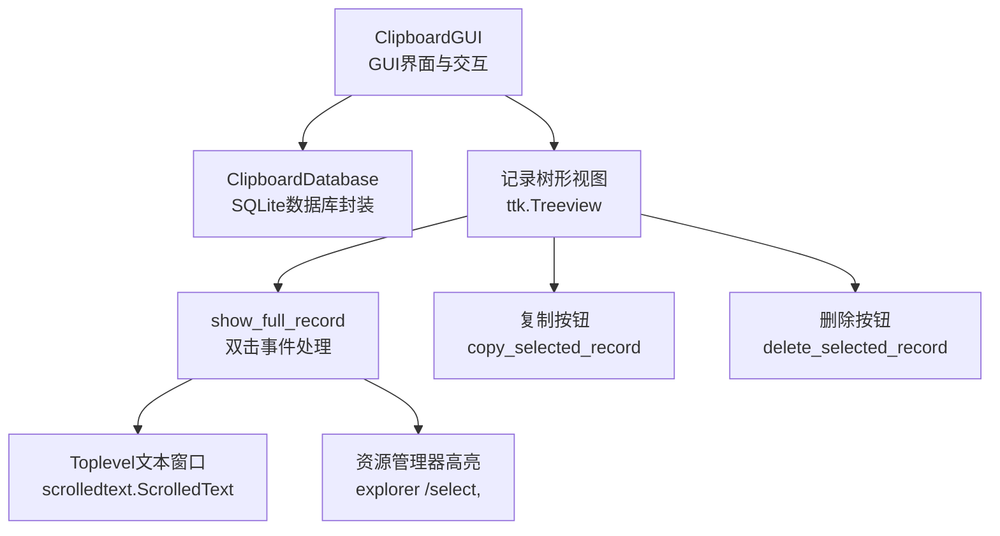
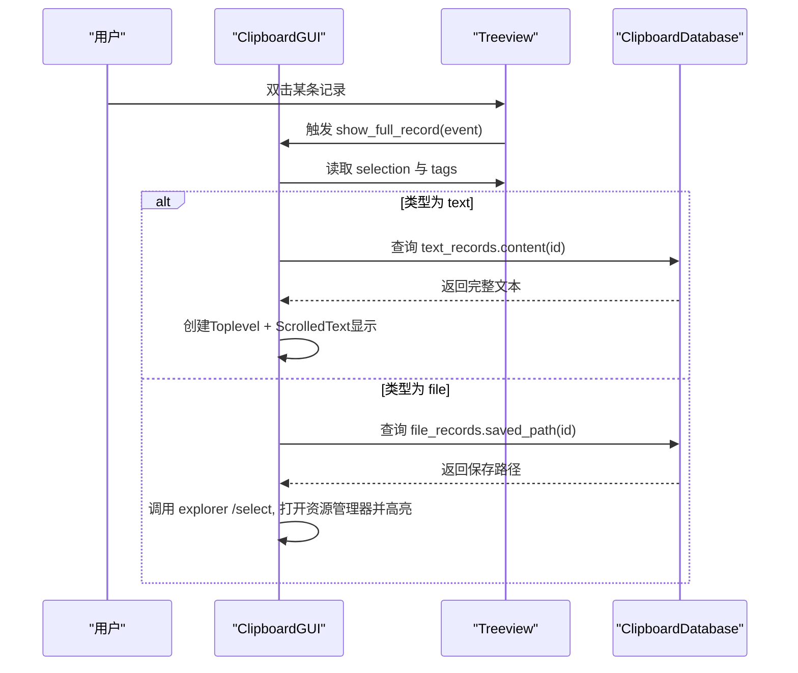
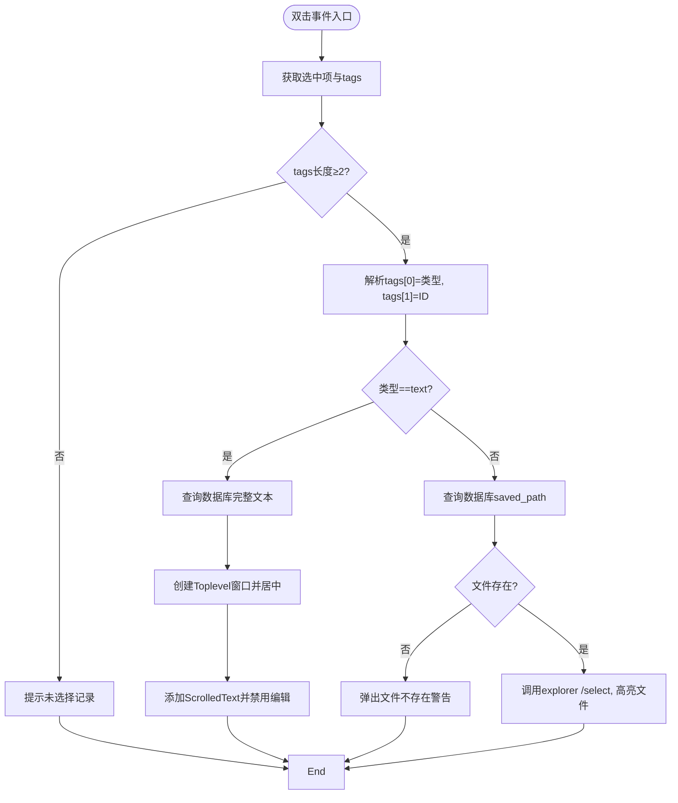
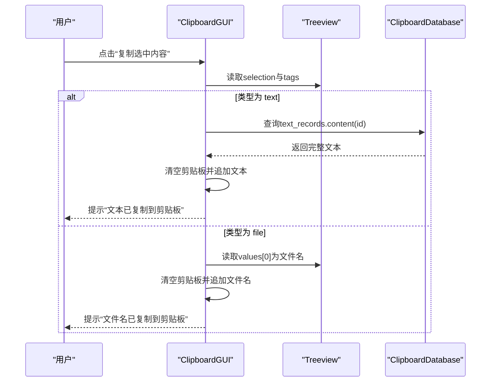
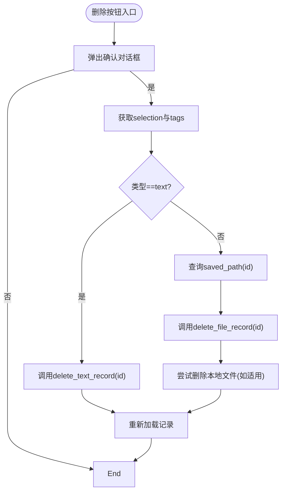
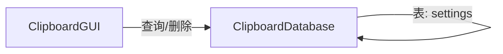

# 记录交互功能

<cite>
**本文引用的文件**
- [clipboard_gui.py](file://clipboard_gui.py)
- [clipboard_db.py](file://clipboard_db.py)
</cite>

## 目录
1. [简介](#简介)
2. [项目结构](#项目结构)
3. [核心组件](#核心组件)
4. [架构总览](#架构总览)
5. [详细组件分析](#详细组件分析)
6. [依赖关系分析](#依赖关系分析)
7. [性能考量](#性能考量)
8. [故障排查指南](#故障排查指南)
9. [结论](#结论)

## 简介
本文件聚焦于“记录交互功能”，围绕以下目标展开：
- 全面说明 show_full_record 方法的双击事件处理逻辑，包括如何通过树形视图的 tags 获取记录类型(text/file)和ID。
- 详细描述文本记录的完整内容展示流程：创建 Toplevel 窗口、居中显示、使用 scrolledtext.ScrolledText 实现可滚动文本区域。
- 解释文件记录的处理方式：通过 saved_path 定位文件并在资源管理器中高亮显示(explorer /select,)。
- 文档化 copy_selected_record 方法的剪贴板复制实现。
- 文档化 delete_selected_record 方法的删除确认流程。
- 说明 user_action_in_progress 标志在防止并发操作中的作用。

## 项目结构
本项目采用“GUI + 数据库”分层设计：
- GUI 层负责用户交互与界面展示，核心类为 ClipboardGUI。
- 数据库层负责数据持久化与查询，核心类为 ClipboardDatabase。
- 双击事件绑定在 GUI 的记录树形视图上，调用 show_full_record 进行内容展示；复制与删除分别由按钮触发，调用 copy_selected_record 与 delete_selected_record。

图表来源
- [clipboard_gui.py](file://clipboard_gui.py#L227-L279)
- [clipboard_gui.py](file://clipboard_gui.py#L749-L795)
- [clipboard_gui.py](file://clipboard_gui.py#L796-L838)
- [clipboard_gui.py](file://clipboard_gui.py#L839-L878)
- [clipboard_db.py](file://clipboard_db.py#L185-L261)

章节来源
- [clipboard_gui.py](file://clipboard_gui.py#L227-L279)
- [clipboard_gui.py](file://clipboard_gui.py#L749-L795)
- [clipboard_gui.py](file://clipboard_gui.py#L796-L838)
- [clipboard_gui.py](file://clipboard_gui.py#L839-L878)
- [clipboard_db.py](file://clipboard_db.py#L185-L261)

## 核心组件
- ClipboardGUI：负责构建界面、维护用户操作状态、处理双击事件、复制与删除等交互。
- ClipboardDatabase：负责数据库初始化、记录查询、统计、设置读写、删除过期记录等。

章节来源
- [clipboard_gui.py](file://clipboard_gui.py#L37-L71)
- [clipboard_db.py](file://clipboard_db.py#L13-L115)

## 架构总览
GUI 与数据库通过方法调用解耦，事件驱动交互：
- 双击事件：从 Treeview 的 tags 中提取记录类型与ID，分别走文本详情窗口或文件资源管理器高亮。
- 复制事件：根据记录类型复制完整文本或文件名至剪贴板。
- 删除事件：弹出确认对话框，确认后删除数据库记录并尝试删除本地文件（如适用）。

图表来源
- [clipboard_gui.py](file://clipboard_gui.py#L749-L795)
- [clipboard_db.py](file://clipboard_db.py#L185-L218)

## 详细组件分析

### 双击事件处理：show_full_record
- 事件绑定：在记录标签页中，为 Treeview 绑定双击事件，回调函数为 show_full_record。
- 选择与标签解析：
  - 获取当前选中项的 tags 列表；
  - tags[0] 表示记录类型（"text" 或 "file"），tags[1] 表示记录ID。
- 文本记录处理：
  - 从数据库查询完整文本内容；
  - 创建 Toplevel 子窗口，居中显示；
  - 使用 scrolledtext.ScrolledText 构建可滚动文本区域，禁用编辑状态以只读展示。
- 文件记录处理：
  - 从数据库查询 saved_path；
  - 若文件存在，调用系统命令 explorer /select, 高亮显示文件所在位置；
  - 若文件不存在，弹出警告提示。

图表来源
- [clipboard_gui.py](file://clipboard_gui.py#L749-L795)
- [clipboard_db.py](file://clipboard_db.py#L185-L218)

章节来源
- [clipboard_gui.py](file://clipboard_gui.py#L269-L271)
- [clipboard_gui.py](file://clipboard_gui.py#L749-L795)

### 文本记录完整内容展示流程
- 创建窗口：使用 Toplevel 构建新窗口，设置标题与尺寸。
- 居中显示：调用 center_child_window 计算屏幕中心并设置 geometry。
- 可滚动文本区域：使用 scrolledtext.ScrolledText，插入完整文本后禁用编辑状态，避免用户修改。
- 数据来源：通过数据库查询 text_records 的 content 字段，保证显示最新内容。

章节来源
- [clipboard_gui.py](file://clipboard_gui.py#L771-L782)
- [clipboard_db.py](file://clipboard_db.py#L185-L218)

### 文件记录处理方式
- 通过 saved_path 定位文件：
  - 从数据库查询 file_records 的 saved_path；
  - 若文件存在，调用系统命令 explorer /select, 高亮显示文件所在位置；
  - 若文件不存在，弹出警告提示。
- 注意：该流程不涉及文件内容读取，仅用于资源管理器定位与高亮。

章节来源
- [clipboard_gui.py](file://clipboard_gui.py#L783-L794)
- [clipboard_db.py](file://clipboard_db.py#L223-L261)

### 剪贴板复制：copy_selected_record
- 用户操作状态标记：在方法开始与结束处设置 user_action_in_progress，避免并发操作冲突。
- 选择与标签解析：与双击类似，从 Treeview 的 selection 与 tags 中获取类型与ID。
- 文本记录复制：
  - 从数据库查询完整文本；
  - 清空剪贴板并追加文本，提示“文本已复制到剪贴板”。
- 文件记录复制：
  - 从 Treeview 的 values 中取名称或内容列（文件名）；
  - 清空剪贴板并追加文件名，提示“文件名已复制到剪贴板”。

图表来源
- [clipboard_gui.py](file://clipboard_gui.py#L796-L838)
- [clipboard_db.py](file://clipboard_db.py#L185-L218)

章节来源
- [clipboard_gui.py](file://clipboard_gui.py#L796-L838)

### 删除记录：delete_selected_record
- 用户操作状态标记：在方法开始与结束处设置 user_action_in_progress。
- 选择与标签解析：从 Treeview 的 selection 与 tags 中获取类型与ID。
- 删除确认：
  - 弹出“确定要删除这条记录吗？”的确认对话框；
  - 用户点击“是”后继续执行删除。
- 删除执行：
  - 文本记录：调用 delete_text_record；
  - 文件记录：先查询 saved_path，再调用 delete_file_record，并尝试删除本地文件（若不再被引用）。
- 刷新显示：删除完成后重新加载记录列表。

图表来源
- [clipboard_gui.py](file://clipboard_gui.py#L839-L878)
- [clipboard_db.py](file://clipboard_db.py#L334-L349)

章节来源
- [clipboard_gui.py](file://clipboard_gui.py#L839-L878)

### user_action_in_progress 标志的作用
- 并发控制：在复制、删除、设置、重置等用户操作开始时设置为 True，在 finally 中统一复位为 False，防止用户在操作进行中触发其他交互导致竞态。
- 自动更新抑制：在自动更新任务中，若 user_action_in_progress 为 True，则跳过刷新，避免干扰用户操作。

章节来源
- [clipboard_gui.py](file://clipboard_gui.py#L43-L47)
- [clipboard_gui.py](file://clipboard_gui.py#L836-L838)
- [clipboard_gui.py](file://clipboard_gui.py#L875-L878)
- [clipboard_gui.py](file://clipboard_gui.py#L1686-L1696)

## 依赖关系分析
- GUI 依赖数据库接口：
  - show_full_record：查询 text_records 或 file_records；
  - copy_selected_record：查询 text_records；
  - delete_selected_record：删除 text_records 或 file_records，并可能删除本地文件。
- 数据库提供：
  - 记录查询与统计；
  - 设置读写与过期记录清理。

图表来源
- [clipboard_gui.py](file://clipboard_gui.py#L749-L795)
- [clipboard_gui.py](file://clipboard_gui.py#L796-L838)
- [clipboard_gui.py](file://clipboard_gui.py#L839-L878)
- [clipboard_db.py](file://clipboard_db.py#L185-L261)
- [clipboard_db.py](file://clipboard_db.py#L334-L349)

章节来源
- [clipboard_gui.py](file://clipboard_gui.py#L749-L795)
- [clipboard_gui.py](file://clipboard_gui.py#L796-L838)
- [clipboard_gui.py](file://clipboard_gui.py#L839-L878)
- [clipboard_db.py](file://clipboard_db.py#L185-L261)
- [clipboard_db.py](file://clipboard_db.py#L334-L349)

## 性能考量
- 自动更新频率：每 2 秒检查一次，仅在窗口可见且无用户操作与焦点时刷新，降低 CPU 占用。
- 数据库查询：文本与文件记录均支持排序与限制数量，避免一次性加载过多数据。
- UI 组件：文本详情窗口使用 ScrolledText，适合长文本展示；Treeview 本身具备虚拟化能力，配合分页策略可进一步优化大数据量场景。

章节来源
- [clipboard_gui.py](file://clipboard_gui.py#L1676-L1696)
- [clipboard_db.py](file://clipboard_db.py#L185-L261)

## 故障排查指南
- 双击无响应：
  - 检查是否正确选择了记录（selection 是否为空）；
  - 检查 tags 是否包含至少两个元素（类型与ID）。
- 文本详情窗口未显示：
  - 确认数据库查询返回了完整文本；
  - 确认 Toplevel 创建与居中逻辑正常。
- 文件高亮失败：
  - 检查 saved_path 是否存在；
  - 确认系统命令 explorer /select, 调用成功。
- 复制无效：
  - 确认 user_action_in_progress 未阻塞；
  - 检查剪贴板清空与追加逻辑。
- 删除未生效：
  - 确认确认对话框已选择“是”；
  - 检查数据库删除接口是否调用；
  - 若删除文件失败，检查文件是否仍被其他进程占用。

章节来源
- [clipboard_gui.py](file://clipboard_gui.py#L749-L795)
- [clipboard_gui.py](file://clipboard_gui.py#L796-L838)
- [clipboard_gui.py](file://clipboard_gui.py#L839-L878)
- [clipboard_db.py](file://clipboard_db.py#L185-L218)
- [clipboard_db.py](file://clipboard_db.py#L334-L349)

## 结论
本功能通过 Treeview 的 tags 与 selection 实现对记录类型的精准识别，结合数据库查询与系统命令，分别实现了文本详情窗口与文件资源管理器高亮。复制与删除操作均通过 user_action_in_progress 标志有效防止并发冲突，并在自动更新中进行抑制，保障用户体验与系统稳定性。建议在后续版本中：
- 为复制与删除操作增加更细粒度的错误反馈；
- 对大数据量场景引入分页或懒加载策略；
- 对文件删除失败的情况提供重试或手动清理指引。