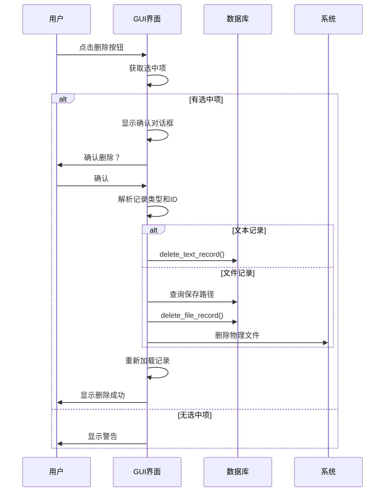

# 记录删除交互

<cite>
**本文档引用的文件**   
- [clipboard_gui.py](file://clipboard_gui.py#L839-L877)
- [clipboard_db.py](file://clipboard_db.py#L334-L348)
</cite>

## 目录
1. [删除确认流程](#删除确认流程)
2. [记录类型识别与删除](#记录类型识别与删除)
3. [UI更新机制](#ui更新机制)
4. [用户操作保护](#用户操作保护)

## 删除确认流程

`delete_selected_record`方法实现了完整的用户确认流程，以防止误删重要记录。当用户点击"删除选中记录"按钮时，系统首先检查是否有选中的记录。如果有选中记录，则弹出`messagebox.askyesno`确认对话框，提示用户"确定要删除这条记录吗？"。

这种双重确认机制确保了用户在执行删除操作前有明确的确认步骤，有效防止了意外删除。只有当用户在对话框中选择"是"时，系统才会继续执行删除操作；如果用户选择"否"或关闭对话框，则删除操作被取消，程序流返回到正常状态。

**Section sources**
- [clipboard_gui.py](file://clipboard_gui.py#L846-L847)

## 记录类型识别与删除

删除流程中，系统通过树形视图的选中项获取待删除记录的详细信息。首先通过`self.records_tree.selection()`获取选中的项目，然后使用`self.records_tree.item(item, "tags")`方法提取项目的标签信息。这些标签包含了记录的关键元数据，包括记录类型（"text"或"file"）和记录ID。

系统根据解析出的记录类型调用相应的数据库删除方法：
- 对于文本记录，直接调用`self.db.delete_text_record(record_id)`方法
- 对于文件记录，先查询数据库获取文件的保存路径，然后调用`self.db.delete_file_record(record_id)`删除数据库记录，最后尝试删除对应的物理文件

这种基于标签的类型识别机制使得系统能够统一处理不同类型的记录，同时确保每种类型都得到适当的处理。

**Diagram sources **
- [clipboard_gui.py](file://clipboard_gui.py#L844-L868)

**Section sources**
- [clipboard_gui.py](file://clipboard_gui.py#L848-L853)

## UI更新机制

删除操作完成后，系统会自动更新用户界面以反映最新的数据状态。UI更新机制包含两个关键步骤：

1. **重新加载记录列表**：调用`self.load_records()`方法，该方法会清空当前的树形视图并从数据库重新加载所有记录。这确保了用户界面显示的是最新的数据，已删除的记录不再显示。

2. **刷新统计信息**：在重新加载记录的同时，系统会自动更新统计信息显示。通过调用`self.update_statistics_display()`方法，界面右下角的统计信息会被刷新，显示当前的文本记录数、文件记录数和累计大小等数据。

这种自动更新机制为用户提供了即时的反馈，让用户清楚地知道删除操作已经成功执行，并且界面数据已经同步更新。

**Section sources**
- [clipboard_gui.py](file://clipboard_gui.py#L871-L872)

## 用户操作保护

在整个删除过程中，`user_action_in_progress`标志起到了关键的保护作用。该标志在删除操作开始时被设置为`True`，在操作完成或发生异常时被重置为`False`。

这种机制确保了在删除执行期间阻止其他用户操作，避免了竞态条件。例如，当一个删除操作正在进行时，用户无法同时启动另一个删除操作或执行其他可能影响数据一致性的操作。这不仅提高了系统的稳定性，也防止了因并发操作导致的数据损坏或异常状态。

通过try-finally结构，系统确保无论删除操作成功与否，`user_action_in_progress`标志都会被正确重置，从而保证了状态机的完整性。

**Section sources**
- [clipboard_gui.py](file://clipboard_gui.py#L842-L843)
- [clipboard_gui.py](file://clipboard_gui.py#L876-L877)