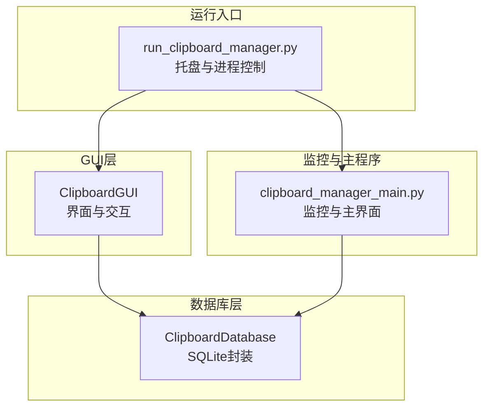
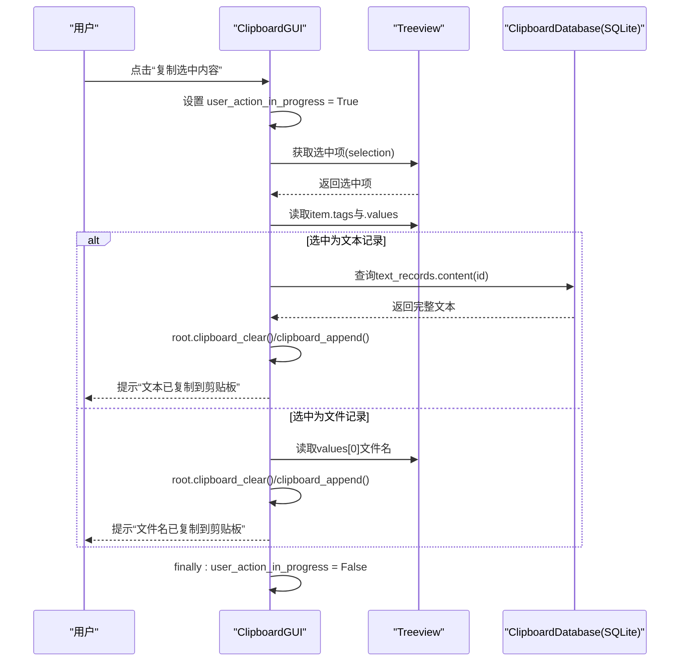
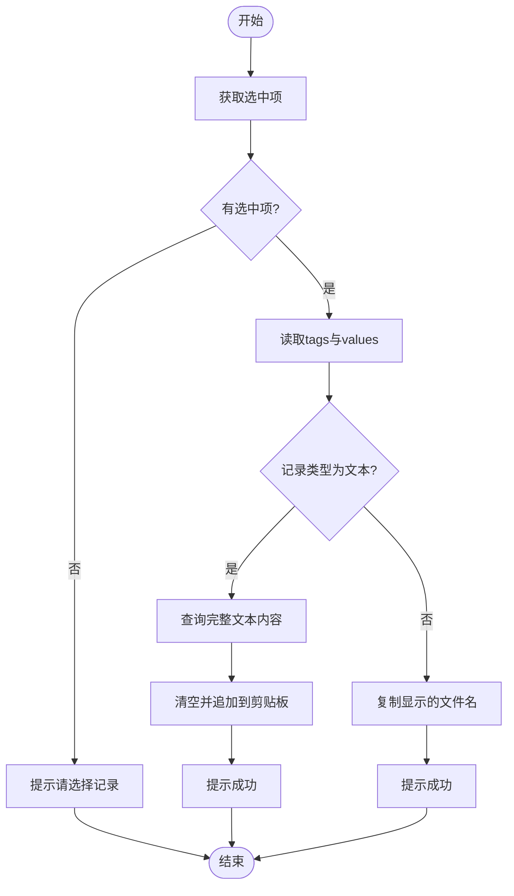
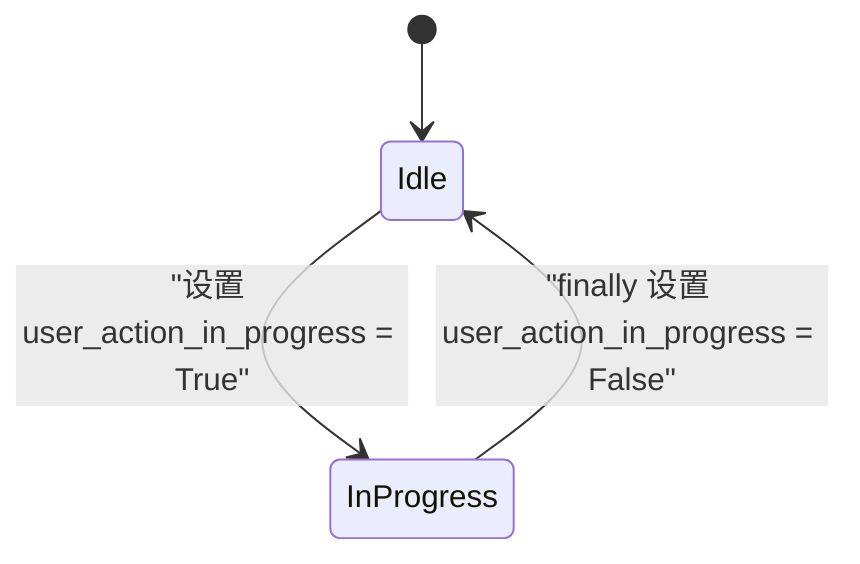
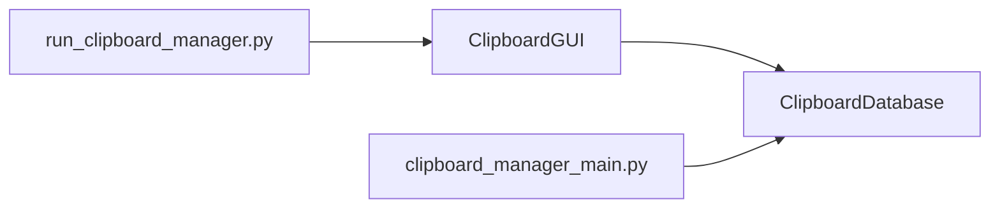

# 记录复制交互

<cite>
**本文档引用的文件**
- [clipboard_gui.py](file://clipboard_gui.py)
- [clipboard_db.py](file://clipboard_db.py)
- [run_clipboard_manager.py](file://run_clipboard_manager.py)
- [clipboard_manager_main.py](file://clipboard_manager_main.py)
</cite>

## 目录
1. [简介](#简介)
2. [项目结构](#项目结构)
3. [核心组件](#核心组件)
4. [架构总览](#架构总览)
5. [详细组件分析](#详细组件分析)
6. [依赖关系分析](#依赖关系分析)
7. [性能考量](#性能考量)
8. [故障排查指南](#故障排查指南)
9. [结论](#结论)

## 简介
本文件聚焦于“复制选中记录”交互的实现逻辑，围绕以下目标展开：
- 如何从树形视图中获取选中项
- 如何通过item的tags提取记录类型与ID
- 如何调用数据库接口读取原始内容
- 文本内容复制到系统剪贴板的具体实现（使用tkinter的剪贴板操作）
- 文件记录复制其原始路径的处理方式
- user_action_in_progress标志的作用：在操作开始时设为True，防止其他并发操作（如删除或刷新）干扰当前复制流程，确保数据一致性与操作原子性

## 项目结构
本项目采用模块化设计，GUI层负责界面与用户交互，数据库层负责持久化与查询，运行入口负责进程生命周期与托盘集成。

图表来源
- [clipboard_gui.py](file://clipboard_gui.py#L37-L68)
- [clipboard_db.py](file://clipboard_db.py#L13-L115)
- [run_clipboard_manager.py](file://run_clipboard_manager.py#L32-L71)
- [clipboard_manager_main.py](file://clipboard_manager_main.py#L1-L120)

章节来源
- [clipboard_gui.py](file://clipboard_gui.py#L37-L68)
- [clipboard_db.py](file://clipboard_db.py#L13-L115)
- [run_clipboard_manager.py](file://run_clipboard_manager.py#L32-L71)
- [clipboard_manager_main.py](file://clipboard_manager_main.py#L1-L120)

## 核心组件
- ClipboardGUI：提供树形视图展示历史记录，处理复制、删除等用户操作，并通过user_action_in_progress保护关键流程。
- ClipboardDatabase：封装SQLite数据库的初始化、查询、更新与删除操作。
- run_clipboard_manager.py：负责托盘图标、进程互斥、隐藏主窗口、启动监控线程。
- clipboard_manager_main.py：提供独立的监控器与GUI主界面（非本交互流程使用）。

章节来源
- [clipboard_gui.py](file://clipboard_gui.py#L37-L68)
- [clipboard_db.py](file://clipboard_db.py#L13-L115)
- [run_clipboard_manager.py](file://run_clipboard_manager.py#L32-L71)
- [clipboard_manager_main.py](file://clipboard_manager_main.py#L1-L120)

## 架构总览
复制选中记录的端到端流程如下：

图表来源
- [clipboard_gui.py](file://clipboard_gui.py#L796-L838)
- [clipboard_db.py](file://clipboard_db.py#L185-L214)

章节来源
- [clipboard_gui.py](file://clipboard_gui.py#L796-L838)
- [clipboard_db.py](file://clipboard_db.py#L185-L214)

## 详细组件分析

### 复制选中记录：copy_selected_record 方法
- 获取选中项
  - 通过树形视图的selection()获取当前选中项
  - 通过item(..., "tags")读取记录类型与ID
  - 通过item(..., "values")读取显示值（文件记录时取名称或内容列）
- 文本记录复制
  - 依据ID查询完整文本内容
  - 使用root.clipboard_clear()与root.clipboard_append()写入剪贴板
- 文件记录复制
  - 直接复制显示的文件名（而非原始路径），便于用户粘贴到文件管理器或命令行
- user_action_in_progress 标志
  - 在进入方法时置为True，保证期间不会被其他操作中断
  - finally块中统一置为False，确保异常场景也能恢复状态

图表来源
- [clipboard_gui.py](file://clipboard_gui.py#L796-L838)

章节来源
- [clipboard_gui.py](file://clipboard_gui.py#L796-L838)

### 树形视图选中项与tags解析
- 树形视图插入记录时，使用tags绑定记录类型与ID，例如("text", record_id)或("file", record_id)
- 选中后通过item(..., "tags")可直接获取类型与ID
- 通过item(..., "values")可获取显示列（文件记录时取名称或内容列）

章节来源
- [clipboard_gui.py](file://clipboard_gui.py#L616-L623)
- [clipboard_gui.py](file://clipboard_gui.py#L796-L838)

### 数据库接口读取原始内容
- 文本记录：依据ID查询完整文本内容
- 文件记录：复制显示的文件名（非原始路径），避免泄露内部保存路径

章节来源
- [clipboard_db.py](file://clipboard_db.py#L185-L214)
- [clipboard_gui.py](file://clipboard_gui.py#L810-L832)

### 系统剪贴板操作
- 使用tk.Tk对象的clipboard_clear()与clipboard_append()实现清空并追加内容
- 该操作属于GUI线程范畴，无需额外跨平台库

章节来源
- [clipboard_gui.py](file://clipboard_gui.py#L820-L832)

### user_action_in_progress 标志的作用
- 并发保护：在复制、删除、重置等关键操作开始时置为True，防止其他操作（如刷新、删除）在中途修改数据
- 原子性保障：通过finally确保无论成功与否都会恢复标志，避免状态悬挂
- 典型使用：复制、删除、重置、设置等方法均采用相同模式

图表来源
- [clipboard_gui.py](file://clipboard_gui.py#L796-L838)
- [clipboard_gui.py](file://clipboard_gui.py#L840-L877)
- [clipboard_gui.py](file://clipboard_gui.py#L890-L949)

章节来源
- [clipboard_gui.py](file://clipboard_gui.py#L796-L838)
- [clipboard_gui.py](file://clipboard_gui.py#L840-L877)
- [clipboard_gui.py](file://clipboard_gui.py#L890-L949)

## 依赖关系分析
- GUI层依赖数据库层：复制与删除等操作均通过ClipboardDatabase访问SQLite
- 运行入口依赖GUI层：通过ClipboardGUI构建界面、托盘与隐藏主窗口
- 监控与主程序（clipboard_manager_main.py）与本交互流程解耦，但共享数据库

图表来源
- [clipboard_gui.py](file://clipboard_gui.py#L37-L68)
- [clipboard_db.py](file://clipboard_db.py#L13-L115)
- [run_clipboard_manager.py](file://run_clipboard_manager.py#L32-L71)
- [clipboard_manager_main.py](file://clipboard_manager_main.py#L1-L120)

章节来源
- [clipboard_gui.py](file://clipboard_gui.py#L37-L68)
- [clipboard_db.py](file://clipboard_db.py#L13-L115)
- [run_clipboard_manager.py](file://run_clipboard_manager.py#L32-L71)
- [clipboard_manager_main.py](file://clipboard_manager_main.py#L1-L120)

## 性能考量
- 复制操作均为轻量级数据库查询与剪贴板写入，性能开销极低
- user_action_in_progress仅用于串行化关键操作，避免竞态，不影响整体吞吐
- 若未来记录规模扩大，建议：
  - 为常用查询字段建立索引（当前已有部分索引）
  - 对频繁读取的字段（如content）考虑缓存策略（需权衡内存与一致性）

## 故障排查指南
- 复制无响应
  - 检查是否选择了记录（未选择会弹出提示）
  - 确认user_action_in_progress未被其他长时间操作占用
- 文本复制失败
  - 确认数据库中对应ID存在且可查询
  - 检查剪贴板权限与系统状态
- 文件名复制异常
  - 确认显示列正确（文件记录取名称或内容列）
- 并发冲突
  - 若同时执行删除/刷新等操作，可能因user_action_in_progress阻塞导致卡顿，等待操作完成

章节来源
- [clipboard_gui.py](file://clipboard_gui.py#L796-L838)
- [clipboard_gui.py](file://clipboard_gui.py#L840-L877)

## 结论
- copy_selected_record通过树形视图的tags与values精准定位记录类型与ID，分别走文本完整内容查询与文件名复制两条路径
- 系统剪贴板操作采用tkinter标准接口，简单可靠
- user_action_in_progress有效防止并发操作干扰，确保复制流程的原子性与一致性
- 当前实现聚焦于“复制”，文件记录复制的是文件名而非原始路径，符合用户直觉与安全考虑