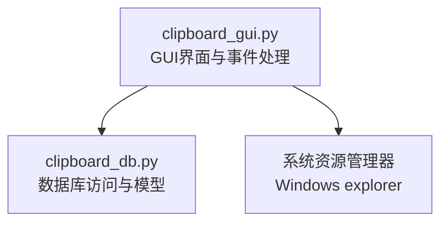
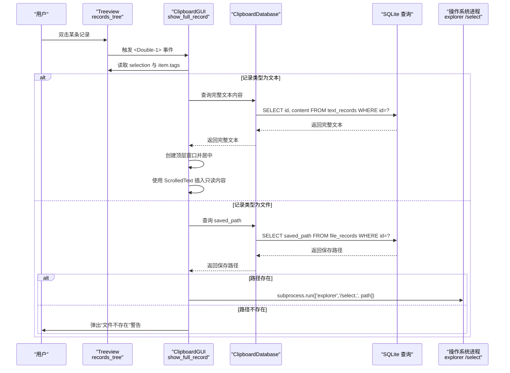
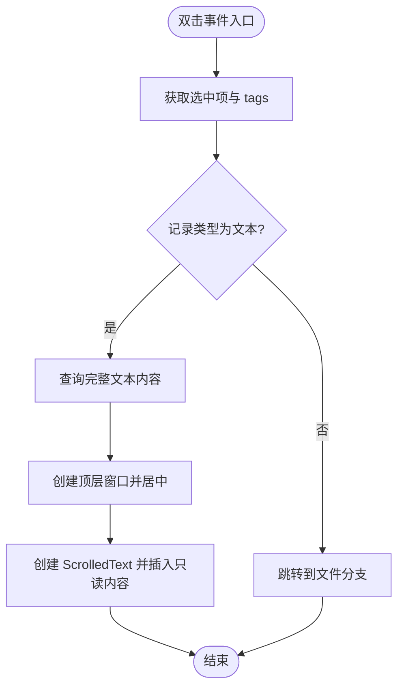
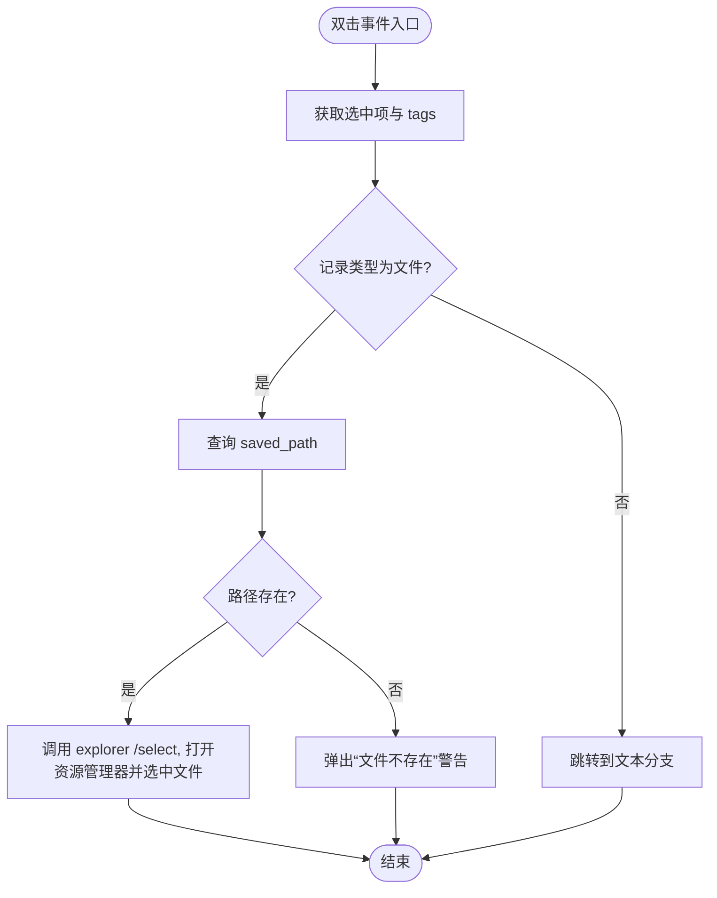
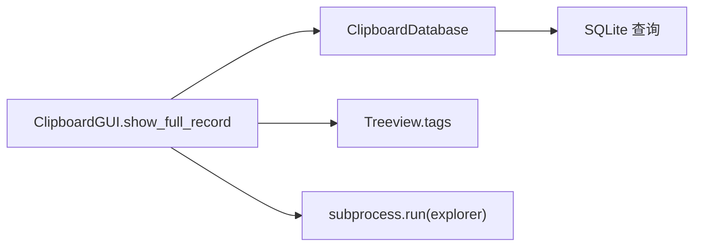

# 记录查看交互

<cite>
**本文引用的文件**
- [clipboard_gui.py](file://clipboard_gui.py)
- [clipboard_db.py](file://clipboard_db.py)
</cite>

## 目录
1. [简介](#简介)
2. [项目结构](#项目结构)
3. [核心组件](#核心组件)
4. [架构概览](#架构概览)
5. [详细组件分析](#详细组件分析)
6. [依赖关系分析](#依赖关系分析)
7. [性能考量](#性能考量)
8. [故障排查指南](#故障排查指南)
9. [结论](#结论)

## 简介
本文件围绕“记录查看交互”主题，聚焦于双击事件触发的 show_full_record 方法，系统性说明其处理流程与实现细节。重点涵盖：
- 如何通过 tree.item(item, 'tags') 提取记录类型与数据库ID
- 文本记录的完整内容展示机制：创建顶层窗口、居中显示、使用可滚动文本区域并插入只读内容
- 文件记录的处理逻辑：通过 saved_path 字段定位文件路径，并使用系统进程在资源管理器中高亮显示文件
- 异常处理路径：当文件不存在时给出警告提示

## 项目结构
本仓库包含多个脚本文件，其中与“记录查看交互”直接相关的文件为 clipboard_gui.py（GUI界面与事件处理）、clipboard_db.py（数据库访问与模型）。show_full_record 方法位于 GUI 层，负责响应用户双击事件并根据记录类型执行不同展示策略。

图表来源
- [clipboard_gui.py](file://clipboard_gui.py#L749-L795)
- [clipboard_db.py](file://clipboard_db.py#L185-L261)

章节来源
- [clipboard_gui.py](file://clipboard_gui.py#L227-L279)
- [clipboard_db.py](file://clipboard_db.py#L185-L261)

## 核心组件
- GUI层组件
  - 记录树形视图 records_tree：承载文本与文件两类记录，双击事件绑定至 show_full_record
  - show_full_record：双击事件处理器，依据记录类型分别处理文本与文件
  - center_child_window：子窗口居中显示工具函数
- 数据库层组件
  - ClipboardDatabase：提供文本与文件记录的查询接口，以及数据库初始化与维护能力

章节来源
- [clipboard_gui.py](file://clipboard_gui.py#L227-L279)
- [clipboard_gui.py](file://clipboard_gui.py#L749-L795)
- [clipboard_gui.py](file://clipboard_gui.py#L111-L123)
- [clipboard_db.py](file://clipboard_db.py#L185-L261)

## 架构概览
show_full_record 的调用链路如下：
- 用户双击记录行 -> 触发 records_tree 的 <Double-1> 事件 -> 调用 show_full_record
- show_full_record 读取选中项的 tags，解析记录类型与数据库ID
- 文本记录：从数据库查询完整内容，创建顶层窗口，ScrolledText 插入只读内容
- 文件记录：从数据库查询 saved_path，若存在则调用系统进程在资源管理器中高亮显示，否则弹出警告

图表来源
- [clipboard_gui.py](file://clipboard_gui.py#L749-L795)
- [clipboard_db.py](file://clipboard_db.py#L185-L261)

## 详细组件分析

### 双击事件与记录类型识别
- 事件绑定
  - 在记录标签页中，为 Treeview 绑定了 <Double-1> 事件，回调指向 show_full_record
- 记录类型与ID提取
  - 通过 tree.item(item, 'tags') 获取标签元组，约定第一个元素为记录类型（text 或 file），第二个元素为数据库ID
- 选择校验
  - 若未选中任何项，则不执行后续逻辑

章节来源
- [clipboard_gui.py](file://clipboard_gui.py#L269-L271)
- [clipboard_gui.py](file://clipboard_gui.py#L749-L759)

### 文本记录完整内容展示机制
- 数据库查询
  - 通过 ClipboardDatabase 查询完整文本内容，返回 id 与 content
- 窗口创建与居中
  - 使用 Toplevel 创建新窗口，调用 center_child_window 实现屏幕居中
- 可滚动文本区域
  - 使用 scrolledtext.ScrolledText 构建可滚动文本框
  - 插入完整文本后，将控件设为只读状态，避免用户编辑
- 关闭与焦点
  - 顶层窗口独立存在，不影响主窗口；关闭后回到主界面

图表来源
- [clipboard_gui.py](file://clipboard_gui.py#L749-L795)
- [clipboard_gui.py](file://clipboard_gui.py#L111-L123)
- [clipboard_db.py](file://clipboard_db.py#L185-L209)

章节来源
- [clipboard_gui.py](file://clipboard_gui.py#L749-L795)
- [clipboard_gui.py](file://clipboard_gui.py#L111-L123)
- [clipboard_db.py](file://clipboard_db.py#L185-L209)

### 文件记录处理逻辑
- 数据库查询
  - 通过 ClipboardDatabase 查询 saved_path 字段
- 路径存在性判断
  - 若路径存在：调用系统进程在资源管理器中高亮显示该文件
  - 若路径不存在：弹出“文件不存在”的警告提示
- Windows 资源管理器集成
  - 使用 subprocess.run(['explorer', '/select,', path]) 打开资源管理器并选中目标文件

图表来源
- [clipboard_gui.py](file://clipboard_gui.py#L783-L795)
- [clipboard_db.py](file://clipboard_db.py#L223-L259)

章节来源
- [clipboard_gui.py](file://clipboard_gui.py#L783-L795)
- [clipboard_db.py](file://clipboard_db.py#L223-L259)

### 异常处理路径
- 文件不存在
  - 当 saved_path 查询结果为空或路径不存在时，弹出“文件不存在”的警告提示
- 文本记录缺失
  - 当查询不到对应文本记录时，show_full_record 中未显式处理，但复制与删除等其他分支会提示“无法获取文本内容”或“请先选择一条记录”，可参考这些分支的提示策略

章节来源
- [clipboard_gui.py](file://clipboard_gui.py#L790-L794)

## 依赖关系分析
- 组件耦合
  - ClipboardGUI 依赖 ClipboardDatabase 进行数据查询
  - show_full_record 依赖 records_tree 的 selection 与 tags 结构
- 数据结构约定
  - Treeview 插入记录时使用 tags 元组，约定第一个元素为记录类型（text/file），第二个元素为数据库ID
- 外部依赖
  - Windows 资源管理器：通过 subprocess 调用 explorer
  - SQLite：用于读取文本与文件记录的完整内容及路径

图表来源
- [clipboard_gui.py](file://clipboard_gui.py#L749-L795)
- [clipboard_db.py](file://clipboard_db.py#L185-L261)

章节来源
- [clipboard_gui.py](file://clipboard_gui.py#L749-L795)
- [clipboard_db.py](file://clipboard_db.py#L185-L261)

## 性能考量
- 查询复杂度
  - 文本与文件记录的查询均为单条记录检索，时间复杂度 O(1)，受数据库索引影响
- UI渲染
  - 文本内容插入 ScrolledText 后即禁用编辑，避免不必要的交互开销
- 资源管理
  - 子窗口独立存在，避免阻塞主窗口；文件路径不存在时不执行外部进程，减少无效IO

## 故障排查指南
- 双击无反应
  - 检查是否正确选中某条记录；未选中时不会触发处理逻辑
- 文本窗口未显示
  - 确认数据库中是否存在对应ID的文本记录；若不存在，需检查数据一致性
- 文件未打开资源管理器
  - 检查 saved_path 是否为空或已被移动/删除；若不存在，将弹出“文件不存在”警告
- 资源管理器未选中文件
  - 确认传入的路径有效且可访问；必要时手动定位文件所在目录

章节来源
- [clipboard_gui.py](file://clipboard_gui.py#L749-L795)

## 结论
show_full_record 方法通过 Treeview 的 tags 约定，实现了对文本与文件两类记录的差异化展示：文本记录以只读窗口呈现完整内容，文件记录则直接在资源管理器中高亮显示。该设计简洁清晰，异常处理完善，用户体验良好。建议在后续版本中统一提示风格，增强一致性。