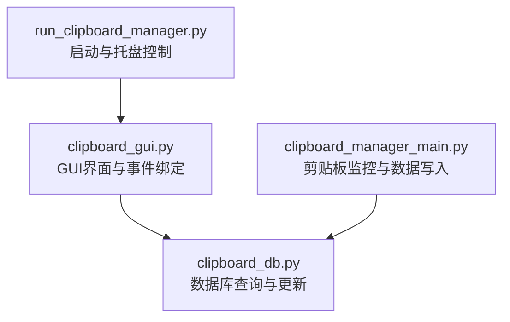
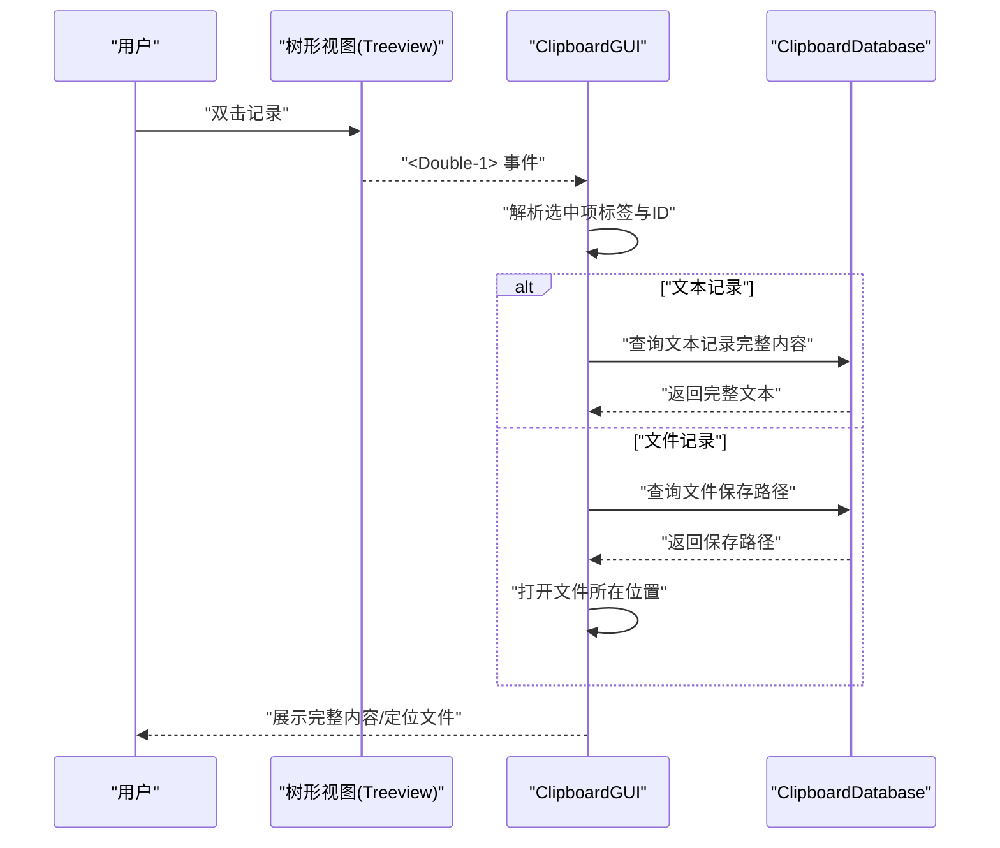
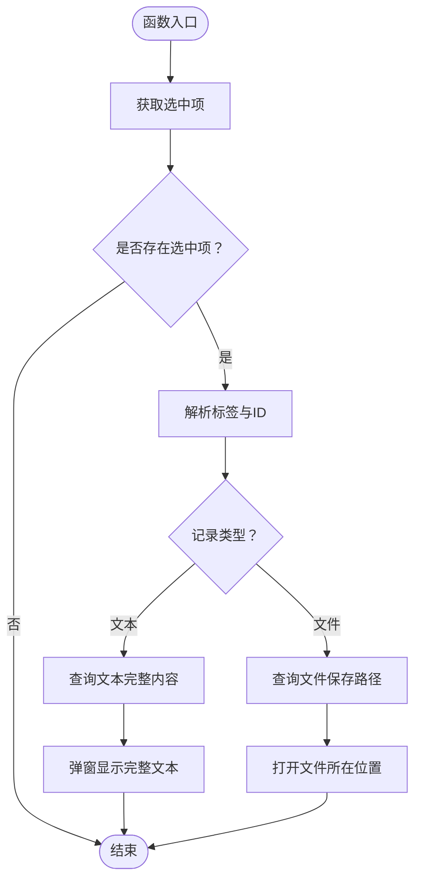
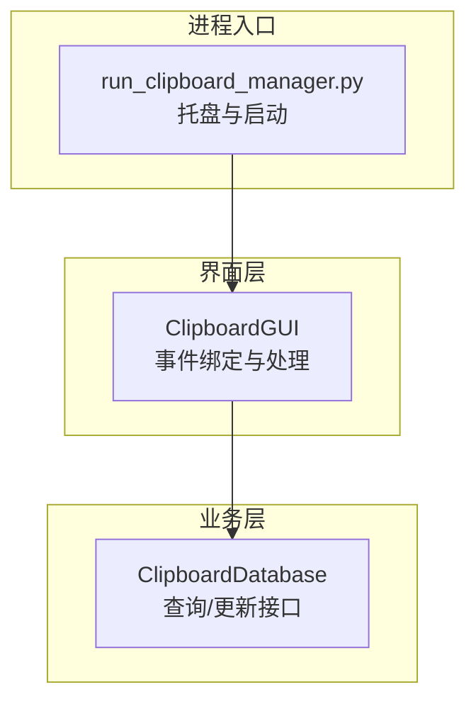

# 交互事件

<cite>
**本文引用的文件**
- [clipboard_gui.py](file://clipboard_gui.py)
- [clipboard_manager_main.py](file://clipboard_manager_main.py)
- [clipboard_db.py](file://clipboard_db.py)
- [run_clipboard_manager.py](file://run_clipboard_manager.py)
</cite>

## 目录
1. [简介](#简介)
2. [项目结构](#项目结构)
3. [核心组件](#核心组件)
4. [架构总览](#架构总览)
5. [详细组件分析](#详细组件分析)
6. [依赖关系分析](#依赖关系分析)
7. [性能考量](#性能考量)
8. [故障排查指南](#故障排查指南)
9. [结论](#结论)

## 简介
本文件聚焦于系统中与用户交互事件相关的绑定与处理，具体包括：
- 双击事件（<Double-1>）绑定到 show_full_record 方法，用于在树形视图中显示所选记录的完整内容；
- 树形视图选择事件（<<TreeviewSelect>>）绑定到 on_tree_select 方法（当前为空实现）；
- 鼠标滚轮事件（<MouseWheel>）绑定到 on_mouse_wheel 方法（当前为空实现）。

我们将解释这些事件绑定如何提升用户体验，并分析事件处理函数与数据库查询之间的潜在关联与调用链路。

## 项目结构
与交互事件直接相关的核心文件如下：
- GUI 界面与事件绑定：clipboard_gui.py
- 数据库接口与查询：clipboard_db.py
- 主程序与剪贴板监控：clipboard_manager_main.py
- 启动入口与托盘集成：run_clipboard_manager.py

图表来源
- [run_clipboard_manager.py](file://run_clipboard_manager.py#L55-L66)
- [clipboard_gui.py](file://clipboard_gui.py#L269-L275)
- [clipboard_db.py](file://clipboard_db.py#L185-L261)
- [clipboard_manager_main.py](file://clipboard_manager_main.py#L112-L180)

章节来源
- [run_clipboard_manager.py](file://run_clipboard_manager.py#L55-L66)
- [clipboard_gui.py](file://clipboard_gui.py#L269-L275)
- [clipboard_db.py](file://clipboard_db.py#L185-L261)
- [clipboard_manager_main.py](file://clipboard_manager_main.py#L112-L180)

## 核心组件
- 事件绑定位置：在记录标签页的树形视图中，分别绑定了双击、选择变更与滚轮事件。
- 事件处理函数：
  - show_full_record：根据选中项类型（文本/文件），从数据库读取完整内容或打开文件所在位置；
  - on_tree_select：当前为空实现，预留用于后续扩展（如懒加载、高亮等）；
  - on_mouse_wheel：当前为空实现，预留用于后续扩展（如滚动到底部触发加载更多）。

章节来源
- [clipboard_gui.py](file://clipboard_gui.py#L269-L275)
- [clipboard_gui.py](file://clipboard_gui.py#L642-L651)
- [clipboard_gui.py](file://clipboard_gui.py#L749-L795)

## 架构总览
事件处理流程概览（以双击事件为例）：

图表来源
- [clipboard_gui.py](file://clipboard_gui.py#L269-L275)
- [clipboard_gui.py](file://clipboard_gui.py#L749-L795)
- [clipboard_db.py](file://clipboard_db.py#L185-L261)

## 详细组件分析

### 事件绑定与处理函数
- 双击事件（<Double-1>）绑定到 show_full_record
  - 功能：根据选中项的标签与ID判断记录类型，从数据库读取完整内容或打开文件所在位置；
  - 用户体验：避免在列表中仅显示预览导致的信息不全，提供“点即看”的便捷体验。
- 树形视图选择事件（<<TreeviewSelect>>）绑定到 on_tree_select
  - 当前实现：空函数，预留扩展点；
  - 潜在用途：可扩展为懒加载、高亮选中项、触发上下文菜单等。
- 鼠标滚轮事件（<MouseWheel>）绑定到 on_mouse_wheel
  - 当前实现：空函数，预留扩展点；
  - 潜在用途：可扩展为滚动到底部触发加载更多记录、或在特定场景下进行微调操作。

章节来源
- [clipboard_gui.py](file://clipboard_gui.py#L269-L275)
- [clipboard_gui.py](file://clipboard_gui.py#L642-L651)
- [clipboard_gui.py](file://clipboard_gui.py#L749-L795)

### 双击事件处理流程（show_full_record）

图表来源
- [clipboard_gui.py](file://clipboard_gui.py#L749-L795)
- [clipboard_db.py](file://clipboard_db.py#L185-L261)

### 事件处理函数与数据库查询的潜在关联
- show_full_record 会根据记录类型调用数据库查询：
  - 文本记录：通过 ID 查询完整内容；
  - 文件记录：通过 ID 查询保存路径，再由系统调用打开文件所在位置。
- on_tree_select/on_mouse_wheel 当前为空实现，但其预留的扩展点可与数据库查询结合：
  - 如需实现“滚动到底部自动加载更多”，可在 on_mouse_wheel 中检测滚动位置并触发分页查询；
  - 如需实现“选中高亮/上下文菜单”，可在 on_tree_select 中读取当前选中项的元数据并更新界面状态。

章节来源
- [clipboard_gui.py](file://clipboard_gui.py#L642-L651)
- [clipboard_gui.py](file://clipboard_gui.py#L749-L795)
- [clipboard_db.py](file://clipboard_db.py#L185-L261)

## 依赖关系分析
- GUI 与数据库的耦合：
  - GUI 通过 ClipboardDatabase 的查询接口读取数据，保证了业务逻辑与界面层的分离；
  - 数据库接口提供统一的查询方法（文本/文件记录、统计、搜索等），便于事件处理函数按需调用。
- 启动与托盘：
  - run_clipboard_manager.py 负责启动 GUI 并默认隐藏主窗口，通过托盘图标提供快速显示界面的能力；
  - 该设计使得事件绑定在托盘图标激活后依然可用，提升用户体验的一致性。

图表来源
- [run_clipboard_manager.py](file://run_clipboard_manager.py#L55-L66)
- [clipboard_gui.py](file://clipboard_gui.py#L269-L275)
- [clipboard_db.py](file://clipboard_db.py#L185-L261)

章节来源
- [run_clipboard_manager.py](file://run_clipboard_manager.py#L55-L66)
- [clipboard_gui.py](file://clipboard_gui.py#L269-L275)
- [clipboard_db.py](file://clipboard_db.py#L185-L261)

## 性能考量
- 事件处理函数中涉及数据库查询时，应避免在主线程执行耗时操作，必要时采用异步或延迟加载策略，防止界面卡顿。
- 对于滚动加载更多等场景，建议在 on_mouse_wheel 中做边界检测与节流，减少频繁触发数据库查询。
- 文本/文件记录的查询应尽量使用索引字段（如 ID、时间戳）以降低查询成本。

## 故障排查指南
- 双击无效或未显示完整内容
  - 检查是否正确选中某一行（树形视图需有选中项）；
  - 确认事件绑定是否生效（<Double-1> 绑定到 show_full_record）；
  - 若为文件记录，确认保存路径是否存在，否则会提示文件不存在。
- 选择事件与滚轮事件无响应
  - 当前实现为空，属于预留扩展点，若期望功能生效，请在相应函数中补充逻辑。
- 托盘图标无法显示或界面无法唤起
  - 检查启动入口是否正常运行（run_clipboard_manager.py）；
  - 确认系统托盘依赖是否满足（如 Pillow、pystray）。

章节来源
- [clipboard_gui.py](file://clipboard_gui.py#L749-L795)
- [clipboard_gui.py](file://clipboard_gui.py#L642-L651)
- [run_clipboard_manager.py](file://run_clipboard_manager.py#L55-L66)

## 结论
- 事件绑定为用户提供“点即看”的即时反馈，显著提升了浏览与检索效率；
- 当前 on_tree_select 与 on_mouse_wheel 为空实现，为后续扩展提供了清晰的切入点；
- 事件处理函数与数据库查询紧密协作，遵循“界面层调用业务层接口”的设计原则，保持了良好的分层与可维护性。