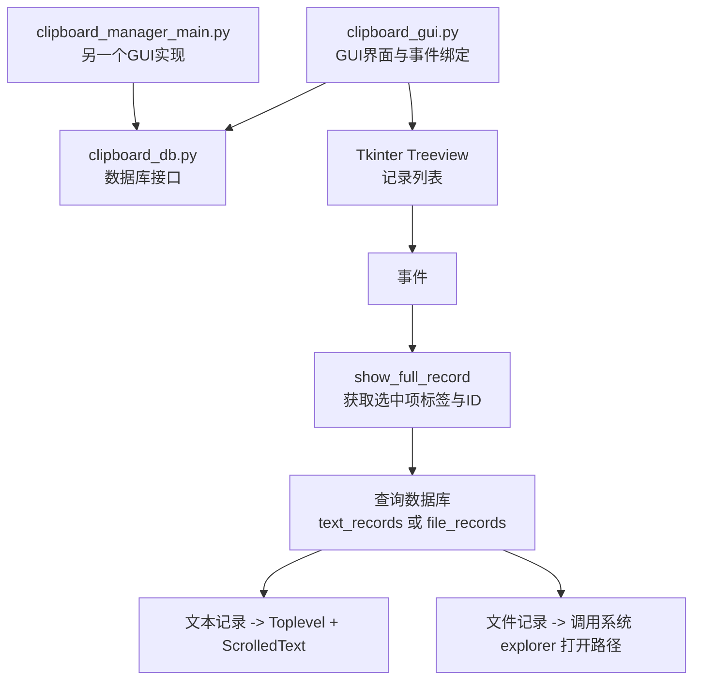
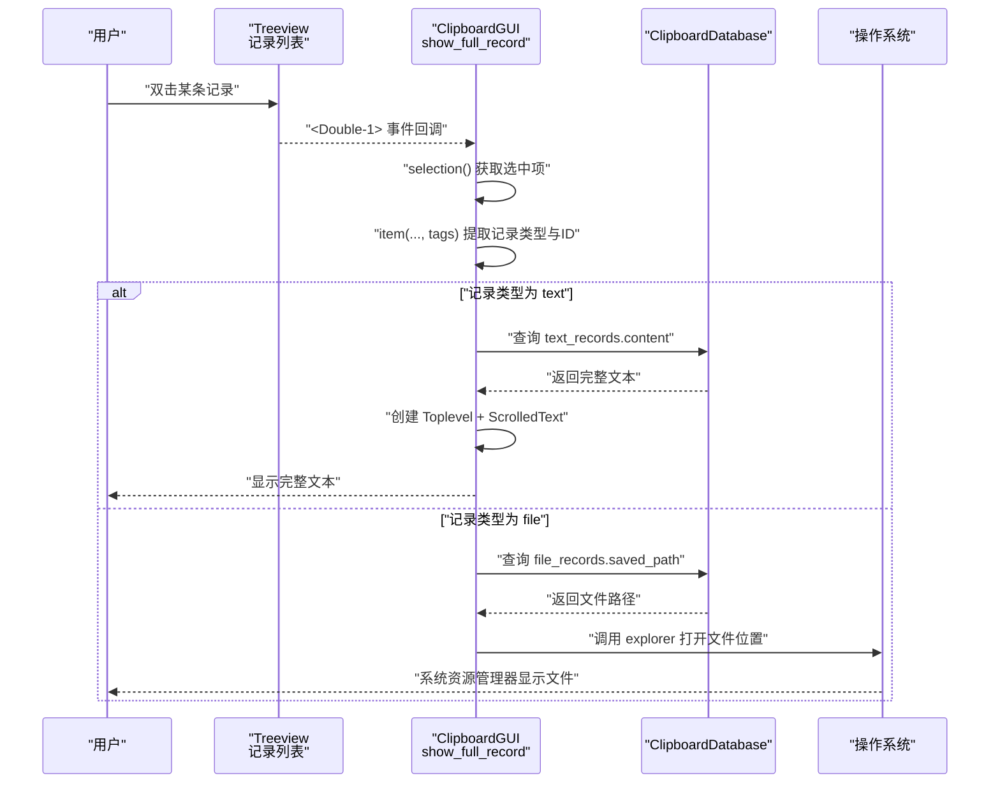
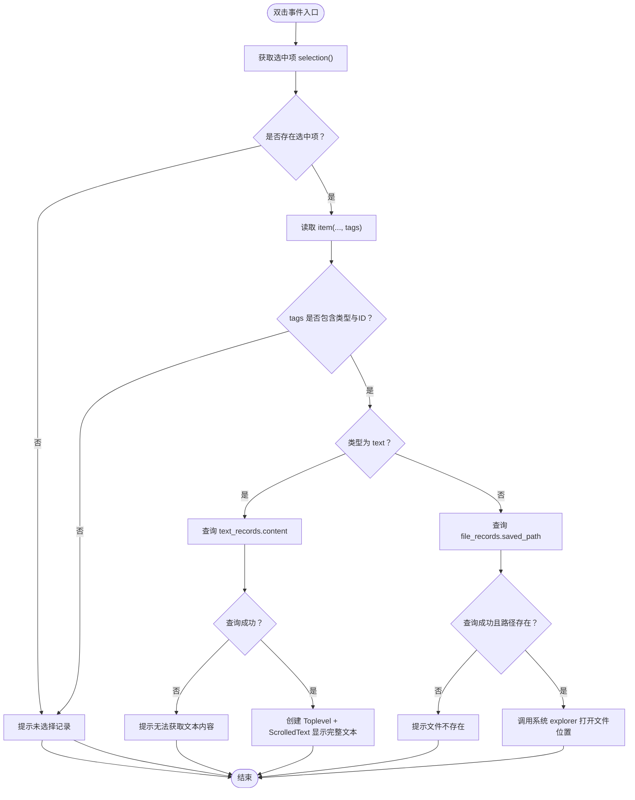
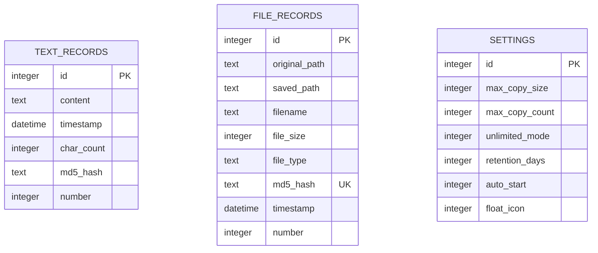
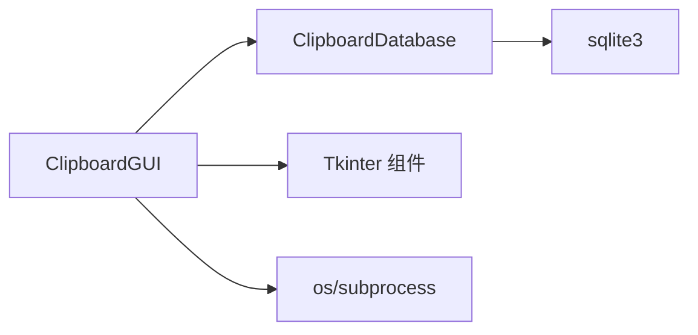

# 双击事件

<cite>
**本文引用的文件**
- [clipboard_gui.py](file://clipboard_gui.py)
- [clipboard_db.py](file://clipboard_db.py)
- [clipboard_manager_main.py](file://clipboard_manager_main.py)
</cite>

## 目录
1. [简介](#简介)
2. [项目结构](#项目结构)
3. [核心组件](#核心组件)
4. [架构总览](#架构总览)
5. [详细组件分析](#详细组件分析)
6. [依赖分析](#依赖分析)
7. [性能考虑](#性能考虑)
8. [故障排查指南](#故障排查指南)
9. [结论](#结论)

## 简介
本节聚焦“双击事件（<Double-1>）”在记录标签页中的实现机制。该事件绑定到 show_full_record 方法，用于展示用户选中记录的完整内容。当用户双击某条记录时，系统通过 Treeview 的 selection() 获取选中项，提取其标签中的记录类型（text/file）和 ID，进而查询数据库获取完整文本内容或定位文件路径。对于文本记录，创建独立的 Toplevel 窗口并使用 ScrolledText 控件显示完整内容；对于文件记录，则调用系统 explorer 打开文件所在位置。该交互显著提升了用户体验，避免主界面信息过载，并通过实际代码示例展示事件绑定、窗口创建和数据库查询的集成流程。同时说明该功能与 ClipboardDatabase 类的交互关系，以及在大数据量场景下的性能优化建议。

## 项目结构
本仓库包含多个模块，其中与“双击事件”直接相关的文件为：
- clipboard_gui.py：提供 GUI 界面、记录标签页、Treeview、事件绑定及 show_full_record 实现。
- clipboard_db.py：提供数据库初始化、查询、统计等接口，供 GUI 层调用。
- clipboard_manager_main.py：另一个 GUI 主程序（非本节重点），但展示了类似的双击事件实现思路，可作为对比参考。

图表来源
- [clipboard_gui.py](file://clipboard_gui.py#L238-L288)
- [clipboard_gui.py](file://clipboard_gui.py#L749-L795)
- [clipboard_db.py](file://clipboard_db.py#L185-L261)

章节来源
- [clipboard_gui.py](file://clipboard_gui.py#L238-L288)
- [clipboard_gui.py](file://clipboard_gui.py#L749-L795)
- [clipboard_db.py](file://clipboard_db.py#L185-L261)

## 核心组件
- 记录标签页与 Treeview：负责展示文本与文件记录，支持排序、搜索与双击事件。
- 事件绑定：<Double-1> 绑定到 show_full_record，实现双击查看详情。
- 数据库层 ClipboardDatabase：提供 get_text_records、get_file_records、search_records 等查询接口。
- 窗口与控件：针对文本记录创建 Toplevel + ScrolledText；针对文件记录调用系统 explorer。

章节来源
- [clipboard_gui.py](file://clipboard_gui.py#L238-L288)
- [clipboard_gui.py](file://clipboard_gui.py#L749-L795)
- [clipboard_db.py](file://clipboard_db.py#L185-L261)

## 架构总览
下图展示“双击事件”的端到端调用链路，从 Treeview 事件到数据库查询再到 UI 呈现。

图表来源
- [clipboard_gui.py](file://clipboard_gui.py#L749-L795)
- [clipboard_db.py](file://clipboard_db.py#L185-L261)

## 详细组件分析

### 事件绑定与入口
- Treeview 列表在记录标签页中绑定 <Double-1> 事件至 show_full_record。
- 事件回调中通过 selection() 获取当前选中项，再通过 item(..., tags) 提取记录类型与 ID。

章节来源
- [clipboard_gui.py](file://clipboard_gui.py#L238-L288)
- [clipboard_gui.py](file://clipboard_gui.py#L749-L795)

### 双击处理逻辑（show_full_record）
- 提取标签：tags[0] 表示记录类型（text/file），tags[1] 表示记录 ID。
- 文本记录：连接数据库查询 text_records.content，创建 Toplevel + ScrolledText 显示完整内容。
- 文件记录：连接数据库查询 file_records.saved_path，调用系统 explorer 打开文件所在位置。

图表来源
- [clipboard_gui.py](file://clipboard_gui.py#L749-L795)
- [clipboard_db.py](file://clipboard_db.py#L185-L261)

章节来源
- [clipboard_gui.py](file://clipboard_gui.py#L749-L795)

### 数据库查询与模型
- 文本记录表：text_records（id, content, timestamp, char_count, md5_hash, number）。
- 文件记录表：file_records（id, original_path, saved_path, filename, file_size, file_type, md5_hash, timestamp, number）。
- 查询接口：
  - get_text_records：支持排序与分页（limit/offset）。
  - get_file_records：支持排序与分页（limit/offset）。
  - search_records：支持关键词与类型过滤。

图表来源
- [clipboard_db.py](file://clipboard_db.py#L18-L115)
- [clipboard_db.py](file://clipboard_db.py#L185-L261)
- [clipboard_db.py](file://clipboard_db.py#L281-L314)

章节来源
- [clipboard_db.py](file://clipboard_db.py#L18-L115)
- [clipboard_db.py](file://clipboard_db.py#L185-L261)
- [clipboard_db.py](file://clipboard_db.py#L281-L314)

### 与 ClipboardDatabase 的交互关系
- GUI 层通过 self.db（ClipboardDatabase 实例）执行查询。
- 文本记录：查询 content 字段，用于完整内容展示。
- 文件记录：查询 saved_path 字段，用于打开文件所在目录。
- 统计与设置：GUI 层也通过 db.get_statistics、db.get_settings 等接口获取辅助信息。

章节来源
- [clipboard_gui.py](file://clipboard_gui.py#L40-L46)
- [clipboard_gui.py](file://clipboard_gui.py#L581-L626)
- [clipboard_gui.py](file://clipboard_gui.py#L749-L795)
- [clipboard_db.py](file://clipboard_db.py#L316-L333)
- [clipboard_db.py](file://clipboard_db.py#L359-L386)

### 与其他 GUI 实现的对比（可选参考）
另一个 GUI 主程序 clipboard_manager_main.py 中同样实现了双击事件，但针对不同的 Treeview 结构与列定义，展示了相似的“双击 -> 查询 -> 展示/打开”的通用模式。此处仅作概念性对比，不展开具体代码分析。

章节来源
- [clipboard_manager_main.py](file://clipboard_manager_main.py#L554-L664)

## 依赖分析
- 组件耦合：
  - ClipboardGUI 依赖 ClipboardDatabase 提供的数据访问能力。
  - Treeview 与事件绑定位于 GUI 层，职责清晰。
- 外部依赖：
  - Tkinter（Treeview、Toplevel、ScrolledText、消息框等）。
  - sqlite3（数据库访问）。
  - os/subprocess（文件路径与系统 explorer 调用）。
- 潜在循环依赖：
  - 本项目中 GUI 与数据库模块双向依赖较弱，主要为 GUI 调用 DB 接口，未见循环导入迹象。

图表来源
- [clipboard_gui.py](file://clipboard_gui.py#L40-L46)
- [clipboard_gui.py](file://clipboard_gui.py#L749-L795)
- [clipboard_db.py](file://clipboard_db.py#L185-L261)

章节来源
- [clipboard_gui.py](file://clipboard_gui.py#L40-L46)
- [clipboard_gui.py](file://clipboard_gui.py#L749-L795)
- [clipboard_db.py](file://clipboard_db.py#L185-L261)

## 性能考虑
- 数据库查询：
  - 文本记录与文件记录均支持排序与分页（limit/offset）。在大数据量场景下，建议：
    - 优先使用分页加载，避免一次性加载过多记录。
    - 对常用查询字段建立索引（如 md5_hash、timestamp），减少查询耗时。
- UI 响应：
  - 双击事件应在主线程中快速完成数据库查询与窗口创建，避免阻塞。
  - 对于超长文本，建议在 Toplevel 中使用 ScrolledText 并限制一次性加载的字符数，必要时采用懒加载或分页显示。
- 资源管理：
  - 关闭数据库连接与销毁窗口句柄，避免内存泄漏。
  - 对文件路径不存在的情况进行快速失败与提示，减少无效系统调用。

[本节为通用性能建议，不直接分析具体文件]

## 故障排查指南
- 未选择记录即双击：
  - 现象：弹出“请先选择一条记录”的提示。
  - 排查：确认 selection() 是否返回非空，item(..., tags) 是否包含类型与 ID。
- 文本记录无法获取：
  - 现象：提示“无法获取文本内容”。
  - 排查：检查数据库中对应 id 的 content 是否存在，确认查询语句与表结构一致。
- 文件记录路径不存在：
  - 现象：提示“文件不存在”。
  - 排查：确认 file_records.saved_path 是否有效，文件是否被外部删除或移动。
- 系统 explorer 无法打开：
  - 现象：调用 explorer 失败或无响应。
  - 排查：确认系统平台为 Windows，路径格式正确，目标文件存在。

章节来源
- [clipboard_gui.py](file://clipboard_gui.py#L749-L795)

## 结论
“双击事件（<Double-1>）”通过 Treeview selection() 与 item(..., tags) 快速提取记录类型与 ID，结合 ClipboardDatabase 的查询接口，分别对文本与文件记录进行差异化处理：文本记录在独立窗口中完整展示，文件记录则调用系统 explorer 定位文件。该机制有效避免了主界面信息过载，提升了用户检索与复用效率。在大数据量场景下，建议配合分页、索引与懒加载策略，持续优化查询与渲染性能。