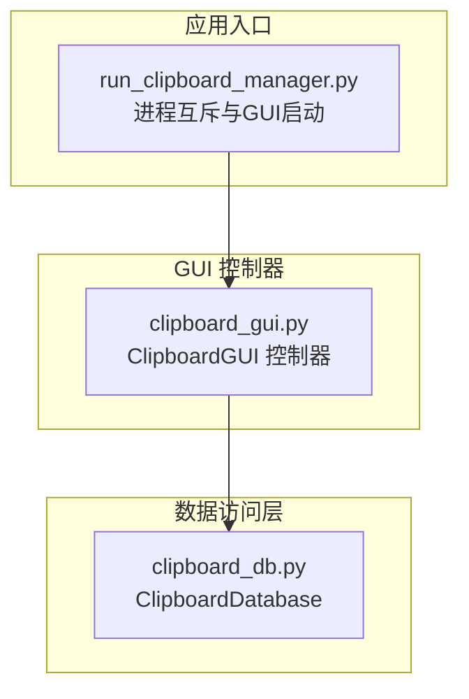
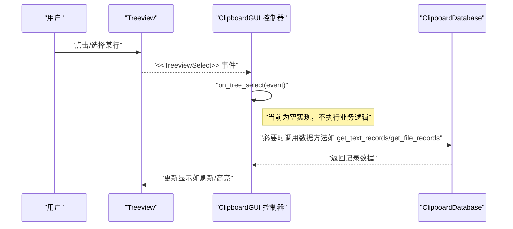
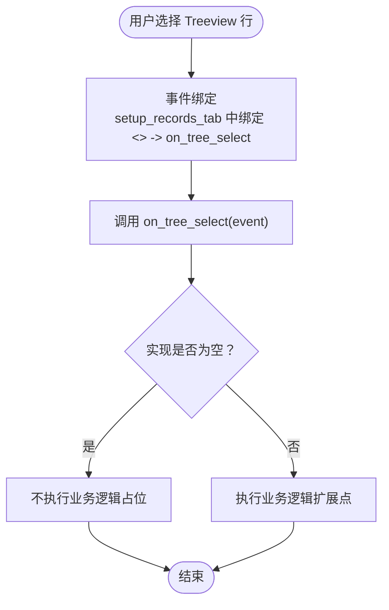
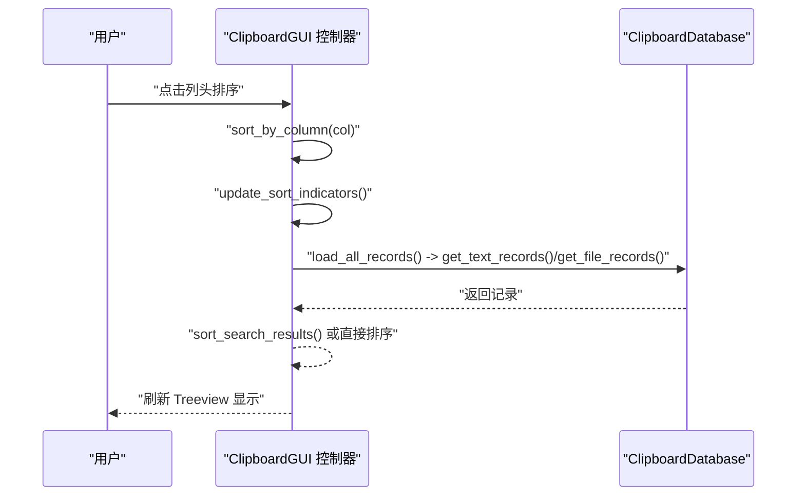
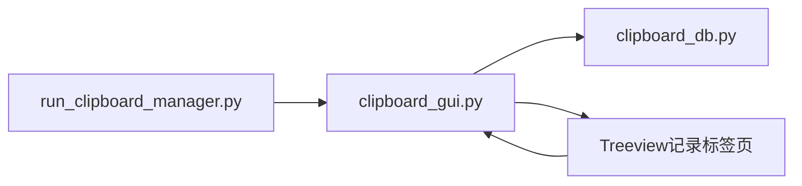

# 树形视图选择事件

<cite>
**本文引用的文件**
- [clipboard_gui.py](file://clipboard_gui.py)
- [clipboard_db.py](file://clipboard_db.py)
- [run_clipboard_manager.py](file://run_clipboard_manager.py)
</cite>

## 目录
1. [简介](#简介)
2. [项目结构](#项目结构)
3. [核心组件](#核心组件)
4. [架构总览](#架构总览)
5. [详细组件分析](#详细组件分析)
6. [依赖关系分析](#依赖关系分析)
7. [性能考量](#性能考量)
8. [故障排查指南](#故障排查指南)
9. [结论](#结论)

## 简介
本文件系统化梳理“树形视图选择事件”在当前实现中的状态与演进路径。该事件已绑定到空实现的 on_tree_select 方法，目前未执行任何业务逻辑。本文将基于 Tkinter 事件系统的工作机制，结合 GUI 控制器层与数据访问层的职责划分，解释为何在当前无分页机制下该事件处理函数为空，并探讨在未来引入懒加载、选中态高亮、实时预览、状态同步等能力时的扩展方向与实现路径。同时，本文还将说明 setup_records_tab 中的事件绑定代码如何将用户交互传递至控制器层，并讨论该事件与 load_records、search_records 等数据加载方法的潜在协同机制。

## 项目结构
本仓库围绕“剪贴板历史记录”这一核心功能展开，主要由 GUI 控制器、数据库访问层与应用入口组成：
- GUI 控制器负责界面布局、事件绑定与用户交互响应（clipboard_gui.py）
- 数据库访问层提供数据读写与检索（clipboard_db.py）
- 应用入口负责进程互斥、后台监控与 GUI 启动（run_clipboard_manager.py）

图表来源
- [run_clipboard_manager.py](file://run_clipboard_manager.py#L32-L66)
- [clipboard_gui.py](file://clipboard_gui.py#L1-L120)
- [clipboard_db.py](file://clipboard_db.py#L1-L60)

章节来源
- [run_clipboard_manager.py](file://run_clipboard_manager.py#L32-L66)
- [clipboard_gui.py](file://clipboard_gui.py#L1-L120)
- [clipboard_db.py](file://clipboard_db.py#L1-L60)

## 核心组件
- Treeview 选择事件绑定：在记录标签页中，通过 Tkinter 的事件绑定将 <<TreeviewSelect>> 事件与控制器方法 on_tree_select 关联。
- 控制器层方法 on_tree_select：当前实现为空，仅占位，未执行任何业务逻辑。
- 数据加载方法：
  - load_records：一次性加载所有记录（含文本与文件），并填充 Treeview。
  - search_records：基于关键字搜索记录，随后在当前排序策略下排序并展示。
- 数据访问层方法：
  - get_text_records / get_file_records：支持排序与可选分页参数（limit/offset）。
  - search_records：支持按内容或文件名模糊检索。

章节来源
- [clipboard_gui.py](file://clipboard_gui.py#L227-L279)
- [clipboard_gui.py](file://clipboard_gui.py#L640-L651)
- [clipboard_gui.py](file://clipboard_gui.py#L581-L626)
- [clipboard_gui.py](file://clipboard_gui.py#L652-L748)
- [clipboard_db.py](file://clipboard_db.py#L185-L261)
- [clipboard_db.py](file://clipboard_db.py#L281-L314)

## 架构总览
下面的序列图展示了 Tkinter 事件系统如何将用户交互传递至控制器层，并进一步调用数据访问层：

图表来源
- [clipboard_gui.py](file://clipboard_gui.py#L227-L279)
- [clipboard_gui.py](file://clipboard_gui.py#L640-L651)
- [clipboard_db.py](file://clipboard_db.py#L185-L261)

章节来源
- [clipboard_gui.py](file://clipboard_gui.py#L227-L279)
- [clipboard_gui.py](file://clipboard_gui.py#L640-L651)
- [clipboard_db.py](file://clipboard_db.py#L185-L261)

## 详细组件分析

### Treeview 选择事件绑定与当前实现
- 绑定位置：setup_records_tab 中为 Treeview 绑定了 <<TreeviewSelect>> 事件，并将其路由到 on_tree_select。
- 当前实现：on_tree_select 为空实现，注释表明“不再需要处理分页逻辑”，意味着在当前一次性加载全量记录的模式下，选择事件无需触发额外的数据加载或状态变更。
- 事件触发时机：当用户点击或键盘导航到某一行时触发；在当前无分页的情况下，选择事件不会带来数据层面的变化。

图表来源
- [clipboard_gui.py](file://clipboard_gui.py#L227-L279)
- [clipboard_gui.py](file://clipboard_gui.py#L640-L651)

章节来源
- [clipboard_gui.py](file://clipboard_gui.py#L227-L279)
- [clipboard_gui.py](file://clipboard_gui.py#L640-L651)

### 数据加载与排序协作
- load_records：一次性加载所有记录（文本与文件），并按当前排序列与方向填充 Treeview。
- search_records：先清空 Treeview，再根据关键字检索并排序后展示。
- 排序策略：sort_by_column 与 update_sort_indicators 负责列标题排序指示与切换排序方向；load_records 与 sort_search_results 会根据当前排序列对结果进行排序。

图表来源
- [clipboard_gui.py](file://clipboard_gui.py#L280-L308)
- [clipboard_gui.py](file://clipboard_gui.py#L581-L626)
- [clipboard_gui.py](file://clipboard_gui.py#L652-L748)
- [clipboard_db.py](file://clipboard_db.py#L185-L261)

章节来源
- [clipboard_gui.py](file://clipboard_gui.py#L280-L308)
- [clipboard_gui.py](file://clipboard_gui.py#L581-L626)
- [clipboard_gui.py](file://clipboard_gui.py#L652-L748)
- [clipboard_db.py](file://clipboard_db.py#L185-L261)

### 为什么当前 on_tree_select 为空？
- 无分页机制：load_records 一次性加载所有记录，Treeview 中的每一行都来自数据库全量查询结果，选择事件不会触发新的数据加载。
- 无懒加载：数据库层的 get_text_records/get_file_records 支持 limit/offset 参数，但当前 GUI 未传入分页参数，因此不会产生“滚动到底部加载更多”的场景。
- 事件职责边界：选择事件通常用于触发 UI 反馈（如高亮）、状态同步（如更新按钮可用性）或预览（如显示摘要），而非数据加载。

章节来源
- [clipboard_gui.py](file://clipboard_gui.py#L581-L626)
- [clipboard_gui.py](file://clipboard_gui.py#L638-L641)
- [clipboard_db.py](file://clipboard_db.py#L185-L261)

### 未来扩展方向与实现路径
以下为在不同场景下扩展 on_tree_select 的建议路径，均以“占位实现 + 逐步增强”的方式推进，避免破坏现有功能。

- 懒加载（滚动触底加载更多）
  - 目标：在 Treeview 滚动接近底部时，按排序条件分页加载下一批记录。
  - 实现要点：
    - 在控制器层维护当前偏移量与总记录数。
    - 在 on_tree_select 中检测滚动位置阈值，触发分页加载。
    - 调用数据库层的 get_text_records/get_file_records(limit, offset)。
    - 将新数据追加到 Treeview，保持当前排序不变。
  - 风险控制：避免重复加载与并发冲突，可在加载期间禁用再次触发。

- 选中态高亮
  - 目标：选中行时在 UI 上突出显示，便于用户识别当前操作对象。
  - 实现要点：
    - 在 on_tree_select 中获取选中项的 tags/id，设置 Treeview 的 tag 配色或样式。
    - 与复制/删除等按钮的状态联动，仅在选中有效时启用。

- 实时预览（摘要/快速查看）
  - 目标：在不打开详情窗口的前提下，快速预览选中记录的摘要信息。
  - 实现要点：
    - 依据选中项的类型（文本/文件）调用数据库层的补充查询，生成简要摘要。
    - 在 GUI 中弹出轻量级预览面板或在侧边栏展示。

- 状态同步（按钮可用性/统计更新）
  - 目标：根据选中项动态调整工具栏按钮状态与统计信息。
  - 实现要点：
    - on_tree_select 中读取选中项的类型与 id，更新按钮可用性与统计标签。
    - 与 search_records 结果联动：搜索结果中的选中项应能正确反映状态。

- 与 load_records/search_records 的协同
  - 排序一致性：当用户在排序列上切换时，on_tree_select 不应改变排序，但可利用当前排序列与方向对预览或高亮进行一致性处理。
  - 搜索结果中的选择：search_records 会清空并重新填充 Treeview，on_tree_select 需在新数据渲染后维持选中态或提示用户重新选择。

章节来源
- [clipboard_gui.py](file://clipboard_gui.py#L280-L308)
- [clipboard_gui.py](file://clipboard_gui.py#L581-L626)
- [clipboard_gui.py](file://clipboard_gui.py#L652-L748)
- [clipboard_db.py](file://clipboard_db.py#L185-L261)

## 依赖关系分析
- GUI 控制器依赖数据库访问层提供的查询与检索接口。
- Treeview 事件绑定位于 GUI 控制器内部，形成“事件 -> 控制器方法 -> 数据库”的调用链。
- 应用入口负责进程互斥与 GUI 启动，间接影响 GUI 的生命周期与事件处理环境。

图表来源
- [run_clipboard_manager.py](file://run_clipboard_manager.py#L32-L66)
- [clipboard_gui.py](file://clipboard_gui.py#L227-L279)
- [clipboard_db.py](file://clipboard_db.py#L185-L261)

章节来源
- [run_clipboard_manager.py](file://run_clipboard_manager.py#L32-L66)
- [clipboard_gui.py](file://clipboard_gui.py#L227-L279)
- [clipboard_db.py](file://clipboard_db.py#L185-L261)

## 性能考量
- 当前一次性加载全量记录，Treeview 列数较少（5列），数据量增长时可能影响首屏渲染与内存占用。
- 若引入懒加载，需注意：
  - 分页参数的稳定性（排序列与方向需与分页查询一致）。
  - 避免频繁重复请求，可通过去抖或节流控制滚动事件触发频率。
  - 在加载过程中提供进度反馈，避免 UI 卡顿感。

[本节为通用指导，不直接分析具体文件]

## 故障排查指南
- 事件未触发
  - 检查 setup_records_tab 是否正确绑定 <<TreeviewSelect>> 到 on_tree_select。
  - 确认 Treeview 是否处于可交互状态（非禁用）。
- 选择无效或无反应
  - 当前 on_tree_select 为空，属于预期行为；若期望有业务逻辑，请在 on_tree_select 中实现相应处理。
- 数据未按预期排序
  - 确认 sort_by_column 与 update_sort_indicators 的调用顺序正确。
  - 检查 load_records 与 sort_search_results 的排序索引映射是否与列名一致。

章节来源
- [clipboard_gui.py](file://clipboard_gui.py#L227-L279)
- [clipboard_gui.py](file://clipboard_gui.py#L280-L308)
- [clipboard_gui.py](file://clipboard_gui.py#L581-L626)
- [clipboard_gui.py](file://clipboard_gui.py#L652-L748)

## 结论
- 当前 Treeview 选择事件已正确绑定到 on_tree_select，但由于采用一次性加载全量记录的模式，该事件处理函数为空实现，不执行任何业务逻辑。
- 未来若引入懒加载、选中态高亮、实时预览或状态同步等功能，可将 on_tree_select 作为扩展点，逐步增强其职责，同时保持与 load_records、search_records 等数据加载方法的协同一致性。
- 在实现过程中，应关注事件触发频率、排序一致性与 UI 响应性，确保用户体验稳定流畅。