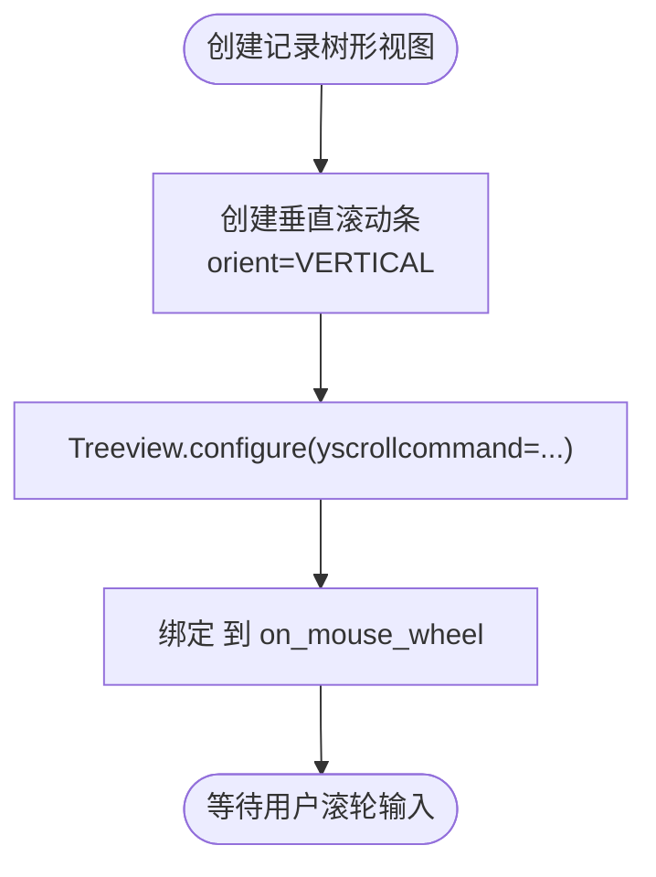

# 鼠标滚轮事件

<cite>
**本文引用的文件**
- [clipboard_gui.py](file://clipboard_gui.py)
- [clipboard_manager_main.py](file://clipboard_manager_main.py)
</cite>

## 目录
1. [简介](#简介)
2. [项目结构](#项目结构)
3. [核心组件](#核心组件)
4. [架构总览](#架构总览)
5. [详细组件分析](#详细组件分析)
6. [依赖关系分析](#依赖关系分析)
7. [性能考量](#性能考量)
8. [故障排查指南](#故障排查指南)
9. [结论](#结论)

## 简介
本文件围绕“鼠标滚轮事件”的绑定与处理展开，重点分析以下方面：
- 事件绑定：记录树形视图控件将鼠标滚轮事件绑定到 on_mouse_wheel 方法。
- 当前实现：on_mouse_wheel 方法为空，仅返回默认行为，不拦截系统默认滚动处理。
- 协同机制：与内置滚动条（Scrollbar）的 yscrollcommand 配置协同工作，滚轮事件由系统默认处理程序接管，驱动 Scrollbar 的滚动。
- 扩展潜力：on_mouse_wheel 作为占位符，为未来实现垂直滚动优化、滚轮缩放、分页触发等高级交互预留扩展点。
- 事件流：从用户输入到系统响应的完整链路，包括事件绑定、默认处理程序接管、Scrollbar 同步滚动。

## 项目结构
本仓库包含 GUI 主程序与管理器模块，其中与“鼠标滚轮事件”直接相关的核心位置如下：
- 记录树形视图（ttk.Treeview）位于 GUI 主程序中，绑定了鼠标滚轮事件。
- 滚动条（ttk.Scrollbar）通过 yscrollcommand 与 Treeview 关联，形成滚动联动。
- 管理器模块提供数据层能力，但与滚轮事件无直接绑定。

图表来源
- [clipboard_gui.py](file://clipboard_gui.py#L254-L275)
- [clipboard_gui.py](file://clipboard_gui.py#L642-L646)

章节来源
- [clipboard_gui.py](file://clipboard_gui.py#L254-L275)
- [clipboard_gui.py](file://clipboard_gui.py#L642-L646)

## 核心组件
- 记录树形视图（records_tree）：承载历史记录展示，绑定鼠标滚轮事件。
- 垂直滚动条（records_scrollbar_y）：通过 yscrollcommand 与 Treeview 关联，实现滚动联动。
- 事件处理器（on_mouse_wheel）：当前为空，仅返回默认行为，不拦截系统默认处理。

章节来源
- [clipboard_gui.py](file://clipboard_gui.py#L254-L275)
- [clipboard_gui.py](file://clipboard_gui.py#L642-L646)

## 架构总览
鼠标滚轮事件在 GUI 中的处理流程如下：
- 用户在记录树形视图上滚动鼠标滚轮。
- 系统默认处理程序接管事件，根据滚轮方向与幅度调整 Treeview 的可见区域。
- Treeview 的 yview() 与 Scrollbar 的 set() 通过 yscrollcommand 实现联动，滚动条随之移动。
- on_mouse_wheel 作为占位符，未改变默认行为，保留了未来扩展的空间。

图表来源
- [clipboard_gui.py](file://clipboard_gui.py#L254-L275)
- [clipboard_gui.py](file://clipboard_gui.py#L642-L646)

## 详细组件分析

### 组件一：记录树形视图与滚动条配置
- 树形视图创建与列配置：用于展示记录名称/内容、类型、大小、时间、次数等。
- 垂直滚动条创建：orient=tk.VERTICAL，command 指向 Treeview.yview。
- Treeview 通过 configure(yscrollcommand=...) 将滚动条与视图联动。
- 绑定鼠标滚轮事件：将 <MouseWheel> 绑定到 on_mouse_wheel。

图表来源
- [clipboard_gui.py](file://clipboard_gui.py#L236-L275)

章节来源
- [clipboard_gui.py](file://clipboard_gui.py#L236-L275)

### 组件二：事件绑定与当前实现
- 事件绑定：在记录树形视图上绑定 <MouseWheel> 到 on_mouse_wheel。
- 当前实现：on_mouse_wheel 方法体为空，仅返回默认行为，不拦截系统默认处理。
- 影响：滚轮事件由系统默认处理程序接管，Treeview 的 yview() 与 Scrollbar 的 set() 保持联动。

图表来源
- [clipboard_gui.py](file://clipboard_gui.py#L273-L275)
- [clipboard_gui.py](file://clipboard_gui.py#L642-L646)

章节来源
- [clipboard_gui.py](file://clipboard_gui.py#L273-L275)
- [clipboard_gui.py](file://clipboard_gui.py#L642-L646)

### 组件三：与管理器模块的关系
- 管理器模块（clipboard_manager_main.py）提供数据层能力，负责文本/文件记录的增删改查与统计。
- 与滚轮事件无直接绑定，但数据加载与 Treeview 的内容更新会影响滚动体验。
- 例如：文本记录标签页与文件记录标签页均配置了垂直滚动条，与 Treeview 的 yscrollcommand 联动。

章节来源
- [clipboard_manager_main.py](file://clipboard_manager_main.py#L554-L614)

## 依赖关系分析
- 组件耦合
  - 记录树形视图与滚动条之间通过 yscrollcommand 强耦合，保证滚动一致性。
  - 鼠标滚轮事件与 Treeview 强耦合，事件绑定在 GUI 初始化阶段完成。
- 外部依赖
  - Tkinter 的事件系统与默认滚动处理机制。
  - 数据库层（ClipboardDatabase）提供记录加载，间接影响 Treeview 内容量与滚动需求。
- 潜在风险
  - 若未来在 on_mouse_wheel 中加入自定义逻辑，需谨慎处理返回值，避免破坏默认滚动行为。
  - 若 Treeview 内容量过大，滚动条同步可能成为性能瓶颈，需考虑虚拟化或分页策略。

图表来源
- [clipboard_gui.py](file://clipboard_gui.py#L254-L275)
- [clipboard_gui.py](file://clipboard_gui.py#L642-L646)
- [clipboard_manager_main.py](file://clipboard_manager_main.py#L554-L614)

## 性能考量
- 滚动性能
  - 当前实现完全依赖系统默认处理，避免了自定义滚动逻辑带来的额外开销。
  - 若未来引入惯性滚动或滚轮缩放，建议采用轻量级动画与节流策略，避免频繁更新导致卡顿。
- 数据量与滚动体验
  - 大量记录会增加 Treeview 的渲染与滚动负担。可考虑：
    - 分页加载（当前已注释掉的分页方法），减少一次性渲染的数据量。
    - 虚拟化（Virtualization）：仅渲染可视区域内的行项。
- 事件处理成本
  - on_mouse_wheel 当前为空，几乎不产生额外开销。若加入复杂逻辑，应避免在事件回调中执行阻塞操作。

## 故障排查指南
- 症状：滚轮无法滚动或滚动异常
  - 检查 Treeview 是否处于可聚焦状态，确保事件能正确传递到控件。
  - 确认滚动条与 Treeview 的 yscrollcommand 配置正确，避免联动失效。
- 症状：on_mouse_wheel 有自定义逻辑后，滚动失效
  - 确保自定义逻辑中仍通过系统默认处理路径更新 yview() 或 Scrollbar.set()。
  - 避免在回调中返回非默认值导致事件被拦截。
- 症状：内容过多导致滚动卡顿
  - 考虑分页加载或虚拟化策略，减少一次性渲染的数据量。
  - 优化数据加载与排序逻辑，避免在滚动过程中触发大量数据库查询。

章节来源
- [clipboard_gui.py](file://clipboard_gui.py#L254-L275)
- [clipboard_gui.py](file://clipboard_gui.py#L642-L646)

## 结论
- 当前实现中，鼠标滚轮事件通过 on_mouse_wheel 占位符返回默认行为，系统默认处理程序接管滚轮事件，驱动 Treeview 的 yview() 与 Scrollbar 的 set() 实现联动滚动。
- 这种设计简洁可靠，避免了自定义滚动逻辑的复杂性，同时保留了扩展空间。
- 未来可在 on_mouse_wheel 中实现垂直滚动优化、滚轮缩放、分页触发等高级交互，但需确保与系统默认处理路径兼容，维持滚动条与视图的一致性。