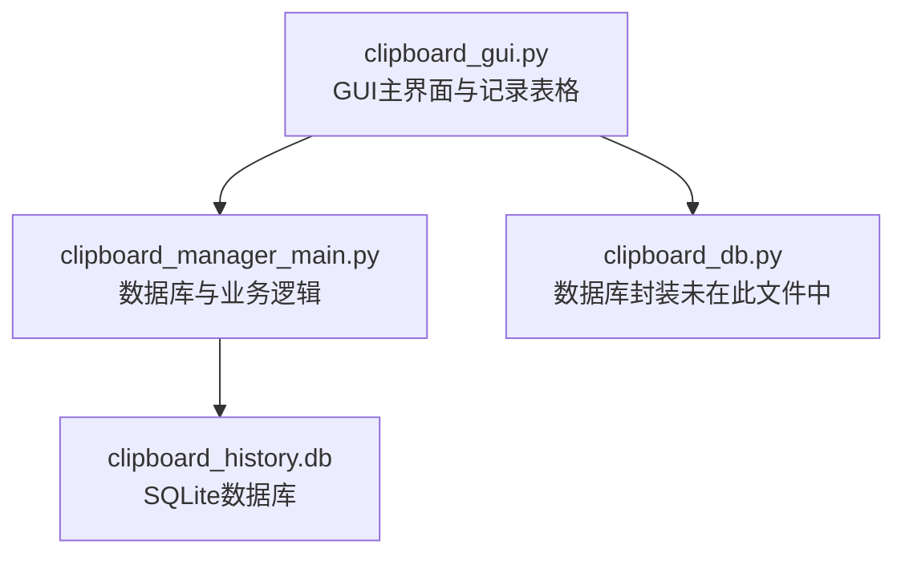
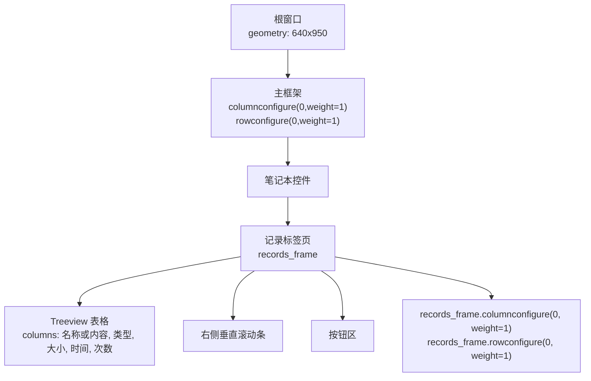
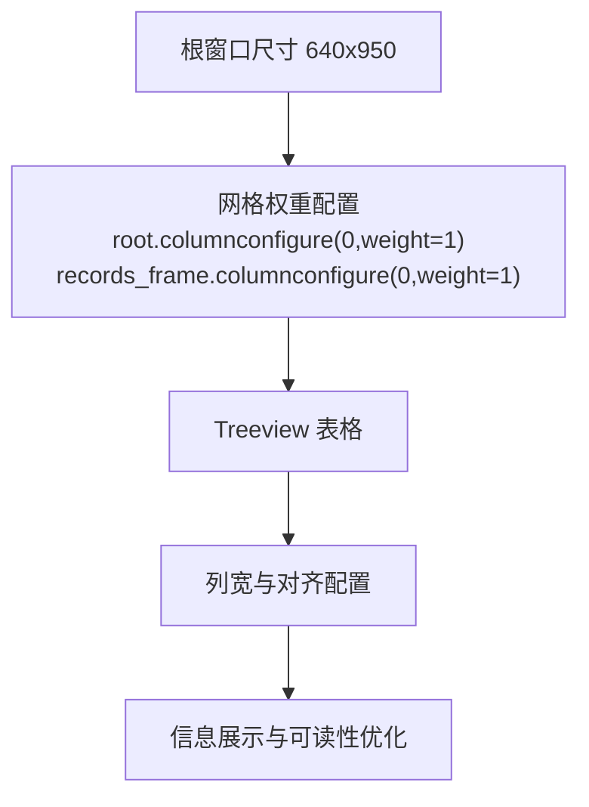

# 列配置

<cite>
**本文引用的文件**
- [clipboard_gui.py](file://clipboard_gui.py)
- [clipboard_manager_main.py](file://clipboard_manager_main.py)
</cite>

## 目录
1. [简介](#简介)
2. [项目结构](#项目结构)
3. [核心组件](#核心组件)
4. [架构概览](#架构概览)
5. [详细组件分析](#详细组件分析)
6. [依赖分析](#依赖分析)
7. [性能考量](#性能考量)
8. [故障排查指南](#故障排查指南)
9. [结论](#结论)

## 简介
本文件聚焦“记录”标签页中 Treeview 表格的列宽与对齐配置，围绕如下目标展开：
- 解释各列的宽度与对齐策略：名称或内容列 250 像素且左对齐，类型、大小、时间列分别为 80、80、130 像素且居中对齐，次数列 50 像素且居中对齐。
- 说明这些尺寸如何优化信息展示与界面美观性。
- 结合窗口整体尺寸 640x950 的适配关系，解释列宽与窗口宽度的关系。
- 解释权重配置 self.records_frame.columnconfigure(0, weight=1) 如何实现列的水平扩展。

## 项目结构
本仓库包含 GUI 主程序与数据库交互模块。与列配置直接相关的代码位于 GUI 模块中，负责构建“记录”标签页的表格并设置列宽与对齐。

图表来源
- [clipboard_gui.py](file://clipboard_gui.py#L227-L279)
- [clipboard_manager_main.py](file://clipboard_manager_main.py#L56-L111)

章节来源
- [clipboard_gui.py](file://clipboard_gui.py#L227-L279)
- [clipboard_manager_main.py](file://clipboard_manager_main.py#L56-L111)

## 核心组件
- 记录表格（Treeview）：在“记录”标签页中创建，列名为“名称或内容”“类型”“大小”“时间”“次数”，并分别设置列宽与对齐方式。
- 窗口尺寸：根窗口几何尺寸为 640x950，表格所在帧通过网格权重实现水平扩展。
- 排序与显示：表格支持点击列头排序，同时在加载记录时会根据排序字段动态更新显示内容。

章节来源
- [clipboard_gui.py](file://clipboard_gui.py#L227-L279)
- [clipboard_gui.py](file://clipboard_gui.py#L247-L253)

## 架构概览
下图展示了“记录”标签页的表格布局与权重配置关系，体现列宽与窗口宽度的适配思路。

图表来源
- [clipboard_gui.py](file://clipboard_gui.py#L172-L219)
- [clipboard_gui.py](file://clipboard_gui.py#L227-L279)

章节来源
- [clipboard_gui.py](file://clipboard_gui.py#L172-L219)
- [clipboard_gui.py](file://clipboard_gui.py#L227-L279)

## 详细组件分析

### 列宽与对齐配置
- “名称或内容”列：宽度 250 像素，左对齐（w）
- “类型”列：宽度 80 像素，居中对齐（center）
- “大小”列：宽度 80 像素，居中对齐（center）
- “时间”列：宽度 130 像素，居中对齐（center）
- “次数”列：宽度 50 像素，居中对齐（center）

这些尺寸与对齐策略的优化点：
- 名称或内容列较长，采用 250 像素宽度与左对齐，便于完整展示文本或文件名，减少截断带来的阅读成本。
- 数值类列（大小、次数）与时间列采用 80、50、130 像素宽度并居中对齐，使数值信息在视觉上更易比较，且对齐统一提升可读性。
- 通过居中对齐，数值与时间在列内更紧凑，减少视觉拥挤感。

章节来源
- [clipboard_gui.py](file://clipboard_gui.py#L247-L253)

### 窗口整体尺寸与列宽适配
- 根窗口尺寸为 640x950。
- 表格所在帧 records_frame 通过网格权重配置实现了水平扩展：
  - 根帧 columnconfigure(0, weight=1)、rowconfigure(0, weight=1)
  - records_frame.columnconfigure(0, weight=1)、rowconfigure(0, weight=1)
- 这些权重使得表格在窗口宽度变化时能够自适应扩展，从而在固定列宽下仍能充分利用可用空间，避免横向滚动条频繁出现。

章节来源
- [clipboard_gui.py](file://clipboard_gui.py#L208-L219)
- [clipboard_gui.py](file://clipboard_gui.py#L276-L279)

### 权重配置与水平扩展机制
- 权重（weight）的作用：当父容器大小变化时，weight 值较大的网格列或行会优先获得额外空间。
- 在“记录”标签页中：
  - records_frame.columnconfigure(0, weight=1) 使表格所在列随窗口宽度变化而扩展。
  - records_frame.rowconfigure(0, weight=1) 使表格所在行随窗口高度变化而扩展。
- 由于各列宽度固定，扩展主要体现在表格整体宽度的增加，从而在不改变列宽的前提下，尽量容纳更多内容，减少横向滚动需求。

章节来源
- [clipboard_gui.py](file://clipboard_gui.py#L208-L219)
- [clipboard_gui.py](file://clipboard_gui.py#L276-L279)

### 数据加载与列宽一致性
- 表格在加载记录时，会根据排序字段动态更新显示内容，但列宽与对齐保持不变，保证了视觉一致性与可读性。
- 数据库层提供文本与文件两类记录，表格在插入时按列顺序填充，列宽配置确保不同长度的内容都能清晰呈现。

章节来源
- [clipboard_gui.py](file://clipboard_gui.py#L581-L626)
- [clipboard_manager_main.py](file://clipboard_manager_main.py#L181-L211)

## 依赖分析
- “记录”标签页的表格依赖于根窗口与主框架的网格权重配置，以实现响应式布局。
- 表格列宽与对齐策略独立于数据源，仅影响渲染表现，因此与数据库层解耦良好。
- 权重配置与窗口尺寸共同决定了表格在不同分辨率下的适配效果。

图表来源
- [clipboard_gui.py](file://clipboard_gui.py#L49-L54)
- [clipboard_gui.py](file://clipboard_gui.py#L208-L219)
- [clipboard_gui.py](file://clipboard_gui.py#L247-L253)

章节来源
- [clipboard_gui.py](file://clipboard_gui.py#L49-L54)
- [clipboard_gui.py](file://clipboard_gui.py#L208-L219)
- [clipboard_gui.py](file://clipboard_gui.py#L247-L253)

## 性能考量
- 固定列宽与居中对齐的组合在渲染上较为轻量，不会引入额外的复杂计算。
- 权重配置仅影响布局分配，不涉及频繁的重绘或重排，对性能影响可忽略。
- 若未来需要支持动态列宽（例如根据内容自动调整），需评估 Treeview 的列宽调整与滚动条行为，避免频繁触发横向滚动。

## 故障排查指南
- 表格内容被截断：检查列宽是否过窄或窗口过窄。可通过增大窗口宽度或适当增加列宽来改善。
- 横向滚动条频繁出现：确认窗口宽度与列宽之和的关系，必要时减少列数或调整列宽。
- 排序后显示异常：确认排序字段映射与数据库字段一致，避免因排序逻辑导致显示错位。

章节来源
- [clipboard_gui.py](file://clipboard_gui.py#L280-L308)
- [clipboard_gui.py](file://clipboard_gui.py#L627-L637)

## 结论
- “名称或内容”“类型”“大小”“时间”“次数”列的宽度与对齐策略，兼顾了信息完整性与视觉一致性。
- 窗口 640x950 的尺寸与权重配置协同工作，使表格在不同分辨率下保持良好的可读性与可用性。
- 权重配置实现了列的水平扩展，配合固定列宽，既保证了列内信息的稳定呈现，又提升了整体布局的弹性。