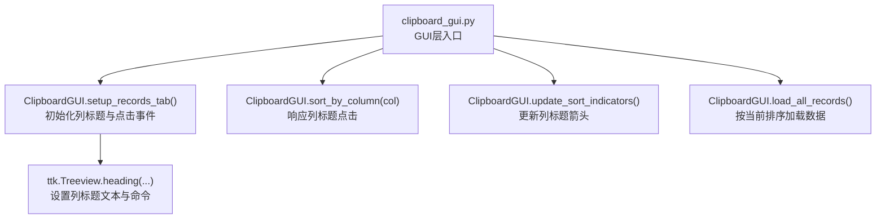
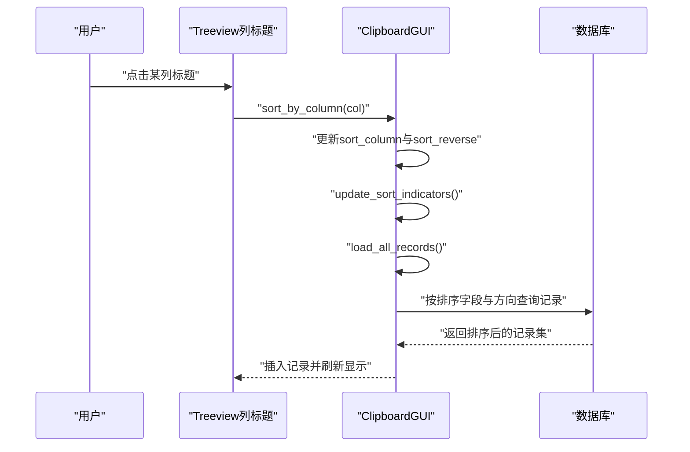
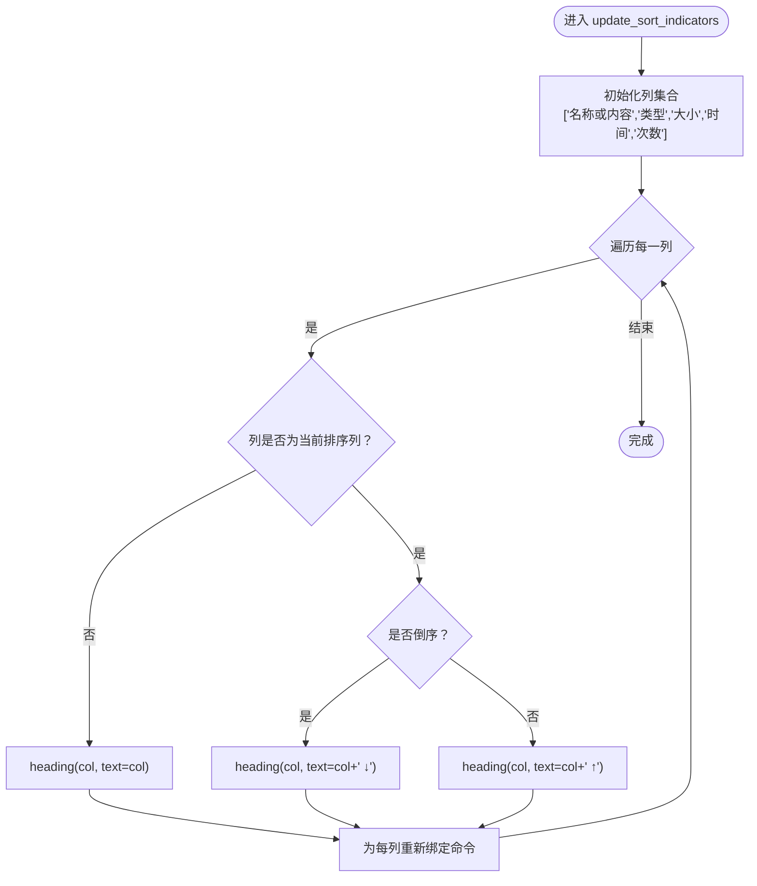
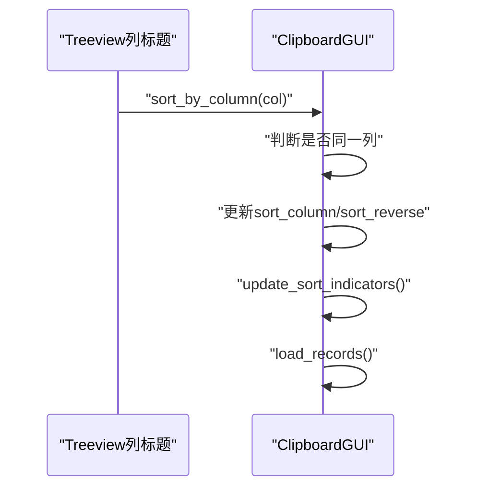
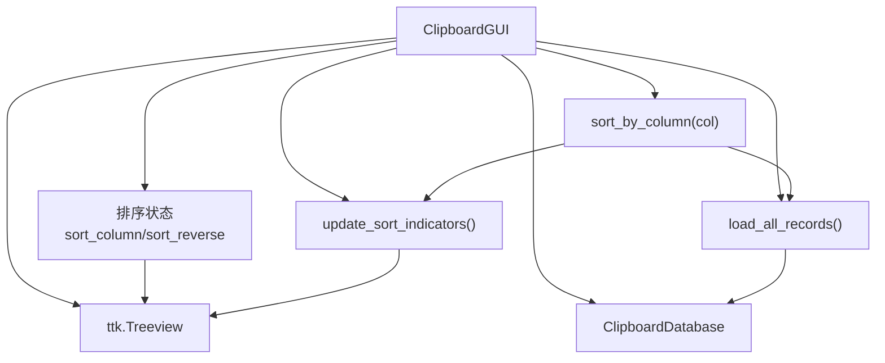

# 排序UI反馈

<cite>
**本文引用的文件**
- [clipboard_gui.py](file://clipboard_gui.py)
</cite>

## 目录
1. [简介](#简介)
2. [项目结构](#项目结构)
3. [核心组件](#核心组件)
4. [架构总览](#架构总览)
5. [详细组件分析](#详细组件分析)
6. [依赖关系分析](#依赖关系分析)
7. [性能考量](#性能考量)
8. [故障排查指南](#故障排查指南)
9. [结论](#结论)

## 简介
本文聚焦于“排序UI反馈”主题，深入文档化 update_sort_indicators 方法的实现细节，解释其如何遍历所有列标题，并依据当前 self.sort_column 与 self.sort_reverse 状态动态更新列标题文本以显示“↑”或“↓”箭头符号。同时，本文将梳理 sort_by_column 调用时的完整执行流程，说明 update_sort_indicators 如何通过修改 heading 的 text 属性实现用户界面的视觉反馈，从而提升用户体验。

## 项目结构
本仓库包含多个模块，但与排序UI反馈直接相关的核心位于 GUI 层的 clipboard_gui.py 文件中。该文件定义了 ClipboardGUI 类，负责构建记录表格、绑定列标题点击事件、维护排序状态、并提供 update_sort_indicators 与 sort_by_column 等关键方法。

图表来源
- [clipboard_gui.py](file://clipboard_gui.py#L226-L308)
- [clipboard_gui.py](file://clipboard_gui.py#L584-L624)

章节来源
- [clipboard_gui.py](file://clipboard_gui.py#L226-L308)
- [clipboard_gui.py](file://clipboard_gui.py#L584-L624)

## 核心组件
- 列标题与点击事件绑定
  - 在 setup_records_tab 中，为每个列标题设置 text 与 command，点击时调用 sort_by_column。
- 排序状态管理
  - sort_by_column 负责切换排序方向或更新当前排序列，并调用 update_sort_indicators 与 load_records。
- 排序指示器更新
  - update_sort_indicators 遍历所有列标题，基于当前排序列与方向动态拼接箭头符号，并通过 Treeview.heading 更新文本。
- 数据加载与排序
  - load_all_records 根据当前排序列与方向，从数据库加载并展示记录。

章节来源
- [clipboard_gui.py](file://clipboard_gui.py#L226-L308)
- [clipboard_gui.py](file://clipboard_gui.py#L279-L294)
- [clipboard_gui.py](file://clipboard_gui.py#L584-L624)

## 架构总览
下面的序列图展示了用户点击某一列标题时，从 sort_by_column 到 update_sort_indicators 再到数据加载的整体流程。

图表来源
- [clipboard_gui.py](file://clipboard_gui.py#L279-L294)
- [clipboard_gui.py](file://clipboard_gui.py#L294-L306)
- [clipboard_gui.py](file://clipboard_gui.py#L584-L624)

## 详细组件分析

### update_sort_indicators 方法详解
- 功能概述
  - 遍历所有列标题，若当前列等于 self.sort_column，则在该列标题文本末尾追加“↑”或“↓”，分别表示正序与倒序；否则仅保留原列名。
  - 同时为每个列标题重新绑定命令，确保点击仍能触发 sort_by_column。
- 关键实现点
  - 列集合：固定包含五列标题，对应界面显示列。
  - 箭头拼接规则：
    - 当 col == self.sort_column 时，若 self.sort_reverse 为真，则追加“ ↓”；否则追加“ ↑”。
  - 更新方式：通过 Treeview.heading(col, text=..., command=...) 修改列标题文本与点击回调。
- 用户体验
  - 即时视觉反馈：点击列标题后，列标题立即显示对应箭头，直观反映当前排序状态。
  - 交互一致性：点击同一列可切换排序方向，再次点击另一列则切换当前排序列并默认倒序。

图表来源
- [clipboard_gui.py](file://clipboard_gui.py#L294-L306)

章节来源
- [clipboard_gui.py](file://clipboard_gui.py#L294-L306)

### sort_by_column 方法与排序状态切换
- 行为规则
  - 若点击列与当前排序列相同：切换 self.sort_reverse。
  - 若点击列不同于当前排序列：更新 self.sort_column 为点击列，并将 self.sort_reverse 设为 True（默认倒序）。
- 执行顺序
  - 更新排序状态后，立即调用 update_sort_indicators 以刷新列标题显示。
  - 随后调用 load_records（内部委托 load_all_records）以重新加载并展示排序后的数据。
- 与 update_sort_indicators 的协作
  - 两者配合，确保 UI 与数据层同步，避免出现“状态与显示不一致”的问题。

图表来源
- [clipboard_gui.py](file://clipboard_gui.py#L279-L294)

章节来源
- [clipboard_gui.py](file://clipboard_gui.py#L279-L294)

### 列标题初始化与命令绑定
- 初始化阶段
  - 在 setup_records_tab 中，为每个列标题设置 text 与 command。
  - 使用 functools.partial 解决闭包捕获问题，确保传入的列名正确。
- 与 update_sort_indicators 的关系
  - 初始化时未包含箭头；首次点击任一列后，update_sort_indicators 会为所有列重新设置文本与命令，保证后续点击行为一致。

章节来源
- [clipboard_gui.py](file://clipboard_gui.py#L226-L245)

### 数据加载与排序应用
- load_all_records
  - 从数据库按当前排序列与方向获取记录，然后插入 Treeview。
  - get_db_sort_field 将界面列名映射为数据库字段名，确保排序字段正确。
- 搜索结果排序
  - sort_search_results 在搜索场景下也遵循相同的排序策略，确保搜索结果与主界面一致。

章节来源
- [clipboard_gui.py](file://clipboard_gui.py#L584-L624)
- [clipboard_gui.py](file://clipboard_gui.py#L627-L636)
- [clipboard_gui.py](file://clipboard_gui.py#L668-L748)

## 依赖关系分析
- 组件耦合
  - ClipboardGUI 内部方法高度内聚：sort_by_column 依赖 update_sort_indicators 与 load_records；update_sort_indicators 依赖 self.sort_column 与 self.sort_reverse。
  - Treeview 作为 UI 控件，通过 heading API 与 GUI 状态解耦，便于集中管理排序状态。
- 外部依赖
  - 数据库访问：通过 ClipboardDatabase 提供的接口进行查询与排序。
  - Tkinter：使用 ttk.Treeview 实现表格与列标题交互。

图表来源
- [clipboard_gui.py](file://clipboard_gui.py#L226-L308)
- [clipboard_gui.py](file://clipboard_gui.py#L584-L624)

章节来源
- [clipboard_gui.py](file://clipboard_gui.py#L226-L308)
- [clipboard_gui.py](file://clipboard_gui.py#L584-L624)

## 性能考量
- update_sort_indicators 的复杂度
  - 固定遍历五列，时间复杂度 O(1)，开销极低。
  - 每次点击列标题都会执行一次，通常不会成为性能瓶颈。
- 数据加载排序
  - load_all_records 会从数据库按排序字段与方向查询记录，建议数据库层建立相应索引以优化排序性能。
- 搜索排序
  - sort_search_results 在内存中对结果进行排序，若搜索结果较多，可能带来额外的内存与 CPU 开销。可考虑在数据库层直接排序以减少内存压力。

[本节为通用性能讨论，不直接分析具体文件]

## 故障排查指南
- 现象：点击列标题后，箭头未显示或显示异常
  - 检查 update_sort_indicators 是否被调用（sort_by_column 中有明确调用）。
  - 确认 self.sort_column 与 self.sort_reverse 的值是否正确更新。
- 现象：点击列标题后数据未按预期排序
  - 检查 get_db_sort_field 的映射是否正确。
  - 确认 load_all_records 的排序参数传入是否正确。
- 现象：搜索结果排序不一致
  - 检查 sort_search_results 的排序逻辑与 sort_by_column 的状态是否一致。

章节来源
- [clipboard_gui.py](file://clipboard_gui.py#L279-L294)
- [clipboard_gui.py](file://clipboard_gui.py#L294-L306)
- [clipboard_gui.py](file://clipboard_gui.py#L584-L624)
- [clipboard_gui.py](file://clipboard_gui.py#L627-L636)
- [clipboard_gui.py](file://clipboard_gui.py#L668-L748)

## 结论
update_sort_indicators 通过简洁高效的固定遍历与条件拼接，实现了对列标题的即时可视化反馈；结合 sort_by_column 的状态切换与 load_all_records 的数据加载，形成了“状态—UI—数据”三者协同的一致性设计。该实现提升了用户对排序状态的感知能力，改善了交互体验。建议在数据库层面完善索引与排序字段映射，以进一步优化性能与稳定性。