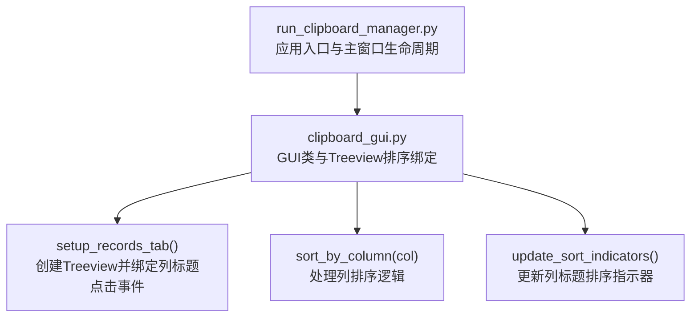
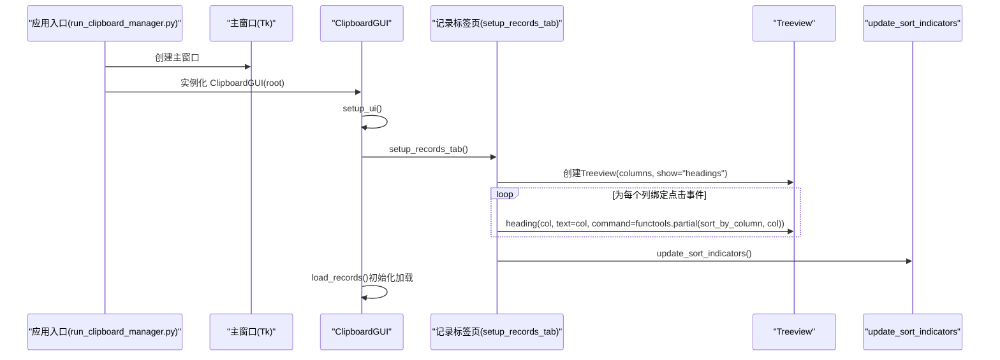
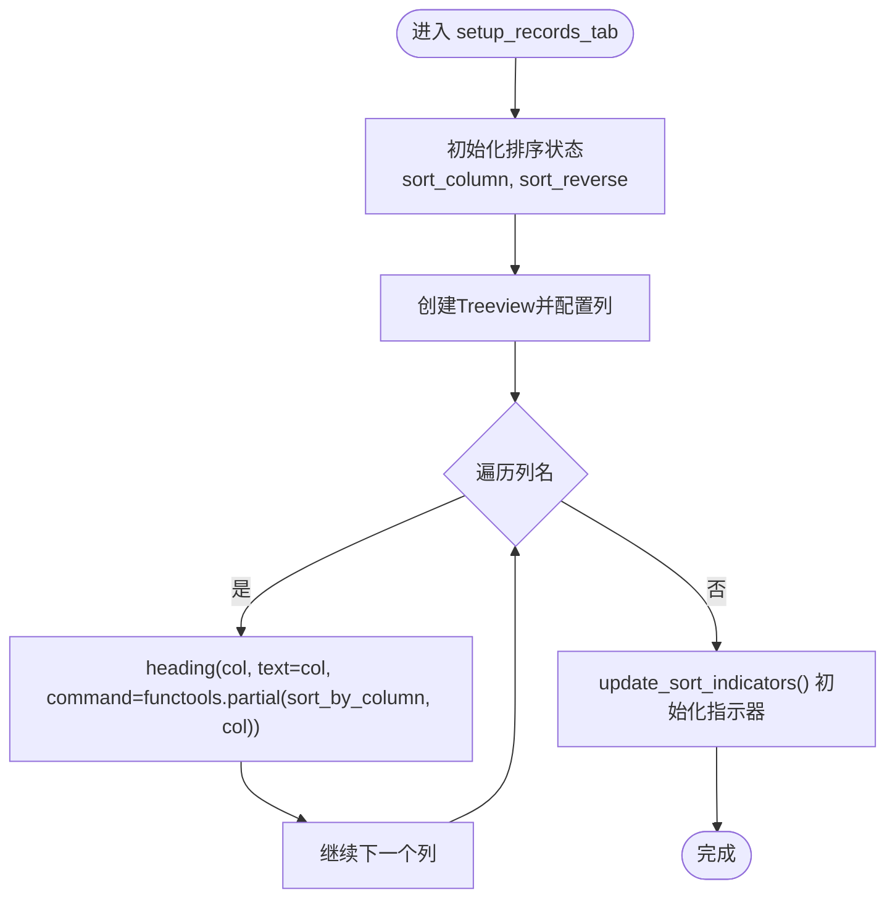
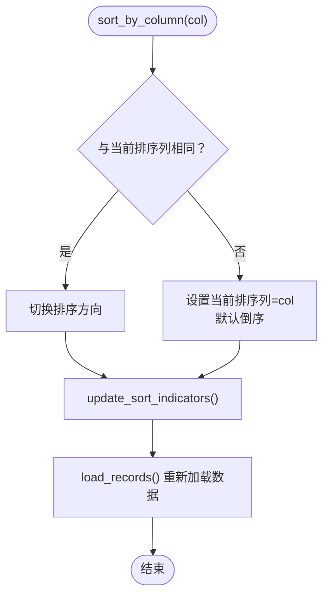
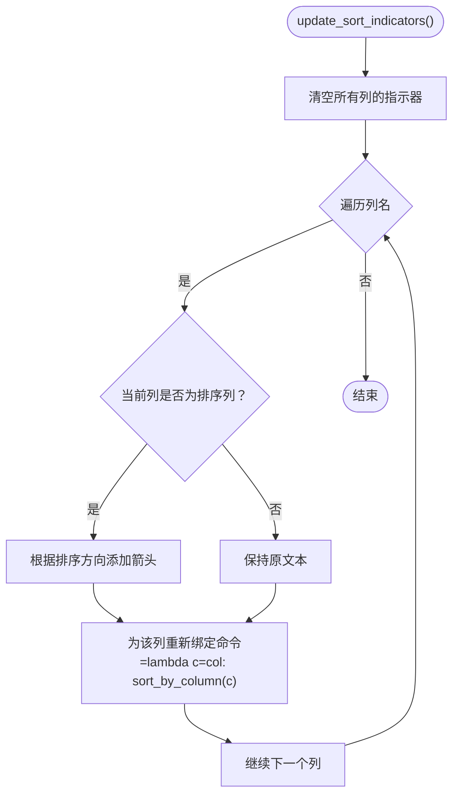
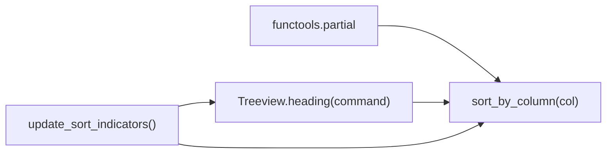

# 排序事件绑定

<cite>
**本文引用的文件**
- [clipboard_gui.py](file://clipboard_gui.py)
- [run_clipboard_manager.py](file://run_clipboard_manager.py)
</cite>

## 目录
1. [简介](#简介)
2. [项目结构](#项目结构)
3. [核心组件](#核心组件)
4. [架构总览](#架构总览)
5. [详细组件分析](#详细组件分析)
6. [依赖关系分析](#依赖关系分析)
7. [性能考量](#性能考量)
8. [故障排查指南](#故障排查指南)
9. [结论](#结论)

## 简介
本文聚焦于 GUI 初始化过程中，针对 Treeview 控件列标题的排序事件绑定机制，特别是通过 for 循环与 functools.partial 的组合，如何解决循环闭包导致的参数绑定问题，确保每个列标题点击事件都能正确传递对应的列名参数。同时阐述 Treeview.heading 方法的 command 参数配置方式，以及事件绑定在 GUI 初始化流程中的执行时机。

## 项目结构
本仓库包含多个模块，其中与排序事件绑定直接相关的核心文件为 clipboard_gui.py，负责构建 GUI 并设置记录标签页；run_clipboard_manager.py 负责应用入口与主窗口生命周期管理。

图表来源
- [run_clipboard_manager.py](file://run_clipboard_manager.py#L55-L66)
- [clipboard_gui.py](file://clipboard_gui.py#L172-L279)
- [clipboard_gui.py](file://clipboard_gui.py#L280-L308)

章节来源
- [run_clipboard_manager.py](file://run_clipboard_manager.py#L55-L66)
- [clipboard_gui.py](file://clipboard_gui.py#L172-L279)

## 核心组件
- GUI 类 ClipboardGUI：负责构建界面、初始化排序状态、绑定 Treeview 列标题点击事件、处理排序逻辑与 UI 更新。
- 记录标签页 setup_records_tab：创建 Treeview，配置列标题与点击事件，设置列宽与对齐方式，并绑定其他交互事件。
- 排序回调 sort_by_column：接收列名参数，切换排序方向或更新默认排序方向，更新排序指示器并重新加载数据。
- 指示器更新 update_sort_indicators：为当前排序列添加上下箭头，同时为各列重新绑定点击回调。

章节来源
- [clipboard_gui.py](file://clipboard_gui.py#L227-L279)
- [clipboard_gui.py](file://clipboard_gui.py#L280-L308)

## 架构总览
GUI 初始化流程中，setup_ui 负责创建笔记本与各标签页，其中记录标签页由 setup_records_tab 完成 Treeview 的创建与事件绑定。排序事件绑定的关键在于 for 循环内使用 functools.partial 为每个列标题构造独立的回调，避免闭包捕获变量带来的“最终值”问题。

图表来源
- [run_clipboard_manager.py](file://run_clipboard_manager.py#L55-L66)
- [clipboard_gui.py](file://clipboard_gui.py#L172-L279)
- [clipboard_gui.py](file://clipboard_gui.py#L280-L308)

## 详细组件分析

### 组件A：setup_records_tab 中的排序事件绑定
- for 循环遍历列名集合，逐个调用 Treeview.heading 配置 text 与 command。
- 使用 functools.partial 包装 sort_by_column，将当前列名作为固定参数注入回调，从而避免闭包捕获变量导致的“最终值”问题。
- 在循环结束后，调用 update_sort_indicators 初始化排序指示器，确保首屏显示正确的排序方向。

图表来源
- [clipboard_gui.py](file://clipboard_gui.py#L227-L279)
- [clipboard_gui.py](file://clipboard_gui.py#L280-L308)

章节来源
- [clipboard_gui.py](file://clipboard_gui.py#L227-L279)

### 组件B：sort_by_column 的处理逻辑
- 接收列名参数 col，判断是否与当前排序列相同：
  - 若相同：切换排序方向（升/降）。
  - 若不同：更新当前排序列为 col，并设置默认倒序（与原始行为一致）。
- 调用 update_sort_indicators 更新列标题文本与命令。
- 调用 load_records 重新加载并显示数据。

图表来源
- [clipboard_gui.py](file://clipboard_gui.py#L280-L294)
- [clipboard_gui.py](file://clipboard_gui.py#L295-L308)

章节来源
- [clipboard_gui.py](file://clipboard_gui.py#L280-L294)

### 组件C：update_sort_indicators 的指示器更新
- 遍历所有列，若当前列等于排序列，则在列标题文本末尾追加上/下箭头表示排序方向。
- 为每个列重新绑定点击回调，采用 lambda 形式将当前列名传入 sort_by_column，确保点击时能正确识别列名。

图表来源
- [clipboard_gui.py](file://clipboard_gui.py#L295-L308)

章节来源
- [clipboard_gui.py](file://clipboard_gui.py#L295-L308)

### 组件D：Treeview.heading 的 command 参数配置
- 在 setup_records_tab 中，通过 heading(col, text=col, command=...) 为每个列标题设置点击回调。
- 为保证回调能携带正确的列名参数，使用 functools.partial 将列名固定到 sort_by_column。
- 在 update_sort_indicators 中，再次调用 heading 为各列重新绑定命令，确保 UI 与逻辑同步。

章节来源
- [clipboard_gui.py](file://clipboard_gui.py#L227-L279)
- [clipboard_gui.py](file://clipboard_gui.py#L295-L308)

### 组件E：GUI 初始化与事件绑定的执行时机
- 应用入口 run_clipboard_manager.py 创建 Tk 主窗口并实例化 ClipboardGUI。
- ClipboardGUI.__init__ 中调用 setup_ui，setup_ui 内部创建笔记本并添加记录标签页。
- 记录标签页的 setup_records_tab 在标签页创建后立即执行，此时 Treeview 已就绪，可安全绑定列标题点击事件。
- 初始化阶段还会延时触发 load_records，用于首次加载数据。

章节来源
- [run_clipboard_manager.py](file://run_clipboard_manager.py#L55-L66)
- [clipboard_gui.py](file://clipboard_gui.py#L172-L226)

## 依赖关系分析
- clipboard_gui.py 依赖 functools.partial 实现回调参数固化，避免闭包捕获变量导致的参数绑定问题。
- Treeview 的 heading 方法承担了列标题点击事件的承载角色，其 command 参数即为回调入口。
- update_sort_indicators 与 sort_by_column 共同维护排序状态与 UI 指示器的一致性。

图表来源
- [clipboard_gui.py](file://clipboard_gui.py#L227-L308)

章节来源
- [clipboard_gui.py](file://clipboard_gui.py#L227-L308)

## 性能考量
- 使用 functools.partial 固定列名参数，避免在每次点击时进行额外的闭包查找，提升回调触发效率。
- update_sort_indicators 在排序状态变更时批量更新所有列标题文本与命令，避免频繁 DOM 更新。
- Treeview 数据加载采用一次性清空与插入的方式，配合排序参数直接从数据库层控制排序，减少前端二次排序开销。

## 故障排查指南
- 现象：点击任意列标题均无法区分具体列名，或总是跳转到同一列排序。
  - 排查要点：确认是否在循环中使用 functools.partial 为 sort_by_column 注入列名参数；检查 update_sort_indicators 是否在循环中为每个列重新绑定命令。
- 现象：排序指示器未随点击变化。
  - 排查要点：确认 update_sort_indicators 是否在 sort_by_column 中被调用；确认 heading 的 text 与 command 是否被正确更新。
- 现象：初始化时未显示排序箭头。
  - 排查要点：确认 setup_records_tab 结束后是否调用了 update_sort_indicators；确认 sort_column 与 sort_reverse 的初始值是否符合预期。

章节来源
- [clipboard_gui.py](file://clipboard_gui.py#L227-L308)

## 结论
通过在 setup_records_tab 中使用 for 循环与 functools.partial，成功解决了循环闭包导致的参数绑定问题，确保每个 Treeview 列标题点击事件都能正确传递对应的列名参数。结合 update_sort_indicators 的指示器更新与 sort_by_column 的排序逻辑，实现了稳定、直观且高效的排序交互体验。事件绑定在 GUI 初始化流程中尽早执行，保证了用户在首屏即可进行排序操作。