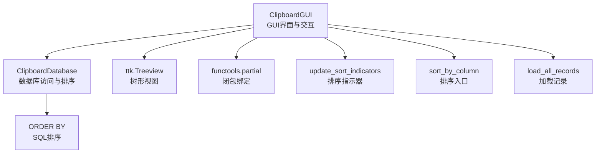
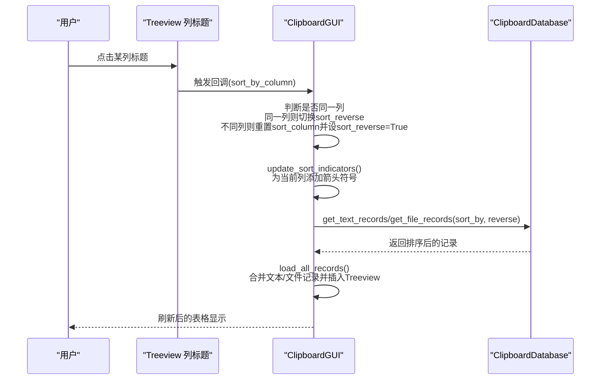
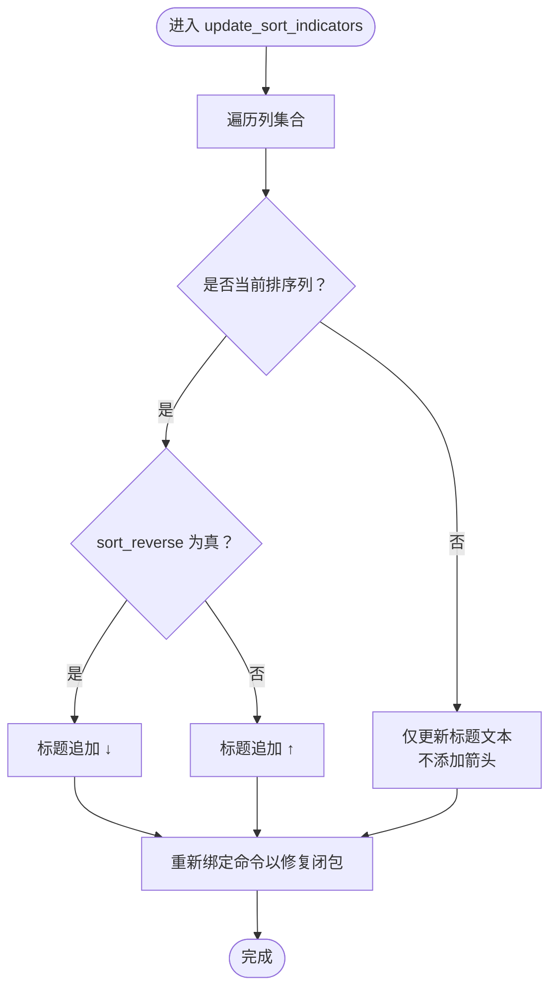
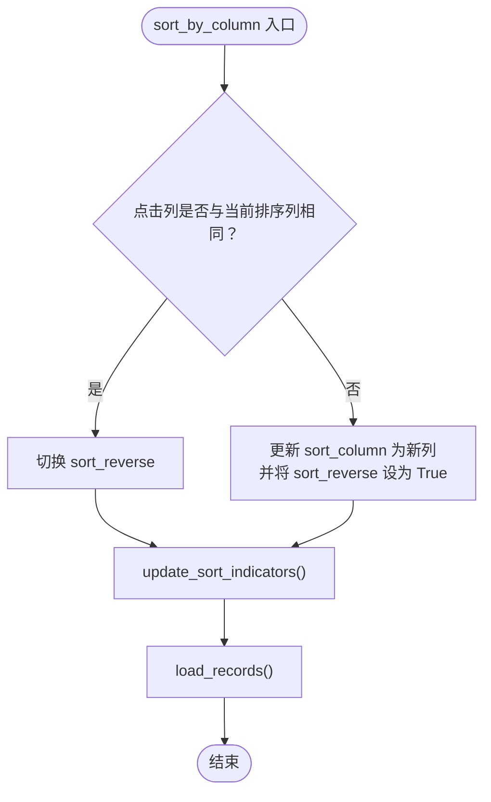
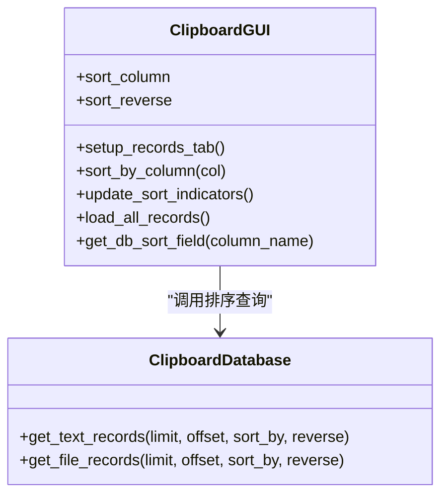
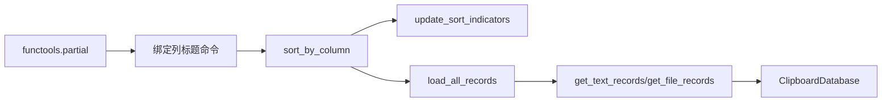

# 排序机制

<cite>
**本文引用的文件**
- [clipboard_gui.py](file://clipboard_gui.py)
- [clipboard_db.py](file://clipboard_db.py)
</cite>

## 目录
1. [简介](#简介)
2. [项目结构](#项目结构)
3. [核心组件](#核心组件)
4. [架构总览](#架构总览)
5. [详细组件分析](#详细组件分析)
6. [依赖关系分析](#依赖关系分析)
7. [性能考量](#性能考量)
8. [故障排查指南](#故障排查指南)
9. [结论](#结论)

## 简介
本文件围绕“基于列标题点击的排序功能”进行全面文档化，重点覆盖以下方面：
- 在记录标签页中，通过 for 循环结合 functools.partial 为每一列绑定 self.sort_by_column 回调，避免闭包捕获导致的点击列名时始终使用最后一个列名的问题。
- self.sort_column 与 self.sort_reverse 两个状态变量的初始化与默认行为：默认按“时间”列倒序。
- update_sort_indicators 方法如何遍历所有列，并为当前排序列动态添加“↑”或“↓”箭头符号。
- sort_by_column 方法中点击同一列切换方向、点击不同列重置为倒序的逻辑实现。
- 数据库侧排序字段映射与实际查询排序方向控制，确保 GUI 与数据库层的一致性。

## 项目结构
本项目与排序相关的代码主要分布在 GUI 层与数据库层：
- GUI 层负责界面交互、状态维护与排序指示器更新。
- 数据库层提供按字段排序的查询接口，支持正序/倒序。

图表来源
- [clipboard_gui.py](file://clipboard_gui.py#L238-L308)
- [clipboard_db.py](file://clipboard_db.py#L185-L261)

章节来源
- [clipboard_gui.py](file://clipboard_gui.py#L238-L308)
- [clipboard_db.py](file://clipboard_db.py#L185-L261)

## 核心组件
- ClipboardGUI.setup_records_tab：初始化排序状态、绑定列标题点击事件、设置列宽与滚动条、创建 Treeview。
- ClipboardGUI.sort_by_column：根据点击列决定是否切换排序方向，或重置为倒序，并触发重新加载与指示器更新。
- ClipboardGUI.update_sort_indicators：为当前排序列动态添加箭头符号，同时重建列标题命令以保持闭包正确性。
- ClipboardGUI.load_all_records：将文本与文件两类记录合并后，按当前排序状态调用数据库接口并插入 Treeview。
- ClipboardDatabase.get_text_records/get_file_records：提供按字段排序的查询能力，支持正序/倒序。
- ClipboardGUI.get_db_sort_field：将界面列名映射为数据库字段名，保证排序字段一致性。

章节来源
- [clipboard_gui.py](file://clipboard_gui.py#L238-L308)
- [clipboard_gui.py](file://clipboard_gui.py#L581-L626)
- [clipboard_gui.py](file://clipboard_gui.py#L627-L637)
- [clipboard_db.py](file://clipboard_db.py#L185-L261)

## 架构总览
排序流程从用户点击列标题开始，经过 GUI 状态更新与指示器刷新，再到数据库查询与界面渲染，形成闭环。

图表来源
- [clipboard_gui.py](file://clipboard_gui.py#L238-L308)
- [clipboard_gui.py](file://clipboard_gui.py#L581-L626)
- [clipboard_db.py](file://clipboard_db.py#L185-L261)

## 详细组件分析

### 列标题点击绑定与闭包问题
- 在 setup_records_tab 中，通过 for 循环遍历列名，使用 functools.partial 将当前列名绑定到 sort_by_column，从而避免闭包捕获导致的“点击列标题总是使用最后一个列名”的问题。
- 绑定后立即调用 update_sort_indicators 初始化列标题显示。

章节来源
- [clipboard_gui.py](file://clipboard_gui.py#L238-L245)

### 排序状态初始化与默认行为
- 在 setup_records_tab 中，初始化排序状态：
  - self.sort_column = "时间"
  - self.sort_reverse = True（默认倒序）
- 这一默认行为与 load_all_records 中对数据库的排序方向控制一致，确保“最新记录优先”。

章节来源
- [clipboard_gui.py](file://clipboard_gui.py#L231-L233)
- [clipboard_gui.py](file://clipboard_gui.py#L591-L597)

### update_sort_indicators：动态添加排序箭头
- 该方法遍历所有列，若当前列等于 self.sort_column，则根据 self.sort_reverse 的布尔值为列标题追加“↑”或“↓”箭头符号。
- 同时，为每个列标题重新设置 command，使用 lambda 或 partial 保持闭包正确性，避免后续点击仍指向旧列。

图表来源
- [clipboard_gui.py](file://clipboard_gui.py#L295-L308)

章节来源
- [clipboard_gui.py](file://clipboard_gui.py#L295-L308)

### sort_by_column：点击同一列切换方向、点击不同列重置为倒序
- 若点击列与当前排序列相同：切换 sort_reverse。
- 若点击列不同于当前排序列：更新 sort_column 为新列，并将 sort_reverse 设为 True（倒序）。
- 更新完成后，调用 update_sort_indicators 刷新列标题显示，并重新加载记录。

图表来源
- [clipboard_gui.py](file://clipboard_gui.py#L280-L294)

章节来源
- [clipboard_gui.py](file://clipboard_gui.py#L280-L294)

### 数据库排序字段映射与查询方向
- get_db_sort_field 将界面列名映射为数据库字段名，确保排序字段与数据库表结构一致。
- load_all_records 调用 get_text_records/get_file_records 时，传入当前排序字段与排序方向，最终由数据库层执行 ORDER BY 并返回排序后的记录。

图表来源
- [clipboard_gui.py](file://clipboard_gui.py#L231-L233)
- [clipboard_gui.py](file://clipboard_gui.py#L280-L294)
- [clipboard_gui.py](file://clipboard_gui.py#L581-L626)
- [clipboard_gui.py](file://clipboard_gui.py#L627-L637)
- [clipboard_db.py](file://clipboard_db.py#L185-L261)

章节来源
- [clipboard_gui.py](file://clipboard_gui.py#L231-L233)
- [clipboard_gui.py](file://clipboard_gui.py#L581-L626)
- [clipboard_gui.py](file://clipboard_gui.py#L627-L637)
- [clipboard_db.py](file://clipboard_db.py#L185-L261)

## 依赖关系分析
- GUI 层依赖 functools.partial 解决闭包捕获问题，确保每个列标题绑定正确的列名。
- GUI 层依赖 ClipboardDatabase 的排序查询接口，传入 sort_by 与 reverse 控制排序字段与方向。
- GUI 层通过 update_sort_indicators 动态刷新列标题文本与命令，维持 UI 与状态的一致性。

图表来源
- [clipboard_gui.py](file://clipboard_gui.py#L238-L308)
- [clipboard_db.py](file://clipboard_db.py#L185-L261)

章节来源
- [clipboard_gui.py](file://clipboard_gui.py#L238-L308)
- [clipboard_db.py](file://clipboard_db.py#L185-L261)

## 性能考量
- 排序在数据库层完成，避免在 Python 层对大量数据进行二次排序，降低内存与 CPU 开销。
- 当前实现未对排序字段建立额外索引，若历史数据量增长显著，可考虑为常用排序字段（如 timestamp、file_size、number）建立索引以提升查询性能。
- 搜索结果排序在 GUI 层进行，针对较小的结果集影响有限；若搜索结果规模扩大，可考虑在数据库层统一排序以减少 Python 层处理。

## 故障排查指南
- 现象：点击列标题后排序方向不变
  - 检查 sort_by_column 是否被正确调用，以及 sort_reverse 是否被切换。
  - 确认 update_sort_indicators 是否为当前列添加了箭头符号。
- 现象：点击不同列后未重置为倒序
  - 检查 sort_by_column 中对不同列的分支逻辑，确认 sort_reverse 是否被设置为 True。
- 现象：列标题命令失效或点击总是跳转到最后一列
  - 检查 setup_records_tab 中是否使用 functools.partial 为每个列绑定回调。
  - 确认 update_sort_indicators 是否在每次更新时重新绑定命令。
- 现象：排序字段不匹配
  - 检查 get_db_sort_field 的映射是否与数据库字段一致。
  - 确认 load_all_records 传入的 sort_by 与 reverse 是否来自 GUI 状态。

章节来源
- [clipboard_gui.py](file://clipboard_gui.py#L238-L308)
- [clipboard_gui.py](file://clipboard_gui.py#L280-L294)
- [clipboard_gui.py](file://clipboard_gui.py#L581-L626)
- [clipboard_gui.py](file://clipboard_gui.py#L627-L637)

## 结论
本项目通过 GUI 层的状态变量与数据库层的排序接口协同工作，实现了直观且稳定的列标题点击排序体验。关键点包括：
- 使用 functools.partial 修复闭包捕获问题，确保每列绑定正确的回调。
- 默认按“时间”列倒序，符合用户对“最新记录优先”的预期。
- update_sort_indicators 动态更新列标题与命令，保证 UI 与状态一致。
- sort_by_column 实现“同一列切换方向、不同列重置为倒序”的交互逻辑。
- 数据库层提供灵活的排序接口，支持多字段与正/倒序控制，保障性能与一致性。