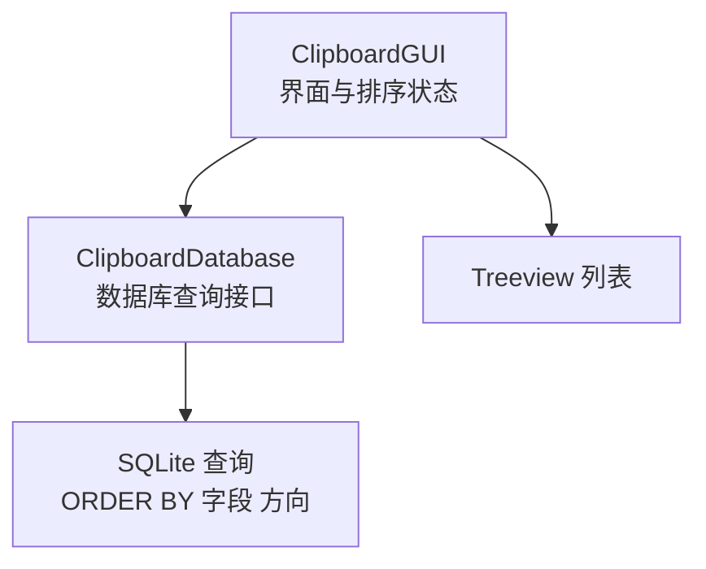
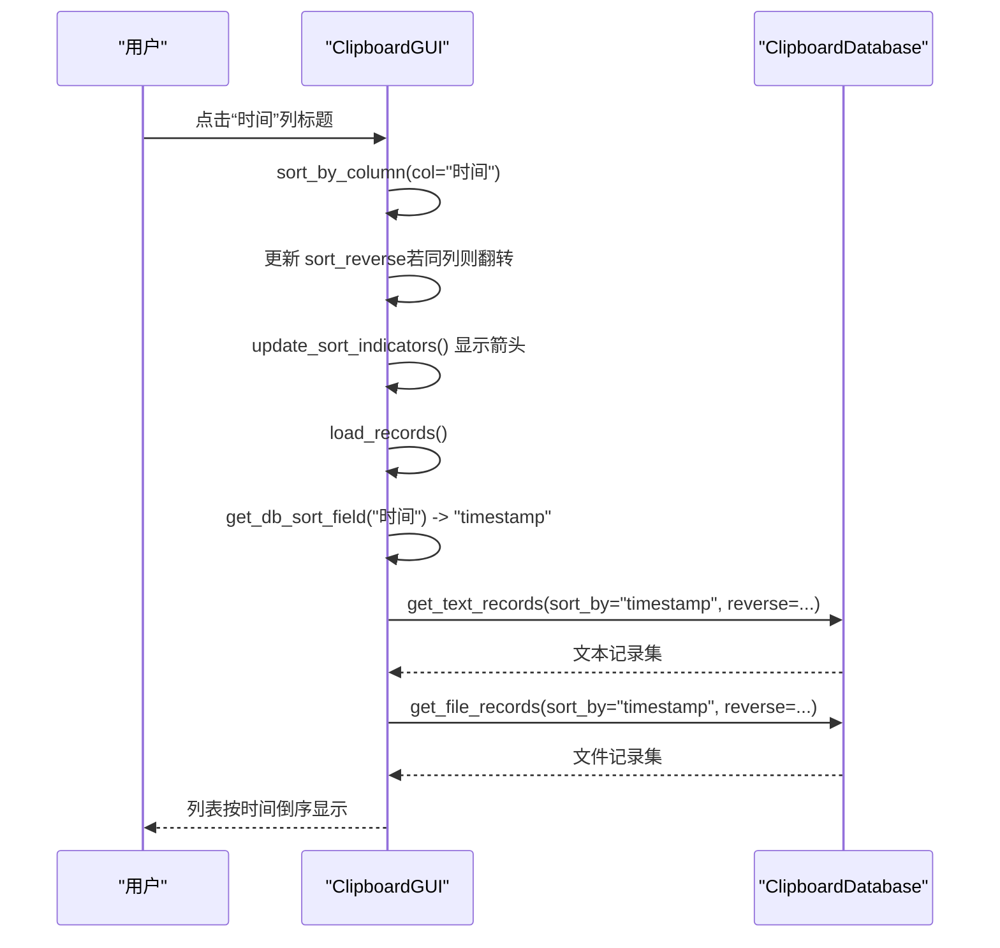
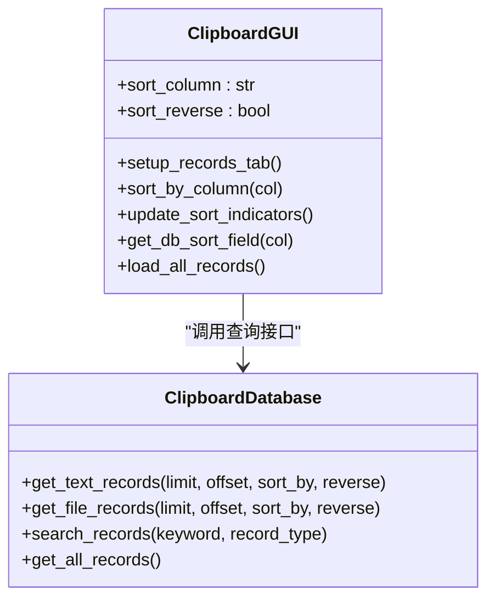

# 排序状态管理

<cite>
**本文引用的文件**
- [clipboard_gui.py](file://clipboard_gui.py)
- [clipboard_db.py](file://clipboard_db.py)
</cite>

## 目录
1. [简介](#简介)
2. [项目结构](#项目结构)
3. [核心组件](#核心组件)
4. [架构总览](#架构总览)
5. [详细组件分析](#详细组件分析)
6. [依赖关系分析](#依赖关系分析)
7. [性能考量](#性能考量)
8. [故障排查指南](#故障排查指南)
9. [结论](#结论)

## 简介
本文件聚焦于 ClipboardGUI 类中两个关键排序状态变量：self.sort_column 与 self.sort_reverse 的初始化、生命周期与状态变化规则，并说明它们如何驱动数据库查询的排序方向。重点覆盖：
- setup_records_tab 中如何将默认排序列初始化为“时间”，并将默认排序方向设为倒序（True），以实现最新记录优先展示。
- sort_by_column 的点击排序逻辑：同列点击切换方向，不同列点击切换列并默认倒序。
- get_db_sort_field 将界面列名映射到数据库字段名，结合 reverse 参数控制 SQL 排序方向。
- load_all_records 如何将排序状态应用于文本与文件两类记录的查询。
- 搜索结果排序（sort_search_results）中对数值型字段的特殊处理与回退策略。

## 项目结构
- GUI 层：clipboard_gui.py 定义 ClipboardGUI 类，负责界面交互、排序状态维护与记录加载。
- 数据层：clipboard_db.py 定义 ClipboardDatabase 类，提供数据库查询接口，支持按字段与方向排序。

图表来源
- [clipboard_gui.py](file://clipboard_gui.py#L227-L308)
- [clipboard_db.py](file://clipboard_db.py#L185-L261)

章节来源
- [clipboard_gui.py](file://clipboard_gui.py#L227-L308)
- [clipboard_db.py](file://clipboard_db.py#L185-L261)

## 核心组件
- ClipboardGUI.sort_column：当前排序列（界面列名，如“时间”）。
- ClipboardGUI.sort_reverse：当前排序方向（布尔值，True 表示倒序，False 表示正序）。
- ClipboardGUI.setup_records_tab：初始化排序状态并绑定列标题点击事件。
- ClipboardGUI.sort_by_column：处理列标题点击，更新排序状态并触发重新加载。
- ClipboardGUI.get_db_sort_field：将界面列名映射到数据库字段名。
- ClipboardGUI.load_all_records：根据排序状态查询文本与文件记录并渲染。
- ClipboardDatabase.get_text_records/get_file_records：执行数据库查询，支持 sort_by 与 reverse 参数。

章节来源
- [clipboard_gui.py](file://clipboard_gui.py#L227-L308)
- [clipboard_gui.py](file://clipboard_gui.py#L581-L640)
- [clipboard_gui.py](file://clipboard_gui.py#L627-L640)
- [clipboard_db.py](file://clipboard_db.py#L185-L261)

## 架构总览
排序功能的端到端流程如下：

图表来源
- [clipboard_gui.py](file://clipboard_gui.py#L280-L308)
- [clipboard_gui.py](file://clipboard_gui.py#L581-L640)
- [clipboard_gui.py](file://clipboard_gui.py#L627-L640)
- [clipboard_db.py](file://clipboard_db.py#L185-L261)

## 详细组件分析

### 初始化与默认行为（setup_records_tab）
- 初始化位置：setup_records_tab 方法中显式设置：
  - self.sort_column = "时间"
  - self.sort_reverse = True
- 作用：确保首次进入记录标签页时，默认按“时间”列倒序排列，最新记录显示在上方。
- 后续绑定：为每个列标题绑定 sort_by_column 回调，实现点击排序。

章节来源
- [clipboard_gui.py](file://clipboard_gui.py#L227-L246)

### 点击排序逻辑（sort_by_column）
- 规则：
  - 若点击的是当前排序列：切换排序方向（True↔False）。
  - 若点击的是其他列：切换排序列为该列，并将排序方向设为 True（默认倒序）。
- 影响：立即更新列标题的排序指示器（箭头），并触发重新加载。

章节来源
- [clipboard_gui.py](file://clipboard_gui.py#L280-L308)

### 排序指示器更新（update_sort_indicators）
- 功能：为当前排序列的标题追加上/下箭头，直观显示排序方向。
- 实现：遍历所有列，若列名等于 sort_column，则根据 sort_reverse 追加箭头。

章节来源
- [clipboard_gui.py](file://clipboard_gui.py#L295-L308)

### 列名到数据库字段映射（get_db_sort_field）
- 目的：将界面列名映射到数据库字段名，保证排序字段正确。
- 映射规则（部分）：
  - “名称或内容” → content
  - “类型” → file_type（文件记录）
  - “大小” → file_size
  - “时间” → timestamp
  - “次数” → number
- 默认回退：未匹配时回退到 timestamp。

章节来源
- [clipboard_gui.py](file://clipboard_gui.py#L627-L640)

### 数据加载与排序应用（load_all_records）
- 流程：
  - 清空现有列表项。
  - 通过 get_db_sort_field 将当前列名映射为数据库字段。
  - 分别调用 db.get_text_records 与 db.get_file_records，并传入 sort_by 与 reverse。
  - 合并两类记录，插入 Treeview。
- 关键点：reverse 来自 sort_reverse，决定 SQL 的 ORDER BY 方向。

章节来源
- [clipboard_gui.py](file://clipboard_gui.py#L581-L640)
- [clipboard_db.py](file://clipboard_db.py#L185-L261)

### 搜索结果排序（sort_search_results）
- 场景：当执行关键词搜索后，在记录标签页中对结果进行排序。
- 规则：
  - 根据当前 sort_column 计算排序索引。
  - 数值型字段（大小、次数）采用数值解析与排序，异常时回退为 0。
  - 其他字段使用文本排序。
  - 异常回退：若排序异常，统一按“时间”列倒序显示。
- 影响：即使搜索结果来自不同来源，也能保持与界面一致的排序体验。

章节来源
- [clipboard_gui.py](file://clipboard_gui.py#L652-L748)

### 数据库查询接口（ClipboardDatabase）
- get_text_records/get_file_records：
  - 支持 sort_by 与 reverse 参数。
  - reverse 为 True 时 ORDER BY 字段 DESC，否则 ASC。
  - 支持 limit/offset（当前记录页加载已废弃，但接口仍保留）。
- get_all_records/search_records：
  - 默认按 timestamp DESC 排序，体现“最新优先”的通用策略。

章节来源
- [clipboard_db.py](file://clipboard_db.py#L185-L261)
- [clipboard_db.py](file://clipboard_db.py#L263-L314)

## 依赖关系分析

图表来源
- [clipboard_gui.py](file://clipboard_gui.py#L227-L308)
- [clipboard_gui.py](file://clipboard_gui.py#L581-L640)
- [clipboard_gui.py](file://clipboard_gui.py#L627-L640)
- [clipboard_db.py](file://clipboard_db.py#L185-L261)

## 性能考量
- 列表一次性加载：当前实现会一次性加载文本与文件两类记录，合并后再渲染。若数据量较大，建议考虑分页或虚拟化列表以降低首屏渲染压力。
- 排序开销：数值型字段排序（大小、次数）需解析字符串，异常时回退为文本排序，避免崩溃但可能带来额外开销。可考虑在数据入库阶段规范化存储单位，减少解析成本。
- 数据库排序：SQL 层面使用 ORDER BY，建议在常用排序字段（如 timestamp、number）建立索引以提升查询性能。

## 故障排查指南
- 现象：点击列标题无反应
  - 检查 setup_records_tab 是否正确绑定 heading 的 command。
  - 章节来源
    - [clipboard_gui.py](file://clipboard_gui.py#L239-L243)
- 现象：排序方向不符合预期
  - 检查 sort_by_column 的逻辑：同列点击切换方向，不同列默认倒序。
  - 章节来源
    - [clipboard_gui.py](file://clipboard_gui.py#L280-L308)
- 现象：搜索结果排序异常
  - 检查 sort_search_results 的数值解析与回退逻辑。
  - 章节来源
    - [clipboard_gui.py](file://clipboard_gui.py#L668-L748)
- 现象：数据库排序无效
  - 检查 get_db_sort_field 的映射是否正确，以及 reverse 参数是否传入。
  - 章节来源
    - [clipboard_gui.py](file://clipboard_gui.py#L627-L640)
    - [clipboard_db.py](file://clipboard_db.py#L185-L261)

## 结论
- 初始化：setup_records_tab 将默认排序列设为“时间”，默认倒序，确保用户首次看到最新记录。
- 状态管理：sort_by_column 统一管理排序列与方向，update_sort_indicators 即时反馈排序状态。
- 数据层对接：get_db_sort_field 将界面列名映射到数据库字段，结合 reverse 控制 SQL 排序方向。
- 搜索一致性：sort_search_results 保证搜索结果与界面排序规则一致，异常时回退到“时间倒序”。