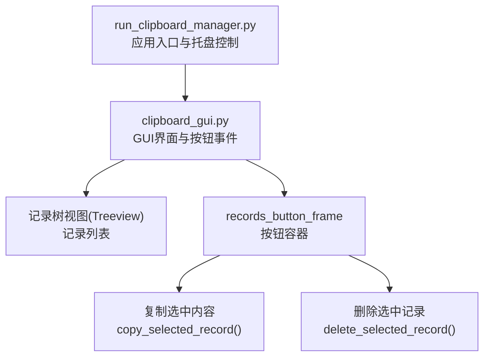
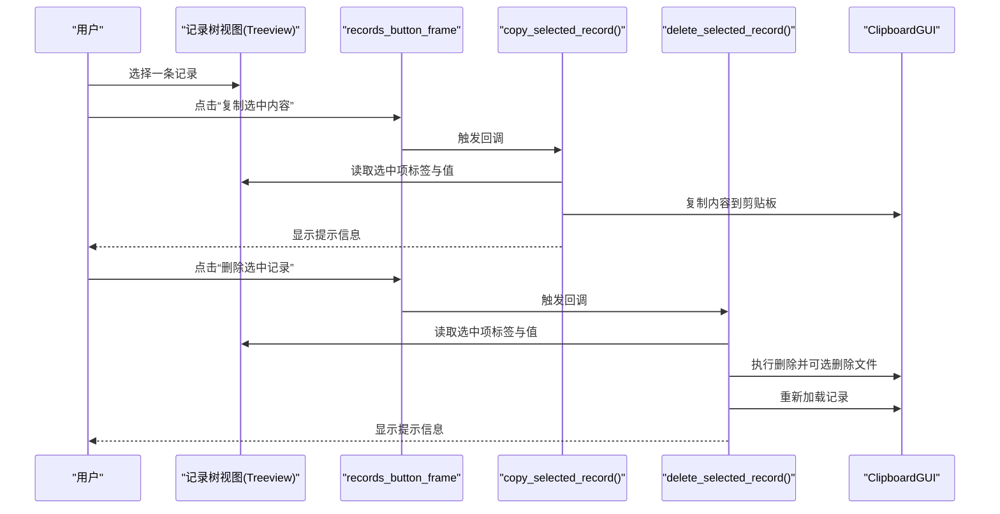
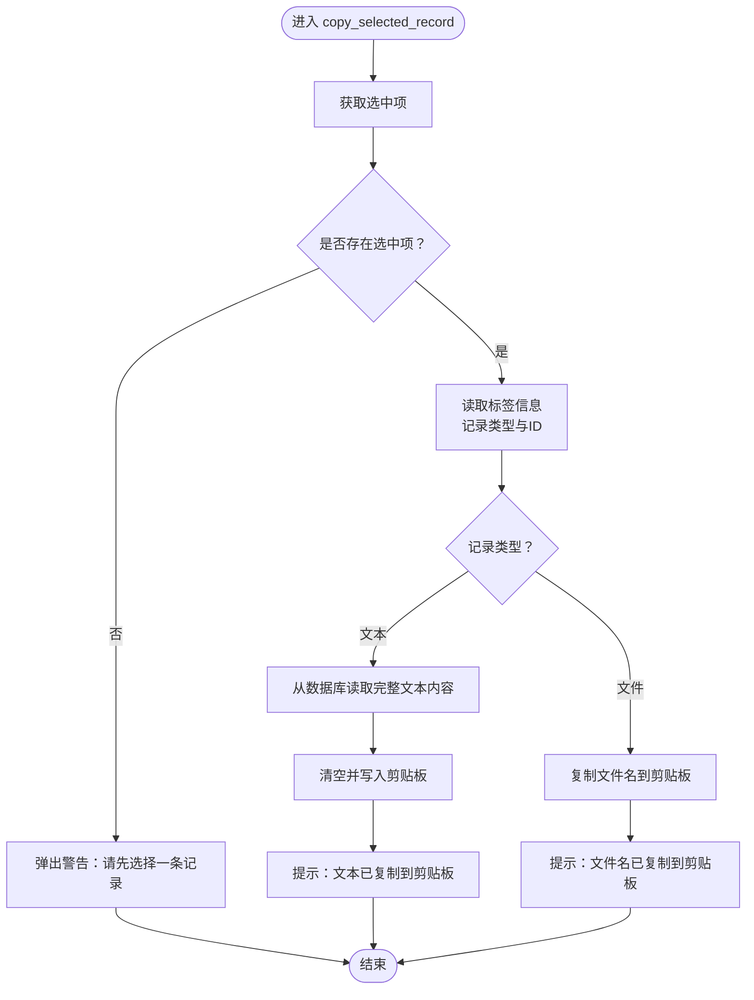
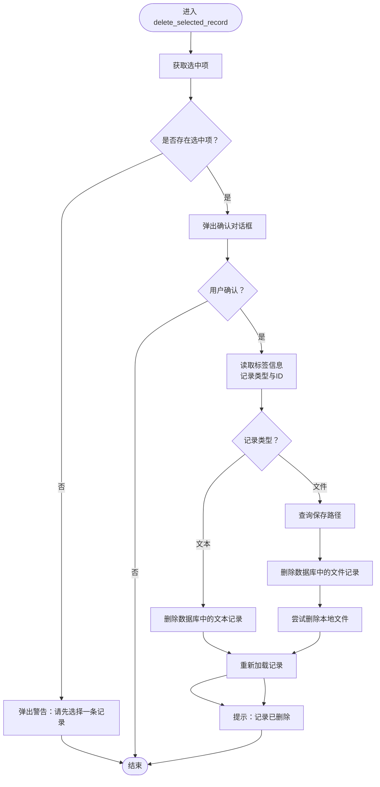
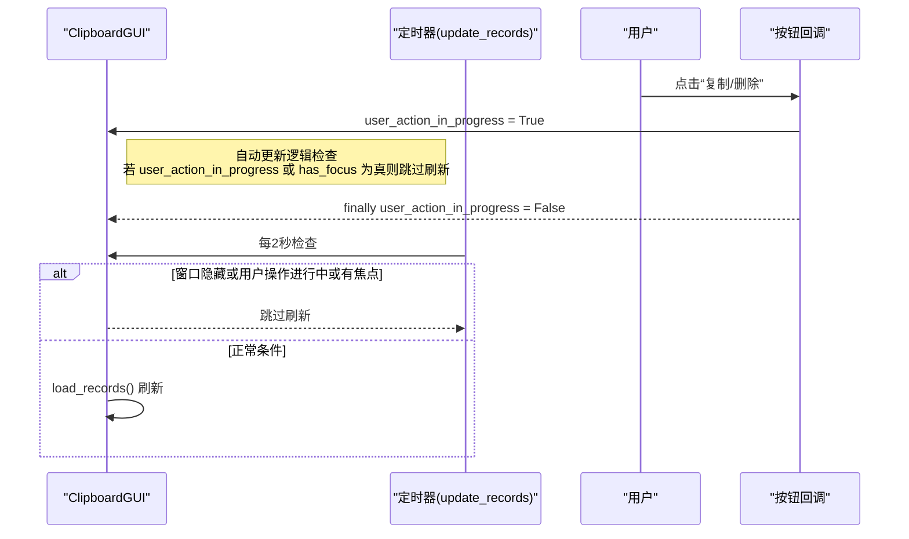
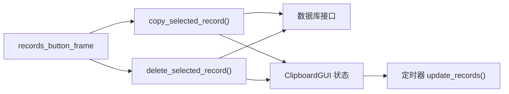

# 操作按钮

<cite>
**本文引用的文件**
- [clipboard_gui.py](file://clipboard_gui.py)
- [run_clipboard_manager.py](file://run_clipboard_manager.py)
</cite>

## 目录
1. [简介](#简介)
2. [项目结构](#项目结构)
3. [核心组件](#核心组件)
4. [架构总览](#架构总览)
5. [详细组件分析](#详细组件分析)
6. [依赖关系分析](#依赖关系分析)
7. [性能考量](#性能考量)
8. [故障排查指南](#故障排查指南)
9. [结论](#结论)

## 简介
本章节聚焦“记录”标签页底部的两个操作按钮：
- “复制选中内容”按钮：调用 copy_selected_record 方法，实现对当前选中记录内容的复制。
- “删除选中记录”按钮：调用 delete_selected_record 方法，实现对当前选中记录的删除。

这两个按钮位于独立的 records_button_frame 框架内，采用 pack 布局管理器水平排列，其中左侧按钮与右侧按钮之间设置 10 像素的右间距。本章节将详细说明按钮的布局、回调绑定、与 GUI 状态管理的交互机制，以及在不同场景下的行为表现。

## 项目结构
与本主题直接相关的文件与职责如下：
- clipboard_gui.py：负责 GUI 界面构建、记录树视图、按钮布局与事件处理，包含 copy_selected_record 与 delete_selected_record 的具体实现。
- run_clipboard_manager.py：负责应用入口、进程互斥检测、剪贴板监控线程启动与 GUI 主窗口的显示/隐藏控制。

图表来源
- [clipboard_gui.py](file://clipboard_gui.py#L227-L279)
- [run_clipboard_manager.py](file://run_clipboard_manager.py#L32-L67)

章节来源
- [clipboard_gui.py](file://clipboard_gui.py#L227-L279)
- [run_clipboard_manager.py](file://run_clipboard_manager.py#L32-L67)

## 核心组件
- records_button_frame：记录标签页底部的按钮容器框架，使用 grid 布局定位，内部包含两个按钮。
- 复制按钮：文本为“复制选中内容”，命令绑定到 copy_selected_record。
- 删除按钮：文本为“删除选中记录”，命令绑定到 delete_selected_record。
- pack 布局：两个按钮通过 pack 水平排列，左侧按钮右侧设置 10 像素的外边距，形成左右间距。

章节来源
- [clipboard_gui.py](file://clipboard_gui.py#L262-L268)

## 架构总览
按钮与事件处理的整体流程如下：
- 用户在记录树视图中选择一条记录。
- 点击“复制选中内容”或“删除选中记录”按钮。
- 按钮触发对应回调方法，方法内部读取选中项的标签信息以判断记录类型（文本/文件），并执行相应操作。
- 操作完成后，重新加载记录列表以反映最新状态。

图表来源
- [clipboard_gui.py](file://clipboard_gui.py#L262-L268)
- [clipboard_gui.py](file://clipboard_gui.py#L796-L838)
- [clipboard_gui.py](file://clipboard_gui.py#L839-L878)

## 详细组件分析

### 按钮布局与排列
- 容器：records_button_frame 通过 grid 放置在记录标签页的第二行，占满两列并设置上边距。
- 子元素：两个按钮均使用 pack 水平排列，第一个按钮右侧设置 10 像素外边距，形成与第二个按钮之间的间距。
- 事件绑定：第一个按钮绑定到 copy_selected_record，第二个按钮绑定到 delete_selected_record。

章节来源
- [clipboard_gui.py](file://clipboard_gui.py#L262-L268)

### 复制选中内容（copy_selected_record）
- 作用：根据选中记录类型（文本或文件）复制对应内容到系统剪贴板，并给出提示。
- 选择性：若未选择任何记录，会弹出警告提示。
- 文本记录：从数据库读取完整文本内容，清空并写入剪贴板，提示“文本已复制到剪贴板”。
- 文件记录：复制文件名到剪贴板，提示“文件名已复制到剪贴板”。

图表来源
- [clipboard_gui.py](file://clipboard_gui.py#L796-L838)

章节来源
- [clipboard_gui.py](file://clipboard_gui.py#L796-L838)

### 删除选中记录（delete_selected_record）
- 作用：删除当前选中的记录，并在必要时尝试删除对应的本地文件。
- 交互：删除前弹出确认对话框，用户确认后继续。
- 选择性：若未选择任何记录，会弹出警告提示。
- 文本记录：直接删除数据库中的文本记录。
- 文件记录：先查询保存路径，删除数据库记录，再尝试删除本地文件（若不再被其他记录引用）。
- 刷新：删除完成后重新加载记录列表，提示“记录已删除”。

图表来源
- [clipboard_gui.py](file://clipboard_gui.py#L839-L878)

章节来源
- [clipboard_gui.py](file://clipboard_gui.py#L839-L878)

### GUI 状态管理与交互机制
- user_action_in_progress：用户操作进行中的全局标记。在按钮回调开始时设为 True，在 finally 中恢复为 False。该标记用于控制自动更新逻辑，避免在用户操作期间频繁刷新记录列表。
- has_focus：窗口焦点状态标记。当窗口获得焦点时设为 True，失去焦点时设为 False。
- start_auto_update/stop_auto_update/update_records：定时任务负责每 2 秒检查一次是否需要刷新记录。在窗口隐藏、用户操作进行中或窗口有焦点时，将跳过刷新以减少干扰。
- hide_window/show_window/toggle_window：通过系统托盘或快捷键切换窗口显示状态。窗口隐藏时停止自动更新，显示时立即刷新记录。

图表来源
- [clipboard_gui.py](file://clipboard_gui.py#L1676-L1696)
- [clipboard_gui.py](file://clipboard_gui.py#L1697-L1722)
- [clipboard_gui.py](file://clipboard_gui.py#L796-L838)
- [clipboard_gui.py](file://clipboard_gui.py#L839-L878)

章节来源
- [clipboard_gui.py](file://clipboard_gui.py#L1676-L1696)
- [clipboard_gui.py](file://clipboard_gui.py#L1697-L1722)
- [clipboard_gui.py](file://clipboard_gui.py#L796-L838)
- [clipboard_gui.py](file://clipboard_gui.py#L839-L878)

## 依赖关系分析
- 按钮与回调：records_button_frame 内部的两个按钮分别绑定到 ClipboardGUI 类的两个方法，二者共享相同的参数签名与返回约定。
- 数据访问：两个回调方法均依赖 Treeview 的选中项标签与值来区分记录类型与 ID，并通过数据库接口执行读取或删除操作。
- 状态协同：user_action_in_progress 与 has_focus 共同影响 update_records 的执行时机，从而间接影响按钮点击时的刷新行为。

图表来源
- [clipboard_gui.py](file://clipboard_gui.py#L262-L268)
- [clipboard_gui.py](file://clipboard_gui.py#L796-L838)
- [clipboard_gui.py](file://clipboard_gui.py#L839-L878)
- [clipboard_gui.py](file://clipboard_gui.py#L1676-L1696)

章节来源
- [clipboard_gui.py](file://clipboard_gui.py#L262-L268)
- [clipboard_gui.py](file://clipboard_gui.py#L796-L838)
- [clipboard_gui.py](file://clipboard_gui.py#L839-L878)
- [clipboard_gui.py](file://clipboard_gui.py#L1676-L1696)

## 性能考量
- 自动更新节流：通过 user_action_in_progress 与 has_focus 控制定时刷新，避免在用户操作或窗口有焦点时频繁刷新，降低 UI 卡顿风险。
- 按钮回调短路：复制/删除操作在方法末尾统一恢复 user_action_in_progress，确保后续定时器能正常工作。
- 文件删除策略：删除文件记录后尝试删除本地文件，但不会强制删除仍在使用的文件，避免误删。

## 故障排查指南
- 未选择记录即点击按钮
  - 现象：弹出警告提示“请先选择一条记录”。
  - 排查：确认 Treeview 是否有选中项；检查 Treeview 的选择事件是否正确触发。
- 复制文本失败
  - 现象：弹出警告提示“无法获取文本内容”。
  - 排查：确认数据库中是否存在对应记录；检查数据库连接与查询逻辑。
- 删除文件记录后仍存在本地文件
  - 现象：数据库记录已删除，但本地文件未被删除。
  - 排查：确认 saved_path 是否有效；检查文件是否被其他记录引用；确认删除权限与路径有效性。
- 按钮点击后记录未刷新
  - 现象：删除/复制后列表未更新。
  - 排查：确认回调是否执行了 load_records；检查 user_action_in_progress 是否长时间保持为 True；确认定时器是否被停止。

章节来源
- [clipboard_gui.py](file://clipboard_gui.py#L796-L838)
- [clipboard_gui.py](file://clipboard_gui.py#L839-L878)
- [clipboard_gui.py](file://clipboard_gui.py#L1676-L1696)

## 结论
- “复制选中内容”与“删除选中记录”按钮位于 records_button_frame 内，采用 pack 水平排列并设置 10 像素右间距。
- 两个按钮分别绑定到 ClipboardGUI 的 copy_selected_record 与 delete_selected_record 方法，二者均基于 Treeview 选中项的标签信息判断记录类型并执行相应操作。
- GUI 状态管理通过 user_action_in_progress 与 has_focus 协同定时刷新逻辑，确保在用户操作期间不干扰刷新，提升用户体验。
- 删除文件记录时具备安全保护，避免误删仍在使用的文件；复制操作针对文本与文件分别处理，保证用户得到预期结果。