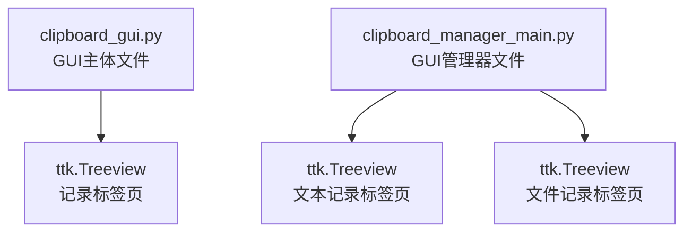
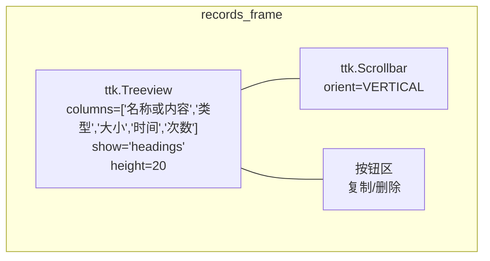
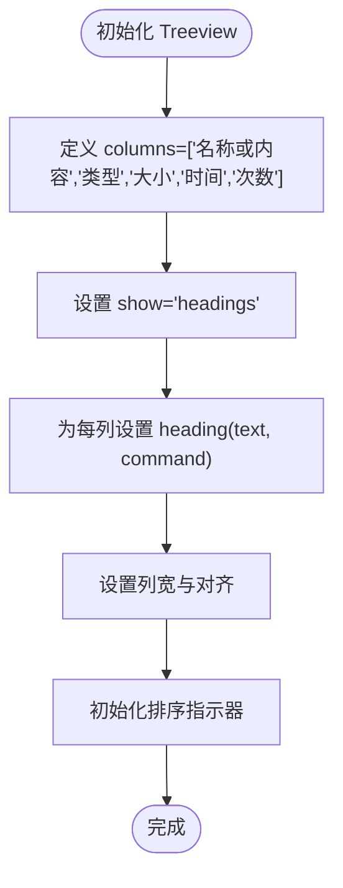
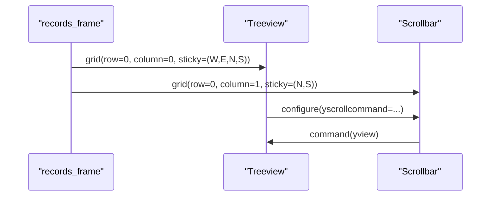
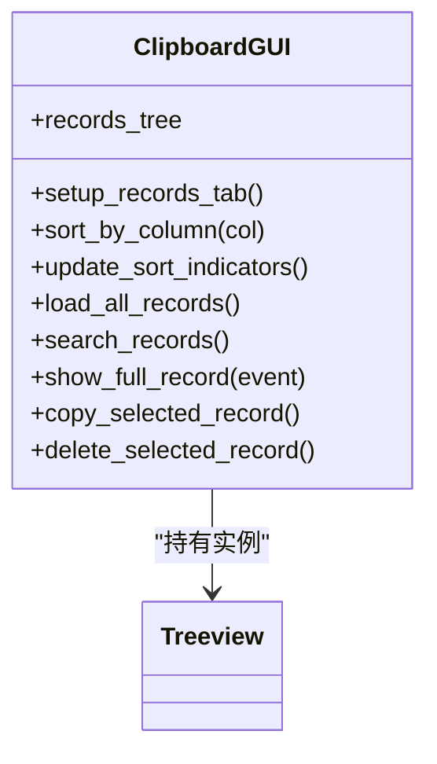
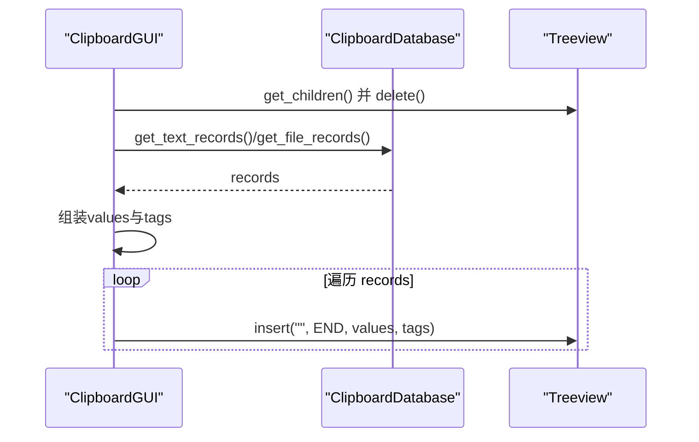
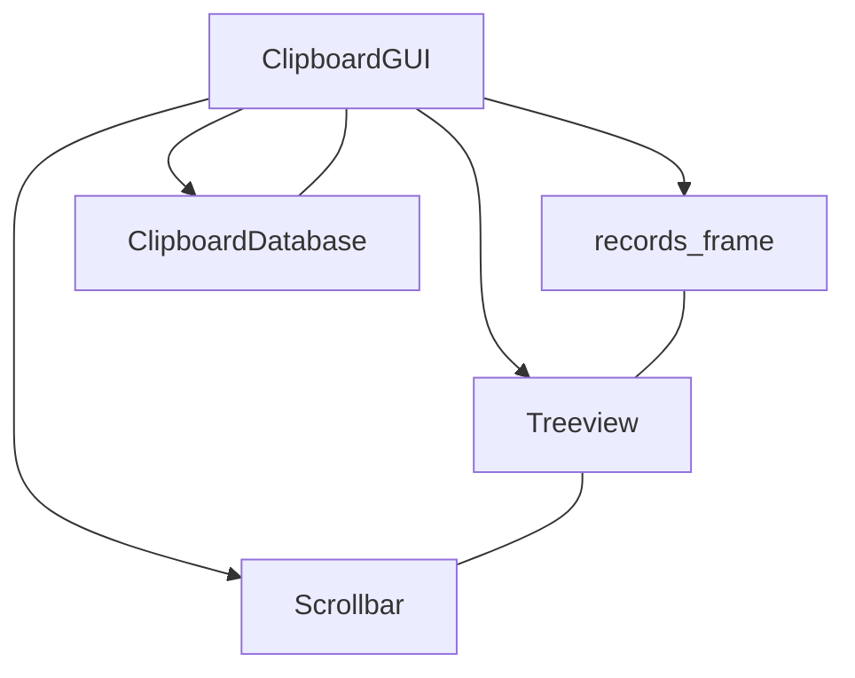

# 树形视图结构

<cite>
**本文引用的文件**
- [clipboard_gui.py](file://clipboard_gui.py)
- [clipboard_manager_main.py](file://clipboard_manager_main.py)
</cite>

## 目录
1. [简介](#简介)
2. [项目结构](#项目结构)
3. [核心组件](#核心组件)
4. [架构总览](#架构总览)
5. [详细组件分析](#详细组件分析)
6. [依赖关系分析](#依赖关系分析)
7. [性能考量](#性能考量)
8. [故障排查指南](#故障排查指南)
9. [结论](#结论)

## 简介
本文件聚焦于 ttk.Treeview 组件在 GUI 中的初始化流程与布局策略，围绕以下目标展开：
- 列定义与表头行为：columns 参数定义的五列“名称或内容”“类型”“大小”“时间”“次数”，以及 show='headings' 的表头显示设置。
- 行高控制：height=20 对可视行数的影响与实际显示效果。
- 布局定位：在 records_frame 网格布局中的 row=0、column=0 定位及 sticky=(tk.W, tk.E, tk.N, tk.S) 的填充行为。
- 实例变量共享：self.records_tree 作为类属性在整个 GUI 生命周期内的共享访问机制。

## 项目结构
本仓库包含多个模块，其中与 ttk.Treeview 直接相关的是 GUI 主体文件与 GUI 管理器文件：
- GUI 主体文件负责界面构建、标签页组织、树形视图初始化与数据绑定。
- GUI 管理器文件提供独立的 GUI 界面（含两个 Treeview），便于理解不同场景下的 Treeview 使用方式。

**图表来源**
- [clipboard_gui.py](file://clipboard_gui.py#L227-L279)
- [clipboard_manager_main.py](file://clipboard_manager_main.py#L554-L614)

**章节来源**
- [clipboard_gui.py](file://clipboard_gui.py#L172-L219)
- [clipboard_manager_main.py](file://clipboard_manager_main.py#L504-L553)

## 核心组件
本节聚焦于记录标签页中的 ttk.Treeview 初始化与关键配置，包括列定义、表头行为、列宽与对齐、滚动条、网格布局与粘性填充，以及实例变量 self.records_tree 的生命周期与共享访问。

- 列定义与表头设置
  - columns 参数定义五列：名称或内容、类型、大小、时间、次数。
  - show='headings' 使得表头可见，且可点击排序。
  - heading 设置列标题与点击回调，结合排序指示器更新。
- 行高控制
  - height=20 指定 Treeview 的可视行数为 20 行。
- 布局与填充
  - grid(row=0, column=0, sticky=(W, E, N, S)) 将 Treeview 填充至 records_frame 的网格单元。
  - records_frame 的 columnconfigure(0, weight=1) 与 rowconfigure(0, weight=1) 保证随父容器缩放。
  - 右侧纵向滚动条通过 yview 与 yscrollcommand 关联。
- 实例变量共享
  - self.records_tree 作为类属性，在 setup_records_tab 中创建后，贯穿后续的排序、插入、删除、复制、删除等操作，形成跨方法的共享访问。

**章节来源**
- [clipboard_gui.py](file://clipboard_gui.py#L227-L279)
- [clipboard_gui.py](file://clipboard_gui.py#L247-L251)
- [clipboard_gui.py](file://clipboard_gui.py#L254-L261)
- [clipboard_gui.py](file://clipboard_gui.py#L276-L279)

## 架构总览
下图展示记录标签页中 Treeview 的初始化与布局关系，以及与滚动条、按钮区、父容器的关系。

**图表来源**
- [clipboard_gui.py](file://clipboard_gui.py#L227-L279)

## 详细组件分析

### Treeview 初始化与列配置
- 列定义与表头
  - columns 为元组，包含五列键名，分别对应“名称或内容”“类型”“大小”“时间”“次数”。
  - show='headings' 使列标题显示为表头，而非默认的伪列。
  - heading 逐列设置文本与点击回调，使用 functools.partial 解决闭包捕获问题。
- 列宽与对齐
  - 通过 column 方法设置各列宽度与对齐方式，满足不同列的信息密度与可读性需求。
- 排序指示器
  - update_sort_indicators 动态更新表头文本，附加上下箭头以指示当前排序方向与列。

**图表来源**
- [clipboard_gui.py](file://clipboard_gui.py#L236-L253)
- [clipboard_gui.py](file://clipboard_gui.py#L280-L308)

**章节来源**
- [clipboard_gui.py](file://clipboard_gui.py#L236-L253)
- [clipboard_gui.py](file://clipboard_gui.py#L280-L308)

### 行高控制与显示行数
- height=20 指定 Treeview 的可视行数为 20 行。
- 实际显示行数受容器高度与行高共同影响；当内容超过 20 行时，需配合纵向滚动条浏览。
- 若容器高度不足，Treeview 会自动裁剪显示范围，滚动条用于上下滚动浏览。

**章节来源**
- [clipboard_gui.py](file://clipboard_gui.py#L236-L236)

### 布局与粘性填充
- 定位与填充
  - Treeview 通过 grid(row=0, column=0, sticky=(W, E, N, S)) 定位在 records_frame 的网格单元中，并通过 sticky 实现随父容器四向拉伸填充。
- 父容器权重
  - records_frame.columnconfigure(0, weight=1) 与 rowconfigure(0, weight=1) 使内部网格具备弹性，随窗口大小变化而自适应。
- 滚动条
  - 右侧纵向滚动条 orient=VERTICAL，通过 yview 与 yscrollcommand 与 Treeview 同步滚动。

**图表来源**
- [clipboard_gui.py](file://clipboard_gui.py#L254-L261)
- [clipboard_gui.py](file://clipboard_gui.py#L258-L261)
- [clipboard_gui.py](file://clipboard_gui.py#L276-L279)

**章节来源**
- [clipboard_gui.py](file://clipboard_gui.py#L254-L261)
- [clipboard_gui.py](file://clipboard_gui.py#L258-L261)
- [clipboard_gui.py](file://clipboard_gui.py#L276-L279)

### 实例变量共享机制
- self.records_tree 作为类属性，在 setup_records_tab 中创建后，贯穿以下操作：
  - 排序：sort_by_column、update_sort_indicators。
  - 数据加载：load_all_records、search_records、sort_search_results。
  - 用户交互：show_full_record、copy_selected_record、delete_selected_record。
  - 滚动与选择：bind 绑定的事件处理。
- 共享访问体现在：
  - 多个方法直接读写 self.records_tree 的子节点、选中项、滚动位置等。
  - 通过 tags 与 values 传递记录类型与标识，实现跨方法的数据一致性。

**图表来源**
- [clipboard_gui.py](file://clipboard_gui.py#L227-L308)
- [clipboard_gui.py](file://clipboard_gui.py#L581-L626)
- [clipboard_gui.py](file://clipboard_gui.py#L627-L748)
- [clipboard_gui.py](file://clipboard_gui.py#L749-L878)

**章节来源**
- [clipboard_gui.py](file://clipboard_gui.py#L227-L308)
- [clipboard_gui.py](file://clipboard_gui.py#L581-L626)
- [clipboard_gui.py](file://clipboard_gui.py#L627-L748)
- [clipboard_gui.py](file://clipboard_gui.py#L749-L878)

### 数据加载与插入流程
- 清空现有数据：遍历并删除所有子节点。
- 从数据库获取文本与文件两类记录，构造统一的五元组 values。
- 根据记录类型设置 tags，以便后续复制、删除、查看完整内容等操作识别记录类型与 ID。
- 逐条插入到 Treeview，values 顺序与列定义一一对应。

**图表来源**
- [clipboard_gui.py](file://clipboard_gui.py#L581-L626)
- [clipboard_gui.py](file://clipboard_gui.py#L619-L622)

**章节来源**
- [clipboard_gui.py](file://clipboard_gui.py#L581-L626)
- [clipboard_gui.py](file://clipboard_gui.py#L619-L622)

## 依赖关系分析
- Treeview 与父容器
  - records_frame 作为 Treeview 的父容器，负责网格权重与粘性填充，确保 Treeview 随窗口缩放。
- Treeview 与滚动条
  - Scrollbar 通过 yview 与 Treeview 的 yscrollcommand 关联，实现双向同步。
- Treeview 与事件
  - 绑定双击、选择变更、滚轮事件，驱动显示完整内容、复制、删除等操作。
- 数据层
  - ClipboardDatabase 提供文本与文件记录的查询、搜索、统计等能力，Treeview 仅负责展示。

**图表来源**
- [clipboard_gui.py](file://clipboard_gui.py#L227-L279)
- [clipboard_gui.py](file://clipboard_gui.py#L581-L626)

**章节来源**
- [clipboard_gui.py](file://clipboard_gui.py#L227-L279)
- [clipboard_gui.py](file://clipboard_gui.py#L581-L626)

## 性能考量
- 行高与渲染
  - height=20 控制可视行数，避免一次性渲染过多行导致卡顿。
- 数据加载策略
  - 分批加载与按需排序，减少 UI 阻塞。
- 滚动与事件
  - 通过绑定事件处理少量高频操作，避免频繁重建 Treeview。
- 建议
  - 当记录量较大时，考虑虚拟化或分页加载，进一步降低内存占用与渲染压力。

[本节为通用建议，不直接分析具体文件]

## 故障排查指南
- 表头未显示
  - 检查 show='headings' 是否正确设置。
  - 确认 heading 是否为每列设置文本与命令。
- 列宽异常
  - 检查 column 宽度与对齐设置是否合理，必要时调整以适配内容。
- 滚动无效
  - 确认 Scrollbar 的 orient 与 Treeview 的 yview/yscrollcommand 是否正确关联。
- 选中项为空
  - 检查 selection 是否为空，避免对空选中执行复制或删除。
- 排序方向不正确
  - 检查 sort_column 与 sort_reverse 的状态，确认 update_sort_indicators 是否被调用。

**章节来源**
- [clipboard_gui.py](file://clipboard_gui.py#L236-L253)
- [clipboard_gui.py](file://clipboard_gui.py#L254-L261)
- [clipboard_gui.py](file://clipboard_gui.py#L280-L308)
- [clipboard_gui.py](file://clipboard_gui.py#L749-L878)

## 结论
本文系统梳理了 ttk.Treeview 在记录标签页中的初始化流程与布局策略，明确了：
- 五列定义与表头行为（show='headings'）。
- 行高控制（height=20）与滚动条配合。
- 在 records_frame 中的网格定位与粘性填充。
- 实例变量 self.records_tree 的类属性共享机制与跨方法访问。
这些设计共同实现了清晰、可排序、可交互的记录展示体验。