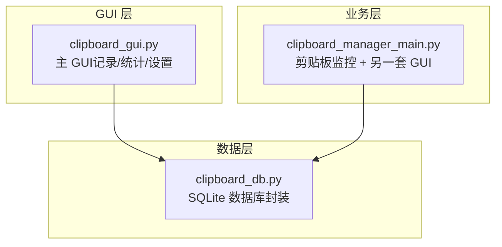
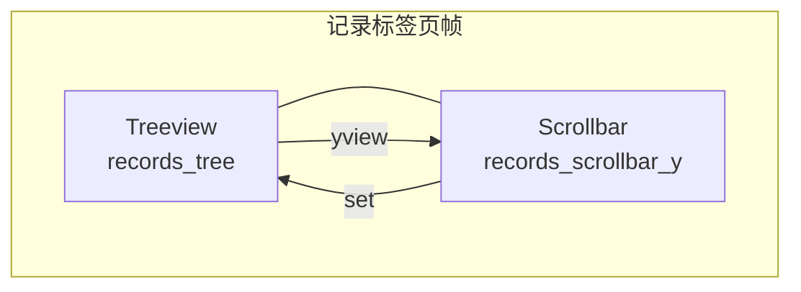
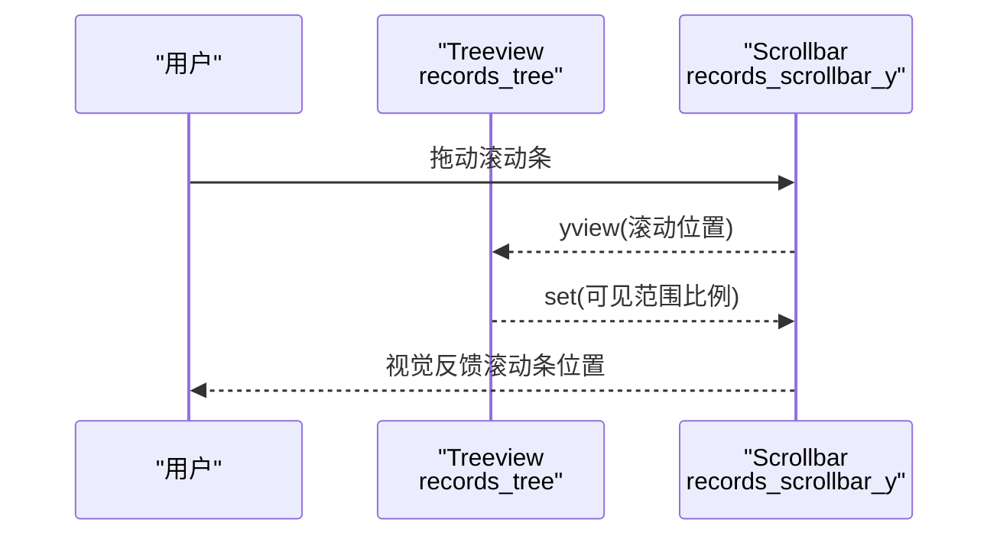
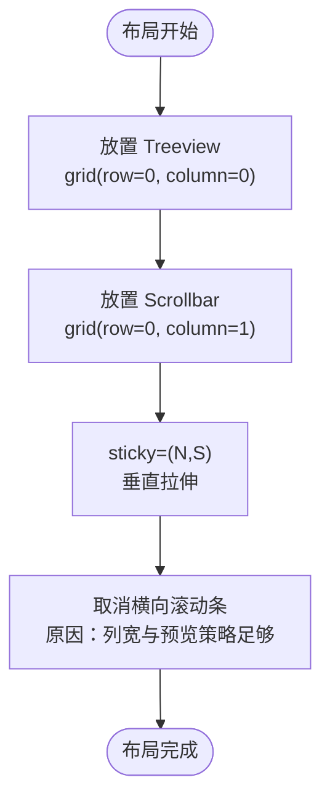
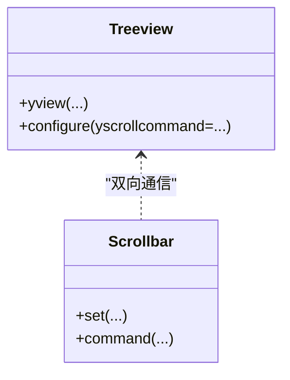
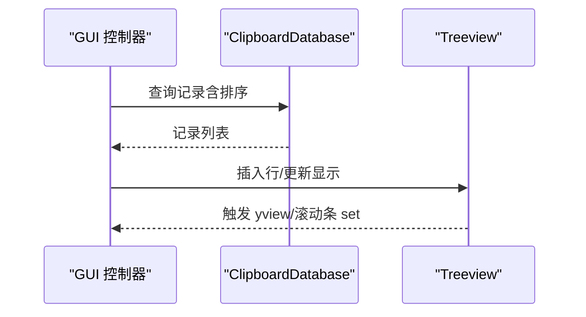
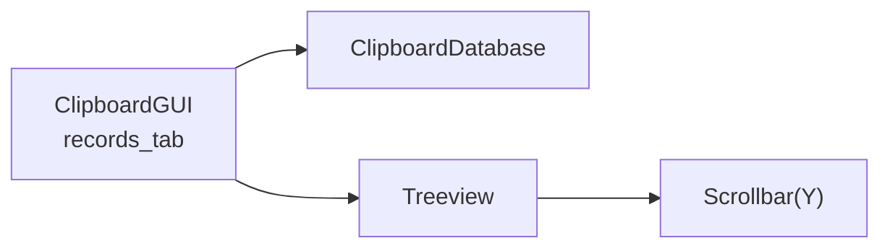

# 滚动条集成

<cite>
**本文引用的文件**
- [clipboard_gui.py](file://clipboard_gui.py)
- [clipboard_manager_main.py](file://clipboard_manager_main.py)
- [clipboard_db.py](file://clipboard_db.py)
</cite>

## 目录
1. [简介](#简介)
2. [项目结构](#项目结构)
3. [核心组件](#核心组件)
4. [架构总览](#架构总览)
5. [详细组件分析](#详细组件分析)
6. [依赖关系分析](#依赖关系分析)
7. [性能考量](#性能考量)
8. [故障排查指南](#故障排查指南)
9. [结论](#结论)

## 简介
本文件聚焦“垂直滚动条”的创建与集成过程，围绕以下目标展开：
- 使用 ttk.Scrollbar 创建 orient=tk.VERTICAL 的滚动条，并将其 command 参数绑定到 self.records_tree.yview。
- 说明 self.records_tree.configure(yscrollcommand=records_scrollbar_y.set) 实现的双向通信机制。
- 描述滚动条在网格布局中位于树形视图右侧（column=1），且垂直填充（sticky=(tk.N, tk.S)）的定位策略。
- 解释为何取消了横向滚动条。

上述内容均基于仓库中的 GUI 实现，特别是记录标签页中树形视图与滚动条的组合使用。

## 项目结构
本项目采用“功能模块 + GUI 主入口”的组织方式：
- 数据层：clipboard_db.py 提供 SQLite 数据库访问与迁移。
- 业务层：clipboard_manager_main.py 提供剪贴板监控与 GUI 界面（另一套 GUI）。
- GUI 层：clipboard_gui.py 提供主 GUI（系统托盘 + 主窗口），其中记录标签页包含树形视图与垂直滚动条。

图表来源
- [clipboard_gui.py](file://clipboard_gui.py#L172-L279)
- [clipboard_manager_main.py](file://clipboard_manager_main.py#L498-L716)
- [clipboard_db.py](file://clipboard_db.py#L1-L115)

章节来源
- [clipboard_gui.py](file://clipboard_gui.py#L172-L279)
- [clipboard_manager_main.py](file://clipboard_manager_main.py#L498-L716)
- [clipboard_db.py](file://clipboard_db.py#L1-L115)

## 核心组件
- 记录标签页中的树形视图（ttk.Treeview）：用于展示“名称或内容、类型、大小、时间、次数”等列。
- 垂直滚动条（ttk.Scrollbar，orient=tk.VERTICAL）：与 Treeview 配合提供纵向滚动。
- 双向通信绑定：滚动条 command 绑定到 Treeview 的 yview；Treeview 的 yscrollcommand 绑定到滚动条 set。

章节来源
- [clipboard_gui.py](file://clipboard_gui.py#L227-L279)

## 架构总览
记录标签页的布局采用网格（grid）管理器，树形视图与垂直滚动条在同一网格单元中并排布局：
- 树形视图 grid(row=0, column=0)，sticky=(tk.W, tk.E, tk.N, tk.S)。
- 垂直滚动条 grid(row=0, column=1)，sticky=(tk.N, tk.S)。

图表来源
- [clipboard_gui.py](file://clipboard_gui.py#L254-L260)

章节来源
- [clipboard_gui.py](file://clipboard_gui.py#L254-L260)

## 详细组件分析

### 垂直滚动条的创建与绑定
- 创建滚动条：使用 orient=tk.VERTICAL，command 参数绑定到 self.records_tree.yview。
- 双向通信：通过 self.records_tree.configure(yscrollcommand=records_scrollbar_y.set) 将 Treeview 的 yview 与滚动条 set 绑定，形成双向联动。

图表来源
- [clipboard_gui.py](file://clipboard_gui.py#L254-L256)

章节来源
- [clipboard_gui.py](file://clipboard_gui.py#L254-L256)

### 网格布局与定位策略
- 树形视图与滚动条在同一网格单元中并排：
  - Treeview：grid(row=0, column=0, sticky=(tk.W, tk.E, tk.N, tk.S))
  - Scrollbar：grid(row=0, column=1, sticky=(tk.N, tk.S))
- 垂直填充（sticky=(tk.N, tk.S)）确保滚动条随父容器高度拉伸，始终贴合 Treeview 上下边缘。
- 取消横向滚动条的原因：
  - 列宽固定且内容以预览为主，横向滚动需求较低；
  - 通过列对齐（如“名称或内容”左对齐）与列宽控制，减少横向溢出；
  - 若出现横向溢出，通常通过调整列宽或内容预览策略解决，而非引入横向滚动条。

图表来源
- [clipboard_gui.py](file://clipboard_gui.py#L258-L260)

章节来源
- [clipboard_gui.py](file://clipboard_gui.py#L247-L260)

### 双向通信机制详解
- 滚动条驱动 Treeview：当用户拖动滚动条时，滚动条调用 Treeview 的 yview，Treeview 更新可见区域。
- Treeview 驱动滚动条：当 Treeview 内容变化导致可视范围改变时，通过 yscrollcommand 回调滚动条的 set，更新滚动条位置与比例。
- 这种机制保证了滚动条与 Treeview 的同步与一致性。

图表来源
- [clipboard_gui.py](file://clipboard_gui.py#L254-L256)

章节来源
- [clipboard_gui.py](file://clipboard_gui.py#L254-L256)

### 数据来源与排序
- Treeview 的数据来源于数据库查询，排序依据列名映射到数据库字段，支持倒序/正序切换。
- 排序与加载流程由 GUI 控制器负责，滚动条在此过程中仅负责可视区域的滚动。

图表来源
- [clipboard_gui.py](file://clipboard_gui.py#L581-L626)
- [clipboard_db.py](file://clipboard_db.py#L185-L261)

章节来源
- [clipboard_gui.py](file://clipboard_gui.py#L581-L626)
- [clipboard_db.py](file://clipboard_db.py#L185-L261)

## 依赖关系分析
- GUI 控制器（ClipboardGUI）依赖数据库封装（ClipboardDatabase）进行数据查询与更新。
- 记录标签页的 Treeview 与滚动条属于同一布局单元，彼此通过 yview 与 set 实现联动。
- 另一套 GUI（ClipboardGUIMain）在 clipboard_manager_main.py 中也展示了类似的滚动条使用模式，但本文重点聚焦 clipboard_gui.py 的记录标签页。

图表来源
- [clipboard_gui.py](file://clipboard_gui.py#L227-L279)
- [clipboard_db.py](file://clipboard_db.py#L1-L115)

章节来源
- [clipboard_gui.py](file://clipboard_gui.py#L227-L279)
- [clipboard_db.py](file://clipboard_db.py#L1-L115)

## 性能考量
- 列宽与对齐：通过固定列宽与对齐方式减少重绘与布局开销。
- 滚动条与 Treeview 的联动：避免频繁刷新，仅在必要时更新可见区域。
- 数据加载：排序与分页逻辑由控制器统一处理，滚动条不参与数据分页。

[本节为通用建议，不直接分析具体文件]

## 故障排查指南
- 滚动条无效或不跟随滚动：
  - 检查是否正确绑定 command 与 yscrollcommand。
  - 确认 Treeview 与滚动条在同一网格单元且 sticky=(tk.N, tk.S)。
- 横向滚动条未出现：
  - 由于取消了横向滚动条，若出现横向溢出，应优先优化列宽或内容预览策略。
- 布局异常：
  - 确认父容器网格权重配置（例如 records_frame.columnconfigure(0, weight=1)）以支持扩展。

章节来源
- [clipboard_gui.py](file://clipboard_gui.py#L254-L260)
- [clipboard_gui.py](file://clipboard_gui.py#L276-L279)

## 结论
- 垂直滚动条通过 orient=tk.VERTICAL 与 Treeview 的 yview/set 双向绑定，实现了稳定的纵向滚动体验。
- 在网格布局中，滚动条位于 Treeview 右侧（column=1），并以 sticky=(tk.N, tk.S) 垂直填充，确保与内容区高度一致。
- 取消横向滚动条是基于列宽与内容预览策略的合理设计，避免不必要的复杂性与视觉噪音。
- 该实现与数据库层解耦良好，便于后续扩展与维护。