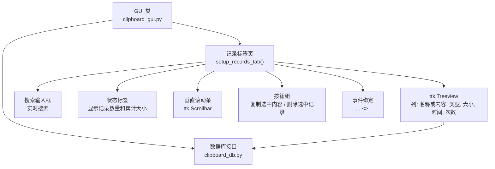
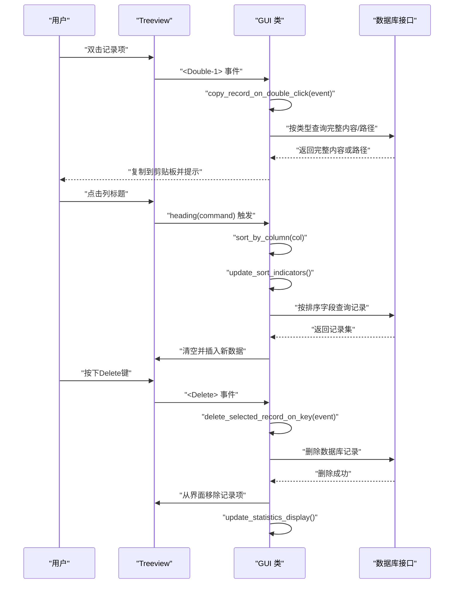
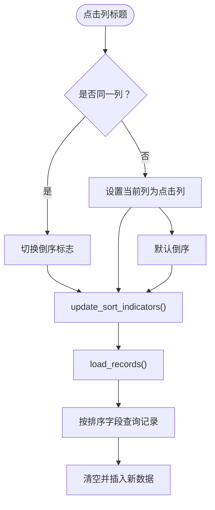
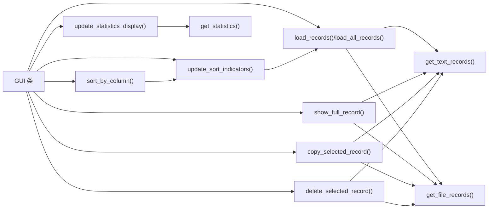

# 记录标签页界面

<cite>
**本文引用的文件**
- [clipboard_gui.py](file://clipboard_gui.py)
- [clipboard_db.py](file://clipboard_db.py)
</cite>

## 目录
1. [简介](#简介)
2. [项目结构](#项目结构)
3. [核心组件](#核心组件)
4. [架构总览](#架构总览)
5. [详细组件分析](#详细组件分析)
6. [依赖关系分析](#依赖关系分析)
7. [性能考量](#性能考量)
8. [故障排查指南](#故障排查指南)
9. [结论](#结论)

## 简介
本文档旨在全面文档化 `setup_records_tab` 方法实现的记录标签页UI结构，涵盖以下关键方面：
- **ttk.Treeview组件**：包括列定义（'名称或内容', '类型', '大小', '时间', '次数'）、列宽设置和对齐方式。
- **垂直滚动条集成**：描述其与Treeview的绑定方式。
- **事件处理**：详细说明双击事件（<Double-1>）的绑定逻辑，以及Delete键删除记录的功能。
- **排序机制**：解释排序指示器的实现机制，包括 `update_sort_indicators` 方法如何动态更新列标题的箭头符号。
- **功能按钮**：描述“复制选中内容”和“删除选中记录”按钮的功能集成。
- **状态显示**：说明如何在状态标签中显示记录数量和累计大小。
- **键盘快捷键**：支持通过Ctrl+L/S快捷键在标签页间切换。

## 项目结构
记录标签页是GUI主界面的核心组成部分，由 `setup_records_tab` 方法负责创建和配置。其主要元素包括Treeview、搜索框、状态标签、按钮、滚动条以及一系列事件绑定。数据访问通过 `clipboard_db.py` 提供的数据库接口完成。

**图表来源**
- [clipboard_gui.py](file://clipboard_gui.py#L227-L279)
- [clipboard_db.py](file://clipboard_db.py#L184-L261)

**章节来源**
- [clipboard_gui.py](file://clipboard_gui.py#L227-L279)

## 核心组件
- **Treeview 组件**
  - **列定义**：名称或内容、类型、大小、时间、次数
  - **列宽与对齐**：
    - 名称或内容：宽度 250，左对齐
    - 类型：宽度 80，居中对齐
    - 大小：宽度 80，居中对齐
    - 时间：宽度 130，居中对齐
    - 次数：宽度 50，居中对齐
  - **行高**：高度 15
- **搜索输入框**：位于标签页顶部，支持实时搜索，用户输入时立即触发搜索。
- **状态标签**：位于标签页底部，显示“X条记录，累计大小YB”的统计信息。
- **垂直滚动条**：仅纵向滚动，与 Treeview 的 yview 绑定。
- **按钮**：
  - 复制选中内容：调用 `copy_selected_record`
  - 删除选中记录：调用 `delete_selected_record`
- **事件**：
  - **双击（<Double-1>）**：触发 `show_full_record`，显示完整内容。
  - **Delete键**：触发 `delete_selected_record_on_key`，删除选中记录。
  - **选择事件（<<TreeviewSelect>>）**：`on_tree_select`（当前版本为空逻辑，保留占位）
  - **鼠标滚轮（<MouseWheel>）**：`on_mouse_wheel`（当前版本返回默认处理）
  - **键盘快捷键**：`switch_to_records_tab` (Ctrl+L) 和 `switch_to_settings_tab` (Ctrl+S)

**章节来源**
- [clipboard_gui.py](file://clipboard_gui.py#L227-L279)

## 架构总览
记录标签页的交互链路如下：用户操作触发事件 -> GUI 业务方法处理 -> 数据库查询/修改 -> Treeview 刷新。

**图表来源**
- [clipboard_gui.py](file://clipboard_gui.py#L227-L308)
- [clipboard_gui.py](file://clipboard_gui.py#L581-L626)
- [clipboard_db.py](file://clipboard_db.py#L184-L261)

## 详细组件分析

### Treeview 列定义与样式
- **列集合**：名称或内容、类型、大小、时间、次数
- **列宽与对齐**：
  - 名称或内容：250 宽度，左对齐
  - 类型/大小/时间/次数：均为 80/130/50 宽度，居中对齐
- **行高**：15
- **显示表头**：show="headings"

**章节来源**
- [clipboard_gui.py](file://clipboard_gui.py#L235-L252)

### 垂直滚动条集成
- 创建垂直滚动条并绑定到 Treeview 的 yview
- Treeview 通过 configure(yscrollcommand=...) 接收滚动条命令
- 布局采用 grid：Treeview 占据第 0 列，滚动条紧邻右侧

**章节来源**
- [clipboard_gui.py](file://clipboard_gui.py#L254-L260)

### 实时搜索功能
- **搜索框**：在 `setup_records_tab` 中创建 `ttk.Entry` 组件，并通过 `grid` 布局放置在标签页顶部。
- **事件绑定**：通过 `self.search_entry.bind('<KeyRelease>', self.on_search_input)` 绑定键盘释放事件，实现用户输入时的实时搜索。
- **搜索逻辑**：
  - 当搜索框有内容时，调用 `search_records` 方法。
  - 该方法会清空现有记录，调用数据库的 `search_records` 接口进行模糊匹配，然后对结果进行排序并显示。
  - 当搜索框为空时，调用 `load_records` 方法，显示所有记录。

**章节来源**
- [clipboard_gui.py](file://clipboard_gui.py#L239-L245)
- [clipboard_gui.py](file://clipboard_gui.py#L675-L699)

### 键盘快捷键切换标签页
- **功能**：支持使用 `Ctrl+L` 快捷键切换到“记录”标签页，使用 `Ctrl+S` 快捷键切换到“设置”标签页。
- **实现**：
  - 在 `setup_ui` 方法中，通过 `self.root.bind('<Control-l>', self.switch_to_records_tab)` 和 `self.root.bind('<Control-s>', self.switch_to_settings_tab)` 绑定快捷键。
  - `switch_to_records_tab` 和 `switch_to_settings_tab` 方法通过调用 `self.notebook.select()` 来切换到指定的标签页框架。

**章节来源**
- [clipboard_gui.py](file://clipboard_gui.py#L208-L212)
- [clipboard_gui.py](file://clipboard_gui.py#L217-L223)

### 双击复制内容与Delete键删除记录
- **双击复制**：
  - 事件绑定：`self.records_tree.bind("<Double-1>", self.copy_record_on_double_click)`
  - 逻辑要点：
    - 获取选中项的 `tags`，解析记录类型与记录 ID。
    - **文本记录**：从数据库读取完整内容，复制到系统剪贴板。
    - **文件记录**：复制显示的文件名（即“名称或内容”列的内容）到剪贴板。
    - 复制成功后，在状态标签中显示提示信息。
- **Delete键删除**：
  - 事件绑定：`self.records_tree.bind("<Delete>", self.delete_selected_record_on_key)`
  - 逻辑要点：
    - 获取选中项，解析记录类型与ID。
    - 调用数据库接口删除对应记录。
    - 从Treeview中移除该项。
    - 更新状态标签的统计信息。

**章节来源**
- [clipboard_gui.py](file://clipboard_gui.py#L277-L280)
- [clipboard_gui.py](file://clipboard_gui.py#L796-L831)
- [clipboard_gui.py](file://clipboard_gui.py#L833-L857)

### 排序指示器实现机制
- **默认排序**：时间列，倒序（最新在前）
- **点击列标题**：
  - 若点击同一列：切换倒序标志
  - 若点击不同列：切换当前列并默认倒序
- **更新指示器**：`update_sort_indicators`
  - 为当前排序列追加箭头符号（正序/倒序）
  - 重新设置 heading 文本与命令，保持可再次点击排序
- **触发重载**：排序变更后调用 `load_records`，重新从数据库拉取并插入

**图表来源**
- [clipboard_gui.py](file://clipboard_gui.py#L280-L308)
- [clipboard_gui.py](file://clipboard_gui.py#L581-L626)
- [clipboard_db.py](file://clipboard_db.py#L184-L261)

**章节来源**
- [clipboard_gui.py](file://clipboard_gui.py#L231-L246)
- [clipboard_gui.py](file://clipboard_gui.py#L280-L308)
- [clipboard_gui.py](file://clipboard_gui.py#L581-L626)

### “复制选中内容”按钮
- **功能**：将选中记录的内容复制到系统剪贴板
- **文本记录**：复制完整文本内容
- **文件记录**：复制文件名（名称或内容列）
- **未选择记录时提示警告**

**章节来源**
- [clipboard_gui.py](file://clipboard_gui.py#L796-L838)

### “删除选中记录”按钮
- **功能**：删除选中记录，并尝试删除对应的文件（若不再被引用）
- **流程**：
  - 弹出确认对话框
  - 解析记录类型与 ID
  - 文本记录：直接删除对应记录
  - 文件记录：先查询保存路径，删除记录，再尝试删除文件
  - 刷新界面：重新加载记录

**章节来源**
- [clipboard_gui.py](file://clipboard_gui.py#L839-L878)

### 状态标签中显示记录数量和累计大小
- **组件**：在 `setup_records_tab` 中创建 `ttk.Label` 组件 `self.status_label`，并放置在标签页底部。
- **初始文本**：`"0条记录，累计大小0B"`
- **更新机制**：
  - 调用 `update_statistics_display` 方法。
  - 该方法首先调用数据库的 `get_statistics` 接口，获取文本记录数、文件记录数和文件总大小。
  - 使用 `format_file_size` 方法将字节大小转换为人类可读的格式（如 KB, MB, GB）。
  - 构造最终的统计信息字符串并更新 `status_label` 的文本。
- **触发时机**：在 `load_records`、`search_records` 和 `delete_selected_record_on_key` 等操作后调用，确保统计信息与界面数据同步。

**章节来源**
- [clipboard_gui.py](file://clipboard_gui.py#L273-L274)
- [clipboard_gui.py](file://clipboard_gui.py#L590-L601)
- [clipboard_db.py](file://clipboard_db.py#L400-L430)

### 树形视图选择事件（<<TreeviewSelect>>）与鼠标滚轮事件（<MouseWheel>）
- **选择事件（<<TreeviewSelect>>）**：当前版本为空逻辑，保留占位，便于后续扩展（如懒加载、高亮等）
- **鼠标滚轮（<MouseWheel>）**：当前版本返回默认处理，未实现自动加载更多逻辑

**章节来源**
- [clipboard_gui.py](file://clipboard_gui.py#L642-L650)
- [clipboard_gui.py](file://clipboard_gui.py#L647-L650)

## 依赖关系分析
- **GUI 与数据库的耦合点**：
  - 排序映射：`get_db_sort_field` 将界面列名映射到数据库字段
  - 数据查询：`get_text_records`/`get_file_records` 支持排序与全量查询
  - **新增**：`get_statistics` 用于获取记录数量和累计大小。
- **事件与业务方法**：
  - 排序：`sort_by_column` -> `update_sort_indicators` -> `load_records` -> `get_text_records`/`get_file_records`
  - 查看详情：`show_full_record` -> 数据库查询
  - 复制/删除：`copy_selected_record`/`delete_selected_record` -> 数据库删除/查询
  - **新增**：`update_statistics_display` -> `get_statistics`

**图表来源**
- [clipboard_gui.py](file://clipboard_gui.py#L280-L308)
- [clipboard_gui.py](file://clipboard_gui.py#L581-L626)
- [clipboard_gui.py](file://clipboard_gui.py#L749-L878)
- [clipboard_db.py](file://clipboard_db.py#L184-L261)

**章节来源**
- [clipboard_gui.py](file://clipboard_gui.py#L581-L626)
- [clipboard_db.py](file://clipboard_db.py#L184-L261)

## 性能考量
- **排序与渲染**：
  - 当前实现为一次性加载全部记录，排序在 GUI 层完成；若数据量增大，建议改为数据库侧排序并引入分页/懒加载
- **滚动与事件**：
  - 鼠标滚轮事件当前返回默认处理，未实现自动加载更多；如需分页，可在事件中判断滚动位置并触发分页加载
- **复制/删除**：
  - 复制/删除均涉及数据库查询或删除，建议在批量操作时合并事务，减少多次连接开销
- **实时搜索**：
  - `search_records` 使用 SQL `LIKE` 进行模糊匹配，当数据量巨大时，两端通配符（%keyword%）可能导致全表扫描，性能下降。可考虑为 `content` 和 `filename` 字段建立索引，或在大数据场景下使用更高效的全文检索方案。

[本节提供通用建议，不直接分析具体文件]

## 故障排查指南
- **双击无效或报错**
  - 检查是否正确绑定 `<Double-1>` 事件
  - 确认选中项存在且 tags 包含类型与 ID
- **复制失败**
  - 文本记录：确认数据库中是否存在对应记录
  - 文件记录：确认保存路径存在
- **删除后未刷新**
  - 确认删除后是否调用了 `load_records`
- **排序箭头不更新**
  - 确认 `update_sort_indicators` 是否被调用
  - 确认 heading 文本是否包含箭头符号
- **搜索无结果**
  - 检查关键词是否过短或包含特殊字符
  - 确认数据库连接正常
- **状态信息不更新**
  - 检查 `update_statistics_display` 是否在数据变更后被正确调用
  - 确认 `get_statistics` 方法能否正确返回数据

**章节来源**
- [clipboard_gui.py](file://clipboard_gui.py#L269-L271)
- [clipboard_gui.py](file://clipboard_gui.py#L749-L878)
- [clipboard_gui.py](file://clipboard_gui.py#L280-L308)
- [clipboard_gui.py](file://clipboard_gui.py#L581-L626)

## 结论
记录标签页通过清晰的列定义、滚动条集成与事件绑定，提供了直观的记录浏览体验。新增的实时搜索功能、键盘快捷键、双击复制和Delete键删除极大地提升了操作效率。排序指示器与复制/删除按钮完善了交互闭环。特别地，在状态标签中实时显示记录数量和累计大小，为用户提供了重要的全局信息。当前实现以一次性加载为主，适合中小规模数据；若未来数据量增长，建议引入数据库侧排序与分页机制，以提升性能与用户体验。