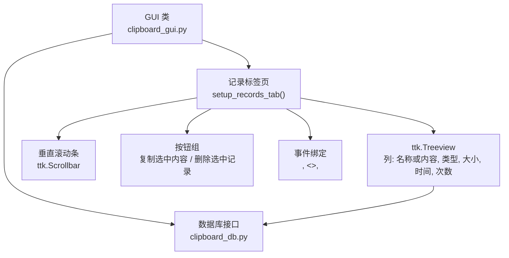
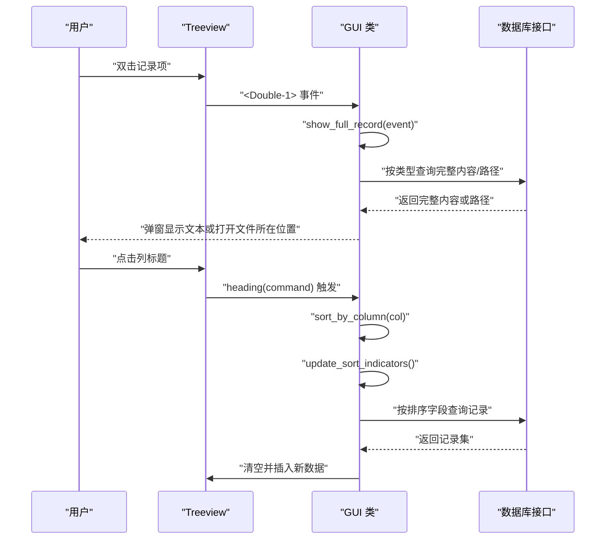
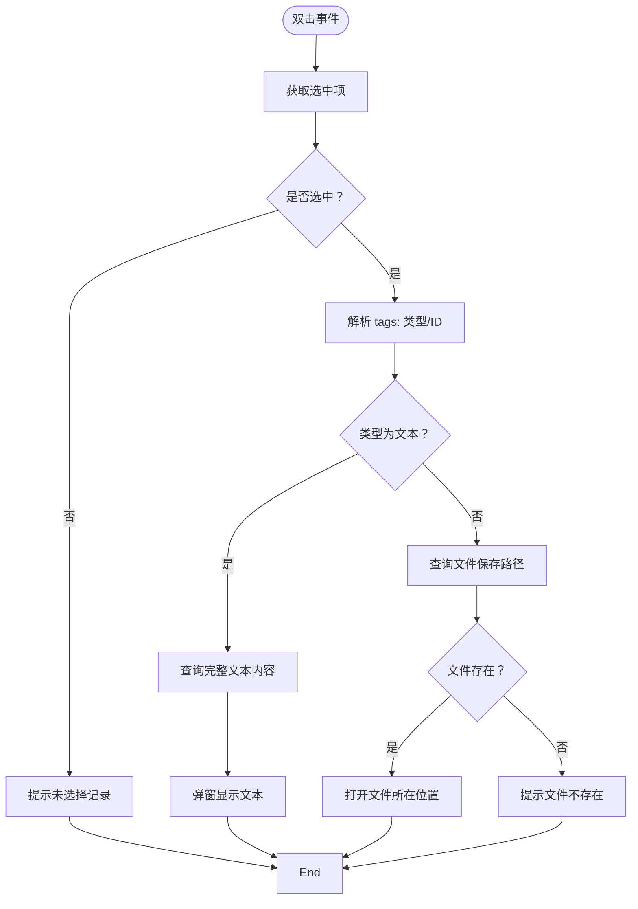
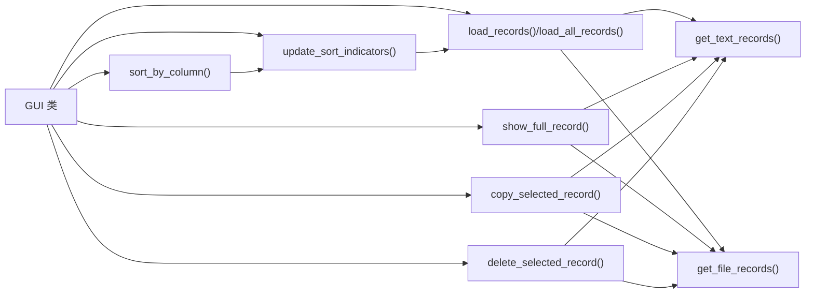

# 记录标签页界面

<cite>
**本文引用的文件**
- [clipboard_gui.py](file://clipboard_gui.py)
- [clipboard_db.py](file://clipboard_db.py)
</cite>

## 目录
1. [简介](#简介)
2. [项目结构](#项目结构)
3. [核心组件](#核心组件)
4. [架构总览](#架构总览)
5. [详细组件分析](#详细组件分析)
6. [依赖关系分析](#依赖关系分析)
7. [性能考量](#性能考量)
8. [故障排查指南](#故障排查指南)
9. [结论](#结论)

## 简介
本文件面向“记录标签页界面”的实现，围绕 setup_records_tab 方法构建的 ttk.Treeview 组件展开，系统性说明：
- 列定义与列宽、对齐方式
- 垂直滚动条集成
- 双击事件绑定与“显示完整内容”流程
- 排序指示器实现机制（update_sort_indicators）
- “复制选中内容”和“删除选中记录”按钮功能
- 树形视图选择事件（<<TreeviewSelect>>）与鼠标滚轮事件（<MouseWheel>）处理策略

## 项目结构
记录标签页位于 GUI 主界面中，由 setup_records_tab 负责创建并配置 Treeview、按钮、滚动条以及事件绑定；数据访问通过数据库层接口完成。

图表来源
- [clipboard_gui.py](file://clipboard_gui.py#L227-L279)
- [clipboard_db.py](file://clipboard_db.py#L184-L261)

章节来源
- [clipboard_gui.py](file://clipboard_gui.py#L227-L279)

## 核心组件
- Treeview 组件
  - 列定义：名称或内容、类型、大小、时间、次数
  - 列宽与对齐：
    - 名称或内容：宽度 250，左对齐
    - 类型：宽度 80，居中对齐
    - 大小：宽度 80，居中对齐
    - 时间：宽度 130，居中对齐
    - 次数：宽度 50，居中对齐
  - 行高：高度 20
- 垂直滚动条：仅纵向滚动，与 Treeview 的 yview 绑定
- 按钮：
  - 复制选中内容：调用 copy_selected_record
  - 删除选中记录：调用 delete_selected_record
- 事件：
  - 双击（<Double-1>）：调用 show_full_record
  - 选择事件（<<TreeviewSelect>>）：on_tree_select（当前版本为空逻辑，保留占位）
  - 鼠标滚轮（<MouseWheel>）：on_mouse_wheel（当前版本返回默认处理）

章节来源
- [clipboard_gui.py](file://clipboard_gui.py#L227-L279)

## 架构总览
记录标签页的交互链路如下：用户操作触发事件 -> GUI 业务方法处理 -> 数据库查询/修改 -> Treeview 刷新。

图表来源
- [clipboard_gui.py](file://clipboard_gui.py#L227-L308)
- [clipboard_gui.py](file://clipboard_gui.py#L581-L626)
- [clipboard_db.py](file://clipboard_db.py#L184-L261)

## 详细组件分析

### Treeview 列定义与样式
- 列集合：名称或内容、类型、大小、时间、次数
- 列宽与对齐：
  - 名称或内容：250 宽度，左对齐
  - 类型/大小/时间/次数：均为 80/130/50 宽度，居中对齐
- 行高：20
- 显示表头：show="headings"

章节来源
- [clipboard_gui.py](file://clipboard_gui.py#L235-L252)

### 垂直滚动条集成
- 创建垂直滚动条并绑定到 Treeview 的 yview
- Treeview 通过 configure(yscrollcommand=...) 接收滚动条命令
- 布局采用 grid：Treeview 占据第 0 列，滚动条紧邻右侧

章节来源
- [clipboard_gui.py](file://clipboard_gui.py#L254-L260)

### 双击事件绑定与“显示完整内容”
- 绑定：<Double-1> -> show_full_record(event)
- 逻辑要点：
  - 获取选中项的 tags，解析记录类型与记录 ID
  - 文本记录：从数据库读取完整内容，弹出窗口展示
  - 文件记录：读取保存路径，尝试使用系统资源管理器定位文件
  - 若文件不存在，提示警告

图表来源
- [clipboard_gui.py](file://clipboard_gui.py#L749-L795)

章节来源
- [clipboard_gui.py](file://clipboard_gui.py#L269-L271)
- [clipboard_gui.py](file://clipboard_gui.py#L749-L795)

### 排序指示器实现机制
- 默认排序：时间列，倒序（最新在前）
- 点击列标题：
  - 若点击同一列：切换倒序标志
  - 若点击不同列：切换当前列并默认倒序
- 更新指示器：update_sort_indicators
  - 为当前排序列追加箭头符号（正序/倒序）
  - 重新设置 heading 文本与命令，保持可再次点击排序
- 触发重载：排序变更后调用 load_records，重新从数据库拉取并插入

图表来源
- [clipboard_gui.py](file://clipboard_gui.py#L280-L308)
- [clipboard_gui.py](file://clipboard_gui.py#L581-L626)
- [clipboard_db.py](file://clipboard_db.py#L184-L261)

章节来源
- [clipboard_gui.py](file://clipboard_gui.py#L231-L246)
- [clipboard_gui.py](file://clipboard_gui.py#L280-L308)
- [clipboard_gui.py](file://clipboard_gui.py#L581-L626)

### “复制选中内容”按钮
- 功能：将选中记录的内容复制到系统剪贴板
- 文本记录：复制完整文本内容
- 文件记录：复制文件名（名称或内容列）
- 未选择记录时提示警告

章节来源
- [clipboard_gui.py](file://clipboard_gui.py#L796-L838)

### “删除选中记录”按钮
- 功能：删除选中记录，并尝试删除对应的文件（若不再被引用）
- 流程：
  - 弹出确认对话框
  - 解析记录类型与 ID
  - 文本记录：直接删除对应记录
  - 文件记录：先查询保存路径，删除记录，再尝试删除文件
  - 刷新界面：重新加载记录

章节来源
- [clipboard_gui.py](file://clipboard_gui.py#L839-L878)

### 树形视图选择事件（<<TreeviewSelect>>）与鼠标滚轮事件（<MouseWheel>）
- 选择事件（<<TreeviewSelect>>）：当前版本为空逻辑，保留占位，便于后续扩展（如懒加载、高亮等）
- 鼠标滚轮（<MouseWheel>）：当前版本返回默认处理，未实现自动加载更多逻辑

章节来源
- [clipboard_gui.py](file://clipboard_gui.py#L642-L650)
- [clipboard_gui.py](file://clipboard_gui.py#L647-L650)

## 依赖关系分析
- GUI 与数据库的耦合点：
  - 排序映射：get_db_sort_field 将界面列名映射到数据库字段
  - 数据查询：get_text_records/get_file_records 支持排序与全量查询
- 事件与业务方法：
  - 排序：sort_by_column -> update_sort_indicators -> load_records -> get_text_records/get_file_records
  - 查看详情：show_full_record -> 数据库查询
  - 复制/删除：copy_selected_record/delete_selected_record -> 数据库删除/查询

图表来源
- [clipboard_gui.py](file://clipboard_gui.py#L280-L308)
- [clipboard_gui.py](file://clipboard_gui.py#L581-L626)
- [clipboard_gui.py](file://clipboard_gui.py#L749-L878)
- [clipboard_db.py](file://clipboard_db.py#L184-L261)

章节来源
- [clipboard_gui.py](file://clipboard_gui.py#L581-L626)
- [clipboard_db.py](file://clipboard_db.py#L184-L261)

## 性能考量
- 排序与渲染：
  - 当前实现为一次性加载全部记录，排序在 GUI 层完成；若数据量增大，建议改为数据库侧排序并引入分页/懒加载
- 滚动与事件：
  - 鼠标滚轮事件当前返回默认处理，未实现自动加载更多；如需分页，可在事件中判断滚动位置并触发分页加载
- 复制/删除：
  - 复制/删除均涉及数据库查询或删除，建议在批量操作时合并事务，减少多次连接开销

[本节提供通用建议，不直接分析具体文件]

## 故障排查指南
- 双击无效或报错
  - 检查是否正确绑定 <Double-1> 事件
  - 确认选中项存在且 tags 包含类型与 ID
- 复制失败
  - 文本记录：确认数据库中是否存在对应记录
  - 文件记录：确认保存路径存在
- 删除后未刷新
  - 确认删除后是否调用了 load_records
- 排序箭头不更新
  - 确认 update_sort_indicators 是否被调用
  - 确认 heading 文本是否包含箭头符号

章节来源
- [clipboard_gui.py](file://clipboard_gui.py#L269-L271)
- [clipboard_gui.py](file://clipboard_gui.py#L749-L878)
- [clipboard_gui.py](file://clipboard_gui.py#L280-L308)
- [clipboard_gui.py](file://clipboard_gui.py#L581-L626)

## 结论
记录标签页通过清晰的列定义、滚动条集成与事件绑定，提供了直观的记录浏览体验。排序指示器与复制/删除按钮完善了交互闭环。当前实现以一次性加载为主，适合中小规模数据；若未来数据量增长，建议引入数据库侧排序与分页机制，以提升性能与用户体验。