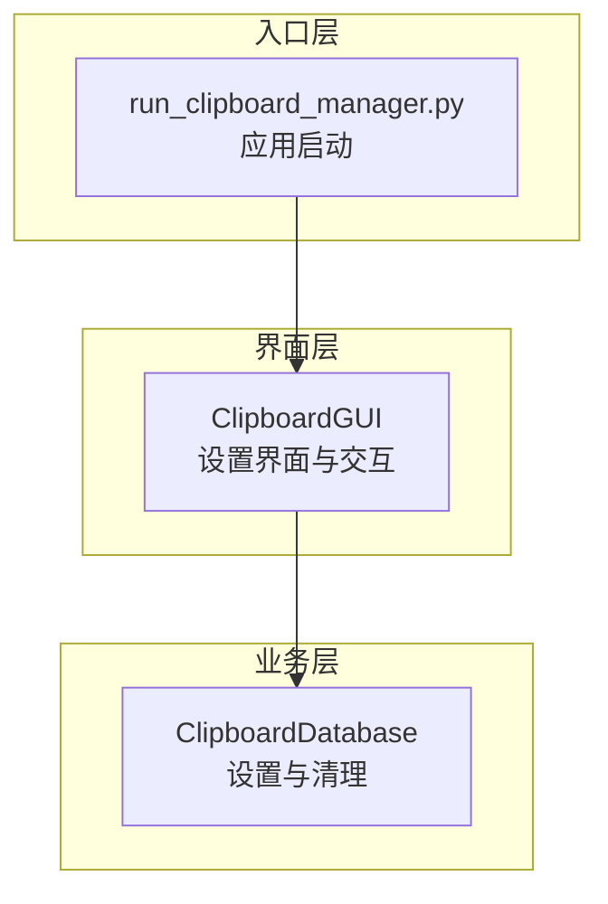
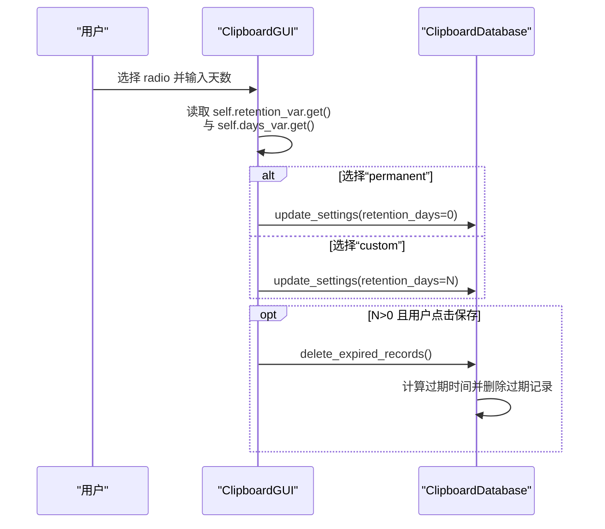
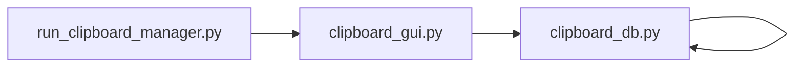

# 保存天数转换规则

<cite>
**本文引用的文件**
- [clipboard_gui.py](file://clipboard_gui.py)
- [clipboard_db.py](file://clipboard_db.py)
- [run_clipboard_manager.py](file://run_clipboard_manager.py)
</cite>

## 目录
1. [简介](#简介)
2. [项目结构](#项目结构)
3. [核心组件](#核心组件)
4. [架构总览](#架构总览)
5. [详细组件分析](#详细组件分析)
6. [依赖关系分析](#依赖关系分析)
7. [性能考量](#性能考量)
8. [故障排查指南](#故障排查指南)
9. [结论](#结论)

## 简介
本文件系统化文档化“保存天数”参数的两种状态：
- 永久保存（retention_days=0）
- 自定义天数（retention_days=int(天数输入)）

重点解释：
- GUI 中 radio 按钮如何通过变量 self.retention_var.get() 判断当前选择；
- 在“permanent”和“custom”两种情况下分别将 retention_days 设为 0 或整型天数；
- 该值如何影响数据库 delete_expired_records 的调用；
- 对数据生命周期管理的实际作用与边界条件。

## 项目结构
围绕“保存天数”的关键文件与职责：
- clipboard_gui.py：提供设置界面、radio 按钮、输入框、保存逻辑与触发清理；
- clipboard_db.py：持久化设置、读取设置、执行过期记录清理；
- run_clipboard_manager.py：应用入口，负责启动监控与 GUI。

图表来源
- [clipboard_gui.py](file://clipboard_gui.py#L328-L554)
- [clipboard_db.py](file://clipboard_db.py#L359-L455)
- [run_clipboard_manager.py](file://run_clipboard_manager.py#L32-L66)

章节来源
- [clipboard_gui.py](file://clipboard_gui.py#L328-L554)
- [clipboard_db.py](file://clipboard_db.py#L359-L455)
- [run_clipboard_manager.py](file://run_clipboard_manager.py#L32-L66)

## 核心组件
- 保存天数设置界面
  - 永久保存 radio（值为“permanent”，对应 retention_days=0）
  - 自定义天数 radio（值为“custom”，对应 retention_days=int(天数输入)）
  - 天数输入框 days_entry 仅在“custom”时启用
- 保存设置流程
  - 读取 radio 选择与天数输入
  - 写入 settings 表的 retention_days 字段
  - 若 retention_days>0，立即触发清理过期记录
- 数据库清理
  - 读取 retention_days
  - 当 retention_days<=0 时不清理
  - 否则计算过期时间并删除 text_records 与 file_records，并删除对应文件

章节来源
- [clipboard_gui.py](file://clipboard_gui.py#L376-L406)
- [clipboard_gui.py](file://clipboard_gui.py#L439-L452)
- [clipboard_gui.py](file://clipboard_gui.py#L477-L533)
- [clipboard_db.py](file://clipboard_db.py#L359-L455)

## 架构总览
“保存天数”在 GUI 与数据库之间的流转如下：

图表来源
- [clipboard_gui.py](file://clipboard_gui.py#L477-L533)
- [clipboard_db.py](file://clipboard_db.py#L387-L455)

## 详细组件分析

### 1) 界面 radio 与天数输入的状态绑定
- 永久保存 radio：variable 绑定 self.retention_var，value 为“permanent”
- 自定义天数 radio：variable 绑定 self.retention_var，value 为“custom”
- 天数输入框 days_entry：初始状态由 load_settings_display 根据 settings['retention_days'] 决定启用/禁用
- 保存设置时，通过 self.retention_var.get() 判断当前选择

章节来源
- [clipboard_gui.py](file://clipboard_gui.py#L376-L406)
- [clipboard_gui.py](file://clipboard_gui.py#L439-L452)

### 2) 保存设置的分支逻辑
- 若 self.retention_var.get() == "permanent"：retention_days = 0
- 否则：retention_days = int(self.days_var.get())
- 将 retention_days 写入 settings 表
- 若 retention_days > 0：调用 self.db.delete_expired_records() 执行清理

章节来源
- [clipboard_gui.py](file://clipboard_gui.py#L477-L533)

### 3) 数据库清理 delete_expired_records 的行为
- 读取 settings['retention_days']
- 若 retention_days <= 0：直接返回，不删除任何记录
- 否则：
  - 计算过期时间（当前时间减去 retention_days 天）
  - 删除 text_records 中 timestamp 早于过期时间的记录
  - 删除 file_records 中 timestamp 早于过期时间的记录，并删除磁盘上对应的文件

章节来源
- [clipboard_db.py](file://clipboard_db.py#L413-L455)

### 4) 生命周期管理的实际作用
- retention_days=0（永久保存）：不会自动清理，数据长期保留
- retention_days=N（N>0）：按 N 天为周期清理过期记录，控制数据占用空间与历史长度
- 保存设置后立即清理，确保新策略生效

章节来源
- [clipboard_gui.py](file://clipboard_gui.py#L520-L523)
- [clipboard_db.py](file://clipboard_db.py#L413-L455)

## 依赖关系分析
- ClipboardGUI 依赖 ClipboardDatabase 提供设置读写与清理能力
- run_clipboard_manager.py 负责启动 GUI，与 ClipboardManager 的监控循环并行运行
- 保存天数设置与清理之间存在直接耦合：设置变更会触发清理

图表来源
- [run_clipboard_manager.py](file://run_clipboard_manager.py#L32-L66)
- [clipboard_gui.py](file://clipboard_gui.py#L328-L554)
- [clipboard_db.py](file://clipboard_db.py#L359-L455)

章节来源
- [run_clipboard_manager.py](file://run_clipboard_manager.py#L32-L66)
- [clipboard_gui.py](file://clipboard_gui.py#L328-L554)
- [clipboard_db.py](file://clipboard_db.py#L359-L455)

## 性能考量
- 清理操作涉及数据库查询与文件删除，建议在用户保存设置后触发一次即可，避免频繁触发导致性能抖动
- retention_days 较大时，清理扫描范围更大，可能带来短暂延迟
- 建议在设置界面提供确认提示，避免误操作导致大量数据被清理

[本节为通用建议，不直接分析具体文件]

## 故障排查指南
- 输入非数字
  - 现象：保存设置时报错提示“请输入有效的数字”
  - 原因：自定义天数输入无法转换为整数
  - 处理：确保输入正整数
- 未启用自定义天数却选择了“custom”
  - 现象：days_entry 仍为禁用状态
  - 原因：load_settings_display 会根据 settings['retention_days'] 决定启用/禁用
  - 处理：先切换到“permanent”，再回到“custom”并正确输入天数
- 清理未生效
  - 现象：设置为 N 天后仍看到旧记录
  - 原因：retention_days<=0 时不会清理
  - 处理：确认 radio 选择为“custom”，且输入为正整数

章节来源
- [clipboard_gui.py](file://clipboard_gui.py#L520-L533)
- [clipboard_db.py](file://clipboard_db.py#L413-L455)

## 结论
- “永久保存”与“自定义天数”是保存天数的两种互斥状态，通过 radio 按钮与 days_var 协同决定最终的 retention_days 值
- retention_days=0 时，数据库不执行清理；retention_days>0 时，保存设置即触发清理，确保策略即时生效
- 该机制为用户提供可控的数据生命周期管理能力，兼顾空间占用与历史保留需求