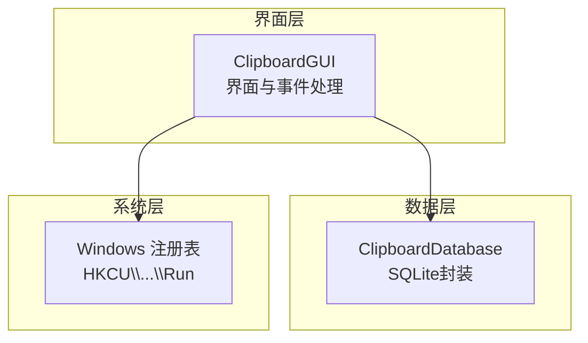
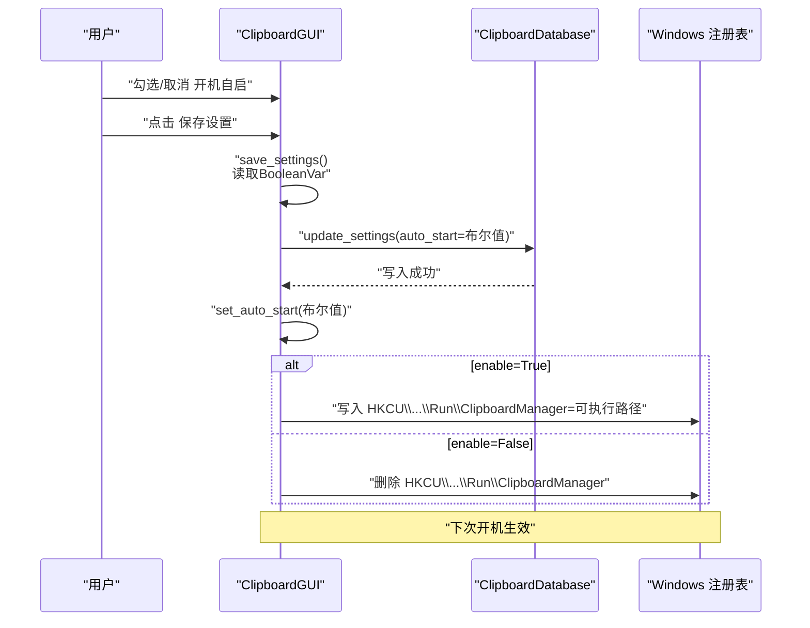
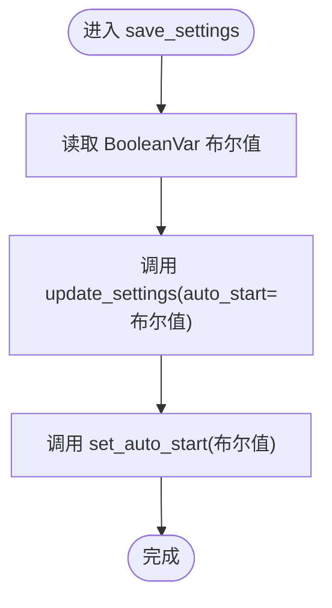
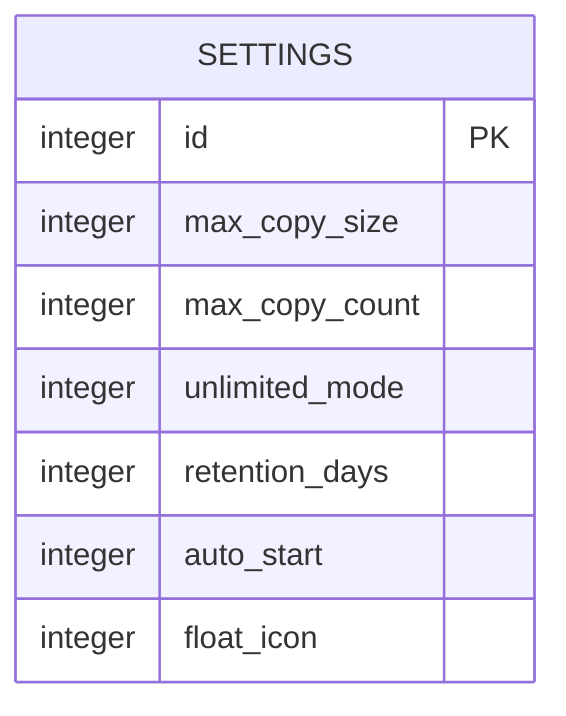
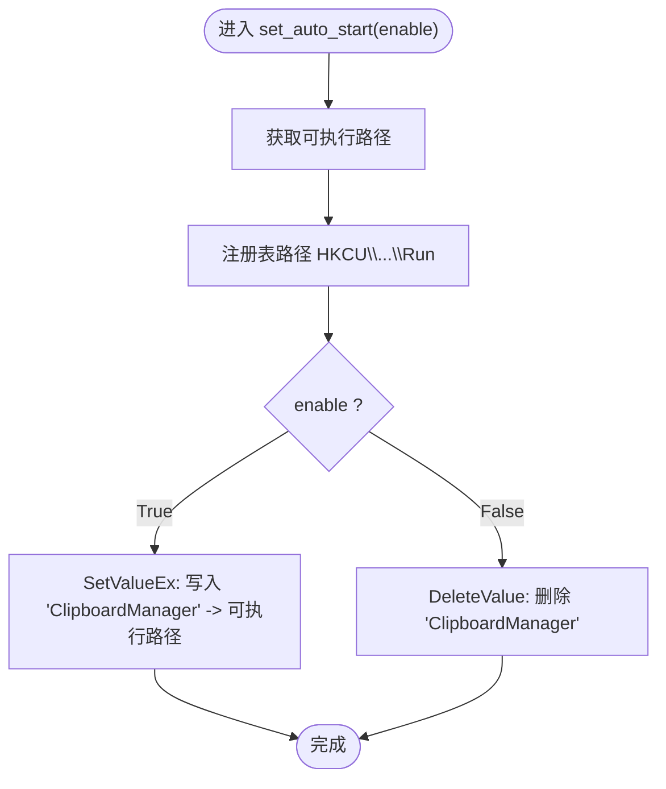
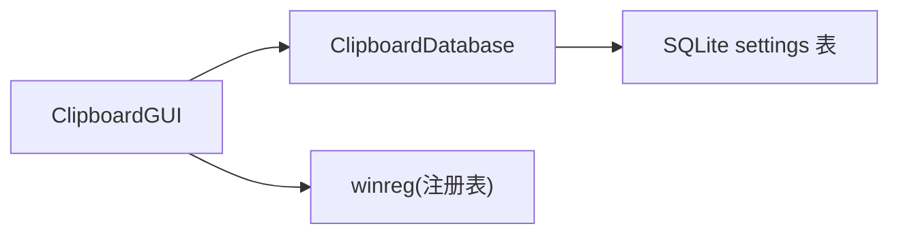

# 开机自启设置持久化

<cite>
**本文引用的文件**
- [clipboard_gui.py](file://clipboard_gui.py)
- [clipboard_db.py](file://clipboard_db.py)
</cite>

## 目录
1. [简介](#简介)
2. [项目结构](#项目结构)
3. [核心组件](#核心组件)
4. [架构总览](#架构总览)
5. [详细组件分析](#详细组件分析)
6. [依赖关系分析](#依赖关系分析)
7. [性能考量](#性能考量)
8. [故障排查指南](#故障排查指南)
9. [结论](#结论)

## 简介
本文件围绕“开机自启”设置从界面控件到系统注册表的完整持久化流程展开，重点说明：
- 设置界面的checkbutton控件如何将布尔值绑定到BooleanVar；
- 保存设置时如何通过save_settings方法获取布尔状态并调用数据库接口更新settings表；
- 如何在set_auto_start方法中根据布尔值调用Windows注册表API，在HKEY_CURRENT_USER\Software\Microsoft\Windows\CurrentVersion\Run下创建或删除程序启动项，从而实现开机自启的启用与禁用，并确保设置重启后依然生效。

## 项目结构
本仓库与“开机自启”相关的代码主要分布在两个模块：
- GUI层：负责界面控件、事件绑定、调用数据库更新与注册表设置；
- 数据库层：负责settings表的初始化、查询与更新。

图表来源
- [clipboard_gui.py](file://clipboard_gui.py#L328-L530)
- [clipboard_db.py](file://clipboard_db.py#L360-L412)

章节来源
- [clipboard_gui.py](file://clipboard_gui.py#L328-L530)
- [clipboard_db.py](file://clipboard_db.py#L76-L114)

## 核心组件
- 界面控件与事件
  - 设置页中的“开机自启”checkbutton，变量为BooleanVar，用于承载用户选择的布尔值。
  - “保存设置”按钮绑定save_settings方法，负责收集界面输入并写入数据库，随后调用set_auto_start应用注册表变更。
- 数据库接口
  - get_settings：从settings表读取当前设置，含auto_start布尔值。
  - update_settings：按传入的关键字参数更新settings表字段，其中auto_start以整型形式存储。
- 注册表操作
  - set_auto_start：根据布尔值在HKCU\Software\Microsoft\Windows\CurrentVersion\Run下写入或删除启动项键值，实现开机自启的启用/禁用。

章节来源
- [clipboard_gui.py](file://clipboard_gui.py#L394-L413)
- [clipboard_gui.py](file://clipboard_gui.py#L477-L530)
- [clipboard_gui.py](file://clipboard_gui.py#L1131-L1163)
- [clipboard_db.py](file://clipboard_db.py#L360-L412)

## 架构总览
开机自启设置的端到端流程如下：
- 用户在界面勾选/取消“开机自启”，布尔值由BooleanVar持有；
- 点击“保存设置”，save_settings读取BooleanVar，调用update_settings写入数据库；
- save_settings随后调用set_auto_start，依据布尔值在注册表HKCU\...\Run写入或删除键值；
- 系统下次启动时，注册表中的启动项生效，程序随系统启动。

图表来源
- [clipboard_gui.py](file://clipboard_gui.py#L477-L530)
- [clipboard_gui.py](file://clipboard_gui.py#L1131-L1163)
- [clipboard_db.py](file://clipboard_db.py#L387-L412)

## 详细组件分析

### 界面控件与事件绑定
- 设置页创建“开机自启”分组，包含一个checkbutton与BooleanVar变量，用于承载用户选择。
- “保存设置”按钮绑定save_settings方法，负责收集界面输入并写入数据库，同时调用set_auto_start应用注册表变更。

章节来源
- [clipboard_gui.py](file://clipboard_gui.py#L394-L413)
- [clipboard_gui.py](file://clipboard_gui.py#L427-L432)

### 保存设置流程（save_settings）
- 读取BooleanVar布尔值；
- 调用update_settings写入settings表的auto_start字段；
- 调用set_auto_start根据布尔值同步注册表。

图表来源
- [clipboard_gui.py](file://clipboard_gui.py#L477-L530)
- [clipboard_db.py](file://clipboard_db.py#L387-L412)

章节来源
- [clipboard_gui.py](file://clipboard_gui.py#L477-L530)

### 数据库持久化（settings表）
- settings表新增auto_start字段（默认1），以整型形式存储布尔值（0/1）。
- get_settings返回字典，其中auto_start转换为Python布尔值供界面使用。
- update_settings按关键字参数更新对应字段。

图表来源
- [clipboard_db.py](file://clipboard_db.py#L76-L114)
- [clipboard_db.py](file://clipboard_db.py#L360-L412)

章节来源
- [clipboard_db.py](file://clipboard_db.py#L76-L114)
- [clipboard_db.py](file://clipboard_db.py#L360-L412)

### 注册表设置（set_auto_start）
- 根据是否打包为exe动态获取可执行路径；
- 在HKEY_CURRENT_USER下的Run键写入或删除名为“ClipboardManager”的字符串值；
- enable=True时写入路径，enable=False时删除该值，若值不存在则忽略异常。

图表来源
- [clipboard_gui.py](file://clipboard_gui.py#L1131-L1163)

章节来源
- [clipboard_gui.py](file://clipboard_gui.py#L1131-L1163)

### 启动时应用注册表设置
- 应用启动时会检查settings表中的auto_start，若为真则调用set_auto_start(True)确保注册表项存在。

章节来源
- [clipboard_gui.py](file://clipboard_gui.py#L60-L62)
- [clipboard_gui.py](file://clipboard_gui.py#L89-L97)
- [clipboard_db.py](file://clipboard_db.py#L360-L385)

## 依赖关系分析
- GUI依赖数据库层进行settings表的读取与更新；
- GUI依赖Windows注册表API（通过winreg）实现开机自启开关；
- settings表的auto_start字段以整型存储，get_settings返回布尔值，update_settings写入整型。

图表来源
- [clipboard_gui.py](file://clipboard_gui.py#L328-L530)
- [clipboard_db.py](file://clipboard_db.py#L360-L412)

章节来源
- [clipboard_gui.py](file://clipboard_gui.py#L328-L530)
- [clipboard_db.py](file://clipboard_db.py#L360-L412)

## 性能考量
- 注册表写入为轻量级I/O，开销极低，对启动/保存设置的响应影响可忽略；
- 数据库更新为单行写入，性能稳定；
- 若频繁切换开机自启，建议减少不必要的重复写入（例如仅在值变化时才写注册表）。

## 故障排查指南
- 注册表写入失败
  - 症状：保存设置后未见开机自启生效。
  - 排查：确认set_auto_start中异常捕获逻辑是否打印错误；检查当前用户权限是否允许修改HKCU\Software\Microsoft\Windows\CurrentVersion\Run。
- 数据库字段缺失
  - 症状：首次运行缺少auto_start字段导致读取异常。
  - 排查：确认init_database是否执行ALTER TABLE添加auto_start字段；确认get_settings返回默认值逻辑。
- 值未持久化
  - 症状：重启后设置丢失。
  - 排查：确认save_settings是否调用了update_settings与set_auto_start；确认注册表键值是否存在。

章节来源
- [clipboard_gui.py](file://clipboard_gui.py#L1131-L1163)
- [clipboard_db.py](file://clipboard_db.py#L76-L114)
- [clipboard_db.py](file://clipboard_db.py#L360-L412)

## 结论
- 开机自启设置从界面到注册表的完整链路清晰：BooleanVar承载用户选择，save_settings写入数据库并同步注册表，set_auto_start在HKCU\...\Run下创建/删除启动项键值；
- settings表以整型存储auto_start，get_settings返回布尔值，update_settings按需更新，保证了跨版本兼容与默认值安全；
- 该设计实现了“所见即所得”的持久化体验：用户在界面勾选后立即生效，重启后依然有效。