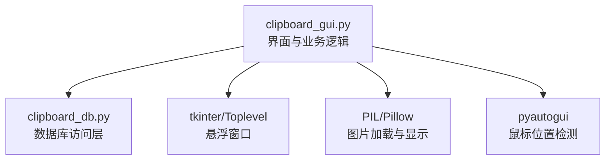
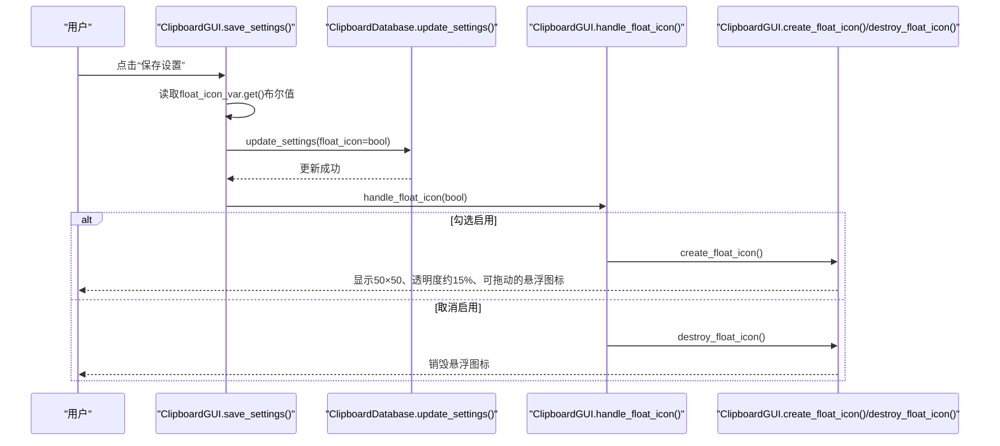
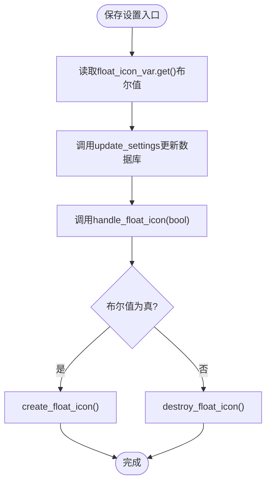
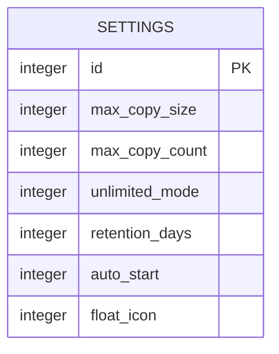
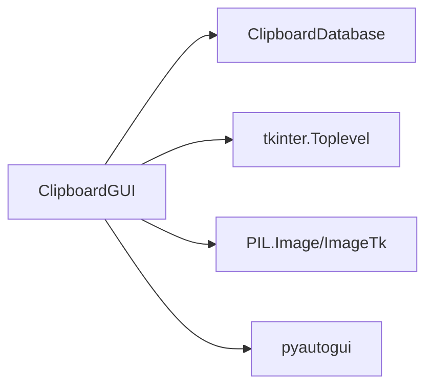

# 悬浮图标设置持久化

<cite>
**本文引用的文件**
- [clipboard_gui.py](file://clipboard_gui.py)
- [clipboard_db.py](file://clipboard_db.py)
</cite>

## 目录
1. [简介](#简介)
2. [项目结构](#项目结构)
3. [核心组件](#核心组件)
4. [架构总览](#架构总览)
5. [详细组件分析](#详细组件分析)
6. [依赖关系分析](#依赖关系分析)
7. [性能考量](#性能考量)
8. [故障排查指南](#故障排查指南)
9. [结论](#结论)

## 简介
本文件围绕“悬浮图标”设置从设置界面的Checkbutton控件到悬浮窗口创建/销毁的完整持久化流程展开，重点说明：
- 用户在设置界面勾选“启用悬浮图标”后，如何通过保存设置流程将布尔值写入数据库；
- 如何在保存设置后立即根据该布尔值动态创建或销毁悬浮窗口，确保用户操作后的视觉反馈与配置一致；
- 以及该流程如何保证设置的即时生效与状态持久化。

## 项目结构
与悬浮图标设置持久化直接相关的文件与职责如下：
- clipboard_gui.py：图形界面与业务逻辑，负责设置界面、Checkbutton绑定、保存设置、创建/销毁悬浮窗口、处理悬浮图标事件等。
- clipboard_db.py：数据库访问层，提供设置的读取与更新接口，包含float_icon字段。

图表来源
- [clipboard_gui.py](file://clipboard_gui.py#L1-L120)
- [clipboard_db.py](file://clipboard_db.py#L1-L120)

章节来源
- [clipboard_gui.py](file://clipboard_gui.py#L1-L120)
- [clipboard_db.py](file://clipboard_db.py#L1-L120)

## 核心组件
- 设置界面的Checkbutton控件：用于开启/关闭悬浮图标，其变量为BooleanVar，对应布尔状态。
- 保存设置方法：在保存时读取该布尔状态，调用数据库更新接口写入float_icon字段。
- 悬浮图标处理方法：根据布尔值决定创建或销毁悬浮窗口。
- 悬浮窗口创建/销毁：创建50×50、透明度约15%、可拖动、点击显示面板的悬浮窗口。

章节来源
- [clipboard_gui.py](file://clipboard_gui.py#L404-L416)
- [clipboard_gui.py](file://clipboard_gui.py#L477-L533)
- [clipboard_gui.py](file://clipboard_gui.py#L1164-L1172)
- [clipboard_gui.py](file://clipboard_gui.py#L1173-L1234)
- [clipboard_gui.py](file://clipboard_gui.py#L1633-L1638)

## 架构总览
下面的序列图展示了从用户勾选设置到悬浮窗口创建/销毁的端到端流程，以及数据库持久化的关键节点。

图表来源
- [clipboard_gui.py](file://clipboard_gui.py#L477-L533)
- [clipboard_gui.py](file://clipboard_gui.py#L1164-L1172)
- [clipboard_gui.py](file://clipboard_gui.py#L1173-L1234)
- [clipboard_gui.py](file://clipboard_gui.py#L1633-L1638)
- [clipboard_db.py](file://clipboard_db.py#L387-L412)

## 详细组件分析

### 设置界面与Checkbutton
- 在设置界面中，悬浮图标设置以Checkbutton呈现，变量为BooleanVar，初始值从数据库读取并回显。
- 初始加载时若数据库不存在float_icon字段，会设置默认值为True，确保首次启动即启用悬浮图标。

章节来源
- [clipboard_gui.py](file://clipboard_gui.py#L404-L416)
- [clipboard_gui.py](file://clipboard_gui.py#L440-L462)

### 保存设置流程与数据库持久化
- 保存设置时，从Checkbutton变量读取布尔值，调用数据库更新接口，将float_icon写入settings表。
- 更新成功后，立即调用handle_float_icon根据布尔值决定创建或销毁悬浮窗口，实现即时生效。

图表来源
- [clipboard_gui.py](file://clipboard_gui.py#L477-L533)
- [clipboard_gui.py](file://clipboard_gui.py#L1164-L1172)
- [clipboard_gui.py](file://clipboard_gui.py#L1173-L1234)
- [clipboard_gui.py](file://clipboard_gui.py#L1633-L1638)
- [clipboard_db.py](file://clipboard_db.py#L387-L412)

章节来源
- [clipboard_gui.py](file://clipboard_gui.py#L477-L533)
- [clipboard_db.py](file://clipboard_db.py#L387-L412)

### 悬浮窗口创建与销毁
- 创建悬浮窗口：Toplevel，尺寸50×50，去边框、置顶、透明度约15%；默认位置位于右下角附近；绑定鼠标事件以支持拖动与悬停显示面板。
- 销毁悬浮窗口：释放窗口资源，避免重复创建导致的资源泄漏。
- 拖动逻辑：记录鼠标按下时的相对偏移，移动时进行边界检查，确保图标始终在屏幕范围内。

章节来源
- [clipboard_gui.py](file://clipboard_gui.py#L1173-L1234)
- [clipboard_gui.py](file://clipboard_gui.py#L1633-L1669)

### 悬浮图标事件与面板联动
- 单击悬浮图标：区分点击与拖动，点击时显示悬浮面板；
- 悬停显示：鼠标进入图标时显示面板；
- 双击图标：显示主窗口；
- 面板隐藏策略：延迟隐藏，避免焦点切换或误触导致的闪烁；当鼠标离开图标与面板区域时隐藏。

章节来源
- [clipboard_gui.py](file://clipboard_gui.py#L1235-L1253)
- [clipboard_gui.py](file://clipboard_gui.py#L1254-L1379)
- [clipboard_gui.py](file://clipboard_gui.py#L1559-L1626)

### 数据模型与字段映射
- settings表包含float_icon字段，采用整型存储布尔值（0/1），读取时转换为Python布尔值供界面使用。

图表来源
- [clipboard_db.py](file://clipboard_db.py#L76-L112)
- [clipboard_db.py](file://clipboard_db.py#L359-L386)

章节来源
- [clipboard_db.py](file://clipboard_db.py#L76-L112)
- [clipboard_db.py](file://clipboard_db.py#L359-L386)

## 依赖关系分析
- GUI层依赖数据库层提供的设置读取与更新接口；
- GUI层内部通过handle_float_icon协调创建/销毁悬浮窗口；
- 悬浮窗口依赖tkinter的Toplevel与事件绑定，以及可选的PIL与pyautogui用于图片与鼠标位置检测。

图表来源
- [clipboard_gui.py](file://clipboard_gui.py#L1-L120)
- [clipboard_gui.py](file://clipboard_gui.py#L1173-L1234)
- [clipboard_gui.py](file://clipboard_gui.py#L1600-L1626)
- [clipboard_db.py](file://clipboard_db.py#L1-L120)

章节来源
- [clipboard_gui.py](file://clipboard_gui.py#L1-L120)
- [clipboard_gui.py](file://clipboard_gui.py#L1173-L1234)
- [clipboard_gui.py](file://clipboard_gui.py#L1600-L1626)
- [clipboard_db.py](file://clipboard_db.py#L1-L120)

## 性能考量
- 悬浮窗口透明度与尺寸较小，对CPU/GPU压力有限，但频繁拖动与面板显示仍需注意事件绑定与布局更新频率。
- 面板隐藏采用延迟机制，减少频繁焦点切换带来的抖动。
- 数据库更新为轻量级写操作，单字段更新开销极低。

## 故障排查指南
- 悬浮图标未显示：
  - 检查保存设置后是否调用了handle_float_icon；
  - 确认数据库中float_icon字段已被正确更新；
  - 查看创建悬浮窗口过程中的异常日志（图片加载失败时会降级为默认背景与文本）。
- 悬浮图标无法拖动：
  - 检查鼠标事件绑定是否生效；
  - 确认边界检查逻辑未将图标强制拉回屏幕外。
- 面板不出现或立即消失：
  - 检查悬停与离开事件的延迟隐藏逻辑；
  - 确认鼠标位置检测是否正常（依赖pyautogui）。

章节来源
- [clipboard_gui.py](file://clipboard_gui.py#L1173-L1234)
- [clipboard_gui.py](file://clipboard_gui.py#L1559-L1626)
- [clipboard_gui.py](file://clipboard_gui.py#L1600-L1626)

## 结论
该流程实现了从设置界面到数据库再到悬浮窗口的完整闭环：
- 用户在设置界面勾选/取消悬浮图标；
- 保存设置时读取布尔值并持久化到数据库；
- 立即根据布尔值创建或销毁悬浮窗口，确保视觉反馈与配置一致；
- 通过事件绑定与边界检查，提供良好的交互体验。