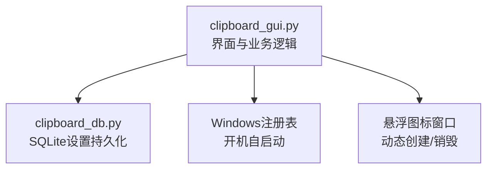
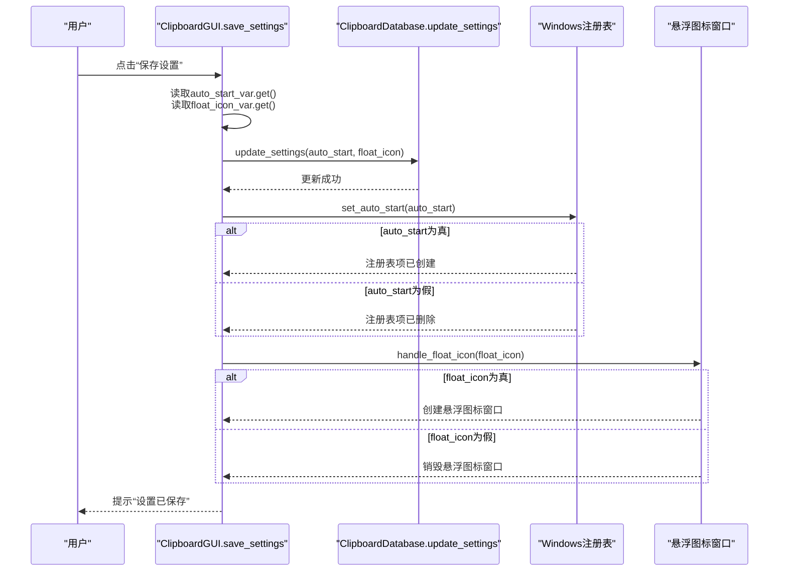
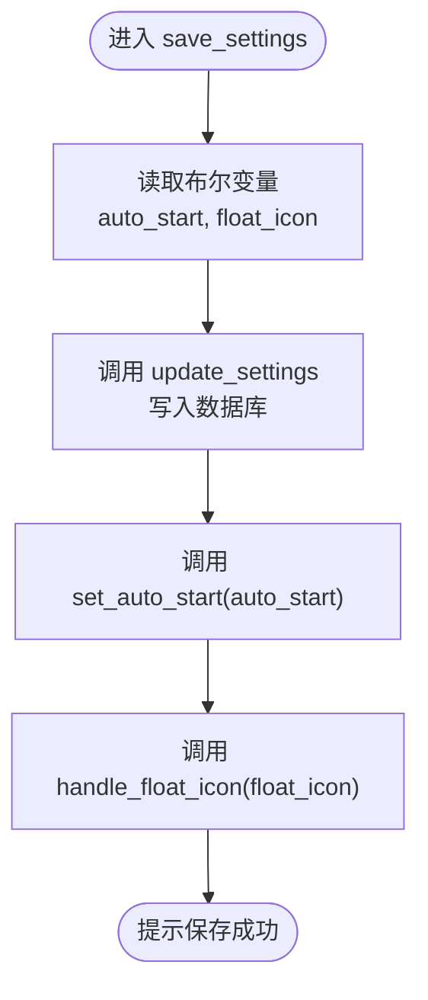
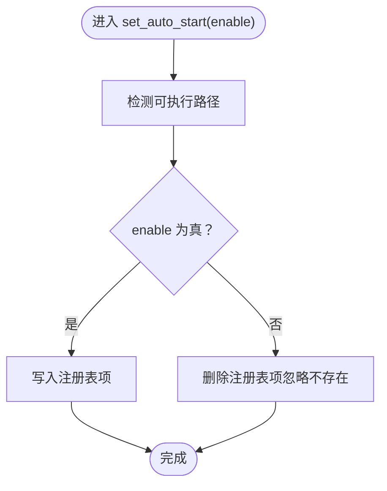
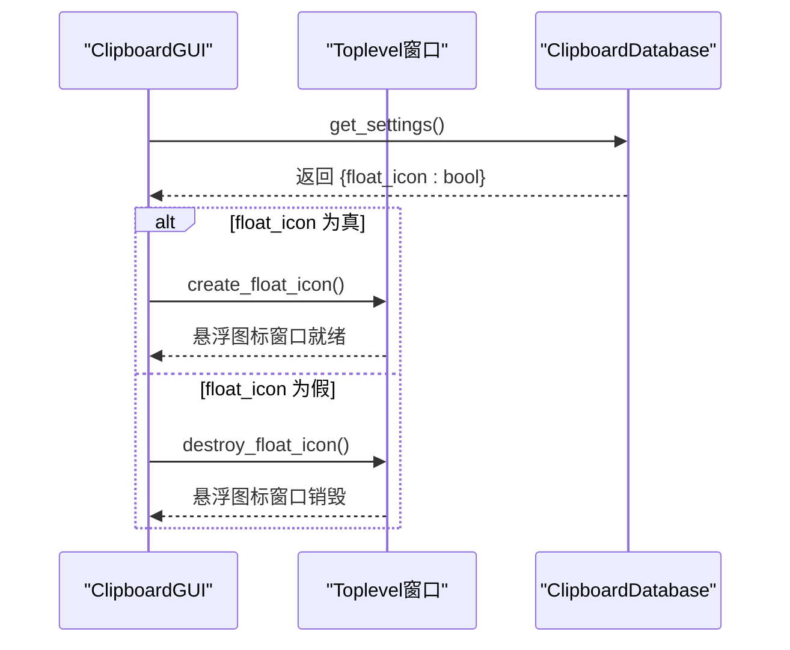
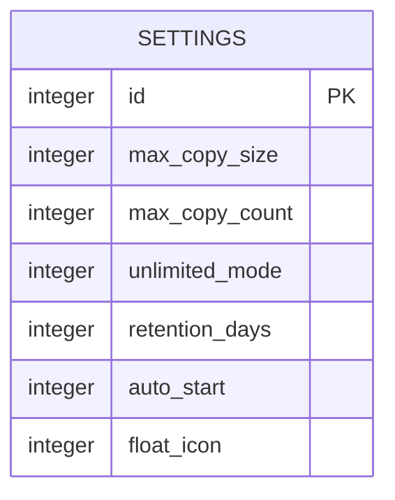
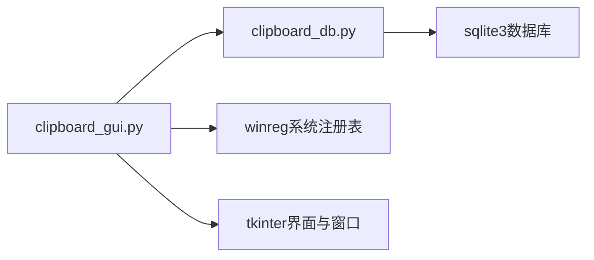

# 系统集成设置持久化

<cite>
**本文引用的文件**
- [clipboard_gui.py](file://clipboard_gui.py)
- [clipboard_db.py](file://clipboard_db.py)
</cite>

## 目录
1. [简介](#简介)
2. [项目结构](#项目结构)
3. [核心组件](#核心组件)
4. [架构总览](#架构总览)
5. [详细组件分析](#详细组件分析)
6. [依赖关系分析](#依赖关系分析)
7. [性能考量](#性能考量)
8. [故障排查指南](#故障排查指南)
9. [结论](#结论)

## 简介
本文件围绕“auto_start”和“float_icon”两个布尔值的完整生命周期展开，从界面控件（checkbutton）到系统行为的即时生效与持久化路径进行深入解析。重点说明：
- 界面层如何通过BooleanVar绑定checkbutton；
- save_settings如何读取布尔状态并通过db.update_settings写入数据库；
- set_auto_start如何基于布尔值配置Windows开机自启动注册表项；
- handle_float_icon如何依据float_icon状态动态创建或销毁悬浮窗口，实现设置的即时生效。

## 项目结构
本仓库采用模块化设计，界面逻辑集中在GUI模块，数据库访问集中在DB模块，二者通过依赖关系耦合，形成清晰的职责分离。

图表来源
- [clipboard_gui.py](file://clipboard_gui.py#L329-L533)
- [clipboard_db.py](file://clipboard_db.py#L359-L412)

章节来源
- [clipboard_gui.py](file://clipboard_gui.py#L329-L533)
- [clipboard_db.py](file://clipboard_db.py#L359-L412)

## 核心组件
- 界面控件与变量
  - auto_start_var：绑定“开机自启”checkbutton，布尔值由用户勾选决定。
  - float_icon_var：绑定“悬浮图标”checkbutton，布尔值由用户勾选决定。
- 数据持久化
  - ClipboardDatabase.update_settings：统一更新settings表中的auto_start与float_icon字段。
  - ClipboardDatabase.get_settings：读取settings表，提供默认值与兼容旧版本字段。
- 系统行为
  - set_auto_start：根据布尔值写入/删除注册表项，实现开机自启动。
  - handle_float_icon：根据布尔值创建/销毁悬浮图标窗口，实现即时生效。

章节来源
- [clipboard_gui.py](file://clipboard_gui.py#L394-L416)
- [clipboard_gui.py](file://clipboard_gui.py#L477-L533)
- [clipboard_gui.py](file://clipboard_gui.py#L1131-L1172)
- [clipboard_gui.py](file://clipboard_gui.py#L1164-L1234)
- [clipboard_db.py](file://clipboard_db.py#L359-L412)

## 架构总览
以下序列图展示了从界面到系统行为的完整调用链路，涵盖持久化与即时生效的关键节点。

图表来源
- [clipboard_gui.py](file://clipboard_gui.py#L477-L533)
- [clipboard_gui.py](file://clipboard_gui.py#L1131-L1172)
- [clipboard_gui.py](file://clipboard_gui.py#L1164-L1234)
- [clipboard_db.py](file://clipboard_db.py#L387-L412)

## 详细组件分析

### 界面控件与变量绑定
- “开机自启”checkbutton绑定BooleanVar，初始值来自数据库settings.auto_start。
- “悬浮图标”checkbutton绑定BooleanVar，初始值来自数据库settings.float_icon，若不存在则默认开启。
- 保存按钮触发save_settings流程，读取两个布尔变量并写入数据库。

章节来源
- [clipboard_gui.py](file://clipboard_gui.py#L394-L416)
- [clipboard_gui.py](file://clipboard_gui.py#L439-L462)

### save_settings：从界面到数据库的持久化
- 读取界面布尔值：auto_start = self.autostart_var.get()；float_icon = self.float_icon_var.get()。
- 调用db.update_settings一次性更新auto_start与float_icon字段。
- 保存后立即调用set_auto_start与handle_float_icon，确保设置即时生效。

图表来源
- [clipboard_gui.py](file://clipboard_gui.py#L477-L533)
- [clipboard_db.py](file://clipboard_db.py#L387-L412)

章节来源
- [clipboard_gui.py](file://clipboard_gui.py#L477-L533)
- [clipboard_db.py](file://clipboard_db.py#L387-L412)

### set_auto_start：Windows开机自启动注册表配置
- 依据布尔值enable决定写入或删除注册表项：
  - 写入：向HKCU\Software\Microsoft\Windows\CurrentVersion\Run写入可执行路径。
  - 删除：删除对应值，若不存在则忽略异常。
- 路径来源：打包exe使用sys.executable，源码运行使用当前脚本绝对路径。

图表来源
- [clipboard_gui.py](file://clipboard_gui.py#L1131-L1172)

章节来源
- [clipboard_gui.py](file://clipboard_gui.py#L1131-L1172)

### handle_float_icon：悬浮图标窗口的动态创建与销毁
- enable为真：调用create_float_icon创建悬浮窗口（50x50像素，透明度约15%，置顶显示，可拖动，悬停显示最近记录面板）。
- enable为假：调用destroy_float_icon销毁悬浮窗口。
- 初始加载时，若settings['float_icon']为真，将在应用启动时自动创建悬浮图标。

图表来源
- [clipboard_gui.py](file://clipboard_gui.py#L80-L97)
- [clipboard_gui.py](file://clipboard_gui.py#L1164-L1234)
- [clipboard_db.py](file://clipboard_db.py#L359-L386)

章节来源
- [clipboard_gui.py](file://clipboard_gui.py#L80-L97)
- [clipboard_gui.py](file://clipboard_gui.py#L1164-L1234)
- [clipboard_db.py](file://clipboard_db.py#L359-L386)

### 数据模型与持久化字段
- settings表新增字段auto_start与float_icon，均以INTEGER存储布尔值（0/1），并提供默认值。
- get_settings返回字典，包含auto_start与float_icon的布尔映射；update_settings按需更新对应字段。

图表来源
- [clipboard_db.py](file://clipboard_db.py#L76-L114)
- [clipboard_db.py](file://clipboard_db.py#L359-L412)

章节来源
- [clipboard_db.py](file://clipboard_db.py#L76-L114)
- [clipboard_db.py](file://clipboard_db.py#L359-L412)

## 依赖关系分析
- GUI模块依赖DB模块进行设置读写；同时依赖winreg模块实现Windows注册表操作；还依赖tkinter创建悬浮窗口。
- DB模块负责SQLite schema初始化与字段兼容性处理（自动添加auto_start、float_icon等字段）。

图表来源
- [clipboard_gui.py](file://clipboard_gui.py#L1-L20)
- [clipboard_gui.py](file://clipboard_gui.py#L1131-L1172)
- [clipboard_db.py](file://clipboard_db.py#L1-L20)

章节来源
- [clipboard_gui.py](file://clipboard_gui.py#L1-L20)
- [clipboard_gui.py](file://clipboard_gui.py#L1131-L1172)
- [clipboard_db.py](file://clipboard_db.py#L1-L20)

## 性能考量
- 注册表操作为轻量级I/O，开销极低，适合在设置保存后立即执行。
- 悬浮图标窗口创建涉及图像加载与窗口层级管理，建议在用户交互较少时触发，避免频繁创建销毁导致抖动。
- 数据库更新为单行写入，性能稳定；建议批量更新时合并多次update_settings调用，减少事务开销。

## 故障排查指南
- 无法写入注册表
  - 检查权限：以当前用户身份运行，确保HKCU写入权限。
  - 捕获异常：set_auto_start内部已捕获异常并打印日志，便于定位。
- 悬浮图标未显示
  - 检查settings['float_icon']是否为真；确认create_float_icon未抛出异常。
  - 若图片加载失败，将回退到纯色背景与文本，检查资源路径与文件是否存在。
- 设置未持久化
  - 确认save_settings中是否正确读取布尔值并调用update_settings。
  - 检查get_settings返回值是否包含float_icon字段（旧版本可能缺失）。

章节来源
- [clipboard_gui.py](file://clipboard_gui.py#L1131-L1172)
- [clipboard_gui.py](file://clipboard_gui.py#L1164-L1234)
- [clipboard_db.py](file://clipboard_db.py#L359-L412)

## 结论
本方案通过界面BooleanVar与数据库settings表的双向绑定，实现了auto_start与float_icon两个关键布尔设置的完整生命周期管理。save_settings在持久化的同时即时调用系统行为函数，确保用户操作的即时反馈与一致性。数据库层通过字段兼容性处理，保证了新老版本的平滑过渡。