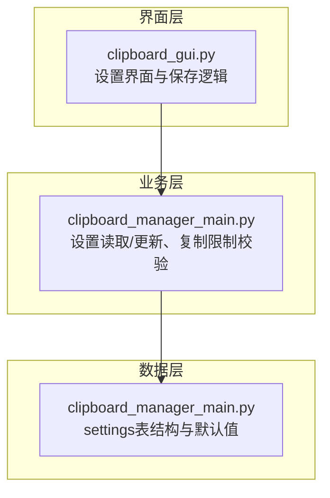
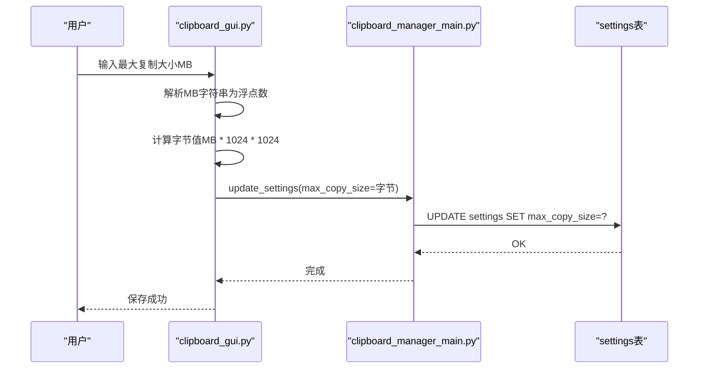
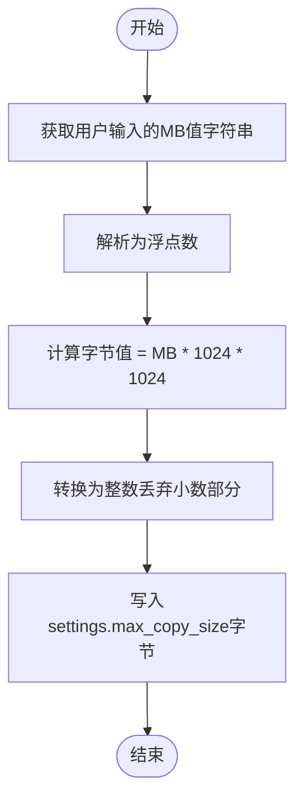
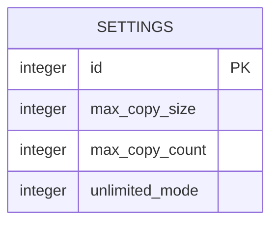
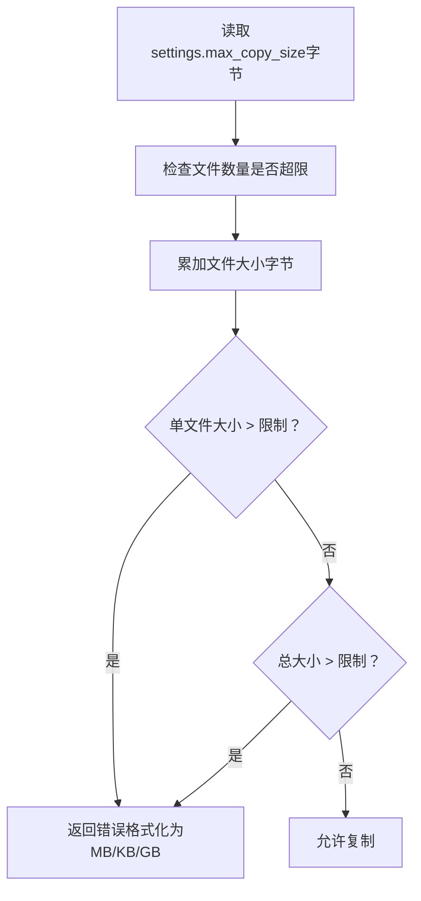
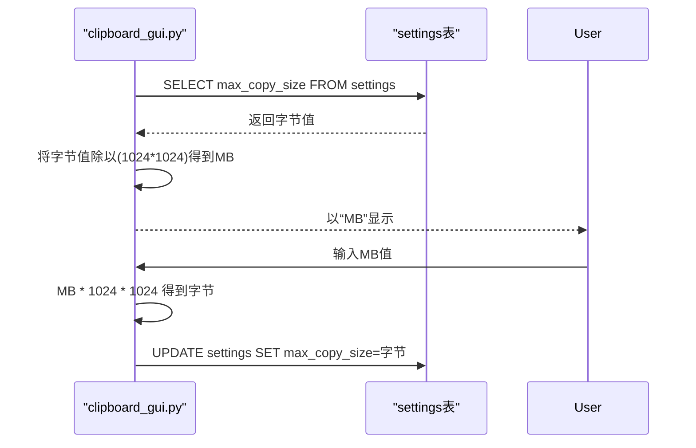
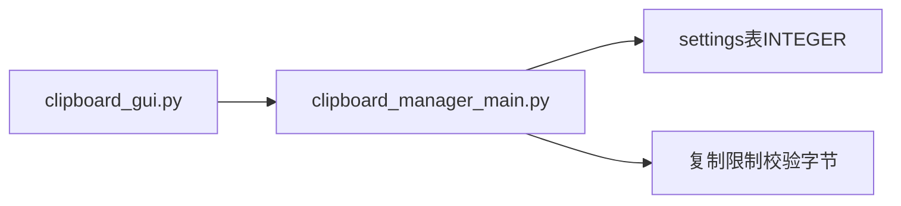

# 设置单位转换逻辑

<cite>
**本文引用的文件**
- [clipboard_gui.py](file://clipboard_gui.py)
- [clipboard_manager_main.py](file://clipboard_manager_main.py)
- [clipboard_content_detector.py](file://clipboard_content_detector.py)
</cite>

## 目录
1. [简介](#简介)
2. [项目结构](#项目结构)
3. [核心组件](#核心组件)
4. [架构总览](#架构总览)
5. [详细组件分析](#详细组件分析)
6. [依赖关系分析](#依赖关系分析)
7. [性能考量](#性能考量)
8. [故障排查指南](#故障排查指南)
9. [结论](#结论)

## 简介
本文件围绕“设置界面中最大复制大小的单位转换”展开，重点解释从用户输入的“兆字节（MB）”到数据库存储所需的“字节（bytes）”之间的转换过程，并说明该转换在数据库存储中的必要性、整数字节值的约束、以及在代码第489行处的实现如何保证精度与数据一致性。

## 项目结构
本仓库涉及多个模块，其中与“设置单位转换”直接相关的核心文件如下：
- 界面层：负责用户交互与设置展示/保存
- 业务层：负责读取设置、执行复制限制校验
- 数据层：负责设置表结构与默认值

图表来源
- [clipboard_gui.py](file://clipboard_gui.py#L477-L533)
- [clipboard_manager_main.py](file://clipboard_manager_main.py#L305-L343)
- [clipboard_manager_main.py](file://clipboard_manager_main.py#L80-L101)

章节来源
- [clipboard_gui.py](file://clipboard_gui.py#L477-L533)
- [clipboard_manager_main.py](file://clipboard_manager_main.py#L80-L101)
- [clipboard_manager_main.py](file://clipboard_manager_main.py#L305-L343)

## 核心组件
- 设置界面与保存逻辑（clipboard_gui.py）
  - 负责从数据库读取设置并以“MB”展示；
  - 用户输入“MB”后，转换为“字节”并写回数据库。
- 设置读取与更新（clipboard_manager_main.py）
  - settings表字段max_copy_size为INTEGER，单位为字节；
  - 提供get_settings/update_settings接口。
- 复制限制校验（clipboard_manager_main.py）
  - 读取settings.max_copy_size进行单文件与总大小校验；
  - 使用format_file_size进行统一的大小格式化展示。

章节来源
- [clipboard_gui.py](file://clipboard_gui.py#L440-L533)
- [clipboard_manager_main.py](file://clipboard_manager_main.py#L80-L101)
- [clipboard_manager_main.py](file://clipboard_manager_main.py#L305-L343)
- [clipboard_manager_main.py](file://clipboard_manager_main.py#L362-L393)

## 架构总览
设置单位转换贯穿“界面层-业务层-数据层”的调用链路，关键流程如下：

图表来源
- [clipboard_gui.py](file://clipboard_gui.py#L477-L533)
- [clipboard_manager_main.py](file://clipboard_manager_main.py#L327-L343)

## 详细组件分析

### 组件A：设置界面中的MB到字节转换
- 输入来源与解析
  - 用户在设置界面输入“最大复制大小”，以“MB”为单位；
  - 界面层通过变量获取用户输入的MB值，并将其解析为浮点数。
- 转换实现
  - 使用乘法运算将MB转换为字节：MB × 1024 × 1024；
  - 将结果转换为整数，确保数据库字段类型要求。
- 存储与一致性
  - 将整数字节值写入settings表的max_copy_size字段；
  - 后续读取时仍以字节为单位参与比较与展示。

图表来源
- [clipboard_gui.py](file://clipboard_gui.py#L477-L533)

章节来源
- [clipboard_gui.py](file://clipboard_gui.py#L477-L533)

### 组件B：数据库存储中的字节单位必要性
- 字段类型约束
  - settings表的max_copy_size为INTEGER类型，仅能存储整数；
  - 因此必须以“字节”为单位存储，避免小数导致的数据丢失或异常。
- 一致性保障
  - 读取settings时直接以字节比较；
  - 展示时再将字节转换为更易读的“MB/KB/GB”。

图表来源
- [clipboard_manager_main.py](file://clipboard_manager_main.py#L80-L101)

章节来源
- [clipboard_manager_main.py](file://clipboard_manager_main.py#L80-L101)
- [clipboard_manager_main.py](file://clipboard_manager_main.py#L305-L343)

### 组件C：复制限制校验中的字节使用
- 单文件与总大小校验均以字节为基准；
- 当超过限制时，使用统一的格式化函数将字节转换为“MB/KB/GB”进行提示。

图表来源
- [clipboard_manager_main.py](file://clipboard_manager_main.py#L362-L393)
- [clipboard_content_detector.py](file://clipboard_content_detector.py#L155-L180)

章节来源
- [clipboard_manager_main.py](file://clipboard_manager_main.py#L362-L393)
- [clipboard_content_detector.py](file://clipboard_content_detector.py#L155-L180)

### 组件D：展示层的MB到字节双向转换
- 从字节到MB：用于设置界面初始化显示与设置窗口展示；
- 从MB到字节：用于保存设置时的转换。

图表来源
- [clipboard_gui.py](file://clipboard_gui.py#L440-L452)
- [clipboard_gui.py](file://clipboard_gui.py#L477-L533)

章节来源
- [clipboard_gui.py](file://clipboard_gui.py#L440-L452)
- [clipboard_gui.py](file://clipboard_gui.py#L477-L533)

## 依赖关系分析
- 界面层依赖业务层提供的设置读取/更新接口；
- 业务层依赖数据层的settings表结构；
- 复制限制校验依赖settings表中的max_copy_size（字节）。

图表来源
- [clipboard_gui.py](file://clipboard_gui.py#L477-L533)
- [clipboard_manager_main.py](file://clipboard_manager_main.py#L305-L343)
- [clipboard_manager_main.py](file://clipboard_manager_main.py#L362-L393)

章节来源
- [clipboard_gui.py](file://clipboard_gui.py#L477-L533)
- [clipboard_manager_main.py](file://clipboard_manager_main.py#L305-L343)
- [clipboard_manager_main.py](file://clipboard_manager_main.py#L362-L393)

## 性能考量
- 转换为整数的开销极低，几乎可忽略；
- 以字节为单位存储有利于比较与聚合查询，避免重复转换；
- 展示层的MB/KB/GB格式化仅在用户交互时触发，不影响核心逻辑性能。

## 故障排查指南
- 保存设置时报错“请输入有效的数字”
  - 可能原因：用户输入非数值或为空；
  - 处理建议：在界面层捕获异常并提示用户输入合法数字。
- 设置未生效或显示异常
  - 可能原因：界面层未正确将MB转换为字节；
  - 处理建议：检查保存逻辑中MB到字节的转换步骤与整数转换。
- 复制被拒绝但提示不明确
  - 可能原因：限制阈值设置过小或展示格式化不直观；
  - 处理建议：确认settings表中的max_copy_size为字节值，并在提示中同时显示字节与MB。

章节来源
- [clipboard_gui.py](file://clipboard_gui.py#L520-L533)

## 结论
- “MB到字节”的转换在本项目中是必要的，因为settings表的max_copy_size字段为INTEGER类型，只能存储整数字节值；
- 界面层负责将用户输入的MB转换为整数字节并写入数据库，业务层在读取后以字节为基准进行复制限制校验；
- 通过在第489行实现的“MB × 1024 × 1024”并强制整数转换，确保了数据类型的一致性与比较的准确性；
- 展示层采用“字节到MB”的逆向转换，保证用户输入与显示的一致性与可理解性。