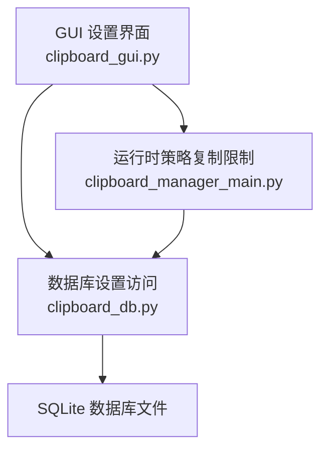
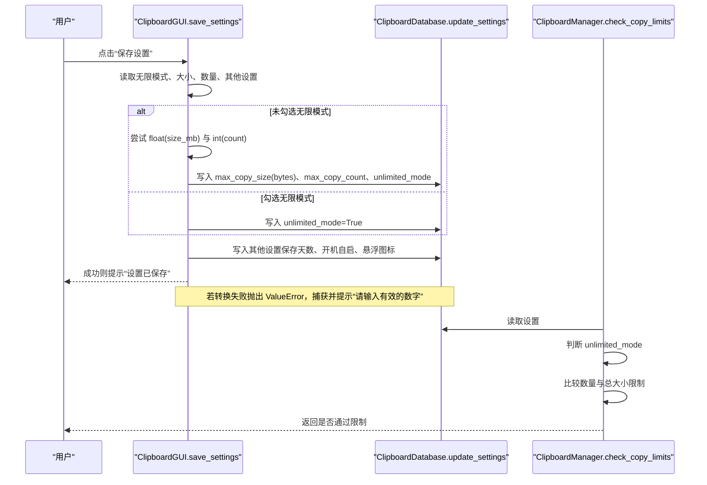
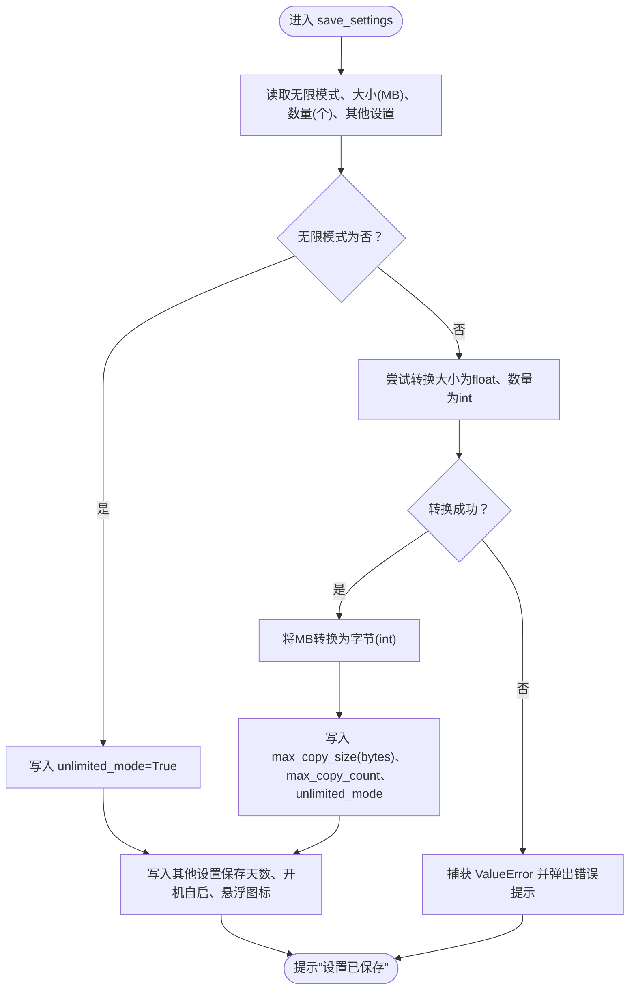
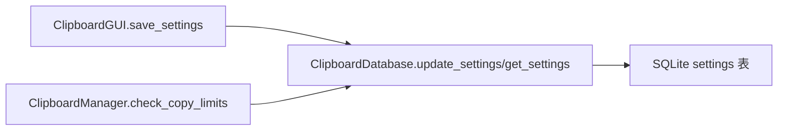

# 设置参数验证机制

<cite>
**本文引用的文件**
- [clipboard_gui.py](file://clipboard_gui.py)
- [clipboard_db.py](file://clipboard_db.py)
- [clipboard_manager_main.py](file://clipboard_manager_main.py)
</cite>

## 目录
1. [简介](#简介)
2. [项目结构](#项目结构)
3. [核心组件](#核心组件)
4. [架构总览](#架构总览)
5. [详细组件分析](#详细组件分析)
6. [依赖关系分析](#依赖关系分析)
7. [性能考量](#性能考量)
8. [故障排查指南](#故障排查指南)
9. [结论](#结论)

## 简介
本文件聚焦于设置界面中 save_settings 方法对“无限模式”“最大复制大小”“最大复制数量”等参数的验证流程，重点解析 try-except 块如何捕获 ValueError 异常以处理非数值输入，确保用户输入的合法性；同时说明在无限模式关闭时，对大小和数量字段进行类型转换（float 和 int）的具体实现方式，并解释无效输入时弹出错误提示 message 的触发条件与用户体验设计。

## 项目结构
- GUI 层负责用户交互与输入收集，调用数据库层持久化设置。
- 数据库层负责设置项的读取、更新与过期记录清理。
- 运行时策略层在复制检测阶段依据设置执行限制判断。

图表来源
- [clipboard_gui.py](file://clipboard_gui.py#L477-L533)
- [clipboard_db.py](file://clipboard_db.py#L360-L412)
- [clipboard_manager_main.py](file://clipboard_manager_main.py#L325-L390)

章节来源
- [clipboard_gui.py](file://clipboard_gui.py#L477-L533)
- [clipboard_db.py](file://clipboard_db.py#L360-L412)
- [clipboard_manager_main.py](file://clipboard_manager_main.py#L325-L390)

## 核心组件
- GUI 设置界面类 ClipboardGUI 提供设置页 UI、输入绑定与保存逻辑。
- 数据库类 ClipboardDatabase 提供设置项的读取与更新能力。
- 运行时策略类 ClipboardManager 在复制检测时依据设置执行限制判断。

章节来源
- [clipboard_gui.py](file://clipboard_gui.py#L477-L533)
- [clipboard_db.py](file://clipboard_db.py#L360-L412)
- [clipboard_manager_main.py](file://clipboard_manager_main.py#L325-L390)

## 架构总览
设置参数验证与保存的整体流程如下：
- 用户在设置页勾选“无限模式”，或输入“最大复制大小（MB）”和“最大复制数量（个）”。
- 点击“保存设置”后，GUI 层进入 save_settings 方法：
  - 若未勾选无限模式，则对大小与数量进行数值校验与类型转换；
  - 将 MB 转换为字节后写入数据库；
  - 其他设置项（如保存天数、开机自启、悬浮图标）也一并更新；
  - 若发生 ValueError（例如用户输入非数值），捕获异常并弹出错误提示。
- 数据库层负责持久化设置；运行时策略层在复制检测时读取设置并执行限制判断。

图表来源
- [clipboard_gui.py](file://clipboard_gui.py#L477-L533)
- [clipboard_db.py](file://clipboard_db.py#L360-L412)
- [clipboard_manager_main.py](file://clipboard_manager_main.py#L325-L390)

## 详细组件分析

### save_settings 方法与参数验证流程
- 输入来源
  - 无限模式：布尔变量，决定是否启用复制限制。
  - 最大复制大小：字符串变量，单位为 MB，保存前需转换为字节。
  - 最大复制数量：字符串变量，保存前需转换为整数。
  - 其他设置：保存天数（永久/自定义）、开机自启、悬浮图标。
- 验证与转换逻辑
  - 当无限模式为否时，对大小与数量进行类型转换：
    - 大小：将字符串转换为浮点数（float），再乘以 1024×1024 得到字节数，并强制转为整数写入数据库。
    - 数量：将字符串转换为整数（int）。
  - 当无限模式为真时，仅更新无限模式标志，跳过大小与数量的转换。
  - 其他设置项按需转换并写入数据库。
- 异常处理
  - 整个保存过程置于 try-except 中，捕获 ValueError。
  - 触发条件：当字符串无法转换为 float 或 int（例如输入非数值字符）时抛出 ValueError。
  - 错误提示：弹出错误对话框，提示“请输入有效的数字”。

图表来源
- [clipboard_gui.py](file://clipboard_gui.py#L477-L533)

章节来源
- [clipboard_gui.py](file://clipboard_gui.py#L477-L533)

### 类型转换与数据流向
- 大小字段（MB -> bytes）
  - 流程：字符串 -> 浮点数 -> 乘以 1024×1024 -> 整数字节 -> 写入数据库。
  - 目的：统一存储为字节，便于运行时策略层比较。
- 数量字段（个）
  - 流程：字符串 -> 整数 -> 写入数据库。
  - 目的：用于限制一次复制的文件数量。

章节来源
- [clipboard_gui.py](file://clipboard_gui.py#L477-L533)
- [clipboard_db.py](file://clipboard_db.py#L360-L412)

### 异常捕获与用户体验设计
- 捕获范围：对大小与数量的转换置于 try-except(ValueError) 中，避免因非法输入导致程序崩溃。
- 触发条件：输入包含非数值字符（如字母、特殊符号、空字符串等）。
- 提示策略：
  - 成功：弹出“设置已保存”的信息提示。
  - 失败：弹出“错误”对话框，提示“请输入有效的数字”，引导用户修正输入。
- 交互联动：
  - 当无限模式被勾选时，大小与数量输入框会被禁用，防止用户误填。
  - 当无限模式取消勾选时，输入框恢复可用，允许用户输入数值。

章节来源
- [clipboard_gui.py](file://clipboard_gui.py#L452-L476)
- [clipboard_gui.py](file://clipboard_gui.py#L477-L533)

### 运行时策略与设置一致性
- 运行时策略在复制检测时读取设置：
  - 若无限模式开启，直接放行。
  - 否则检查文件数量与总大小限制，并给出明确的拒绝原因（含格式化后的大小与数量）。
- 数据库层提供设置读取接口，保证 GUI 与运行时策略的数据一致性。

章节来源
- [clipboard_manager_main.py](file://clipboard_manager_main.py#L325-L390)
- [clipboard_db.py](file://clipboard_db.py#L360-L412)

## 依赖关系分析
- GUI 依赖数据库层进行设置读写。
- 运行时策略依赖数据库层读取设置，用于复制限制判断。
- 三者之间的耦合度较低，职责清晰：界面负责输入与提示，数据库负责持久化，策略负责业务规则。

图表来源
- [clipboard_gui.py](file://clipboard_gui.py#L477-L533)
- [clipboard_db.py](file://clipboard_db.py#L360-L412)
- [clipboard_manager_main.py](file://clipboard_manager_main.py#L325-L390)

章节来源
- [clipboard_gui.py](file://clipboard_gui.py#L477-L533)
- [clipboard_db.py](file://clipboard_db.py#L360-L412)
- [clipboard_manager_main.py](file://clipboard_manager_main.py#L325-L390)

## 性能考量
- 类型转换开销极低，主要成本在于数据库写入与可能的过期记录清理。
- 建议：
  - 在 GUI 层可增加输入框的即时校验（如按键事件过滤非数字字符），减少异常抛出概率。
  - 对于大量设置变更场景，可合并多次 update_settings 调用为单次事务提交，降低写入次数。

## 故障排查指南
- 症状：点击“保存设置”后弹出“请输入有效的数字”。
  - 可能原因：大小或数量输入非数值；无限模式关闭但未正确输入数值。
  - 排查步骤：
    - 确认无限模式勾选状态与输入框可用性（取消勾选会禁用输入框）。
    - 检查大小与数量输入框是否包含字母、空格或特殊字符。
    - 尝试输入纯数字，再次保存。
- 症状：设置未生效或运行时仍受限制。
  - 可能原因：数据库连接异常或写入失败。
  - 排查步骤：
    - 检查数据库文件是否存在且可写。
    - 查看数据库 settings 表中对应字段是否更新成功。

章节来源
- [clipboard_gui.py](file://clipboard_gui.py#L452-L476)
- [clipboard_gui.py](file://clipboard_gui.py#L477-L533)
- [clipboard_db.py](file://clipboard_db.py#L360-L412)

## 结论
- save_settings 方法通过“无限模式开关 + 数值转换 + 异常捕获”的组合，实现了对用户输入的强约束与友好提示。
- 在无限模式关闭时，大小与数量分别以 float/int 进行转换，并将大小统一为字节存储，确保运行时策略层的比较准确高效。
- GUI 与数据库层的职责分离清晰，配合运行时策略层形成完整的限制闭环，既保障了功能正确性，也提升了用户体验。