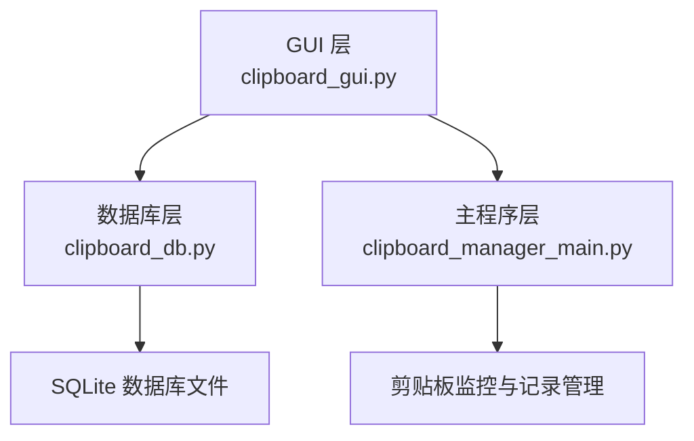
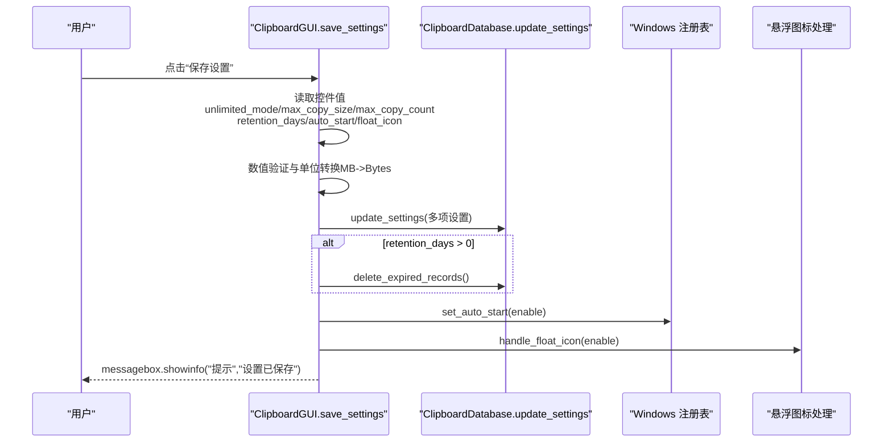
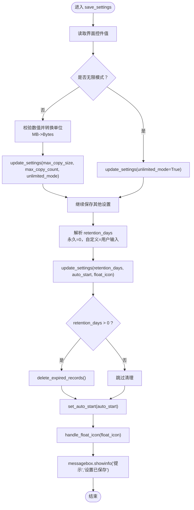
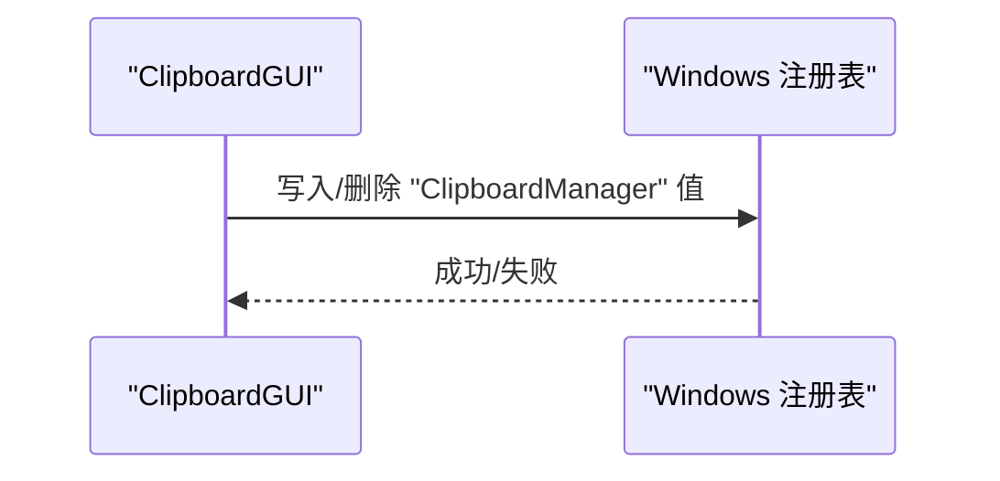
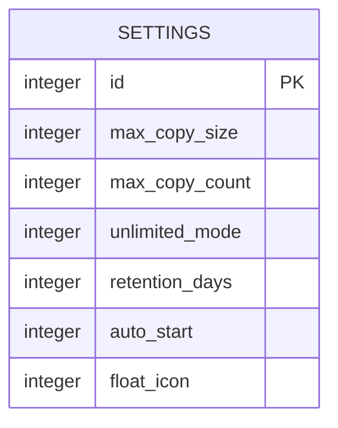
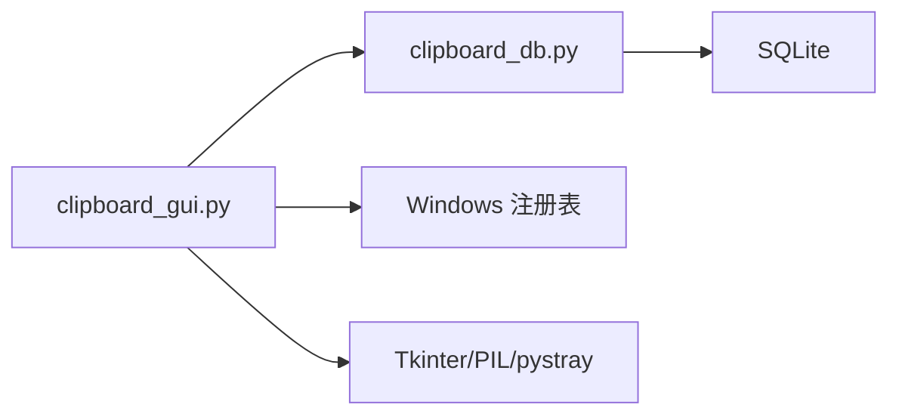

# 设置持久化机制

<cite>
**本文引用的文件**
- [clipboard_gui.py](file://clipboard_gui.py)
- [clipboard_db.py](file://clipboard_db.py)
- [clipboard_manager_main.py](file://clipboard_manager_main.py)
</cite>

## 目录
1. [简介](#简介)
2. [项目结构](#项目结构)
3. [核心组件](#核心组件)
4. [架构总览](#架构总览)
5. [详细组件分析](#详细组件分析)
6. [依赖关系分析](#依赖关系分析)
7. [性能考量](#性能考量)
8. [故障排查指南](#故障排查指南)
9. [结论](#结论)

## 简介
本文围绕“设置持久化”主题，深入解析 GUI 中 save_settings 方法的设置保存流程，涵盖以下要点：
- 从界面控件提取 unlimited_mode、max_copy_size、max_copy_count、retention_days、auto_start、float_icon 等参数的完整过程
- 数值验证机制（try-except ValueError）与单位转换逻辑（MB 到字节的乘法运算）
- retention_days 的永久保存（0）与自定义天数的转换规则
- auto_start 的开机自启配置实现
- handle_float_icon 对悬浮图标的动态创建/销毁
- 设置保存后的用户反馈（messagebox.showinfo）

## 项目结构
本仓库采用“功能模块化 + 数据库驱动”的组织方式：
- GUI 层负责用户交互与设置展示
- 数据库层负责设置项的持久化与读取
- 主程序层提供剪贴板监控与记录管理能力

图表来源
- [clipboard_gui.py](file://clipboard_gui.py#L1-L120)
- [clipboard_db.py](file://clipboard_db.py#L1-L120)
- [clipboard_manager_main.py](file://clipboard_manager_main.py#L1-L120)

章节来源
- [clipboard_gui.py](file://clipboard_gui.py#L1-L120)
- [clipboard_db.py](file://clipboard_db.py#L1-L120)
- [clipboard_manager_main.py](file://clipboard_manager_main.py#L1-L120)

## 核心组件
- ClipboardGUI：提供设置界面、保存逻辑、开机自启与悬浮图标控制
- ClipboardDatabase：提供设置的读取与更新、过期记录清理
- ClipboardManager：提供剪贴板监控与记录管理（与设置持久化间接相关）

章节来源
- [clipboard_gui.py](file://clipboard_gui.py#L1-L120)
- [clipboard_db.py](file://clipboard_db.py#L359-L412)
- [clipboard_manager_main.py](file://clipboard_manager_main.py#L355-L496)

## 架构总览
设置保存流程由 GUI 触发，经由数据库层持久化，随后执行系统级配置（开机自启）与界面级配置（悬浮图标），最后通过消息框反馈用户。

图表来源
- [clipboard_gui.py](file://clipboard_gui.py#L477-L533)
- [clipboard_db.py](file://clipboard_db.py#L387-L412)
- [clipboard_db.py](file://clipboard_db.py#L413-L455)
- [clipboard_gui.py](file://clipboard_gui.py#L1131-L1172)

章节来源
- [clipboard_gui.py](file://clipboard_gui.py#L477-L533)
- [clipboard_db.py](file://clipboard_db.py#L387-L455)

## 详细组件分析

### 1) save_settings 方法：设置保存全流程
- 参数提取与界面联动
  - unlimited_mode：来自无限模式复选框
  - max_copy_size、max_copy_count：仅在非无限模式下校验并保存
  - retention_days：根据“永久保存/自定义天数”单选框决定
  - auto_start：来自“开机自启”复选框
  - float_icon：来自“悬浮图标”复选框
- 数值验证与单位转换
  - 非无限模式下，对 max_copy_size（MB）与 max_copy_count（个）进行数值转换与类型转换
  - 将 MB 转换为字节：max_size_bytes = int(max_size_mb * 1024 * 1024)
  - 异常捕获：统一使用 try-except ValueError，出现非法输入时弹出错误提示
- retention_days 规则
  - “永久保存”对应 0；“自定义天数”对应用户输入的整数天数
  - 当 retention_days > 0 时，调用 delete_expired_records() 清理过期记录
- 系统与界面配置
  - set_auto_start(auto_start)：写入/删除注册表项实现开机自启
  - handle_float_icon(float_icon)：动态创建/销毁悬浮图标
- 用户反馈
  - 成功保存后弹出提示框“设置已保存”

图表来源
- [clipboard_gui.py](file://clipboard_gui.py#L477-L533)
- [clipboard_db.py](file://clipboard_db.py#L387-L412)
- [clipboard_db.py](file://clipboard_db.py#L413-L455)
- [clipboard_gui.py](file://clipboard_gui.py#L1131-L1172)

章节来源
- [clipboard_gui.py](file://clipboard_gui.py#L477-L533)
- [clipboard_db.py](file://clipboard_db.py#L387-L455)

### 2) 数值验证机制与单位转换
- 验证与异常处理
  - 非无限模式下，对 max_copy_size（字符串）进行 float 转换，max_copy_count 进行 int 转换
  - 一旦转换失败，捕获 ValueError 并弹出错误提示“请输入有效的数字”
- 单位转换
  - 将 MB 转换为字节：max_size_bytes = int(max_size_mb * 1024 * 1024)
  - 设置项在数据库中以字节为单位存储，便于后续统一比较与限制

章节来源
- [clipboard_gui.py](file://clipboard_gui.py#L477-L533)
- [clipboard_db.py](file://clipboard_db.py#L387-L412)

### 3) retention_days 的永久保存与自定义天数
- 永久保存
  - 当“永久保存”被选中时，retention_days 设为 0
- 自定义天数
  - 当“自定义天数”被选中时，retention_days 设为用户输入的整数天数
- 过期清理
  - 当 retention_days > 0 时，调用 delete_expired_records()，按设置天数删除过期记录并清理本地文件

章节来源
- [clipboard_gui.py](file://clipboard_gui.py#L501-L523)
- [clipboard_db.py](file://clipboard_db.py#L413-L455)

### 4) auto_start 的开机自启配置
- set_auto_start 实现原理
  - 通过 Windows 注册表 HKCU\Software\Microsoft\Windows\CurrentVersion\Run
  - 启用时写入程序路径，禁用时删除对应值
  - 支持可执行文件与源码两种场景（frozen 或普通脚本）
- 与设置保存的集成
  - save_settings 保存 auto_start 后，立即调用 set_auto_start，即时生效

图表来源
- [clipboard_gui.py](file://clipboard_gui.py#L1131-L1162)

章节来源
- [clipboard_gui.py](file://clipboard_gui.py#L1131-L1162)

### 5) handle_float_icon 与悬浮图标生命周期
- 启用悬浮图标
  - handle_float_icon(True) 调用 create_float_icon()
  - create_float_icon() 动态创建悬浮窗口，设置置顶、透明度、拖拽与点击事件
- 禁用悬浮图标
  - handle_float_icon(False) 调用 destroy_float_icon() 销毁悬浮窗口
- 与设置保存的集成
  - save_settings 保存 float_icon 后，调用 handle_float_icon，即时反映到界面

图表来源
- [clipboard_gui.py](file://clipboard_gui.py#L1164-L1172)
- [clipboard_gui.py](file://clipboard_gui.py#L1173-L1234)
- [clipboard_gui.py](file://clipboard_gui.py#L1633-L1638)

章节来源
- [clipboard_gui.py](file://clipboard_gui.py#L1164-L1172)
- [clipboard_gui.py](file://clipboard_gui.py#L1173-L1234)
- [clipboard_gui.py](file://clipboard_gui.py#L1633-L1638)

### 6) 设置持久化模型与字段映射
- 设置项在数据库中的字段与含义
  - max_copy_size：字节
  - max_copy_count：个
  - unlimited_mode：布尔（0/1）
  - retention_days：天（0 表示永久）
  - auto_start：布尔（0/1）
  - float_icon：布尔（0/1）
- 读取与更新
  - get_settings() 返回字典，包含上述字段
  - update_settings() 支持部分字段更新，最终写入 settings 表

图表来源
- [clipboard_db.py](file://clipboard_db.py#L77-L111)
- [clipboard_db.py](file://clipboard_db.py#L359-L412)

章节来源
- [clipboard_db.py](file://clipboard_db.py#L77-L111)
- [clipboard_db.py](file://clipboard_db.py#L359-L412)

## 依赖关系分析
- GUI 依赖数据库层进行设置读取与更新
- GUI 依赖系统注册表实现开机自启
- GUI 依赖 Tkinter 与 PIL/pystray 实现悬浮图标与托盘图标
- 数据库层依赖 SQLite 存储设置与记录

图表来源
- [clipboard_gui.py](file://clipboard_gui.py#L1-L120)
- [clipboard_db.py](file://clipboard_db.py#L1-L120)

章节来源
- [clipboard_gui.py](file://clipboard_gui.py#L1-L120)
- [clipboard_db.py](file://clipboard_db.py#L1-L120)

## 性能考量
- 数值转换与异常处理开销极低，主要成本在数据库写入与注册表操作
- delete_expired_records() 会扫描并删除过期记录，建议在设置变更时谨慎使用，避免频繁触发
- 悬浮图标创建/销毁涉及图形资源与事件绑定，建议在设置未变更时避免重复创建

## 故障排查指南
- 输入非法导致保存失败
  - 现象：弹出“请输入有效的数字”
  - 排查：确认非无限模式下的最大复制大小与最大数量输入为合法数值
- 开机自启未生效
  - 现象：重启后程序未自动启动
  - 排查：检查注册表项是否存在；确认程序路径正确；以管理员权限运行
- 悬浮图标无法显示或点击无效
  - 现象：悬浮图标未创建或点击无响应
  - 排查：确认 PIL/pystray 是否安装；检查图片资源路径；查看控制台输出的异常信息

章节来源
- [clipboard_gui.py](file://clipboard_gui.py#L530-L533)
- [clipboard_gui.py](file://clipboard_gui.py#L1131-L1162)
- [clipboard_gui.py](file://clipboard_gui.py#L1173-L1234)

## 结论
本文系统梳理了设置保存流程，明确了数值验证、单位转换、过期清理、开机自启与悬浮图标控制的实现细节。通过 GUI -> 数据库 -> 系统配置的清晰链路，实现了设置的可靠持久化与即时生效。建议在生产环境中：
- 对用户输入进行更严格的格式校验（如范围限制）
- 在高频设置变更场景下优化 delete_expired_records() 的触发频率
- 对异常情况进行更完善的日志记录与用户提示