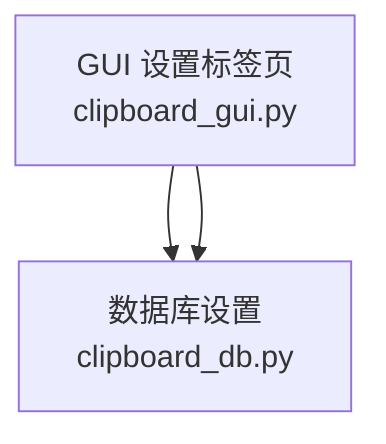
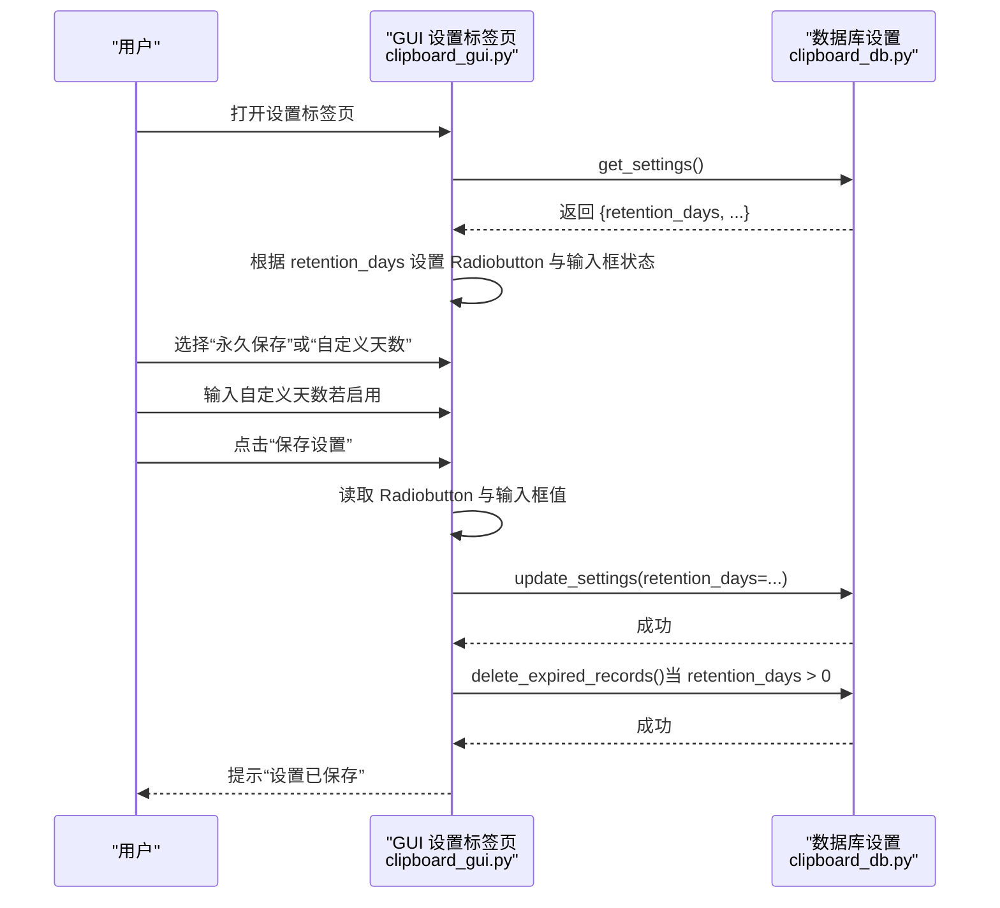
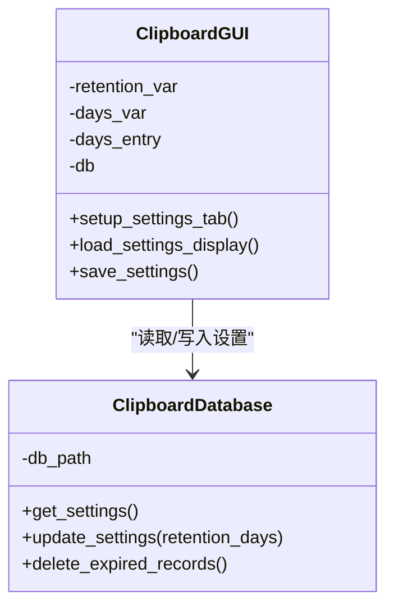
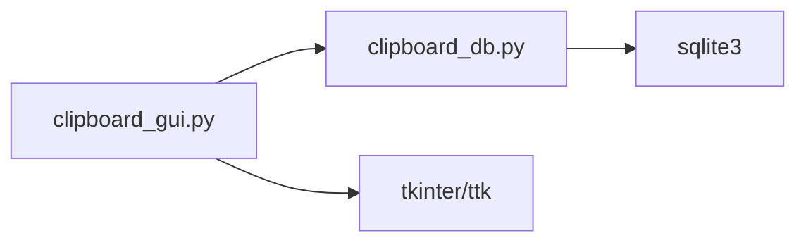

# 保存天数设置

<cite>
**本文引用的文件**
- [clipboard_gui.py](file://clipboard_gui.py)
- [clipboard_db.py](file://clipboard_db.py)
</cite>

## 目录
1. [简介](#简介)
2. [项目结构](#项目结构)
3. [核心组件](#核心组件)
4. [架构总览](#架构总览)
5. [详细组件分析](#详细组件分析)
6. [依赖关系分析](#依赖关系分析)
7. [性能考量](#性能考量)
8. [故障排查指南](#故障排查指南)
9. [结论](#结论)

## 简介
本文件系统化梳理“保存天数设置”区域的单选逻辑实现，重点覆盖：
- ttk.Radiobutton 在“永久保存”与“自定义天数”之间的互斥选择机制
- tk.StringVar 如何作为共享变量控制两个选项的状态同步
- 自定义天数输入框的启用/禁用逻辑
- 默认值处理：当 retention_days 为 0 时显示 30 天
- 结合 setup_settings_tab 与 load_settings_display 方法，阐述界面状态与数据库设置的双向绑定过程

## 项目结构
本功能涉及 GUI 界面与数据库设置的交互，核心文件如下：
- 界面层：clipboard_gui.py 中的设置标签页与设置弹窗
- 数据层：clipboard_db.py 中的 settings 表与相关设置读写

图表来源
- [clipboard_gui.py](file://clipboard_gui.py#L328-L462)
- [clipboard_db.py](file://clipboard_db.py#L359-L412)

章节来源
- [clipboard_gui.py](file://clipboard_gui.py#L328-L462)
- [clipboard_db.py](file://clipboard_db.py#L359-L412)

## 核心组件
- 单选组与共享变量
  - “永久保存”与“自定义天数”两个 Radiobutton 共享同一个 tk.StringVar，保证互斥选择
- 输入框与状态联动
  - 当选择“永久保存”时，自定义天数输入框禁用；选择“自定义天数”时，输入框启用
- 默认值策略
  - 当数据库中 retention_days 为 0 时，界面显示“永久保存”，且自定义天数输入框禁用
  - 当数据库中 retention_days > 0 时，界面显示“自定义天数”，输入框显示具体天数
  - 若数据库中未显式设置天数（例如迁移场景），界面默认显示 30 天（仅在输入框启用时）

章节来源
- [clipboard_gui.py](file://clipboard_gui.py#L376-L393)
- [clipboard_gui.py](file://clipboard_gui.py#L439-L462)
- [clipboard_gui.py](file://clipboard_gui.py#L477-L533)
- [clipboard_db.py](file://clipboard_db.py#L359-L412)

## 架构总览
界面与数据库通过 ClipboardDatabase 的 get_settings/update_settings 实现双向绑定：
- 加载阶段：load_settings_display 从数据库读取设置，设置 Radiobutton 与输入框状态
- 保存阶段：save_settings 读取 Radiobutton 与输入框值，写入数据库，并在需要时清理过期记录

图表来源
- [clipboard_gui.py](file://clipboard_gui.py#L439-L533)
- [clipboard_db.py](file://clipboard_db.py#L359-L412)
- [clipboard_db.py](file://clipboard_db.py#L413-L455)

## 详细组件分析

### 单选逻辑与互斥机制
- 共享变量
  - “永久保存” Radiobutton 绑定值为固定字符串，对应共享变量的一个值
  - “自定义天数” Radiobutton 绑定值为另一个固定字符串，二者共同受同一 tk.StringVar 控制
- 互斥效果
  - 任一 Radiobutton 被选中都会导致另一个自动反选，从而实现互斥
- 状态同步
  - 通过共享变量的 set/get，界面与逻辑层保持一致

章节来源
- [clipboard_gui.py](file://clipboard_gui.py#L376-L393)

### 自定义天数输入框的启用/禁用逻辑
- 初始状态
  - load_settings_display 根据 retention_days 是否大于 0 决定输入框状态
- 选择切换
  - 当选择“永久保存”时，输入框禁用
  - 当选择“自定义天数”时，输入框启用
- 保存时的处理
  - 保存时根据 Radiobutton 的值决定写入 retention_days 的值
  - 若为“永久保存”，写入 0；若为“自定义天数”，写入输入框的整数值

章节来源
- [clipboard_gui.py](file://clipboard_gui.py#L439-L462)
- [clipboard_gui.py](file://clipboard_gui.py#L477-L533)

### 默认值处理：retention_days 为 0 时显示 30 天
- 数据库默认
  - settings 表新增字段 retention_days，默认值为 0（永久保存）
- 界面默认
  - 当 retention_days 为 0 时，界面显示“永久保存”，输入框禁用
  - 当 retention_days > 0 时，界面显示“自定义天数”，输入框显示具体天数
  - 当未显式设置天数（迁移场景）时，界面默认显示 30 天（仅在输入框启用时）

章节来源
- [clipboard_db.py](file://clipboard_db.py#L77-L109)
- [clipboard_db.py](file://clipboard_db.py#L359-L412)
- [clipboard_gui.py](file://clipboard_gui.py#L439-L462)

### setup_settings_tab 与 load_settings_display 的双向绑定
- setup_settings_tab
  - 创建“永久保存”与“自定义天数”两个 Radiobutton，绑定共享变量
  - 创建自定义天数输入框，初始状态由 load_settings_display 决定
- load_settings_display
  - 从数据库读取设置
  - 设置 Radiobutton 的选中状态
  - 设置输入框的显示值与启用状态
  - 触发其他设置项的初始化（如无限模式等）

章节来源
- [clipboard_gui.py](file://clipboard_gui.py#L328-L462)

### 保存流程与过期清理
- 保存设置
  - 读取 Radiobutton 与输入框值，写入数据库
- 过期清理
  - 当 retention_days > 0 时，调用 delete_expired_records 删除过期记录
- 错误处理
  - 输入校验失败时提示错误

章节来源
- [clipboard_gui.py](file://clipboard_gui.py#L477-L533)
- [clipboard_db.py](file://clipboard_db.py#L413-L455)

### 类关系图（代码级）

图表来源
- [clipboard_gui.py](file://clipboard_gui.py#L328-L533)
- [clipboard_db.py](file://clipboard_db.py#L359-L455)

## 依赖关系分析
- 组件耦合
  - GUI 依赖数据库接口，但未直接依赖数据库实现细节
  - 单选逻辑与输入框状态通过共享变量解耦，降低耦合度
- 外部依赖
  - Tkinter/ttk 用于界面控件
  - SQLite 用于持久化设置
- 循环依赖
  - 未发现循环依赖

图表来源
- [clipboard_gui.py](file://clipboard_gui.py#L1-L40)
- [clipboard_db.py](file://clipboard_db.py#L1-L20)

章节来源
- [clipboard_gui.py](file://clipboard_gui.py#L1-L40)
- [clipboard_db.py](file://clipboard_db.py#L1-L20)

## 性能考量
- 单选与输入框状态切换为 O(1) 操作，性能影响可忽略
- 保存设置时的数据库写入与过期清理为轻量操作，避免频繁触发
- 建议在批量修改设置时合并多次 update_settings 调用，减少数据库往返

## 故障排查指南
- 问题：输入框始终不可编辑
  - 检查 load_settings_display 是否正确根据 retention_days 设置了输入框状态
  - 检查 Radiobutton 的共享变量是否被意外重置
- 问题：保存后未清理过期记录
  - 确认保存流程中是否检测到 retention_days > 0 并调用了 delete_expired_records
- 问题：默认值显示异常
  - 确认数据库 settings 表中 retention_days 字段是否存在且默认值为 0
  - 确认 load_settings_display 的分支逻辑是否按预期执行

章节来源
- [clipboard_gui.py](file://clipboard_gui.py#L439-L533)
- [clipboard_db.py](file://clipboard_db.py#L359-L455)

## 结论
“保存天数设置”区域通过 tk.StringVar 实现两个 Radiobutton 的互斥选择，配合输入框的启用/禁用逻辑，实现了清晰直观的用户交互。界面与数据库通过 get_settings/update_settings 完成双向绑定，retention_days 为 0 时的默认值策略保证了用户体验的一致性。整体设计简洁、低耦合，易于维护与扩展。