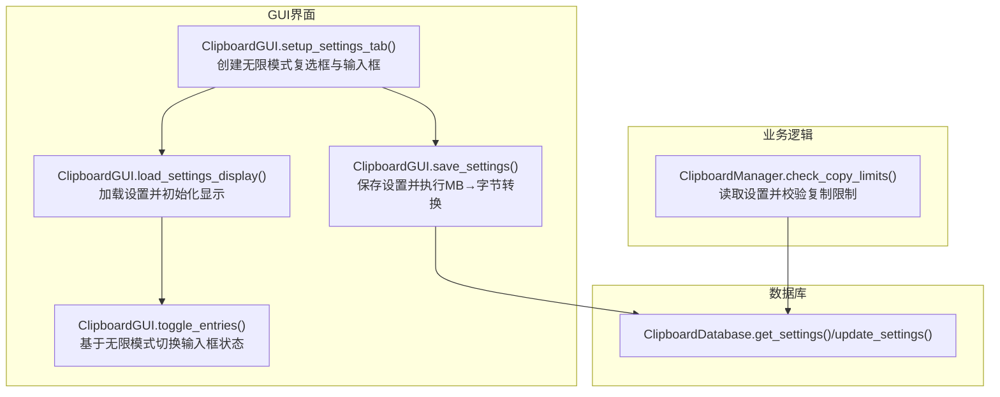
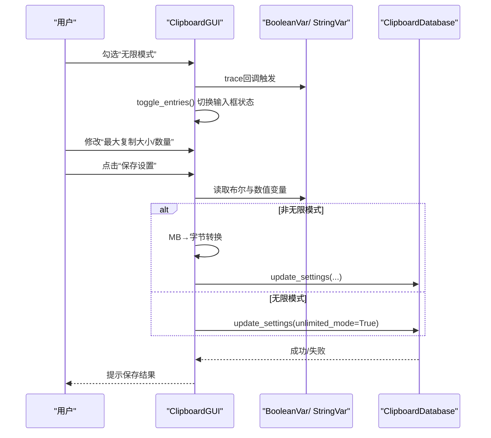
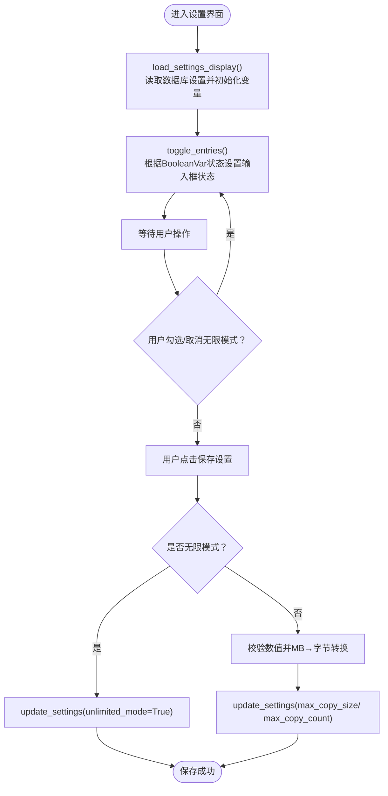
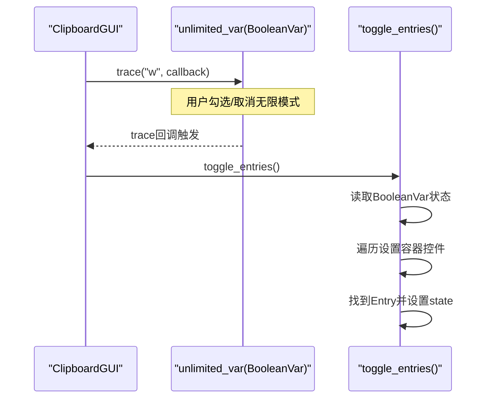
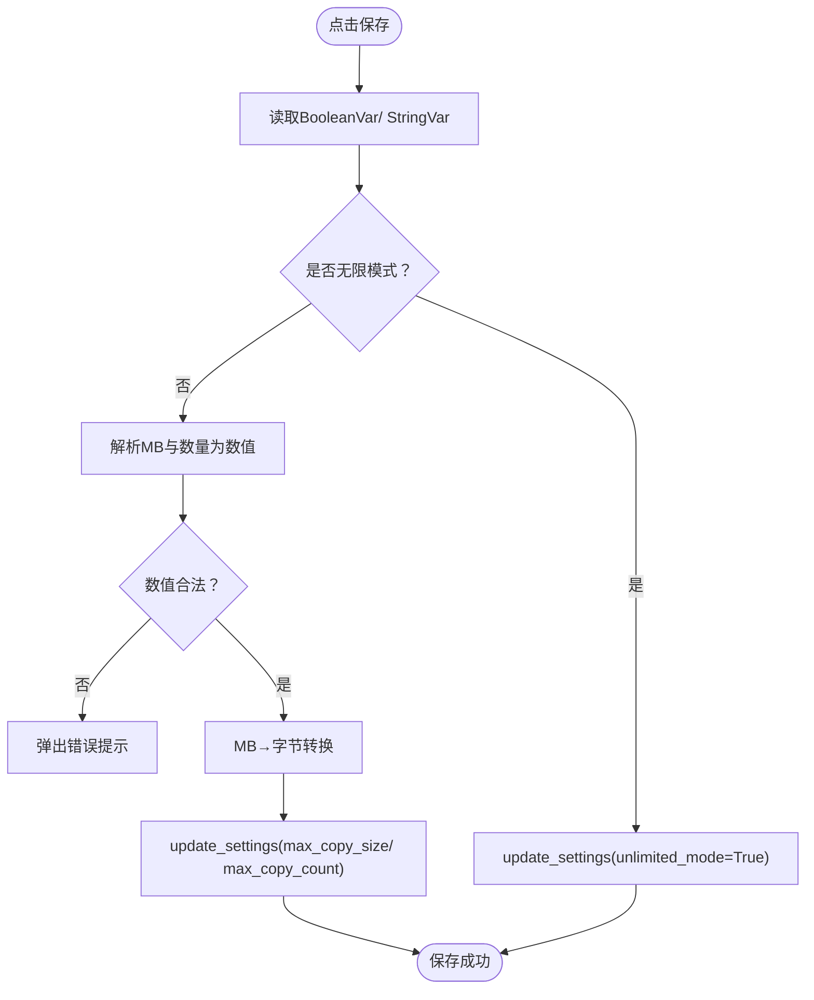
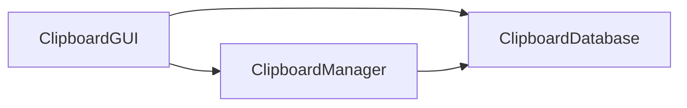

# 复制限制设置

<cite>
**本文引用的文件**
- [clipboard_gui.py](file://clipboard_gui.py)
- [clipboard_manager_main.py](file://clipboard_manager_main.py)
- [clipboard_db.py](file://clipboard_db.py)
</cite>

## 目录
1. [简介](#简介)
2. [项目结构](#项目结构)
3. [核心组件](#核心组件)
4. [架构概览](#架构概览)
5. [详细组件分析](#详细组件分析)
6. [依赖关系分析](#依赖关系分析)
7. [性能考量](#性能考量)
8. [故障排查指南](#故障排查指南)
9. [结论](#结论)

## 简介
本章节聚焦“复制限制设置”区域的UI实现，涵盖以下要点：
- 无限模式复选框（tk.BooleanVar + ttk.Checkbutton）与最大大小、最大数量输入框之间的联动逻辑
- BooleanVar 的 trace 监听机制如何触发 toggle_entries 动态启用/禁用输入控件
- ttk.LabelFrame 的布局策略及其在界面中的视觉分组作用
- 输入验证机制（如 MB 到字节的转换）与数据绑定流程（StringVar/BooleanVar）

## 项目结构
与“复制限制设置”相关的代码主要分布在 GUI 界面模块中，同时业务侧的限制校验由管理器模块提供。

图表来源
- [clipboard_gui.py](file://clipboard_gui.py#L343-L533)
- [clipboard_manager_main.py](file://clipboard_manager_main.py#L362-L393)
- [clipboard_db.py](file://clipboard_db.py#L107-L144)

章节来源
- [clipboard_gui.py](file://clipboard_gui.py#L343-L533)
- [clipboard_manager_main.py](file://clipboard_manager_main.py#L362-L393)

## 核心组件
- 无限模式复选框：tk.BooleanVar + ttk.Checkbutton，用于开启/关闭限制
- 最大大小输入框：tk.StringVar + ttk.Entry，单位为 MB
- 最大数量输入框：tk.StringVar + ttk.Entry，单位为 个
- 数据绑定：BooleanVar/ StringVar 与控件双向绑定
- 状态切换：BooleanVar.trace 监听状态变化，调用 toggle_entries 控制输入框可用性
- 保存逻辑：非无限模式时进行数值校验与 MB→字节转换，写入数据库

章节来源
- [clipboard_gui.py](file://clipboard_gui.py#L343-L533)

## 架构概览
复制限制设置的交互链路如下：
- 用户勾选“无限模式” → BooleanVar 状态变化 → trace 回调触发 toggle_entries → 禁用/启用大小与数量输入框
- 用户点击“保存设置” → 读取 BooleanVar/ StringVar → 非无限模式时校验数值并转换为字节 → 更新数据库
- 管理器在处理剪贴板内容时读取数据库设置，执行复制限制校验

图表来源
- [clipboard_gui.py](file://clipboard_gui.py#L343-L533)
- [clipboard_db.py](file://clipboard_db.py#L107-L144)

## 详细组件分析

### 无限模式复选框与输入框联动
- 复选框与 BooleanVar 绑定：用于表示是否启用“无限模式”
- 两个输入框分别与 StringVar 绑定：分别用于设置“最大复制大小（MB）”和“最大复制文件数量（个）”
- 状态切换逻辑：
  - 当无限模式开启时，大小与数量输入框被禁用
  - 当无限模式关闭时，输入框恢复可用
- 初始加载时会根据数据库设置同步 UI 状态，并立即应用一次状态切换

图表来源
- [clipboard_gui.py](file://clipboard_gui.py#L439-L533)

章节来源
- [clipboard_gui.py](file://clipboard_gui.py#L343-L533)

### BooleanVar 的 trace 监听与 toggle_entries
- trace 注册：在设置界面初始化时，为无限模式 BooleanVar 注册 trace 回调
- 回调触发：当变量值发生变化时，自动调用 toggle_entries
- toggle_entries 实现：
  - 依据 BooleanVar 当前值决定输入框状态（禁用/启用）
  - 遍历设置容器内的控件，定位 Entry 并批量设置 state

图表来源
- [clipboard_gui.py](file://clipboard_gui.py#L437-L476)

章节来源
- [clipboard_gui.py](file://clipboard_gui.py#L437-L476)

### ttk.LabelFrame 的布局策略与视觉分组
- 复制限制设置区域使用多个 LabelFrame 进行视觉分组：
  - “复制限制设置”标题
  - “最大复制大小”分组（含 MB 单位标签）
  - “最大复制文件数量”分组（含“个”单位标签）
- 布局特点：
  - 使用网格布局（grid），支持列权重配置，保证在窗口缩放时输入框与标签相对位置稳定
  - 分组容器内部进一步 grid 布局，Entry 与标签并排显示，便于用户理解单位
- 作用：
  - 将相关设置项归类，提升可读性与易用性
  - 通过容器边框与标题明确语义边界

章节来源
- [clipboard_gui.py](file://clipboard_gui.py#L343-L368)

### 输入验证与数据绑定流程（MB→字节转换）
- 数据绑定：
  - 大小输入框：StringVar 绑定 Entry，显示单位 MB
  - 数量输入框：StringVar 绑定 Entry，显示单位 个
  - 无限模式：BooleanVar 绑定 Checkbutton
- 保存时的验证与转换：
  - 若非无限模式：
    - 校验大小（MB）与数量（个）为有效数值
    - 将 MB 转换为字节（乘以 1024×1024），写入数据库
  - 若无限模式：
    - 仅更新 unlimited_mode 标志位
- 错误处理：
  - 非法数值时弹出错误提示

图表来源
- [clipboard_gui.py](file://clipboard_gui.py#L477-L533)

章节来源
- [clipboard_gui.py](file://clipboard_gui.py#L477-L533)

### 与业务侧限制校验的衔接
- 管理器在处理剪贴板内容时会读取数据库设置，并执行复制限制校验：
  - 若开启无限模式，跳过数量与大小限制
  - 否则校验文件数量、单文件大小与总大小
- 这保证了 UI 设置与实际业务行为一致

章节来源
- [clipboard_manager_main.py](file://clipboard_manager_main.py#L362-L393)
- [clipboard_db.py](file://clipboard_db.py#L107-L144)

## 依赖关系分析
- GUI 与数据库：
  - GUI 通过 ClipboardDatabase 的 get_settings/update_settings 读取/写入设置
- GUI 与业务：
  - 业务层 ClipboardManager 在处理剪贴板时读取设置并执行限制校验
- UI 状态与业务一致性：
  - UI 的无限模式与数值设置直接影响业务层的限制判断

图表来源
- [clipboard_gui.py](file://clipboard_gui.py#L343-L533)
- [clipboard_manager_main.py](file://clipboard_manager_main.py#L362-L393)
- [clipboard_db.py](file://clipboard_db.py#L107-L144)

章节来源
- [clipboard_gui.py](file://clipboard_gui.py#L343-L533)
- [clipboard_manager_main.py](file://clipboard_manager_main.py#L362-L393)
- [clipboard_db.py](file://clipboard_db.py#L107-L144)

## 性能考量
- trace 回调在每次 BooleanVar 变化时触发，开销极低，适合频繁切换 UI 状态
- MB→字节转换为纯数值运算，成本可忽略
- 数据库更新采用单次事务写入，避免频繁 IO

## 故障排查指南
- 症状：保存时报“请输入有效的数字”
  - 排查：确认大小与数量输入框中为合法数值；若开启无限模式，可不填写大小与数量
- 症状：修改后未生效
  - 排查：确认点击了“保存设置”按钮；检查数据库设置是否更新
- 症状：无限模式勾选后输入框仍可编辑
  - 排查：确认 trace 是否注册成功；检查 toggle_entries 是否被调用

章节来源
- [clipboard_gui.py](file://clipboard_gui.py#L477-L533)

## 结论
“复制限制设置”区域通过 BooleanVar + trace 的轻量监听机制，实现了无限模式与输入框状态的即时联动；配合 LabelFrame 的清晰分组与单位标签，提升了用户体验。保存流程中对 MB→字节的转换与数值校验确保了设置的正确性，并与业务层的限制校验保持一致，形成完整的闭环。