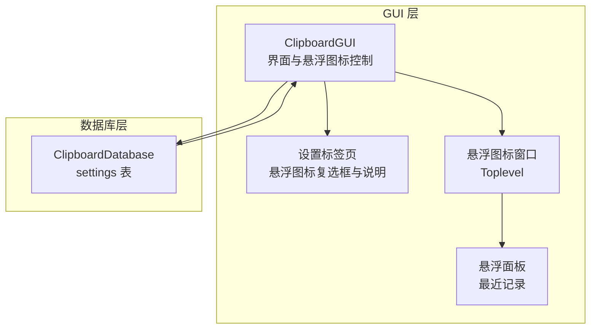
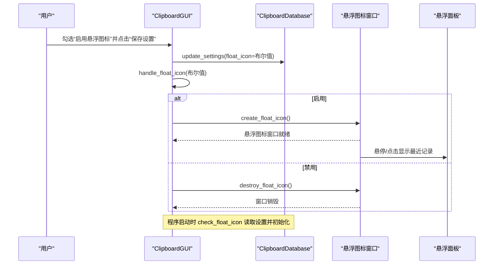
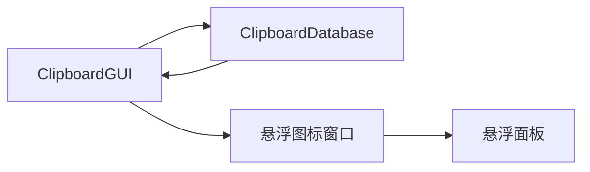

# 悬浮图标设置

<cite>
**本文引用的文件**
- [clipboard_gui.py](file://clipboard_gui.py)
- [clipboard_db.py](file://clipboard_db.py)
</cite>

## 目录
1. [简介](#简介)
2. [项目结构](#项目结构)
3. [核心组件](#核心组件)
4. [架构总览](#架构总览)
5. [详细组件分析](#详细组件分析)
6. [依赖关系分析](#依赖关系分析)
7. [性能考量](#性能考量)
8. [故障排查指南](#故障排查指南)
9. [结论](#结论)

## 简介
本文件围绕“悬浮图标”功能进行全面文档化，重点解释以下方面：
- float_icon_var 如何控制复选框状态
- 通过 save_settings 方法调用 handle_float_icon 函数创建或销毁悬浮窗口
- setup_settings_tab 中对悬浮图标特性（尺寸、透明度、可拖动性）的说明文本设计
- check_float_icon 方法如何在程序启动时依据设置自动初始化悬浮图标

## 项目结构
悬浮图标功能主要分布在 GUI 界面层与数据库设置层：
- GUI 层负责界面交互、悬浮图标窗口的创建/销毁、事件绑定与面板展示
- 数据库层负责设置项的持久化，包括 float_icon 字段

图表来源
- [clipboard_gui.py](file://clipboard_gui.py#L80-L120)
- [clipboard_gui.py](file://clipboard_gui.py#L1160-L1359)
- [clipboard_db.py](file://clipboard_db.py#L77-L112)
- [clipboard_db.py](file://clipboard_db.py#L359-L412)

章节来源
- [clipboard_gui.py](file://clipboard_gui.py#L80-L120)
- [clipboard_gui.py](file://clipboard_gui.py#L1160-L1359)
- [clipboard_db.py](file://clipboard_db.py#L77-L112)
- [clipboard_db.py](file://clipboard_db.py#L359-L412)

## 核心组件
- 浮动图标复选框与说明：位于设置标签页，提供“启用悬浮图标”的开关与特性说明
- 浮动图标窗口：基于 Tkinter 的 Toplevel，具备尺寸、透明度、置顶、可拖动等属性
- 浮动面板：悬浮图标悬停或点击时显示的最近记录面板
- 设置持久化：settings 表中新增 float_icon 字段，支持布尔值存储

章节来源
- [clipboard_gui.py](file://clipboard_gui.py#L405-L416)
- [clipboard_gui.py](file://clipboard_gui.py#L1160-L1359)
- [clipboard_db.py](file://clipboard_db.py#L77-L112)
- [clipboard_db.py](file://clipboard_db.py#L359-L412)

## 架构总览
悬浮图标功能的调用链路如下：
- 用户在设置标签页勾选“启用悬浮图标”
- 点击“保存设置”，调用 save_settings
- save_settings 将 float_icon 写入数据库，并调用 handle_float_icon
- handle_float_icon 根据布尔值创建或销毁悬浮图标窗口
- 程序启动时，check_float_icon 读取设置并自动初始化悬浮图标

图表来源
- [clipboard_gui.py](file://clipboard_gui.py#L477-L533)
- [clipboard_gui.py](file://clipboard_gui.py#L1160-L1359)
- [clipboard_gui.py](file://clipboard_gui.py#L80-L88)
- [clipboard_db.py](file://clipboard_db.py#L387-L412)

## 详细组件分析

### 浮动图标复选框与说明文本
- 复选框变量：float_icon_var（BooleanVar），用于绑定“启用悬浮图标”复选框
- 说明文本：明确悬浮图标特性（尺寸、透明度、可拖动性、点击显示页面）

章节来源
- [clipboard_gui.py](file://clipboard_gui.py#L405-L416)

### 保存设置与处理悬浮图标
- save_settings 读取各设置项，其中包含 float_icon
- 调用 update_settings 将 float_icon 写入数据库
- 调用 handle_float_icon 根据布尔值创建或销毁悬浮图标

章节来源
- [clipboard_gui.py](file://clipboard_gui.py#L477-L533)
- [clipboard_db.py](file://clipboard_db.py#L387-L412)

### 启动时自动初始化悬浮图标
- check_float_icon 从数据库读取设置
- 若设置为启用，则调用 create_float_icon 创建悬浮图标

章节来源
- [clipboard_gui.py](file://clipboard_gui.py#L80-L88)

### 悬浮图标窗口创建与销毁
- create_float_icon
  - 创建 Toplevel，设置几何尺寸、去边框、置顶、透明度
  - 默认位置在右下角，支持鼠标拖动
  - 绑定进入/离开、点击、双击事件
  - 图片加载失败时回退到默认背景与文本
- destroy_float_icon：销毁悬浮图标窗口

章节来源
- [clipboard_gui.py](file://clipboard_gui.py#L1160-L1359)

### 悬浮面板展示与定位
- show_float_panel：聚合最近记录（文本/文件），构建面板并显示
- position_float_panel_above_icon / position_float_panel_within_screen / position_float_panel_centered：根据图标位置与屏幕边界，智能定位面板
- 隐藏策略：延迟隐藏、鼠标位置检测，避免误触

章节来源
- [clipboard_gui.py](file://clipboard_gui.py#L1254-L1359)
- [clipboard_gui.py](file://clipboard_gui.py#L1453-L1558)
- [clipboard_gui.py](file://clipboard_gui.py#L1559-L1632)

### 数据模型与设置持久化
- settings 表新增 float_icon 字段，支持布尔值存储
- get_settings 返回包含 float_icon 的字典
- update_settings 支持更新 float_icon

章节来源
- [clipboard_db.py](file://clipboard_db.py#L77-L112)
- [clipboard_db.py](file://clipboard_db.py#L359-L412)

## 依赖关系分析
- GUI 依赖数据库层进行设置读写
- 悬浮图标窗口与面板依赖 GUI 的事件处理与定位逻辑
- 设置变更通过 handle_float_icon 影响悬浮图标生命周期

图表来源
- [clipboard_gui.py](file://clipboard_gui.py#L1160-L1359)
- [clipboard_db.py](file://clipboard_db.py#L359-L412)

章节来源
- [clipboard_gui.py](file://clipboard_gui.py#L1160-L1359)
- [clipboard_db.py](file://clipboard_db.py#L359-L412)

## 性能考量
- 悬浮面板最近记录查询限制为 50 条，避免一次性加载过多数据
- 面板采用 Text 控件与滚动条，减少复杂布局开销
- 隐藏面板采用延迟与鼠标位置检测，降低频繁创建/销毁带来的抖动

## 故障排查指南
- 悬浮图标未显示
  - 检查设置中“启用悬浮图标”是否勾选
  - 确认 save_settings 是否成功写入数据库
  - 查看启动日志中 check_float_icon 的执行情况
- 图片加载失败
  - create_float_icon 会回退到默认背景与文本，确认资源文件是否存在
- 透明度或尺寸不符合预期
  - create_float_icon 中设置几何尺寸与透明度，确认是否被后续逻辑覆盖
- 面板位置异常
  - position_* 函数会做边界检查，若仍异常，检查屏幕分辨率与任务栏位置

章节来源
- [clipboard_gui.py](file://clipboard_gui.py#L1160-L1359)
- [clipboard_gui.py](file://clipboard_gui.py#L80-L88)
- [clipboard_db.py](file://clipboard_db.py#L359-L412)

## 结论
悬浮图标功能通过 GUI 与数据库的协同，实现了“可配置、可拖动、可悬停查看”的轻量交互入口。其核心在于：
- float_icon_var 控制复选框状态
- save_settings 将设置写入数据库并调用 handle_float_icon
- check_float_icon 在启动时根据设置自动初始化
- create_float_icon/destroy_float_icon 管理悬浮图标生命周期
- show_float_panel 提供最近记录的快速浏览体验