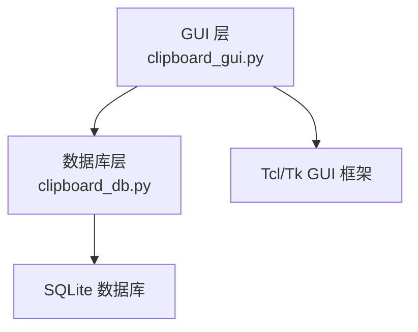
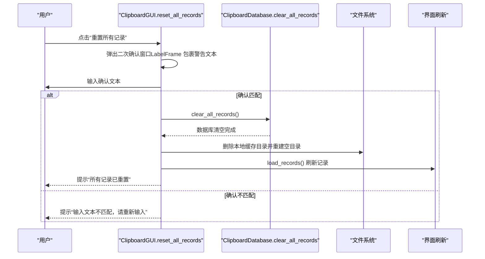
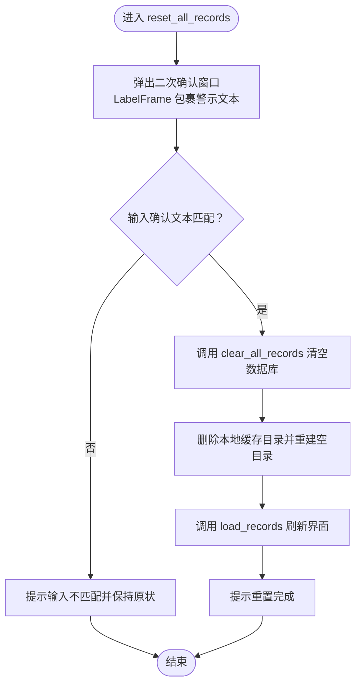
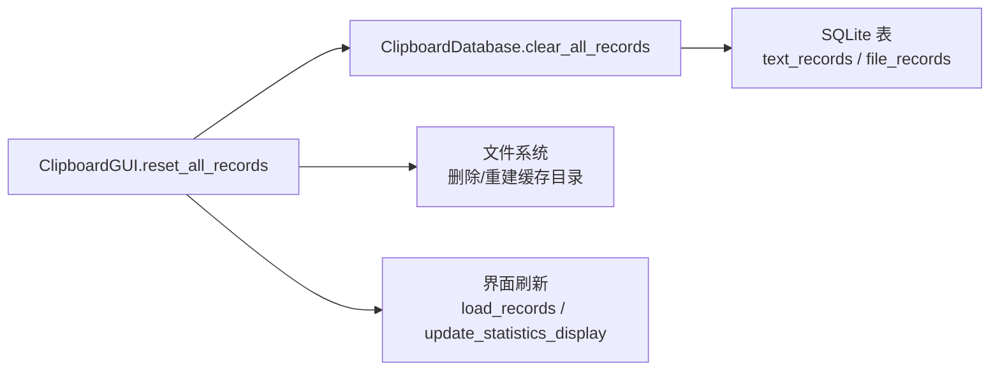

# 数据管理设置

<cite>
**本文引用的文件**
- [clipboard_gui.py](file://clipboard_gui.py)
- [clipboard_db.py](file://clipboard_db.py)
</cite>

## 目录
1. [简介](#简介)
2. [项目结构](#项目结构)
3. [核心组件](#核心组件)
4. [架构总览](#架构总览)
5. [详细组件分析](#详细组件分析)
6. [依赖关系分析](#依赖关系分析)
7. [性能考量](#性能考量)
8. [故障排查指南](#故障排查指南)
9. [结论](#结论)

## 简介
本章节聚焦“数据管理”区域的“重置所有记录”功能实现，涵盖：
- 危险操作警示设计：使用 LabelFrame 包裹警告文本，明确提示风险。
- reset_all_records 方法的执行流程：二次确认、清空数据库与本地缓存、界面刷新。
- 按钮布局策略及与“保存设置/恢复默认”的视觉层级关系。
- 操作完成后对界面状态的刷新机制。

## 项目结构
本项目采用模块化组织，GUI 与数据库逻辑分离：
- GUI 层负责界面交互与用户操作反馈（clipboard_gui.py）。
- 数据库层负责持久化与数据管理（clipboard_db.py）。

图表来源
- [clipboard_gui.py](file://clipboard_gui.py#L1-L120)
- [clipboard_db.py](file://clipboard_db.py#L1-L60)

章节来源
- [clipboard_gui.py](file://clipboard_gui.py#L1-L120)
- [clipboard_db.py](file://clipboard_db.py#L1-L60)

## 核心组件
- ClipboardGUI：提供设置标签页与“重置所有记录”按钮，负责二次确认弹窗、调用数据库清空、刷新界面。
- ClipboardDatabase：提供 clear_all_records 清空数据库记录、get_statistics 更新统计信息等能力。

章节来源
- [clipboard_gui.py](file://clipboard_gui.py#L328-L438)
- [clipboard_gui.py](file://clipboard_gui.py#L890-L949)
- [clipboard_db.py](file://clipboard_db.py#L350-L358)

## 架构总览
“重置所有记录”涉及的调用链如下：

图表来源
- [clipboard_gui.py](file://clipboard_gui.py#L890-L949)
- [clipboard_db.py](file://clipboard_db.py#L350-L358)

## 详细组件分析

### 重置按钮与警示设计
- 位置与分组：在设置标签页中，“数据管理”标题下包含一个 LabelFrame，内部展示“此操作将删除所有记录和本地缓存文件！”的警示文本，并提供“重置所有记录”按钮。
- 视觉层次：警示文本位于按钮上方，形成“先警示、后行动”的层级关系，强调危险性。
- 交互入口：按钮绑定到 reset_all_records 方法。

章节来源
- [clipboard_gui.py](file://clipboard_gui.py#L417-L425)

### reset_all_records 方法实现
- 二次确认机制：
  - 弹出模态子窗口，居中显示。
  - 使用 LabelFrame 包裹红色加粗警示文本，明确风险。
  - 要求用户输入固定确认文本，不匹配则拒绝执行。
- 数据库清空：
  - 调用数据库层的 clear_all_records，清空 text_records 与 file_records。
- 本地缓存清理：
  - 删除 clipboard_files 目录，若删除失败则弹出错误提示；随后重建空目录以保证后续写入可用。
- 界面刷新：
  - 调用 load_records，重新加载并显示空记录集。
  - 最终弹出成功提示。

图表来源
- [clipboard_gui.py](file://clipboard_gui.py#L890-L949)
- [clipboard_db.py](file://clipboard_db.py#L350-L358)

章节来源
- [clipboard_gui.py](file://clipboard_gui.py#L890-L949)
- [clipboard_db.py](file://clipboard_db.py#L350-L358)

### 按钮布局策略与视觉层级
- “重置所有记录”按钮置于独立的 LabelFrame 中，上方警示文本先行，突出危险性。
- 与“保存设置/恢复默认”按钮同属一个按钮框架，但前者位于更靠下的层级，视觉上弱化其危险性，同时通过警示文本强化安全提示。
- 该布局策略符合“先警示、后操作”的交互原则，降低误触风险。

章节来源
- [clipboard_gui.py](file://clipboard_gui.py#L417-L433)

### 界面状态刷新机制
- 统计信息刷新：reset_all_records 完成后，load_records 会再次调用 update_statistics_display，从而更新统计面板中的文本内容。
- 记录列表刷新：load_records 会清空 Treeview 并重新加载记录，确保界面显示为空状态。
- 用户状态标记：reset_all_records 在执行前后设置 user_action_in_progress，便于外部逻辑感知用户操作进行中。

章节来源
- [clipboard_gui.py](file://clipboard_gui.py#L581-L626)
- [clipboard_gui.py](file://clipboard_gui.py#L555-L580)
- [clipboard_gui.py](file://clipboard_gui.py#L890-L949)

## 依赖关系分析
- GUI 依赖数据库层提供的清空接口与统计接口。
- 数据库层依赖 SQLite 存储，提供 clear_all_records、get_statistics 等方法。
- 文件系统依赖：重置时需删除本地缓存目录，依赖 shutil/os 模块。

图表来源
- [clipboard_gui.py](file://clipboard_gui.py#L890-L949)
- [clipboard_db.py](file://clipboard_db.py#L350-L358)

章节来源
- [clipboard_gui.py](file://clipboard_gui.py#L555-L626)
- [clipboard_db.py](file://clipboard_db.py#L350-L358)

## 性能考量
- 清空数据库：clear_all_records 为 O(n) 的批量删除，建议在后台线程执行以避免阻塞 GUI。
- 文件删除：删除大型缓存目录可能耗时较长，建议在子线程执行并提供进度反馈。
- 界面刷新：load_records 会重新查询并渲染大量记录，建议在清空场景下可优化为“直接清空并跳过查询”。

## 故障排查指南
- 缓存目录删除失败：
  - 现象：弹出错误提示。
  - 排查：检查目录占用、权限、磁盘空间；确认路径正确。
- 重置后记录未刷新：
  - 现象：界面仍显示旧记录。
  - 排查：确认 reset_all_records 是否调用了 load_records；检查 update_statistics_display 是否被触发。
- 二次确认不生效：
  - 现象：输入确认文本后仍执行重置。
  - 排查：确认确认文本完全一致；检查弹窗是否被遮挡导致输入异常。

章节来源
- [clipboard_gui.py](file://clipboard_gui.py#L920-L949)
- [clipboard_gui.py](file://clipboard_gui.py#L581-L626)

## 结论
“重置所有记录”功能通过明确的警示设计、严格的二次确认、数据库与本地缓存的同步清理，以及完善的界面刷新机制，实现了安全可控的数据重置体验。按钮布局遵循“先警示、后操作”的层级关系，配合 user_action_in_progress 标记，有助于提升整体交互安全性与一致性。