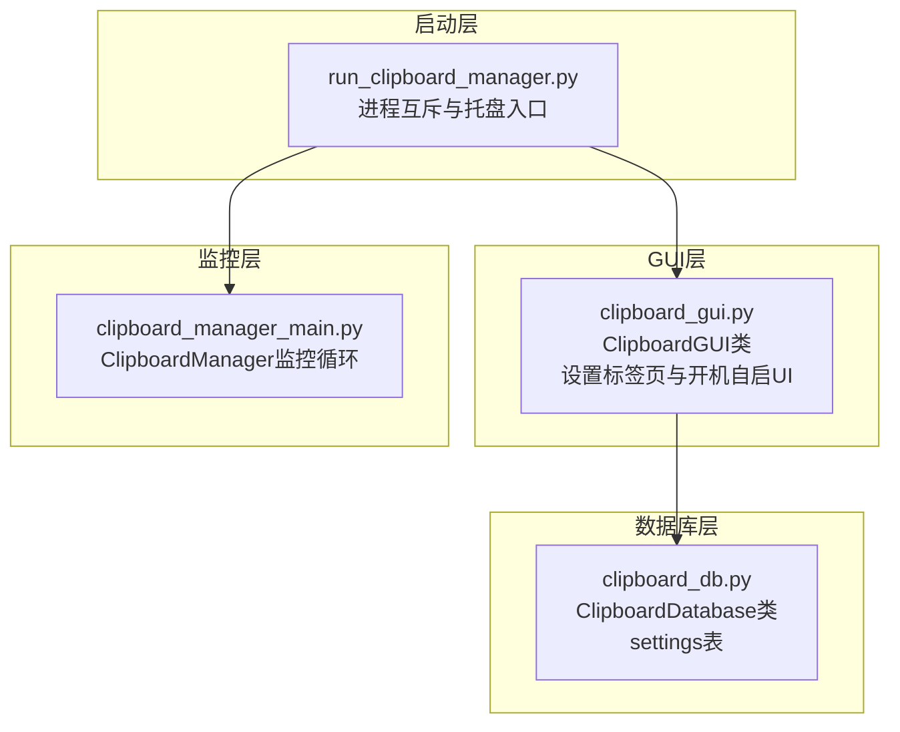
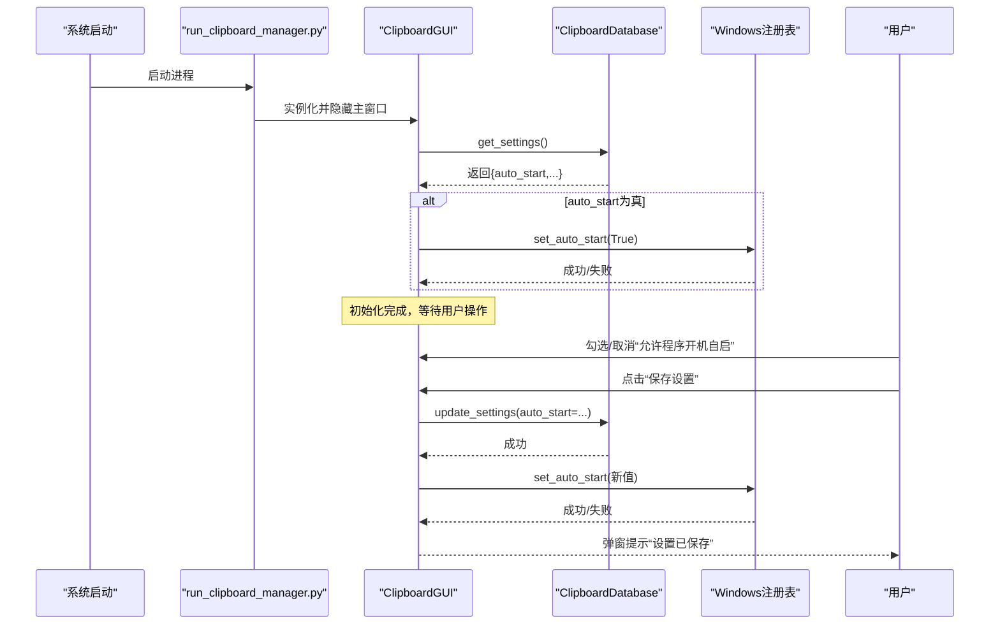
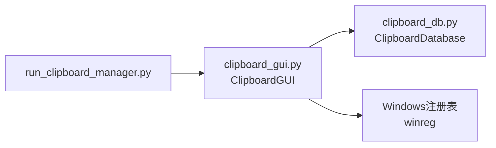

# 系统设置

<cite>
**本文引用的文件**
- [clipboard_gui.py](file://clipboard_gui.py)
- [clipboard_db.py](file://clipboard_db.py)
- [run_clipboard_manager.py](file://run_clipboard_manager.py)
- [clipboard_manager_main.py](file://clipboard_manager_main.py)
</cite>

## 目录
1. [简介](#简介)
2. [项目结构](#项目结构)
3. [核心组件](#核心组件)
4. [架构总览](#架构总览)
5. [详细组件分析](#详细组件分析)
6. [依赖关系分析](#依赖关系分析)
7. [性能考量](#性能考量)
8. [故障排查指南](#故障排查指南)
9. [结论](#结论)

## 简介
本文件聚焦“开机自启设置”的UI实现与系统功能集成逻辑，围绕tk.BooleanVar变量与复选框状态绑定、save_settings方法调用set_auto_start写入注册表、check_auto_start在初始化时读取数据库设置并同步界面状态等关键流程展开。同时结合代码示例路径，说明错误处理机制（如注册表访问失败）与用户反馈（messagebox提示）的设计。

## 项目结构
该项目采用“GUI + 数据库 + 主进程监控”的分层设计：
- GUI层负责用户交互与设置持久化，开机自启设置位于“设置”标签页。
- 数据库层提供设置项的读写，包含auto_start、float_icon、retention_days等字段。
- 启动层负责进程互斥与托盘显示，初始化时触发GUI并执行check_auto_start同步开机自启状态。

图表来源
- [run_clipboard_manager.py](file://run_clipboard_manager.py#L32-L70)
- [clipboard_gui.py](file://clipboard_gui.py#L329-L462)
- [clipboard_db.py](file://clipboard_db.py#L359-L412)
- [clipboard_manager_main.py](file://clipboard_manager_main.py#L731-L761)

章节来源
- [run_clipboard_manager.py](file://run_clipboard_manager.py#L32-L70)
- [clipboard_gui.py](file://clipboard_gui.py#L329-L462)
- [clipboard_db.py](file://clipboard_db.py#L359-L412)
- [clipboard_manager_main.py](file://clipboard_manager_main.py#L731-L761)

## 核心组件
- ClipboardGUI类：负责构建“设置”标签页，维护tk.BooleanVar变量，保存设置并调用set_auto_start写入注册表；在初始化时调用check_auto_start读取数据库设置并同步界面。
- ClipboardDatabase类：提供settings表的读写接口，包含auto_start、float_icon、retention_days等字段。
- run_clipboard_manager：启动入口，负责进程互斥、托盘图标与GUI实例化，初始化后触发GUI的check_auto_start。

章节来源
- [clipboard_gui.py](file://clipboard_gui.py#L329-L462)
- [clipboard_gui.py](file://clipboard_gui.py#L89-L97)
- [clipboard_gui.py](file://clipboard_gui.py#L1130-L1163)
- [clipboard_db.py](file://clipboard_db.py#L359-L412)
- [run_clipboard_manager.py](file://run_clipboard_manager.py#L32-L70)

## 架构总览
开机自启设置的端到端流程如下：
- GUI初始化：创建“设置”标签页，绑定tk.BooleanVar到“允许程序开机自启”复选框。
- 初始化同步：check_auto_start从数据库读取auto_start，若为真则调用set_auto_start(True)写入注册表。
- 用户修改：用户勾选/取消复选框后点击“保存设置”，save_settings更新数据库settings表，并再次调用set_auto_start写入注册表。
- 错误处理：注册表写入异常时打印错误日志；数值校验异常时弹出错误提示。

图表来源
- [run_clipboard_manager.py](file://run_clipboard_manager.py#L32-L70)
- [clipboard_gui.py](file://clipboard_gui.py#L89-L97)
- [clipboard_gui.py](file://clipboard_gui.py#L477-L533)
- [clipboard_gui.py](file://clipboard_gui.py#L1130-L1163)
- [clipboard_db.py](file://clipboard_db.py#L359-L412)

## 详细组件分析

### 开机自启UI与tk.BooleanVar绑定
- “设置”标签页中创建tk.BooleanVar变量并绑定到“允许程序开机自启”复选框，用于双向同步界面状态与内存变量。
- 初始加载时，load_settings_display从数据库读取settings并设置autostart_var的值，确保界面与数据库一致。
- 保存设置时，save_settings读取autostart_var的布尔值，调用update_settings写入数据库，随后立即调用set_auto_start写入注册表。

章节来源
- [clipboard_gui.py](file://clipboard_gui.py#L394-L413)
- [clipboard_gui.py](file://clipboard_gui.py#L439-L462)
- [clipboard_gui.py](file://clipboard_gui.py#L477-L533)

### 初始化同步：check_auto_start
- GUI构造函数在UI创建完成后调用check_auto_start。
- 该方法从数据库读取settings，若auto_start为真，则调用set_auto_start(True)写入注册表，从而实现开机自启状态的初始化同步。

章节来源
- [clipboard_gui.py](file://clipboard_gui.py#L89-L97)

### 写入注册表：set_auto_start
- set_auto_start根据enable参数决定写入或删除注册表项。
- 注册表路径为当前用户的“Run”项，键名为固定字符串，值为可执行文件路径（支持打包后的exe与开发环境脚本路径）。
- 异常捕获：注册表访问失败时打印错误日志；取消开机自启时若键值不存在，捕获FileNotFoundError并忽略。

章节来源
- [clipboard_gui.py](file://clipboard_gui.py#L1130-L1163)

### 保存设置流程：save_settings
- 保存设置时，先更新数据库settings表的auto_start字段，再调用set_auto_start写入注册表。
- 数值校验异常（如非数字输入）会弹出错误提示框；成功后弹出“设置已保存”。

章节来源
- [clipboard_gui.py](file://clipboard_gui.py#L477-L533)

### 错误处理与用户反馈
- 注册表访问失败：set_auto_start内部捕获异常并打印错误日志，避免中断流程。
- 数值校验失败：save_settings中对用户输入进行数值转换，失败时弹出错误提示框。
- 成功反馈：save_settings在成功后弹出“设置已保存”提示框。

章节来源
- [clipboard_gui.py](file://clipboard_gui.py#L1130-L1163)
- [clipboard_gui.py](file://clipboard_gui.py#L520-L533)

### 数据模型与字段演进
- settings表包含auto_start字段（默认值由数据库初始化逻辑决定），用于存储开机自启开关状态。
- 数据库初始化时会尝试添加auto_start字段（若不存在），保证向后兼容。

章节来源
- [clipboard_db.py](file://clipboard_db.py#L77-L111)
- [clipboard_db.py](file://clipboard_db.py#L359-L412)

## 依赖关系分析
- GUI依赖数据库层提供的settings读写接口，用于持久化开机自启状态。
- GUI依赖Windows注册表API（winreg）实现开机自启写入。
- 启动层负责进程互斥与托盘图标，初始化后触发GUI的check_auto_start，确保开机自启状态与数据库一致。

图表来源
- [clipboard_gui.py](file://clipboard_gui.py#L1130-L1163)
- [clipboard_db.py](file://clipboard_db.py#L359-L412)
- [run_clipboard_manager.py](file://run_clipboard_manager.py#L32-L70)

章节来源
- [clipboard_gui.py](file://clipboard_gui.py#L1130-L1163)
- [clipboard_db.py](file://clipboard_db.py#L359-L412)
- [run_clipboard_manager.py](file://run_clipboard_manager.py#L32-L70)

## 性能考量
- 注册表写入为轻量级操作，开销极低；建议在用户显式保存设置时触发，避免频繁写入。
- GUI初始化阶段仅进行一次数据库读取与一次注册表写入，开销可控。
- 若未来用户量增长，可考虑将注册表写入异步化或合并写入策略，但当前实现已足够简洁高效。

## 故障排查指南
- 注册表写入失败
  - 现象：控制台打印错误日志，开机自启未生效。
  - 排查：确认当前用户权限是否允许修改注册表；检查键名与路径是否正确；确认系统策略是否禁用了自启动。
  - 参考路径：[clipboard_gui.py](file://clipboard_gui.py#L1130-L1163)
- 数值输入无效
  - 现象：弹出“请输入有效的数字”错误提示。
  - 排查：检查用户输入是否为合法数字；确认未处于“无限模式”时才需要输入数值。
  - 参考路径：[clipboard_gui.py](file://clipboard_gui.py#L520-L533)
- 初始化未同步
  - 现象：开机自启状态与界面不一致。
  - 排查：确认数据库settings表中auto_start字段值；检查GUI初始化流程是否执行了check_auto_start。
  - 参考路径：[clipboard_gui.py](file://clipboard_gui.py#L89-L97)，[clipboard_db.py](file://clipboard_db.py#L359-L412)

章节来源
- [clipboard_gui.py](file://clipboard_gui.py#L89-L97)
- [clipboard_gui.py](file://clipboard_gui.py#L1130-L1163)
- [clipboard_gui.py](file://clipboard_gui.py#L520-L533)
- [clipboard_db.py](file://clipboard_db.py#L359-L412)

## 结论
本实现通过tk.BooleanVar与“允许程序开机自启”复选框的绑定，将用户界面状态与数据库settings表的auto_start字段关联。初始化时check_auto_start读取数据库并调用set_auto_start写入注册表，确保开机自启状态的一致性；用户保存设置时同样遵循“先写数据库，再写注册表”的顺序，并提供完善的错误处理与用户反馈。整体设计简洁可靠，易于维护与扩展。