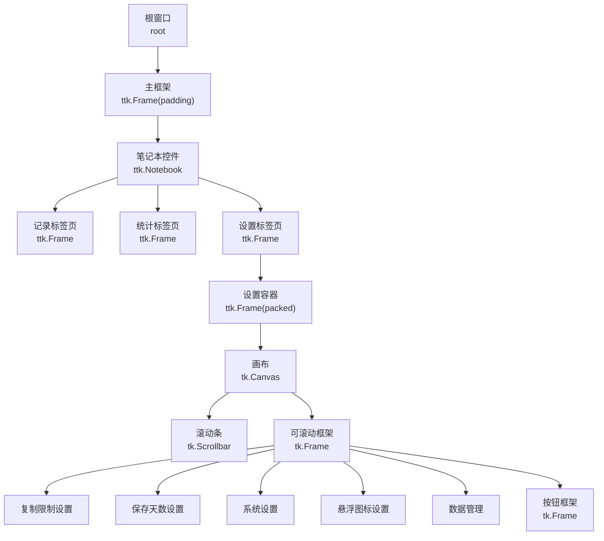
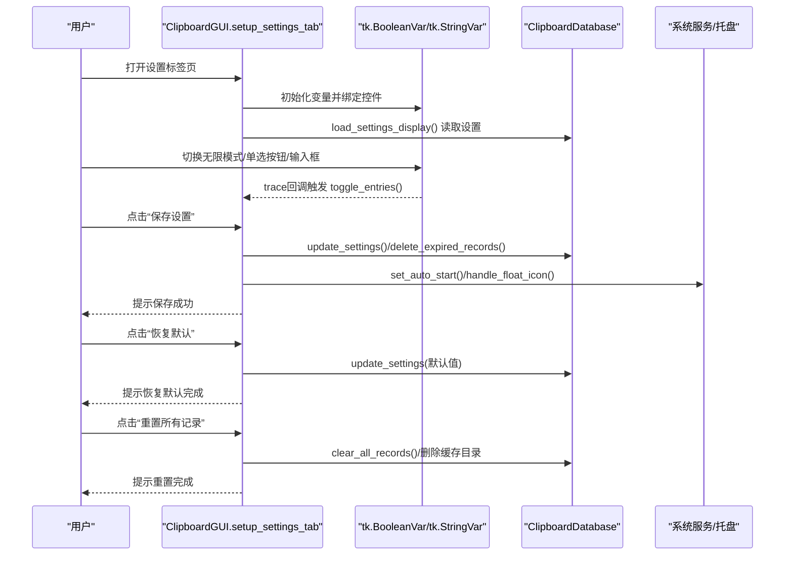
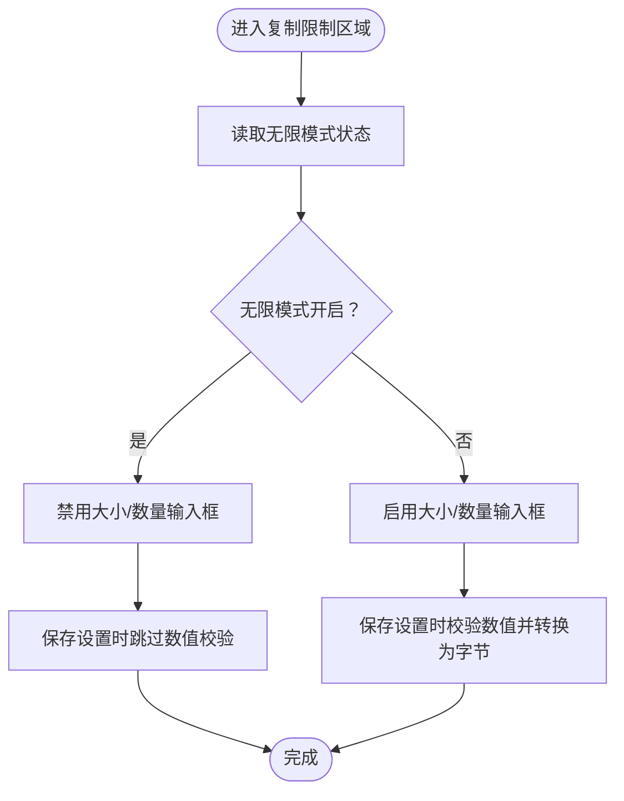
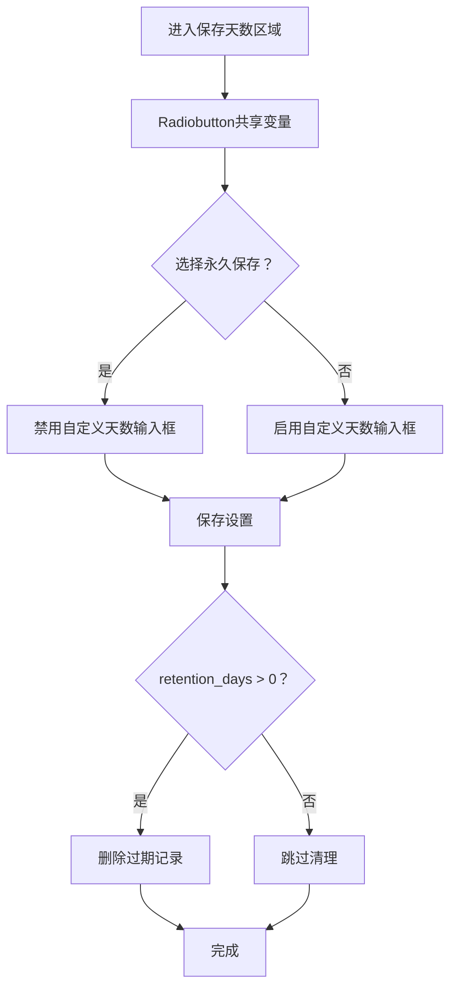
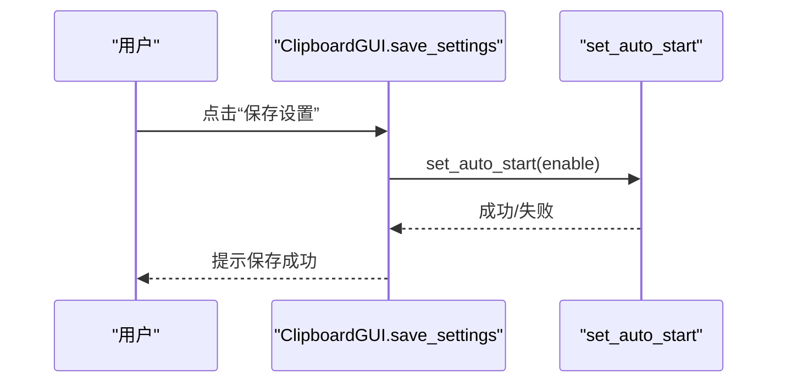
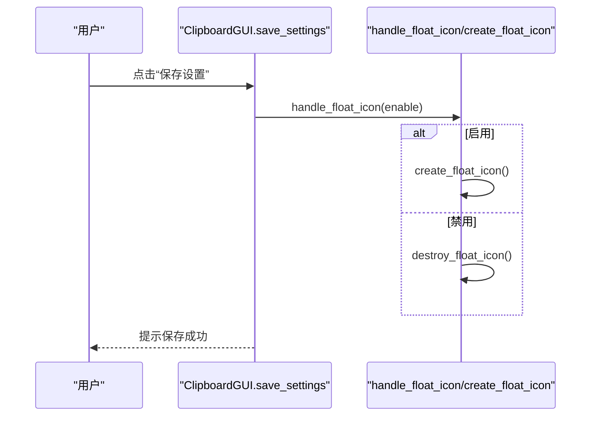
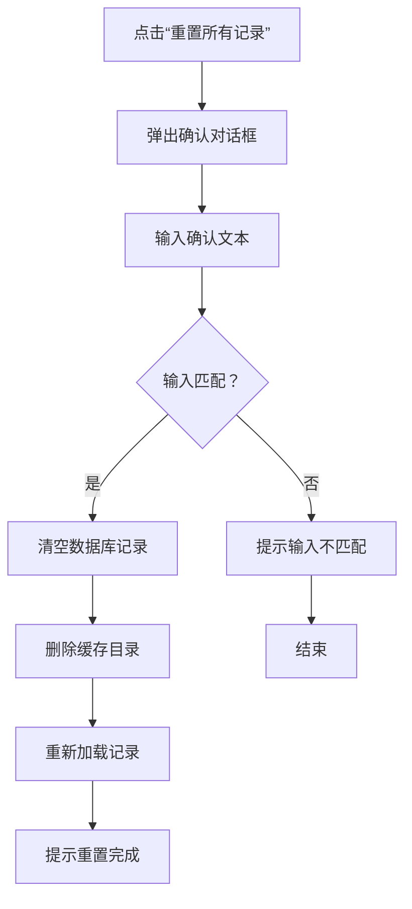
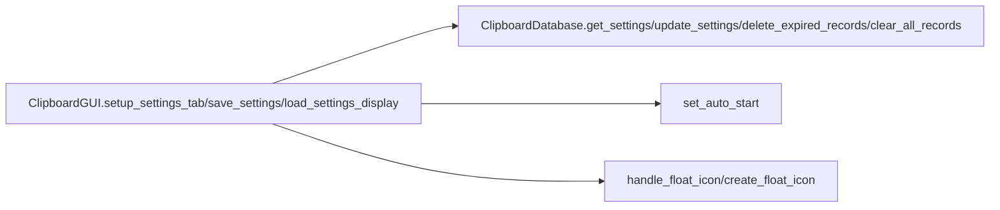

# 设置标签页界面

<cite>
**本文引用的文件**
- [clipboard_gui.py](file://clipboard_gui.py)
- [clipboard_db.py](file://clipboard_db.py)
</cite>

## 更新摘要
**已更改内容**
- 更新了设置标签页的布局结构，从基于ttk.LabelFrame的分组布局重构为基于tk.Canvas的可滚动布局。
- 将控件从ttk控件替换为tk控件，以获得更简洁的外观。
- 将最大复制大小和最大复制数量的设置合并到同一行显示。
- 添加了新的功能区域“剪贴板记录类型”和“悬浮图标透明度”。
- 更新了相关架构图和流程图以反映新的布局和交互逻辑。

## 目录
1. [简介](#简介)
2. [项目结构](#项目结构)
3. [核心组件](#核心组件)
4. [架构总览](#架构总览)
5. [详细组件分析](#详细组件分析)
6. [依赖关系分析](#依赖关系分析)
7. [性能考量](#性能考量)
8. [故障排查指南](#故障排查指南)
9. [结论](#结论)

## 简介
本文件系统化文档化“设置标签页”UI结构与交互实现，覆盖复制限制、保存天数、系统设置、悬浮图标、数据管理五大功能区域。重点说明：
- 基于tk.Canvas的可滚动布局策略
- tk控件替代ttk控件以获得更简洁的外观
- 最大复制大小和数量设置合并到同一行
- ttk.Radiobutton的单选逻辑与互斥控制
- tk.BooleanVar、tk.StringVar等变量类在表单控件中的数据绑定机制
- “永久保存”与“自定义天数”的互斥选择逻辑
- 无限模式对其他输入框的禁用/启用控制（toggle_entries方法）
- 保存、恢复默认、重置按钮的功能划分与事件绑定

## 项目结构
设置标签页位于GUI主界面的Notebook中，作为独立标签页呈现。其布局采用基于Canvas的可滚动布局，保证内容的可读性与可维护性。

**图表来源**
- [clipboard_gui.py](file://clipboard_gui.py#L316-L460)

**章节来源**
- [clipboard_gui.py](file://clipboard_gui.py#L316-L460)

## 核心组件
- 设置容器与主框架：设置标签页内部采用两层容器，外层填充并居中，内层使用Canvas和滚动条支持滚动。
- 可滚动布局：使用tk.Canvas和tk.Scrollbar实现可滚动布局，支持鼠标滚轮事件。
- 表单变量：通过tk.BooleanVar/tk.StringVar绑定复选框、单选按钮与输入框，实现双向数据绑定。
- 事件绑定：trace监听无限模式变化，触发输入框状态切换；Radiobutton通过variable/value实现互斥选择。
- 数据持久化：通过ClipboardDatabase的get_settings/update_settings/delete_expired_records等接口完成设置读写与清理。

**章节来源**
- [clipboard_gui.py](file://clipboard_gui.py#L316-L460)
- [clipboard_gui.py](file://clipboard_gui.py#L463-L496)
- [clipboard_gui.py](file://clipboard_gui.py#L498-L512)
- [clipboard_gui.py](file://clipboard_gui.py#L513-L580)
- [clipboard_gui.py](file://clipboard_gui.py#L582-L601)
- [clipboard_gui.py](file://clipboard_gui.py#L920-L978)
- [clipboard_db.py](file://clipboard_db.py#L444-L471)
- [clipboard_db.py](file://clipboard_db.py#L472-L496)

## 架构总览
设置标签页的控制流由“界面初始化 -> 事件绑定 -> 用户交互 -> 数据持久化/系统集成”构成。核心流程如下：

**图表来源**
- [clipboard_gui.py](file://clipboard_gui.py#L316-L460)
- [clipboard_gui.py](file://clipboard_gui.py#L463-L496)
- [clipboard_gui.py](file://clipboard_gui.py#L498-L512)
- [clipboard_gui.py](file://clipboard_gui.py#L513-L580)
- [clipboard_gui.py](file://clipboard_gui.py#L582-L601)
- [clipboard_gui.py](file://clipboard_gui.py#L920-L978)
- [clipboard_gui.py](file://clipboard_gui.py#L1194-L1201)
- [clipboard_db.py](file://clipboard_db.py#L444-L471)
- [clipboard_db.py](file://clipboard_db.py#L472-L496)

## 详细组件分析

### 复制限制区域（无限模式、最大复制大小、最大复制数量）
- 布局策略：使用tk.Canvas和tk.Scrollbar实现可滚动布局，将最大复制大小和最大复制数量设置合并到同一行。
- 控件与变量：
  - 无限模式：tk.Checkbutton + tk.BooleanVar，用于开启/关闭无限模式。
  - 最大复制大小：tk.Entry + tk.StringVar，单位为MB；当无限模式开启时禁用。
  - 最大复制数量：tk.Entry + tk.StringVar，单位为个；当无限模式开启时禁用。
- 互斥与联动：无限模式开启时，上述两个输入框统一禁用；关闭时恢复可用。
- 保存逻辑：非无限模式时校验数值有效性，转换为字节后写入数据库。

**图表来源**
- [clipboard_gui.py](file://clipboard_gui.py#L350-L377)

**章节来源**
- [clipboard_gui.py](file://clipboard_gui.py#L350-L377)

### 保存天数区域（永久保存 vs 自定义天数）
- 布局策略：使用tk.Label包裹“记录保存设置”，内部再分为“永久保存”和“自定义天数”两部分。
- 单选逻辑：tk.Radiobutton通过共享tk.StringVar实现互斥选择。
  - 永久保存：value="permanent"，对应retention_days=0。
  - 自定义天数：value="custom"，对应输入框days_entry，单位为天。
- 互斥控制：当选择“永久保存”时，自定义天数输入框禁用；选择“自定义天数”时，输入框启用。
- 过期清理：保存设置后，若设置为自定义天数，会调用数据库接口删除过期记录。

**图表来源**
- [clipboard_gui.py](file://clipboard_gui.py#L379-L397)

**章节来源**
- [clipboard_gui.py](file://clipboard_gui.py#L379-L397)

### 系统设置区域（开机自启）
- 控件与变量：tk.Checkbutton + tk.BooleanVar，用于控制是否允许程序开机自启。
- 系统集成：保存设置后调用set_auto_start，通过注册表实现开机自启/取消开机自启。
- 事件绑定：保存设置时统一更新数据库与系统服务。

**图表来源**
- [clipboard_gui.py](file://clipboard_gui.py#L412-L415)

**章节来源**
- [clipboard_gui.py](file://clipboard_gui.py#L412-L415)

### 悬浮图标区域（悬浮图标开关）
- 控件与变量：tk.Checkbutton + tk.BooleanVar，用于控制是否启用悬浮图标。
- 界面集成：保存设置后调用handle_float_icon，根据开关创建或销毁悬浮图标窗口。
- 功能说明：悬浮图标具备置顶、透明度、拖动、悬停显示面板、双击显示主窗口等行为。

**图表来源**
- [clipboard_gui.py](file://clipboard_gui.py#L417-L420)

**章节来源**
- [clipboard_gui.py](file://clipboard_gui.py#L417-L420)

### 数据管理区域（重置所有记录）
- 控件与变量：tk.Button + 独立弹窗确认流程。
- 安全机制：弹窗要求用户输入特定确认文本，防止误操作。
- 数据清理：调用数据库clear_all_records删除所有记录，并删除本地缓存目录clipboard_files。
- 事件绑定：reset_all_records方法负责弹窗、校验与清理流程。

**图表来源**
- [clipboard_gui.py](file://clipboard_gui.py#L439-L445)

**章节来源**
- [clipboard_gui.py](file://clipboard_gui.py#L439-L445)

## 依赖关系分析
- GUI层依赖数据库层：设置读取与写入均通过ClipboardDatabase接口完成。
- 事件耦合：无限模式与输入框状态耦合，通过trace触发toggle_entries；保存按钮与系统服务/托盘图标耦合。
- 外部依赖：Windows注册表（开机自启）、系统托盘图标（可选）。

**图表来源**
- [clipboard_gui.py](file://clipboard_gui.py#L316-L460)
- [clipboard_gui.py](file://clipboard_gui.py#L463-L496)
- [clipboard_gui.py](file://clipboard_gui.py#L498-L512)
- [clipboard_gui.py](file://clipboard_gui.py#L513-L580)
- [clipboard_gui.py](file://clipboard_gui.py#L582-L601)
- [clipboard_gui.py](file://clipboard_gui.py#L920-L978)
- [clipboard_gui.py](file://clipboard_gui.py#L1194-L1201)
- [clipboard_db.py](file://clipboard_db.py#L444-L471)
- [clipboard_db.py](file://clipboard_db.py#L472-L496)

**章节来源**
- [clipboard_gui.py](file://clipboard_gui.py#L316-L460)
- [clipboard_gui.py](file://clipboard_gui.py#L463-L496)
- [clipboard_gui.py](file://clipboard_gui.py#L498-L512)
- [clipboard_gui.py](file://clipboard_gui.py#L513-L580)
- [clipboard_gui.py](file://clipboard_gui.py#L582-L601)
- [clipboard_gui.py](file://clipboard_gui.py#L920-L978)
- [clipboard_gui.py](file://clipboard_gui.py#L1194-L1201)
- [clipboard_db.py](file://clipboard_db.py#L444-L471)
- [clipboard_db.py](file://clipboard_db.py#L472-L496)

## 性能考量
- 界面渲染：设置标签页采用Canvas + Scrollbar的组合布局，支持滚动，有利于长内容的显示与响应。
- 事件监听：trace监听仅在无限模式切换时触发，开销极小。
- 数据库操作：保存设置时批量更新settings表，删除过期记录时一次性执行SQL并删除文件，避免频繁IO。
- 系统服务：注册表写入与托盘图标创建/销毁均为轻量级操作，注意异常捕获与降级处理。

## 故障排查指南
- 数值输入异常
  - 现象：保存时报错“请输入有效的数字”。
  - 原因：非无限模式下，最大复制大小/数量未通过数值校验。
  - 处理：确保输入为有效数字，单位正确。
- 保存天数无效
  - 现象：选择“永久保存”后仍提示过期清理。
  - 原因：retention_days=0时不清理过期记录。
  - 处理：确认Radiobutton互斥逻辑正常，或检查数据库写入。
- 开机自启未生效
  - 现象：勾选开机自启后重启未启动。
  - 原因：注册表权限不足或路径获取异常。
  - 处理：以管理员权限运行，检查set_auto_start的异常日志。
- 悬浮图标无法显示
  - 现象：启用后无悬浮图标。
  - 原因：图片加载失败或托盘图标不可用。
  - 处理：检查资源路径与Pillow/pystray安装情况，或使用默认背景与文本。

**章节来源**
- [clipboard_gui.py](file://clipboard_gui.py#L579-L580)
- [clipboard_gui.py](file://clipboard_gui.py#L1194-L1201)

## 结论
设置标签页通过基于Canvas的可滚动布局和tk控件，实现了更简洁的外观和更好的用户体验。复制限制、保存天数、系统设置、悬浮图标与数据管理的完整配置闭环得以保持。无限模式与单选按钮的互斥控制逻辑明确，toggle_entries方法有效保障了输入框状态的一致性。结合数据库与系统服务的协同，整体用户体验良好且具备安全保护（如重置确认）。