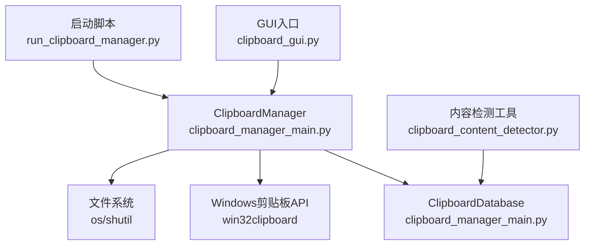
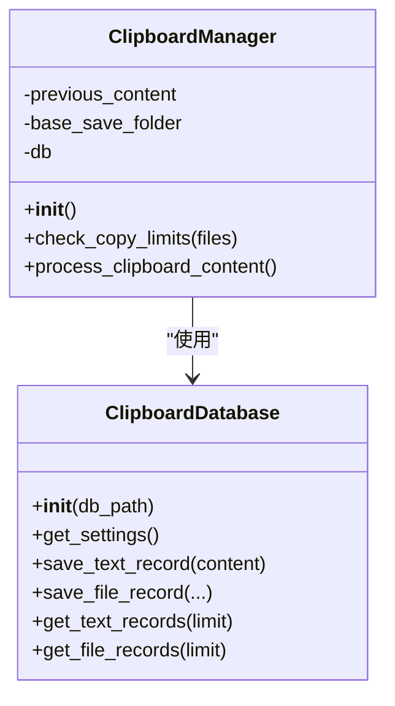

# ClipboardManager类

<cite>
**本文引用的文件**
- [clipboard_manager_main.py](file://clipboard_manager_main.py)
- [clipboard_db.py](file://clipboard_db.py)
- [clipboard_content_detector.py](file://clipboard_content_detector.py)
- [run_clipboard_manager.py](file://run_clipboard_manager.py)
</cite>

## 目录
1. [简介](#简介)
2. [项目结构](#项目结构)
3. [核心组件](#核心组件)
4. [架构概览](#架构概览)
5. [详细组件分析](#详细组件分析)
6. [依赖关系分析](#依赖关系分析)
7. [性能考量](#性能考量)
8. [故障排查指南](#故障排查指南)
9. [结论](#结论)
10. [附录](#附录)

## 简介
ClipboardManager类负责监控Windows剪贴板变化，识别其中的文本与文件内容，并根据配置规则进行限制检查、去重与持久化。它通过内部的数据库实例保存文本与文件记录，支持文件按类型分类存储与MD5去重，同时维护“上一次内容键”以避免重复处理相同剪贴板内容。该类设计为单线程使用，多线程环境需由外部调用方自行同步。

## 项目结构
- 主要实现位于clipboard_manager_main.py，包含ClipboardManager、ClipboardDatabase以及GUI与监控入口。
- 数据库层独立于主模块，便于后续扩展与测试。
- clipboard_content_detector.py提供独立的剪贴板内容检测与限制检查工具，可作为参考或在其他场景复用。
- run_clipboard_manager.py提供系统托盘与GUI集成的启动脚本。



图表来源
- [clipboard_manager_main.py](file://clipboard_manager_main.py#L355-L496)
- [clipboard_db.py](file://clipboard_db.py#L13-L115)
- [clipboard_content_detector.py](file://clipboard_content_detector.py#L1-L274)
- [run_clipboard_manager.py](file://run_clipboard_manager.py#L1-L71)

章节来源
- [clipboard_manager_main.py](file://clipboard_manager_main.py#L1-L120)
- [clipboard_db.py](file://clipboard_db.py#L1-L120)
- [clipboard_content_detector.py](file://clipboard_content_detector.py#L1-L120)
- [run_clipboard_manager.py](file://run_clipboard_manager.py#L1-L71)

## 核心组件
- ClipboardManager：剪贴板监控与处理的核心类，负责初始化数据库、限制检查、内容识别、MD5计算、文件复制与数据库保存、去重与“上一次内容键”管理。
- ClipboardDatabase：数据库抽象，封装SQLite表结构、记录增删改查、设置读写、统计与过期清理等。
- ClipboardContentDetector：独立的内容检测与限制检查工具，提供格式枚举、内容提取、限制检查与格式化输出等能力。
- 启动与GUI：run_clipboard_manager.py提供系统托盘与GUI入口，内部通过线程运行监控循环。

章节来源
- [clipboard_manager_main.py](file://clipboard_manager_main.py#L355-L496)
- [clipboard_db.py](file://clipboard_db.py#L13-L115)
- [clipboard_content_detector.py](file://clipboard_content_detector.py#L1-L120)
- [run_clipboard_manager.py](file://run_clipboard_manager.py#L1-L71)

## 架构概览
ClipboardManager在每次循环中打开剪贴板，检测内容类型（文件列表或文本），根据设置检查数量与大小限制，计算文件MD5，构建目标保存路径并复制文件，最后将记录写入数据库。期间通过previous_content键避免重复处理相同内容。

```mermaid
sequenceDiagram
participant Loop as "监控循环<br/>monitor_clipboard_loop"
participant Manager as "ClipboardManager"
participant Win as "Windows剪贴板API"
participant DB as "ClipboardDatabase"
participant FS as "文件系统"
Loop->>Manager : 调用process_clipboard_content()
Manager->>Win : OpenClipboard()
alt 检测到文件列表
Manager->>Win : IsClipboardFormatAvailable(CF_HDROP)
Manager->>Win : GetClipboardData(CF_HDROP)
Manager->>Manager : check_copy_limits(files)
alt 允许
Manager->>Manager : 计算MD5/构建保存路径/复制文件
Manager->>FS : 复制文件
Manager->>DB : save_file_record(...)
DB-->>Manager : 返回记录ID
else 不允许
Manager-->>Loop : 打印限制原因并返回
end
else 检测到文本
Manager->>Win : IsClipboardFormatAvailable(CF_UNICODETEXT)
Manager->>Win : GetClipboardData(CF_UNICODETEXT)
Manager->>Manager : 检查文本大小限制
alt 允许
Manager->>DB : save_text_record(text)
DB-->>Manager : 返回记录ID
else 不允许
Manager-->>Loop : 打印限制原因并返回
end
end
Manager->>Win : CloseClipboard()
Manager->>Manager : 更新previous_content
```

图表来源
- [clipboard_manager_main.py](file://clipboard_manager_main.py#L395-L496)
- [clipboard_manager_main.py](file://clipboard_manager_main.py#L355-L361)

## 详细组件分析

### ClipboardManager.__init__
- 初始化数据库实例：创建ClipboardDatabase对象，用于后续的记录与设置读写。
- 初始化previous_content：用于记录上次处理的内容键，避免重复处理。
- 初始化base_save_folder：默认值为"clipboard_files"，并在首次使用前创建目录。

章节来源
- [clipboard_manager_main.py](file://clipboard_manager_main.py#L355-L361)

### ClipboardManager.check_copy_limits
- 功能：根据设置检查一次复制的文件数量与总大小限制，支持无限模式。
- 输入：files（文件路径列表）。
- 流程：
  - 读取设置：从数据库获取max_copy_count、max_copy_size、unlimited_mode。
  - 无限模式：若开启则直接返回允许。
  - 数量检查：若文件数量超过max_copy_count，返回不允许与错误消息。
  - 单文件大小检查：遍历每个文件，若单个文件大小超过max_copy_size，返回不允许与错误消息。
  - 总大小检查：累加总大小，若超过max_copy_size，返回不允许与错误消息。
  - 允许：返回True与空消息。
- 返回值：(bool, str)，第一个元素表示是否允许，第二个元素为错误消息（允许时为空字符串）。
- 错误消息生成：包含具体文件名、实际大小与限制大小的格式化信息。

章节来源
- [clipboard_manager_main.py](file://clipboard_manager_main.py#L362-L394)
- [clipboard_db.py](file://clipboard_db.py#L359-L386)

### ClipboardManager.process_clipboard_content
- 功能：处理当前剪贴板内容，包括文件与文本两类。
- 打开剪贴板：使用win32clipboard.OpenClipboard()。
- 文件内容检测：
  - 判断CF_HDROP格式是否存在。
  - 读取文件列表，调用check_copy_limits进行限制检查。
  - 若允许：
    - 生成current_content_key（基于文件路径排序的字符串）。
    - 若与previous_content不同则继续处理。
    - 对每个文件：
      - 计算MD5（失败则跳过该文件）。
      - 获取文件信息（名称、大小、类型）。
      - 构建保存路径（按类型与日期分层，避免覆盖）。
      - 复制文件至目标路径（若不存在）。
      - 保存文件记录到数据库，返回记录ID并打印日志。
    - 更新previous_content。
  - 异常处理：读取文件列表时捕获异常并打印。
- 文本内容检测：
  - 判断CF_UNICODETEXT格式是否存在。
  - 读取文本内容，去除空白后判断非空。
  - 生成current_content_key（基于文本哈希）。
  - 若与previous_content不同则继续处理。
  - 检查文本大小限制（一般不会超限）。
  - 保存文本记录到数据库，返回记录ID并打印日志。
  - 更新previous_content。
  - 异常处理：读取文本时捕获异常并打印。
- 关闭剪贴板：无论成功与否，最终都会尝试CloseClipboard()。
- 错误处理：对OpenClipboard失败以外的异常进行捕获与打印。

章节来源
- [clipboard_manager_main.py](file://clipboard_manager_main.py#L395-L496)

### previous_content属性
- 作用：记录上次处理的“内容键”，用于去重判断，避免重复保存相同内容。
- 内容键生成策略：
  - 文件：以"files:"开头，后接分号分隔的排序后的文件路径字符串。
  - 文本：以"text:"开头，后接文本内容的哈希值（整数形式）。
- 当内容键未变化时，process_clipboard_content会直接返回，不进行重复处理。

章节来源
- [clipboard_manager_main.py](file://clipboard_manager_main.py#L406-L483)

### base_save_folder属性
- 默认值：字符串"clipboard_files"。
- 创建逻辑：在__init__中调用os.makedirs(base_save_folder, exist_ok=True)，确保目录存在。
- 文件保存路径组织：按文件类型与日期分层，例如"clipboard_files/images/2025-01-01/..."，并在文件名中追加MD5前缀以避免冲突。

章节来源
- [clipboard_manager_main.py](file://clipboard_manager_main.py#L355-L361)
- [clipboard_manager_main.py](file://clipboard_manager_main.py#L411-L456)

### 方法调用时序图（从剪贴板监控到数据保存）
```mermaid
sequenceDiagram
participant User as "用户"
participant Loop as "监控循环"
participant Manager as "ClipboardManager"
participant Win as "剪贴板API"
participant DB as "数据库"
User->>Loop : 触发一次检查
Loop->>Manager : process_clipboard_content()
Manager->>Win : OpenClipboard()
alt 存在文件列表
Manager->>Win : IsClipboardFormatAvailable(CF_HDROP)
Manager->>Win : GetClipboardData(CF_HDROP)
Manager->>Manager : check_copy_limits(files)
alt 允许
loop 遍历每个文件
Manager->>Manager : 计算MD5
Manager->>Manager : 构建保存路径
Manager->>Manager : 复制文件
Manager->>DB : save_file_record(...)
end
else 不允许
Manager-->>Loop : 打印限制原因
end
else 存在文本
Manager->>Win : IsClipboardFormatAvailable(CF_UNICODETEXT)
Manager->>Win : GetClipboardData(CF_UNICODETEXT)
Manager->>Manager : 检查文本大小限制
alt 允许
Manager->>DB : save_text_record(text)
else 不允许
Manager-->>Loop : 打印限制原因
end
end
Manager->>Win : CloseClipboard()
Manager->>Manager : 更新previous_content
```

图表来源
- [clipboard_manager_main.py](file://clipboard_manager_main.py#L395-L496)

## 依赖关系分析
- ClipboardManager依赖ClipboardDatabase进行设置与记录的读写。
- ClipboardManager依赖win32clipboard与win32con进行剪贴板格式检测与数据读取。
- ClipboardManager依赖os与shutil进行文件复制与目录创建。
- ClipboardContentDetector提供独立的限制检查与内容检测能力，其check_copy_limits与format_file_size与ClipboardManager的限制检查逻辑一致，可用于外部脚本或独立工具。



图表来源
- [clipboard_manager_main.py](file://clipboard_manager_main.py#L355-L496)
- [clipboard_db.py](file://clipboard_db.py#L13-L115)

章节来源
- [clipboard_manager_main.py](file://clipboard_manager_main.py#L355-L496)
- [clipboard_db.py](file://clipboard_db.py#L13-L115)
- [clipboard_content_detector.py](file://clipboard_content_detector.py#L143-L180)

## 性能考量
- 限制检查：在文件列表较大时，遍历计算MD5与获取文件大小可能成为瓶颈。建议：
  - 控制max_copy_count与max_copy_size，避免一次性处理过多文件。
  - 在GUI中提供无限模式开关，必要时启用以减少检查成本。
- 文件复制：复制大文件耗时较长，建议：
  - 合理设置保存目录所在磁盘空间与IO性能。
  - 避免在同一时刻大量并发复制。
- 数据库写入：频繁插入与更新可能产生写放大，建议：
  - 合理控制监控频率（默认1秒）。
  - 使用数据库事务批量提交（当前实现逐条提交，可在业务侧优化）。
- 去重：通过MD5与previous_content键避免重复处理，减少无效工作。

[本节为通用指导，不直接分析具体文件]

## 故障排查指南
- 剪贴板访问失败：
  - 现象：process_clipboard_content捕获异常并打印错误信息。
  - 排查：确认OpenClipboard是否被其他进程占用；确保运行环境具备win32clipboard权限。
- 文件复制失败：
  - 现象：计算MD5成功但复制失败时会跳过该文件并打印错误。
  - 排查：检查目标路径权限、磁盘空间、文件名合法性。
- 限制检查触发：
  - 现象：当文件数量或大小超过限制时，打印限制原因并跳过保存。
  - 排查：调整设置中的max_copy_count与max_copy_size，或启用无限模式。
- 数据库异常：
  - 现象：数据库连接或SQL执行异常时会抛出异常并打印。
  - 排查：检查数据库文件完整性与权限，确认SQLite版本兼容性。

章节来源
- [clipboard_manager_main.py](file://clipboard_manager_main.py#L488-L496)
- [clipboard_manager_main.py](file://clipboard_manager_main.py#L411-L456)
- [clipboard_manager_main.py](file://clipboard_manager_main.py#L362-L394)

## 结论
ClipboardManager提供了简洁而实用的剪贴板监控与持久化能力，结合限制检查、MD5去重与分类存储，能够有效管理文本与文件的历史记录。其设计强调易用性与可扩展性，适合在桌面环境中长期运行。多线程环境下需外部同步，避免竞态条件。

[本节为总结，不直接分析具体文件]

## 附录

### 使用示例（外部脚本）
- 实例化与使用：
  - 在外部脚本中导入ClipboardManager并创建实例。
  - 调用process_clipboard_content()进行一次处理。
  - 或通过monitor_clipboard_loop(manager, interval)在循环中持续监控。
- 示例路径：
  - 实例化与监控循环：[clipboard_manager_main.py](file://clipboard_manager_main.py#L717-L730)
  - 直接调用处理方法：[clipboard_manager_main.py](file://clipboard_manager_main.py#L395-L496)

章节来源
- [clipboard_manager_main.py](file://clipboard_manager_main.py#L717-L730)
- [clipboard_manager_main.py](file://clipboard_manager_main.py#L395-L496)

### 线程安全注意事项
- 设计说明：ClipboardManager未内置线程锁，建议在多线程环境中由调用方自行加锁，确保同一时间只有一个线程调用process_clipboard_content()。
- GUI与监控线程：run_clipboard_manager.py通过守护线程运行监控循环，GUI主线程负责界面交互，二者应避免同时修改共享状态。

章节来源
- [run_clipboard_manager.py](file://run_clipboard_manager.py#L32-L69)
- [clipboard_manager_main.py](file://clipboard_manager_main.py#L717-L730)

### 错误处理策略
- 剪贴板访问失败：捕获异常并打印，避免中断流程。
- 文件读取/复制失败：跳过该文件并打印错误，继续处理其他文件。
- 限制检查失败：打印限制原因并返回，不保存。
- 数据库异常：捕获并打印，保持系统稳定。

章节来源
- [clipboard_manager_main.py](file://clipboard_manager_main.py#L488-L496)
- [clipboard_manager_main.py](file://clipboard_manager_main.py#L411-L456)
- [clipboard_manager_main.py](file://clipboard_manager_main.py#L362-L394)