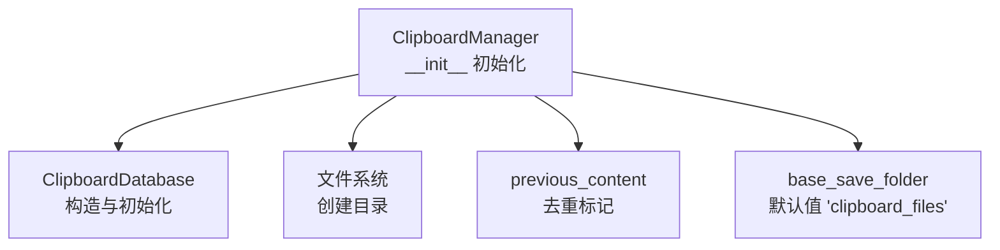
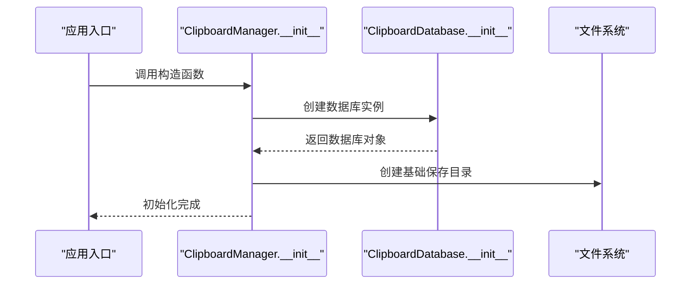
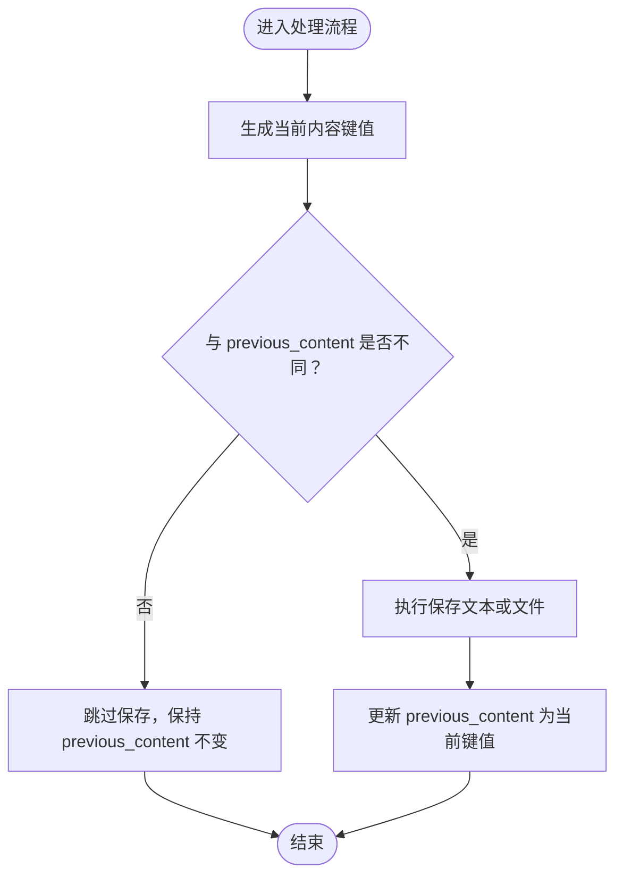
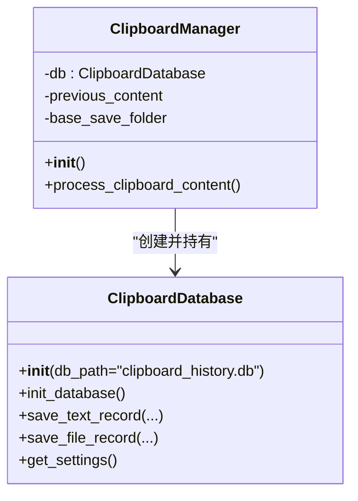

# __init__方法

<cite>
**本文引用的文件**
- [clipboard_manager_main.py](file://clipboard_manager_main.py)
- [clipboard_db.py](file://clipboard_db.py)
</cite>

## 目录
1. [简介](#简介)
2. [项目结构](#项目结构)
3. [核心组件](#核心组件)
4. [架构总览](#架构总览)
5. [详细组件分析](#详细组件分析)
6. [依赖关系分析](#依赖关系分析)
7. [性能考虑](#性能考虑)
8. [故障排查指南](#故障排查指南)
9. [结论](#结论)

## 简介
本节聚焦于 ClipboardManager 类的 __init__ 方法的初始化流程，详细说明以下关键点：
- 如何创建 ClipboardDatabase 实例并赋值给 self.db 属性
- base_save_folder 属性的默认值设置为 'clipboard_files'，以及如何通过 os.makedirs 创建该目录（若不存在）
- previous_content 属性初始化为 None 的作用：用于存储上一次剪贴板内容的键值，避免重复保存相同内容
- 该方法不接受外部参数，所有配置均通过数据库设置表管理

## 项目结构
与 __init__ 方法直接相关的核心文件包括：
- clipboard_manager_main.py：包含 ClipboardManager 类及其 __init__、process_clipboard_content 等方法
- clipboard_db.py：包含 ClipboardDatabase 类及其构造与数据库初始化逻辑

图表来源
- [clipboard_manager_main.py](file://clipboard_manager_main.py#L355-L361)
- [clipboard_db.py](file://clipboard_db.py#L13-L20)

章节来源
- [clipboard_manager_main.py](file://clipboard_manager_main.py#L355-L361)
- [clipboard_db.py](file://clipboard_db.py#L13-L20)

## 核心组件
- ClipboardManager.__init__：完成数据库连接对象的创建、基础保存目录的准备、去重标记的初始化
- ClipboardDatabase.__init__：负责数据库文件路径与初始化流程的封装
- 文件系统操作：使用 os.makedirs 创建基础保存目录

章节来源
- [clipboard_manager_main.py](file://clipboard_manager_main.py#L355-L361)
- [clipboard_db.py](file://clipboard_db.py#L13-L20)

## 架构总览
ClipboardManager 的初始化属于应用启动阶段的一部分，其职责是：
- 保证数据库可用（通过 ClipboardDatabase）
- 准备文件落盘的基础目录
- 为后续的剪贴板内容处理提供状态标记（previous_content）

图表来源
- [clipboard_manager_main.py](file://clipboard_manager_main.py#L355-L361)
- [clipboard_db.py](file://clipboard_db.py#L13-L20)

## 详细组件分析

### ClipboardManager.__init__ 初始化流程
- 创建数据库实例：self.db = ClipboardDatabase()
  - 该步骤委托 ClipboardDatabase 完成数据库文件路径与初始化工作
- 初始化去重标记：self.previous_content = None
  - 用于记录上一次剪贴板内容的“键值”，在后续处理中用于判断是否重复保存
- 设置基础保存目录：self.base_save_folder = "clipboard_files"
  - 通过 os.makedirs(self.base_save_folder, exist_ok=True) 确保目录存在
  - 若目录不存在则创建；若已存在则跳过，避免异常

上述三步构成了 __init__ 的全部初始化逻辑，且不接受任何外部参数，所有配置均由数据库设置表提供。

章节来源
- [clipboard_manager_main.py](file://clipboard_manager_main.py#L355-L361)

### ClipboardDatabase 初始化（间接影响）
- ClipboardDatabase.__init__ 接受可选参数 db_path（默认 "clipboard_history.db"），随后调用 init_database 完成数据库表结构的创建与默认设置的插入
- 该初始化确保后续通过 self.db.save_text_record/save_file_record 等方法能正常工作

章节来源
- [clipboard_db.py](file://clipboard_db.py#L13-L20)

### previous_content 的作用与后续使用
- 初始化为 None，表示尚未有“上一次内容”的参考
- 在 process_clipboard_content 中，会基于当前内容生成一个“键值”（例如文件列表或文本哈希），并与 previous_content 比较
- 若不同，则执行保存逻辑，并将 previous_content 更新为当前键值，从而避免重复保存相同内容

图表来源
- [clipboard_manager_main.py](file://clipboard_manager_main.py#L412-L414)
- [clipboard_manager_main.py](file://clipboard_manager_main.py#L467-L469)

章节来源
- [clipboard_manager_main.py](file://clipboard_manager_main.py#L412-L414)
- [clipboard_manager_main.py](file://clipboard_manager_main.py#L467-L469)

### base_save_folder 与目录创建
- 默认值为 'clipboard_files'
- 通过 os.makedirs(self.base_save_folder, exist_ok=True) 确保目录存在
- 后续文件保存时会在此基础上按“类型/日期”子目录组织文件，便于管理与检索

章节来源
- [clipboard_manager_main.py](file://clipboard_manager_main.py#L359-L360)
- [clipboard_manager_main.py](file://clipboard_manager_main.py#L431-L433)

### 配置管理（不接受外部参数）
- __init__ 不接收外部参数，所有配置均来自数据库设置表
- 例如复制限制（最大数量、大小）、是否无限模式等，均由 self.db.get_settings() 提供
- 这些设置在后续的内容处理中被读取并用于决策（如是否允许保存、是否跳过）

章节来源
- [clipboard_manager_main.py](file://clipboard_manager_main.py#L362-L394)
- [clipboard_manager_main.py](file://clipboard_manager_main.py#L471-L477)

## 依赖关系分析
- ClipboardManager.__init__ 依赖 ClipboardDatabase 的构造与初始化
- ClipboardManager.__init__ 依赖 os 模块进行目录创建
- ClipboardManager.__init__ 为后续 process_clipboard_content 的去重逻辑提供基础状态

图表来源
- [clipboard_manager_main.py](file://clipboard_manager_main.py#L355-L361)
- [clipboard_db.py](file://clipboard_db.py#L13-L20)

章节来源
- [clipboard_manager_main.py](file://clipboard_manager_main.py#L355-L361)
- [clipboard_db.py](file://clipboard_db.py#L13-L20)

## 性能考虑
- 目录创建使用 exist_ok=True，避免重复 IO 操作
- previous_content 的字符串比较成本低，适合高频检测
- 数据库初始化在 __init__ 中完成，避免后续每次操作都进行初始化开销

## 故障排查指南
- 目录无法创建
  - 检查权限与磁盘空间
  - 确认路径未被占用或非法字符
- 数据库初始化失败
  - 检查数据库文件路径与权限
  - 确认 SQLite 可用且版本兼容
- 去重失效
  - 确认 previous_content 在每次保存后正确更新
  - 检查生成键值的规则是否一致（文件列表排序、文本哈希策略）

## 结论
ClipboardManager.__init__ 方法以最小化参数的方式完成初始化：创建数据库实例、准备基础保存目录、初始化去重标记。该设计使得配置完全由数据库设置表驱动，简化了部署与维护。后续的剪贴板内容处理流程依赖这些初始化状态，确保高效、稳定地保存历史记录并避免重复保存。