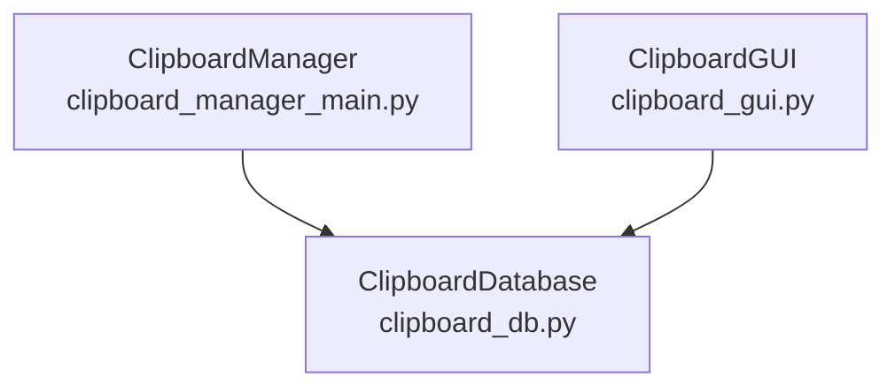
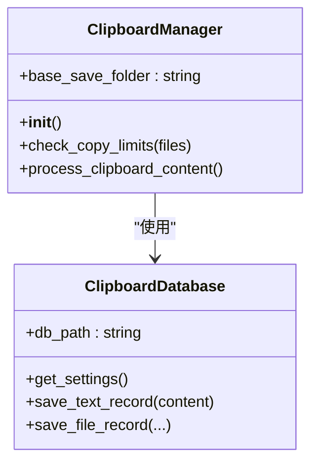
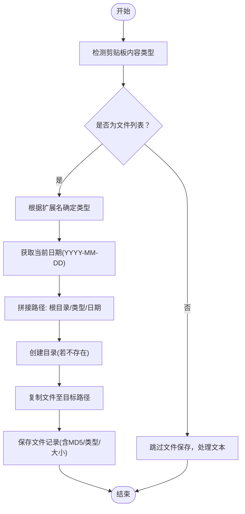
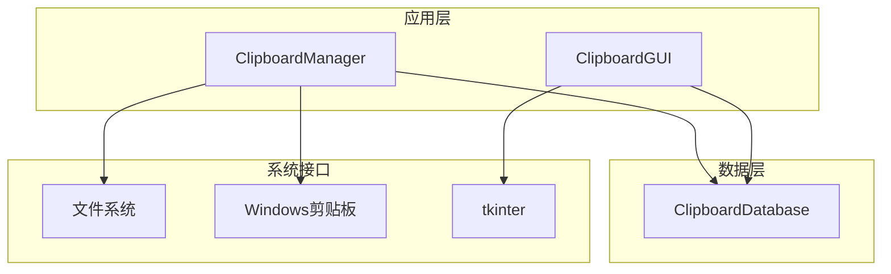

# base_save_folder属性

<cite>
**本文引用的文件**
- [clipboard_manager_main.py](file://clipboard_manager_main.py)
- [clipboard_db.py](file://clipboard_db.py)
- [clipboard_gui.py](file://clipboard_gui.py)
</cite>

## 目录
1. [简介](#简介)
2. [项目结构](#项目结构)
3. [核心组件](#核心组件)
4. [架构总览](#架构总览)
5. [详细组件分析](#详细组件分析)
6. [依赖关系分析](#依赖关系分析)
7. [性能考量](#性能考量)
8. [故障排查指南](#故障排查指南)
9. [结论](#结论)
10. [附录](#附录)

## 简介
本文件围绕“base_save_folder”属性进行深入文档化，重点说明其默认值为“clipboard_files”，作为所有剪贴板文件的根保存目录；解释在构造函数中通过确保目录存在的机制；阐述在处理剪贴板内容时如何结合文件类型与日期构建最终保存路径；并提供自定义路径的建议与目录结构设计对检索效率的影响分析，最后强调该属性在未来支持多用户或多设备同步场景下的可扩展性。

## 项目结构
- 本仓库包含多个模块，其中与“base_save_folder”直接相关的核心文件为：
  - clipboard_manager_main.py：定义剪贴板管理器类，包含属性与处理逻辑
  - clipboard_db.py：数据库初始化与设置项管理
  - clipboard_gui.py：图形界面与设置项展示（含开机自启、悬浮图标等）



图表来源
- [clipboard_manager_main.py](file://clipboard_manager_main.py#L355-L365)
- [clipboard_db.py](file://clipboard_db.py#L1-L120)
- [clipboard_gui.py](file://clipboard_gui.py#L1-L120)

章节来源
- [clipboard_manager_main.py](file://clipboard_manager_main.py#L355-L365)
- [clipboard_db.py](file://clipboard_db.py#L1-L120)
- [clipboard_gui.py](file://clipboard_gui.py#L1-L120)

## 核心组件
- base_save_folder属性
  - 默认值：字符串“clipboard_files”
  - 作用：作为所有剪贴板文件的根保存目录
  - 初始化：在构造函数中创建该目录，确保后续写入可用
- 目录结构设计
  - 保存路径由三部分组成：根目录 + 文件类型子目录 + 日期子目录（YYYY-MM-DD）
  - 例如：clipboard_files/images/2025-04-05/
- 文件命名策略
  - 采用“原始文件名 + _ + MD5前缀 + 扩展名”的方式避免同名冲突

章节来源
- [clipboard_manager_main.py](file://clipboard_manager_main.py#L355-L365)
- [clipboard_manager_main.py](file://clipboard_manager_main.py#L429-L444)

## 架构总览
- 剪贴板监控流程
  - 监控循环周期性调用处理方法
  - 识别剪贴板内容类型（文件/文本）
  - 对文件进行去重、分类、落盘与入库
- 关键交互
  - ClipboardManager负责目录准备与路径拼接
  - ClipboardDatabase负责设置项与历史记录的持久化

```mermaid
sequenceDiagram
participant Loop as "监控循环"
participant Manager as "ClipboardManager"
participant DB as "ClipboardDatabase"
Loop->>Manager : 调用process_clipboard_content()
Manager->>Manager : 打开剪贴板/检测格式
alt 发现文件列表
Manager->>Manager : 计算MD5/获取文件信息
Manager->>Manager : 构建保存路径(根目录/类型/日期)
Manager->>Manager : 创建目录(若不存在)
Manager->>Manager : 复制文件至目标路径
Manager->>DB : 保存文件记录(含MD5/类型/大小)
else 发现文本内容
Manager->>DB : 保存文本记录(含MD5/字符数)
end
```

图表来源
- [clipboard_manager_main.py](file://clipboard_manager_main.py#L395-L496)
- [clipboard_db.py](file://clipboard_db.py#L116-L183)

章节来源
- [clipboard_manager_main.py](file://clipboard_manager_main.py#L395-L496)
- [clipboard_db.py](file://clipboard_db.py#L116-L183)

## 详细组件分析

### ClipboardManager类与base_save_folder
- 属性与初始化
  - 在构造函数中设置base_save_folder为默认值，并调用创建目录函数确保存在
- 处理逻辑
  - 当检测到文件列表时，先进行复制限制检查
  - 计算MD5、获取文件大小与类型
  - 以“根目录/类型/日期”构建保存路径
  - 若目标文件不存在则复制，随后入库



图表来源
- [clipboard_manager_main.py](file://clipboard_manager_main.py#L355-L365)
- [clipboard_manager_main.py](file://clipboard_manager_main.py#L395-L496)
- [clipboard_db.py](file://clipboard_db.py#L305-L343)

章节来源
- [clipboard_manager_main.py](file://clipboard_manager_main.py#L355-L365)
- [clipboard_manager_main.py](file://clipboard_manager_main.py#L395-L496)

### 目录结构与路径构建流程
- 路径构成
  - 根目录：base_save_folder
  - 类型目录：依据文件扩展名归类（如images/documents等）
  - 日期目录：按当日日期（YYYY-MM-DD）
- 流程图



图表来源
- [clipboard_manager_main.py](file://clipboard_manager_main.py#L429-L444)

章节来源
- [clipboard_manager_main.py](file://clipboard_manager_main.py#L429-L444)

### 数据库设置与限制
- 设置项
  - 最大复制大小、最大复制数量、无限模式、记录保存天数、开机自启、悬浮图标等
- 限制检查
  - 在处理文件前会检查数量与总大小是否超限，超限时拒绝保存

章节来源
- [clipboard_db.py](file://clipboard_db.py#L360-L412)
- [clipboard_manager_main.py](file://clipboard_manager_main.py#L362-L394)

### GUI设置与开机自启
- GUI界面提供设置项展示与保存，包括：
  - 无限模式、最大复制大小、最大复制数量
  - 记录保存天数、开机自启、悬浮图标
- 保存设置后可触发过期记录清理与开机自启配置

章节来源
- [clipboard_gui.py](file://clipboard_gui.py#L343-L520)
- [clipboard_gui.py](file://clipboard_gui.py#L972-L1130)
- [clipboard_db.py](file://clipboard_db.py#L387-L412)

## 依赖关系分析
- 组件耦合
  - ClipboardManager依赖ClipboardDatabase进行设置与记录的读写
  - GUI层通过ClipboardDatabase读取/更新设置
- 外部依赖
  - 文件系统：os.makedirs、shutil.copy2
  - Windows剪贴板：win32clipboard/win32con
  - GUI：tkinter/ttk



图表来源
- [clipboard_manager_main.py](file://clipboard_manager_main.py#L1-L40)
- [clipboard_db.py](file://clipboard_db.py#L1-L40)
- [clipboard_gui.py](file://clipboard_gui.py#L1-L40)

章节来源
- [clipboard_manager_main.py](file://clipboard_manager_main.py#L1-L40)
- [clipboard_db.py](file://clipboard_db.py#L1-L40)
- [clipboard_gui.py](file://clipboard_gui.py#L1-L40)

## 性能考量
- 目录创建
  - 使用“存在即忽略”的创建策略，避免重复IO
- 文件复制
  - 仅当目标文件不存在时才复制，减少冗余写入
- MD5计算
  - 分块读取，降低内存占用
- 查询与检索
  - 数据库存储MD5与类型，有利于快速去重与分类检索

章节来源
- [clipboard_manager_main.py](file://clipboard_manager_main.py#L24-L35)
- [clipboard_manager_main.py](file://clipboard_manager_main.py#L430-L444)
- [clipboard_db.py](file://clipboard_db.py#L116-L183)

## 故障排查指南
- 常见问题
  - 权限不足导致无法创建目录或写入文件
  - 路径过长或包含非法字符
  - 剪贴板访问异常
- 排查步骤
  - 确认根目录权限与磁盘空间
  - 检查文件类型分类是否正确
  - 查看数据库记录是否存在重复MD5导致跳过保存
  - 观察日志输出定位具体异常点

章节来源
- [clipboard_manager_main.py](file://clipboard_manager_main.py#L454-L461)
- [clipboard_manager_main.py](file://clipboard_manager_main.py#L488-L496)
- [clipboard_db.py](file://clipboard_db.py#L413-L455)

## 结论
- base_save_folder提供了统一的根目录，配合“类型/日期”的两级分层，使文件组织清晰、易于检索
- 通过MD5去重与限制检查，兼顾了性能与稳定性
- 未来可在保持现有目录结构的基础上，引入用户标识或设备标识，以支持多用户或多设备同步场景

## 附录

### 自定义base_save_folder的建议
- 修改源码（直接修改默认值）
  - 在构造函数中调整默认值，适用于单机部署或固定路径需求
  - 适用场景：无需外部配置、部署简单
- 通过配置文件扩展（推荐）
  - 在数据库中新增设置项（如“base_save_folder”），并在GUI中提供输入框与保存逻辑
  - 优点：无需修改源码、便于迁移与维护
- 多用户/多设备支持
  - 在路径中加入用户标识或设备标识，例如“clipboard_files/{user_id}/{device_id}/...”
  - 与现有“类型/日期”结构兼容，不影响检索逻辑

章节来源
- [clipboard_manager_main.py](file://clipboard_manager_main.py#L355-L365)
- [clipboard_db.py](file://clipboard_db.py#L360-L412)
- [clipboard_gui.py](file://clipboard_gui.py#L343-L520)