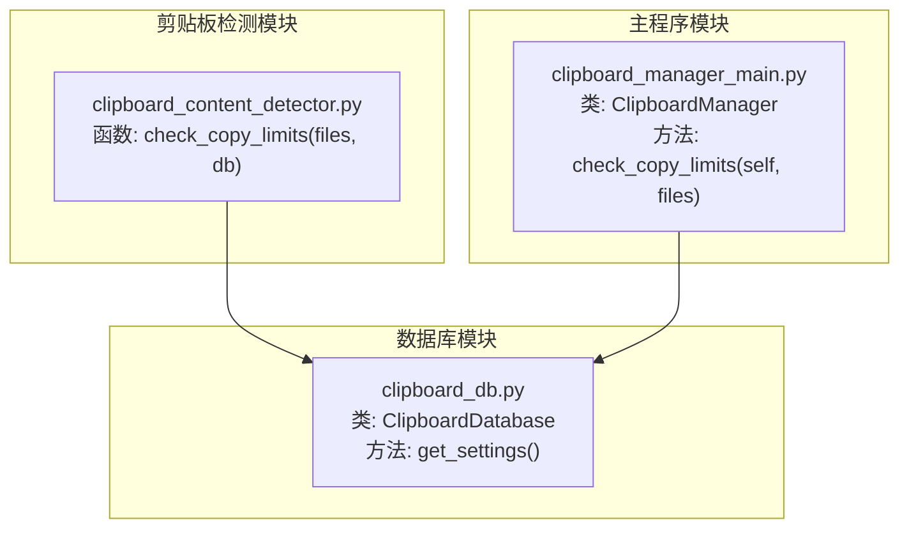
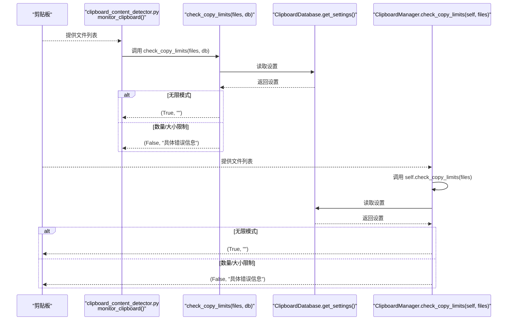
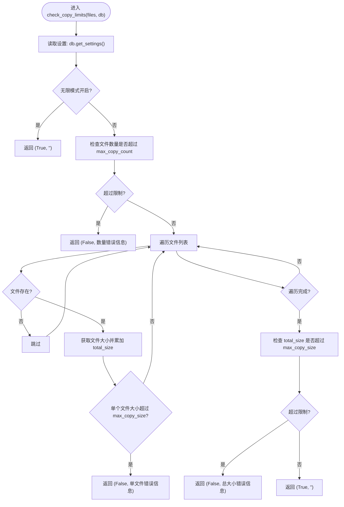
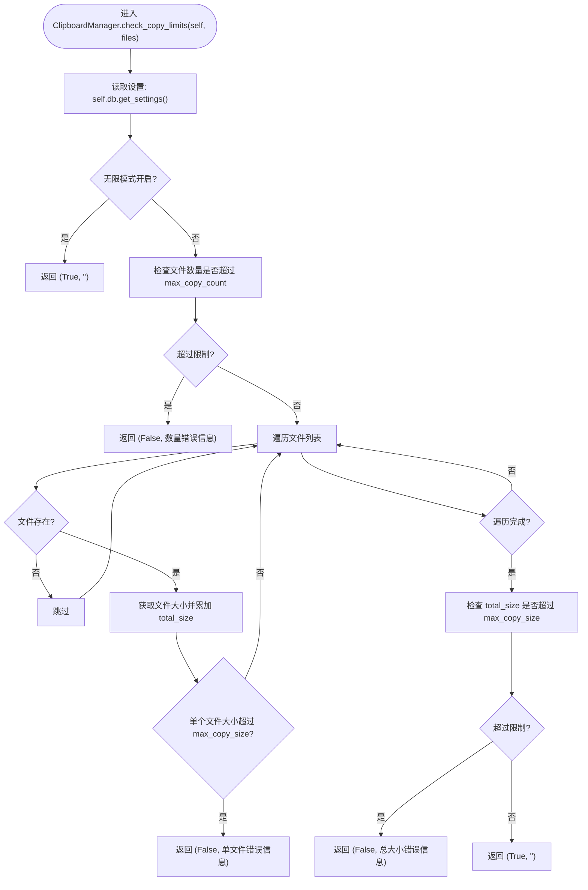
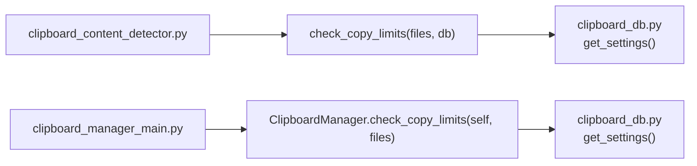

# check_copy_limits方法

<cite>
**本文引用的文件**
- [clipboard_content_detector.py](file://clipboard_content_detector.py)
- [clipboard_manager_main.py](file://clipboard_manager_main.py)
- [clipboard_db.py](file://clipboard_db.py)
</cite>

## 目录
1. [简介](#简介)
2. [项目结构](#项目结构)
3. [核心组件](#核心组件)
4. [架构总览](#架构总览)
5. [详细组件分析](#详细组件分析)
6. [依赖分析](#依赖分析)
7. [性能考量](#性能考量)
8. [故障排查指南](#故障排查指南)
9. [结论](#结论)
10. [附录](#附录)

## 简介
本文件聚焦于 check_copy_limits 方法的功能与实现，详细说明其如何接收文件路径列表作为参数，从数据库获取当前设置（包括最大文件数量、最大文件大小和无限模式状态），并按照严格的检查顺序进行校验：若启用无限模式则直接放行；否则先检查文件数量是否超过限制，再逐个检查每个文件大小是否超过限制，最后检查所有文件的总大小是否超出限制。方法返回布尔值与消息字符串的元组，成功时返回 (True, "")，失败时返回 (False, 具体错误信息)。文档还提供实际调用示例、常见错误消息格式以及在处理大量小文件或单个超大文件时的检查顺序与性能考虑。

## 项目结构
本仓库围绕“剪贴板历史记录管理”展开，涉及剪贴板内容检测、数据库持久化、GUI界面与监控流程。与 check_copy_limits 直接相关的核心文件如下：
- clipboard_content_detector.py：提供独立的剪贴板内容检测器，其中包含 check_copy_limits 的实现，并在监控循环中调用该方法。
- clipboard_manager_main.py：提供 GUI 主程序与 ClipboardManager 类，其中包含 check_copy_limits 的实现，并在处理剪贴板内容时调用该方法。
- clipboard_db.py：提供 ClipboardDatabase 类，负责数据库初始化、设置读取与更新等，为 check_copy_limits 提供数据来源。

图表来源
- [clipboard_content_detector.py](file://clipboard_content_detector.py#L142-L180)
- [clipboard_manager_main.py](file://clipboard_manager_main.py#L361-L393)
- [clipboard_db.py](file://clipboard_db.py#L359-L385)

章节来源
- [clipboard_content_detector.py](file://clipboard_content_detector.py#L1-L274)
- [clipboard_manager_main.py](file://clipboard_manager_main.py#L1-L761)
- [clipboard_db.py](file://clipboard_db.py#L1-L455)

## 核心组件
- check_copy_limits（独立实现）：位于 clipboard_content_detector.py 中，接收文件列表与数据库对象，返回 (允许, 错误消息)。
- check_copy_limits（类方法实现）：位于 clipboard_manager_main.py 的 ClipboardManager 类中，接收文件列表，返回 (允许, 错误消息)。
- ClipboardDatabase.get_settings：位于 clipboard_db.py，提供当前设置（最大文件数量、最大文件大小、无限模式）。

章节来源
- [clipboard_content_detector.py](file://clipboard_content_detector.py#L142-L180)
- [clipboard_manager_main.py](file://clipboard_manager_main.py#L361-L393)
- [clipboard_db.py](file://clipboard_db.py#L359-L385)

## 架构总览
check_copy_limits 的调用链路如下：
- 当剪贴板包含文件列表时，系统会调用 check_copy_limits 对文件集合进行限制校验。
- 若返回不允许，则打印错误消息并终止后续保存流程。
- 若返回允许，则继续执行文件保存与数据库写入。

图表来源
- [clipboard_content_detector.py](file://clipboard_content_detector.py#L228-L256)
- [clipboard_manager_main.py](file://clipboard_manager_main.py#L395-L410)
- [clipboard_db.py](file://clipboard_db.py#L359-L385)

## 详细组件分析

### check_copy_limits（独立实现）
- 参数
  - files：文件路径列表
  - db：数据库对象（ClipboardDatabase 实例）
- 行为
  - 从 db.get_settings() 获取当前设置
  - 若 unlimited_mode 为真，直接返回 (True, "")
  - 若文件数量超过 max_copy_count，返回 (False, "一次复制的文件数量(...)超过了限制(...)")
  - 遍历每个文件，累加总大小 total_size，并对每个文件检查单个文件大小是否超过 max_copy_size，若超过则返回 (False, "文件 '...' 大小(...)超过了限制(...)")
  - 最后检查 total_size 是否超过 max_copy_size，若超过则返回 (False, "一次复制的总大小(...)超过了限制(...)")
  - 所有检查通过则返回 (True, "")
- 返回值
  - 元组：(bool, str)，成功时为 (True, "")，失败时为 (False, 错误消息)

图表来源
- [clipboard_content_detector.py](file://clipboard_content_detector.py#L142-L180)

章节来源
- [clipboard_content_detector.py](file://clipboard_content_detector.py#L142-L180)

### check_copy_limits（类方法实现）
- 参数
  - self：ClipboardManager 实例
  - files：文件路径列表
- 行为
  - 从 self.db.get_settings() 获取当前设置
  - 无限模式：返回 (True, "")
  - 数量限制：返回 (False, "一次复制的文件数量(...)超过了限制(...)")
  - 单个文件大小限制：返回 (False, "文件 '...' 大小(...)超过了限制(...)")
  - 总大小限制：返回 (False, "一次复制的总大小(...)超过了限制(...)")
  - 成功：返回 (True, "")
- 返回值
  - 元组：(bool, str)

图表来源
- [clipboard_manager_main.py](file://clipboard_manager_main.py#L361-L393)

章节来源
- [clipboard_manager_main.py](file://clipboard_manager_main.py#L361-L393)

### 调用示例与使用场景
- 独立脚本监控
  - 在 clipboard_content_detector.py 的 monitor_clipboard 循环中，当检测到剪贴板包含文件列表时，调用 check_copy_limits(files, db) 进行限制校验。若返回不允许，打印错误消息并跳过保存流程。
  - 示例调用路径参考：clipboard_content_detector.py#L249-L253
- GUI主程序
  - 在 ClipboardManager.process_clipboard_content 中，当检测到剪贴板包含文件列表时，调用 self.check_copy_limits(files) 进行限制校验。若返回不允许，打印错误消息并终止保存流程。
  - 示例调用路径参考：clipboard_manager_main.py#L405-L409

章节来源
- [clipboard_content_detector.py](file://clipboard_content_detector.py#L228-L256)
- [clipboard_manager_main.py](file://clipboard_manager_main.py#L395-L410)

### 错误消息格式
- 数量限制错误
  - "一次复制的文件数量(...)超过了限制(...)"
- 单个文件大小限制错误
  - "文件 '...' 大小(...)超过了限制(...)"
- 总大小限制错误
  - "一次复制的总大小(...)超过了限制(...)"
- 成功
  - (True, "")

章节来源
- [clipboard_content_detector.py](file://clipboard_content_detector.py#L142-L180)
- [clipboard_manager_main.py](file://clipboard_manager_main.py#L361-L393)

## 依赖分析
- 数据来源
  - check_copy_limits 依赖 ClipboardDatabase.get_settings() 返回设置字典，包含 max_copy_size、max_copy_count、unlimited_mode。
- 调用关系
  - clipboard_content_detector.py 的 monitor_clipboard 调用 check_copy_limits(files, db)
  - clipboard_manager_main.py 的 ClipboardManager.process_clipboard_content 调用 self.check_copy_limits(files)

图表来源
- [clipboard_content_detector.py](file://clipboard_content_detector.py#L228-L256)
- [clipboard_manager_main.py](file://clipboard_manager_main.py#L395-L410)
- [clipboard_db.py](file://clipboard_db.py#L359-L385)

章节来源
- [clipboard_content_detector.py](file://clipboard_content_detector.py#L1-L274)
- [clipboard_manager_main.py](file://clipboard_manager_main.py#L1-L761)
- [clipboard_db.py](file://clipboard_db.py#L1-L455)

## 性能考量
- 检查顺序
  - 无限模式优先：一旦启用无限模式，立即返回，避免后续昂贵的文件系统操作。
  - 数量检查：O(1) 操作，快速拒绝过多文件。
  - 单个文件大小检查：逐个读取文件大小，O(n) 操作，n 为文件数量。
  - 总大小检查：在遍历过程中累加 total_size，避免二次遍历，整体 O(n)。
- 大量小文件场景
  - 单个文件大小检查会频繁调用文件系统接口，建议在业务层尽量减少不必要的文件列表传递，或在上层做预过滤。
- 单个超大文件场景
  - 单个文件大小检查会触发较大的 IO，建议在上层对可疑大文件提前拦截，或在 UI 层给出提示。
- 异常处理
  - 文件大小读取异常会被捕获并打印日志，不影响整体流程，但应关注异常频率以评估磁盘或权限问题。

[本节为通用性能讨论，无需列出具体文件来源]

## 故障排查指南
- 常见问题
  - 文件不存在：方法会跳过不存在的文件，不会报错；若全部文件不存在，可能误判为数量不足。
  - 权限不足：无法读取文件大小时会打印异常日志，导致该文件未计入大小，最终可能触发总大小限制。
  - 设置未生效：确认数据库 settings 表中的 max_copy_size、max_copy_count、unlimited_mode 是否正确更新。
- 排查步骤
  - 检查数据库设置：通过 ClipboardDatabase.get_settings() 确认当前限制值。
  - 检查文件路径：确认传入的文件路径是否存在且可访问。
  - 观察日志：留意方法内部的异常打印，定位具体文件或权限问题。
- 相关实现参考
  - 设置读取：clipboard_db.py#L359-L385
  - 无限模式判断：clipboard_content_detector.py#L148-L150 或 clipboard_manager_main.py#L367-L369
  - 数量限制判断：clipboard_content_detector.py#L152-L154 或 clipboard_manager_main.py#L371-L373
  - 单个文件大小检查：clipboard_content_detector.py#L164-L169 或 clipboard_manager_main.py#L383-L385
  - 总大小检查：clipboard_content_detector.py#L173-L179 或 clipboard_manager_main.py#L389-L391

章节来源
- [clipboard_db.py](file://clipboard_db.py#L359-L385)
- [clipboard_content_detector.py](file://clipboard_content_detector.py#L142-L180)
- [clipboard_manager_main.py](file://clipboard_manager_main.py#L361-L393)

## 结论
check_copy_limits 方法通过“无限模式优先、数量限制、单个文件大小限制、总大小限制”的严格顺序，确保在不同规模的文件集合（大量小文件或单个超大文件）下都能高效、准确地进行限制校验。其返回值设计简洁明确，便于上层逻辑快速决策。结合数据库设置与异常处理机制，该方法在实际应用中具备良好的稳定性与可维护性。

[本节为总结性内容，无需列出具体文件来源]

## 附录
- 关键实现路径
  - 独立实现：clipboard_content_detector.py#L142-L180
  - 类方法实现：clipboard_manager_main.py#L361-L393
  - 设置读取：clipboard_db.py#L359-L385
- 调用示例路径
  - 独立监控：clipboard_content_detector.py#L249-L253
  - GUI主程序：clipboard_manager_main.py#L405-L409

[本节为补充信息，无需列出具体文件来源]