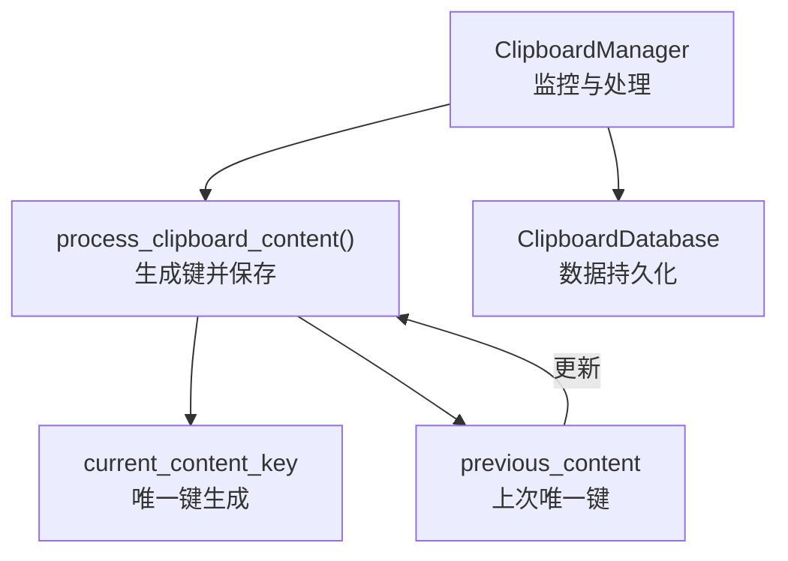
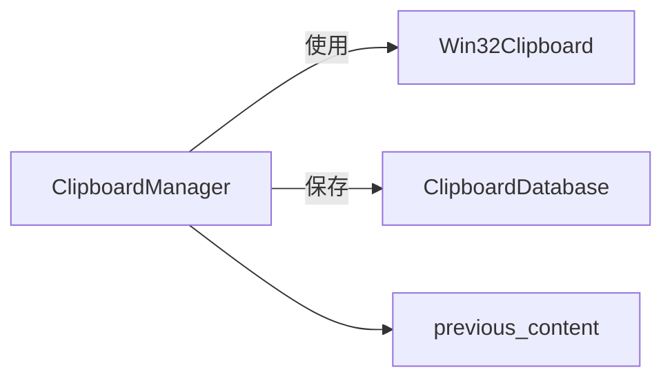

# previous_content属性

<cite>
**本文引用的文件**
- [clipboard_manager_main.py](file://clipboard_manager_main.py)
- [clipboard_content_detector.py](file://clipboard_content_detector.py)
- [clipboard_db.py](file://clipboard_db.py)
</cite>

## 目录
1. [简介](#简介)
2. [项目结构](#项目结构)
3. [核心组件](#核心组件)
4. [架构总览](#架构总览)
5. [详细组件分析](#详细组件分析)
6. [依赖关系分析](#依赖关系分析)
7. [性能考量](#性能考量)
8. [故障排查指南](#故障排查指南)
9. [结论](#结论)

## 简介
本文围绕“previous_content”属性展开，系统阐述其设计目的、实现机制与使用场景，并结合代码定位说明该属性如何在监控循环中避免重复保存相同内容。重点包括：
- 设计目的：通过维护上一次处理的剪贴板内容唯一键，防止在监控循环中重复保存相同内容。
- 实现机制：在process_clipboard_content方法中生成当前内容唯一键，与previous_content比较，不同则执行保存并更新previous_content。
- 键值生成策略：文件列表使用“files:”前缀加排序后路径拼接；文本内容使用“text:”前缀加hash()函数值。
- 局限性与改进方向：无法检测内容相同但顺序不同的文件列表；建议采用更稳健的哈希策略。
- 调试建议：打印previous_content值以追踪状态变化。

## 项目结构
本仓库围绕剪贴板内容的检测、保存与展示构建，涉及监控循环、内容处理、数据库持久化与GUI展示等模块。与“previous_content”属性直接相关的代码集中在主程序模块中。



图表来源
- [clipboard_manager_main.py](file://clipboard_manager_main.py#L355-L496)
- [clipboard_db.py](file://clipboard_db.py#L116-L183)

章节来源
- [clipboard_manager_main.py](file://clipboard_manager_main.py#L355-L496)

## 核心组件
- ClipboardManager：负责监控剪贴板、生成内容唯一键、判断是否保存以及更新previous_content。
- ClipboardDatabase：负责文本与文件记录的保存、去重计数与查询。
- previous_content：类实例变量，存储上一次成功处理的唯一键，用于去重判断。

章节来源
- [clipboard_manager_main.py](file://clipboard_manager_main.py#L355-L361)
- [clipboard_db.py](file://clipboard_db.py#L116-L183)

## 架构总览
下面的序列图展示了监控循环中“previous_content”的工作流程：每次循环读取剪贴板，生成当前唯一键，与previous_content比较，不同则保存并更新。

```mermaid
sequenceDiagram
participant Loop as "监控循环"
participant Manager as "ClipboardManager"
participant Win32 as "Win32Clipboard"
participant DB as "ClipboardDatabase"
Loop->>Manager : "调用process_clipboard_content()"
Manager->>Win32 : "OpenClipboard()"
alt "剪贴板包含文件列表"
Manager->>Win32 : "读取CF_HDROP"
Manager->>Manager : "生成current_content_key='files : '+排序路径拼接"
Manager->>Manager : "比较current_content_key与previous_content"
alt "键不同"
Manager->>Manager : "遍历文件并保存"
Manager->>DB : "save_file_record(...)"
DB-->>Manager : "返回记录ID"
Manager->>Manager : "更新previous_content=current_content_key"
else "键相同"
Manager-->>Loop : "跳过保存"
end
else "剪贴板包含文本"
Manager->>Win32 : "读取CF_UNICODETEXT"
Manager->>Manager : "生成current_content_key='text : '+hash(text)"
Manager->>Manager : "比较current_content_key与previous_content"
alt "键不同"
Manager->>DB : "save_text_record(text)"
DB-->>Manager : "返回记录ID"
Manager->>Manager : "更新previous_content=current_content_key"
else "键相同"
Manager-->>Loop : "跳过保存"
end
end
Manager->>Win32 : "CloseClipboard()"
```

图表来源
- [clipboard_manager_main.py](file://clipboard_manager_main.py#L395-L496)

章节来源
- [clipboard_manager_main.py](file://clipboard_manager_main.py#L395-L496)

## 详细组件分析

### previous_content属性的设计与实现
- 存储位置与初始化
  - ClipboardManager.__init__中初始化previous_content为None，表示初始状态下没有上一次内容键。
- 更新时机
  - 在process_clipboard_content中，仅当“当前唯一键与previous_content不同”时才执行保存，并在保存完成后将previous_content更新为当前唯一键。
- 作用范围
  - 仅在单次进程生命周期内有效，重启后previous_content会重新初始化为None。

章节来源
- [clipboard_manager_main.py](file://clipboard_manager_main.py#L355-L361)
- [clipboard_manager_main.py](file://clipboard_manager_main.py#L457-L458)
- [clipboard_manager_main.py](file://clipboard_manager_main.py#L483-L484)

### 键值生成策略
- 文件列表
  - 生成规则：前缀“files:” + 排序后的文件路径以分号连接的字符串。
  - 优点：对文件顺序不敏感，能识别相同文件集合的不同排列。
  - 缺点：若文件路径包含不可稳定比较的元素（例如临时路径），仍可能误判。
- 文本内容
  - 生成规则：前缀“text:” + hash(text_content)。
  - 优点：简单快速。
  - 缺点：hash()在不同Python进程间可能不稳定；对相同内容但编码差异导致的字节差异不敏感（本实现已统一编码，但仍需注意hash碰撞风险）。

章节来源
- [clipboard_manager_main.py](file://clipboard_manager_main.py#L412-L412)
- [clipboard_manager_main.py](file://clipboard_manager_main.py#L467-L467)

### 与process_clipboard_content的协作
- 流程要点
  - 读取剪贴板格式并判断类型。
  - 生成current_content_key。
  - 比较current_content_key与previous_content。
  - 不同则保存到数据库并更新previous_content；相同则跳过保存。
- 异常与边界
  - 剪贴板访问异常时会捕获并提示，最终关闭剪贴板句柄。
  - 文本大小限制与文件数量/大小限制在保存前进行检查。

章节来源
- [clipboard_manager_main.py](file://clipboard_manager_main.py#L395-L496)

### 与ClipboardDatabase的交互
- 文本记录
  - save_text_record内部计算内容MD5，用于数据库层面的去重计数；而previous_content用于应用层的去重，两者互补。
- 文件记录
  - save_file_record内部计算文件MD5，用于数据库层面的去重计数；previous_content用于应用层的去重，避免重复写入磁盘与数据库。

章节来源
- [clipboard_db.py](file://clipboard_db.py#L116-L183)

### 与独立监控脚本的关系
- clipboard_content_detector.py中的monitor_clipboard同样实现了“previous_content_key”的概念，但其键生成策略与主程序略有差异：
  - 文本键：当文本长度超过阈值时使用“text_md5:”+MD5；否则使用“text:”+hash()。
  - 文件键：使用“files:”+排序路径拼接。
- 该脚本展示了另一种去重思路，可作为对比参考。

章节来源
- [clipboard_content_detector.py](file://clipboard_content_detector.py#L228-L264)
- [clipboard_content_detector.py](file://clipboard_content_detector.py#L236-L244)

## 依赖关系分析
- ClipboardManager依赖Win32Clipboard接口读取剪贴板内容。
- ClipboardManager依赖ClipboardDatabase进行数据持久化。
- previous_content与process_clipboard_content强耦合，是去重控制的核心。



图表来源
- [clipboard_manager_main.py](file://clipboard_manager_main.py#L395-L496)
- [clipboard_db.py](file://clipboard_db.py#L116-L183)

章节来源
- [clipboard_manager_main.py](file://clipboard_manager_main.py#L395-L496)
- [clipboard_db.py](file://clipboard_db.py#L116-L183)

## 性能考量
- 去重判断复杂度
  - 字符串比较O(n)，其中n为键长度；文件列表键受文件数量与路径长度影响。
- I/O开销
  - 文件保存涉及磁盘复制与数据库写入；文本保存主要为数据库写入。
- 建议
  - 对超长文本可考虑使用MD5作为键（参考独立监控脚本策略），减少字符串比较成本。
  - 对文件列表，排序与拼接为O(m log m + L)，m为文件数，L为路径总长度。

[本节为通用性能讨论，无需列出具体文件来源]

## 故障排查指南
- 如何确认previous_content状态
  - 在process_clipboard_content中，可在生成current_content_key后打印该值，观察与previous_content的差异。
  - 可在保存成功后打印previous_content的更新值，验证去重逻辑是否生效。
- 常见问题
  - 重复保存：检查previous_content是否未更新或键生成策略是否一致。
  - 无法检测顺序变化：文件列表键基于排序，若出现非预期重复，检查文件路径是否稳定。
  - 文本键不稳定：hash()在不同进程间可能不同，建议改用MD5（参考独立监控脚本策略）。

章节来源
- [clipboard_manager_main.py](file://clipboard_manager_main.py#L412-L412)
- [clipboard_manager_main.py](file://clipboard_manager_main.py#L467-L467)
- [clipboard_manager_main.py](file://clipboard_manager_main.py#L457-L458)
- [clipboard_manager_main.py](file://clipboard_manager_main.py#L483-L484)

## 结论
- previous_content属性通过“唯一键比较”在应用层实现高效去重，显著降低重复保存的概率与开销。
- 键生成策略针对文件列表与文本分别设计，前者强调顺序无关，后者强调快速比较。
- 当前实现存在局限：文本键依赖hash()稳定性、文件列表键对路径稳定性有要求；可借鉴独立监控脚本的MD5策略提升鲁棒性。
- 建议在开发与调试阶段打印previous_content与current_content_key，以便快速定位状态变化与潜在问题。