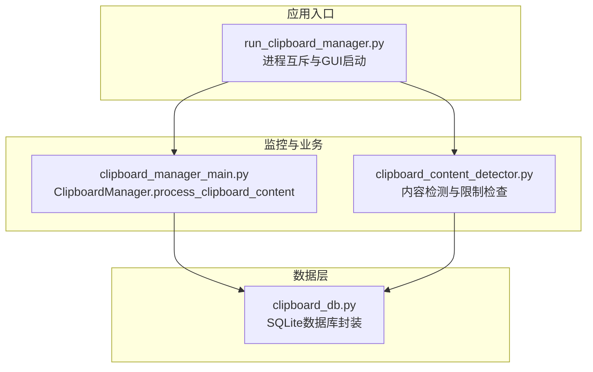
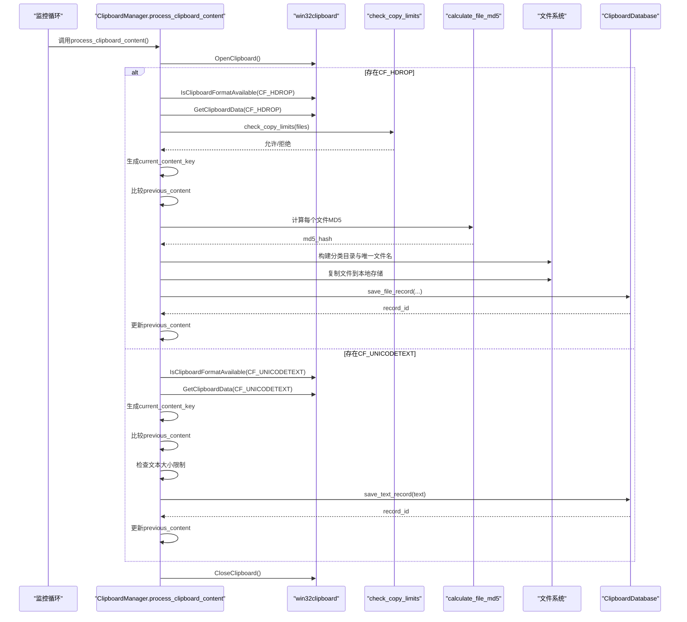
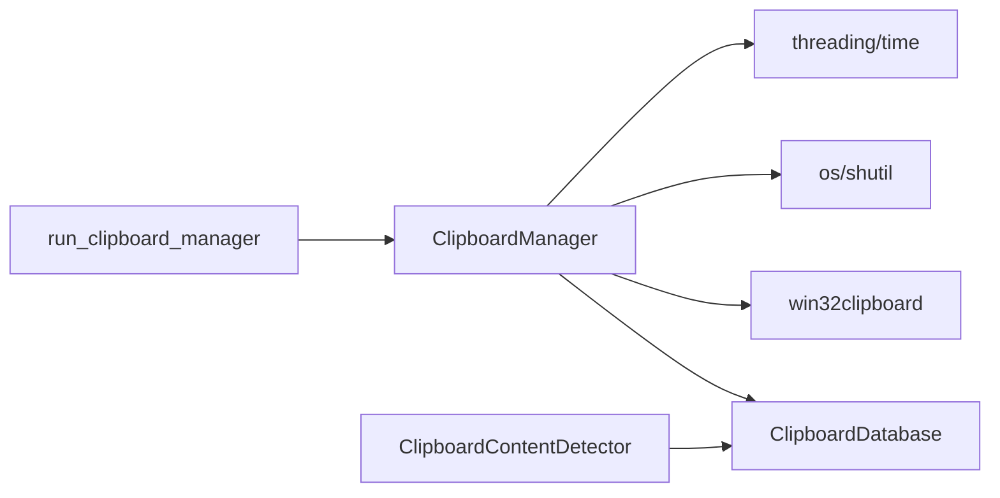

# process_clipboard_content方法

<cite>
**本文引用的文件**
- [clipboard_manager_main.py](file://clipboard_manager_main.py)
- [clipboard_db.py](file://clipboard_db.py)
- [clipboard_content_detector.py](file://clipboard_content_detector.py)
- [run_clipboard_manager.py](file://run_clipboard_manager.py)
</cite>

## 目录
1. [简介](#简介)
2. [项目结构](#项目结构)
3. [核心组件](#核心组件)
4. [架构概览](#架构概览)
5. [详细组件分析](#详细组件分析)
6. [依赖分析](#依赖分析)
7. [性能考虑](#性能考虑)
8. [故障排除指南](#故障排除指南)
9. [结论](#结论)

## 简介
本文件围绕剪贴板内容处理的核心方法 process_clipboard_content 展开，系统性解析其执行流程：如何通过 win32clipboard.OpenClipboard() 访问系统剪贴板，依次检查 CF_HDROP（文件列表）与 CF_UNICODETEXT（文本内容）两种格式；针对文件内容，详述限制检查、MD5 计算、分类保存路径构建、唯一文件名生成与本地复制策略；针对文本内容，说明大小限制检查与数据库持久化；并深入解释 previous_content 属性的去重机制与异常处理策略（如剪贴板访问冲突），最后提供方法调用时序图与最佳实践建议。

## 项目结构
本仓库采用“功能模块化 + GUI集成”的组织方式：
- 主程序与业务逻辑集中在 clipboard_manager_main.py 中，包含 ClipboardManager 类及其核心方法 process_clipboard_content
- 数据库层封装在 clipboard_db.py，负责 SQLite 表结构、记录增删改查与设置项管理
- 剪贴板内容检测器 clipboard_content_detector.py 提供独立的剪贴板内容探测与限制检查能力
- 启动脚本 run_clipboard_manager.py 实现进程互斥、后台监控与 GUI 启动

图表来源
- [run_clipboard_manager.py](file://run_clipboard_manager.py#L1-L71)
- [clipboard_manager_main.py](file://clipboard_manager_main.py#L355-L496)
- [clipboard_content_detector.py](file://clipboard_content_detector.py#L1-L274)
- [clipboard_db.py](file://clipboard_db.py#L1-L120)

章节来源
- [clipboard_manager_main.py](file://clipboard_manager_main.py#L355-L496)
- [clipboard_db.py](file://clipboard_db.py#L1-L120)
- [clipboard_content_detector.py](file://clipboard_content_detector.py#L1-L274)
- [run_clipboard_manager.py](file://run_clipboard_manager.py#L1-L71)

## 核心组件
- ClipboardManager.process_clipboard_content：核心剪贴板处理流程，负责打开剪贴板、检测格式、执行限制检查、文件/文本分支处理、数据库持久化与去重控制
- ClipboardDatabase：数据库封装，提供文本与文件记录的保存、查询、统计与设置读写
- ClipboardContentDetector：独立的内容检测器，提供格式枚举、文本/文件读取与限制检查等能力
- run_clipboard_manager：进程互斥与 GUI 启动，后台线程驱动监控循环

章节来源
- [clipboard_manager_main.py](file://clipboard_manager_main.py#L355-L496)
- [clipboard_db.py](file://clipboard_db.py#L116-L184)
- [clipboard_content_detector.py](file://clipboard_content_detector.py#L87-L138)
- [run_clipboard_manager.py](file://run_clipboard_manager.py#L17-L66)

## 架构概览
process_clipboard_content 的整体执行路径如下：
- 打开剪贴板 -> 检测格式 -> 分支处理（文件/文本）-> 限制检查 -> 计算MD5/生成唯一键 -> 分类保存/数据库持久化 -> 更新 previous_content -> 关闭剪贴板

图表来源
- [clipboard_manager_main.py](file://clipboard_manager_main.py#L395-L496)
- [clipboard_manager_main.py](file://clipboard_manager_main.py#L24-L35)
- [clipboard_manager_main.py](file://clipboard_manager_main.py#L362-L394)
- [clipboard_db.py](file://clipboard_db.py#L116-L184)

## 详细组件分析

### 方法：process_clipboard_content 执行流程
- 剪贴板访问
  - 使用 win32clipboard.OpenClipboard() 打开剪贴板，随后在 finally 中统一关闭
  - 异常处理：捕获非 OpenClipboard 相关异常并打印，避免误判为剪贴板冲突
- 格式检测与分支
  - 若存在 CF_HDROP：读取文件列表，进入文件分支
  - 否则若存在 CF_UNICODETEXT：读取文本内容，进入文本分支
- 去重控制 previous_content
  - 文件分支：以“files:”前缀加排序后的文件路径拼接作为唯一键
  - 文本分支：以“text:”前缀加 hash(text) 作为唯一键
  - 当 current_content_key 与 previous_content 不相等时才执行保存逻辑
- 文件分支处理
  - 限制检查：调用 check_copy_limits(files) 判断数量与总大小是否超限
  - MD5 计算：逐文件计算 MD5，失败则跳过该文件
  - 分类保存：按文件类型与日期生成目标目录，唯一文件名包含 MD5 前缀
  - 复制策略：若目标文件不存在则复制，避免重复写入
  - 数据库持久化：调用 save_file_record(...) 保存记录，支持去重计数
- 文本分支处理
  - 限制检查：计算 UTF-8 字节数，若未开启无限模式且超过 max_copy_size 则拒绝
  - 数据库持久化：调用 save_text_record(...) 保存记录，支持去重计数
- 异常处理
  - 剪贴板访问冲突：OpenClipboard 抛出异常时，方法会捕获并打印提示
  - 文件/文本读取异常：分别捕获并打印错误信息，不影响后续流程
  - 关闭剪贴板：finally 中确保 CloseClipboard() 被调用，即使发生异常

章节来源
- [clipboard_manager_main.py](file://clipboard_manager_main.py#L395-L496)

### 限制检查：check_copy_limits
- 功能：综合判断文件数量与总大小是否超过设置上限
- 逻辑要点：
  - 无限模式：直接放行
  - 数量限制：超过 max_copy_count 即拒绝
  - 单文件大小限制：任一文件超过 max_copy_size 即拒绝
  - 总大小限制：累加后超过 max_copy_size 即拒绝
- 输出：返回 (是否允许, 错误信息)

章节来源
- [clipboard_manager_main.py](file://clipboard_manager_main.py#L362-L394)

### MD5 计算与文件分类
- MD5 计算：逐块读取文件，使用流式算法计算 MD5，失败返回 None 并跳过
- 文件类型分类：依据扩展名映射到 documents/images/videos/audio/pdf/office/archives/others 等类别
- 保存路径：基于 base_save_folder/type_folder/date_folder 构建
- 唯一文件名：在原文件名基础上追加 _MD5 前缀，避免同名冲突
- 复制策略：仅当目标文件不存在时复制，减少磁盘 IO

章节来源
- [clipboard_manager_main.py](file://clipboard_manager_main.py#L24-L35)
- [clipboard_manager_main.py](file://clipboard_manager_main.py#L362-L394)
- [clipboard_manager_main.py](file://clipboard_manager_main.py#L395-L496)

### 文本内容处理与去重
- 唯一键生成：使用 hash(text) 作为文本唯一键（注意 hash 的不确定性，建议结合 MD5）
- 大小限制：UTF-8 编码字节数超过 max_copy_size 时拒绝
- 数据库持久化：save_text_record(...) 支持 md5_hash 唯一约束与去重计数

章节来源
- [clipboard_manager_main.py](file://clipboard_manager_main.py#L462-L496)
- [clipboard_db.py](file://clipboard_db.py#L116-L184)

### previous_content 去重机制
- 文件分支：以“files:”前缀 + 排序后的文件路径拼接作为唯一键
- 文本分支：以“text:”前缀 + hash(text) 作为唯一键
- 作用：避免同一内容重复保存，提升效率与一致性

章节来源
- [clipboard_manager_main.py](file://clipboard_manager_main.py#L412-L413)
- [clipboard_manager_main.py](file://clipboard_manager_main.py#L467-L468)

### 异常处理与剪贴板冲突
- OpenClipboard 异常：被捕获并打印，避免误报为业务错误
- GetClipboardData 异常：分别捕获文件与文本读取异常，不影响其他分支
- CloseClipboard：在 finally 中强制关闭，保证资源释放

章节来源
- [clipboard_manager_main.py](file://clipboard_manager_main.py#L488-L496)

### 与内容检测器的关系
- clipboard_content_detector 提供独立的内容检测与限制检查能力，适合在非主流程场景使用
- 两者均依赖 ClipboardDatabase 获取设置项，保持配置一致性

章节来源
- [clipboard_content_detector.py](file://clipboard_content_detector.py#L87-L138)
- [clipboard_content_detector.py](file://clipboard_content_detector.py#L143-L181)
- [clipboard_db.py](file://clipboard_db.py#L360-L412)

## 依赖分析
- 组件耦合
  - ClipboardManager 依赖 ClipboardDatabase 进行设置与记录持久化
  - process_clipboard_content 依赖 win32clipboard 进行系统剪贴板交互
  - 文件分支依赖 shutil.copy2 进行本地复制
- 外部依赖
  - win32clipboard/win32con：Windows 剪贴板 API
  - sqlite3：本地数据库存储
  - hashlib：MD5 计算
  - os/time/threading：文件系统、时间与并发控制

图表来源
- [clipboard_manager_main.py](file://clipboard_manager_main.py#L355-L496)
- [clipboard_db.py](file://clipboard_db.py#L1-L120)
- [run_clipboard_manager.py](file://run_clipboard_manager.py#L17-L66)

章节来源
- [clipboard_manager_main.py](file://clipboard_manager_main.py#L355-L496)
- [clipboard_db.py](file://clipboard_db.py#L1-L120)
- [run_clipboard_manager.py](file://run_clipboard_manager.py#L17-L66)

## 性能考虑
- 流式 MD5：文件 MD5 采用分块读取，降低内存占用
- 去重与唯一命名：通过 MD5 前缀与唯一键避免重复写入与冲突
- 限制检查前置：在复制前完成数量与大小校验，减少无效 IO
- 去重键设计：文件分支使用排序后的路径拼接，确保顺序无关的稳定性
- 数据库索引：文本记录的 md5_hash 唯一索引有助于快速去重与查询

章节来源
- [clipboard_manager_main.py](file://clipboard_manager_main.py#L24-L35)
- [clipboard_manager_main.py](file://clipboard_manager_main.py#L362-L394)
- [clipboard_db.py](file://clipboard_db.py#L18-L53)

## 故障排除指南
- 剪贴板访问冲突
  - 现象：OpenClipboard 抛出异常
  - 处理：方法已捕获并打印提示，不影响其他分支；可稍后重试
- 文件读取失败
  - 现象：计算 MD5 返回 None 或复制失败
  - 处理：跳过该文件并继续处理其他文件；检查文件权限与路径有效性
- 文本过大
  - 现象：UTF-8 字节数超过 max_copy_size
  - 处理：在非无限模式下拒绝保存；调整设置或拆分内容
- 重复内容
  - 现象：previous_content 未更新导致重复保存
  - 处理：确认唯一键生成逻辑与 previous_content 更新时机；必要时重启监控

章节来源
- [clipboard_manager_main.py](file://clipboard_manager_main.py#L488-L496)
- [clipboard_manager_main.py](file://clipboard_manager_main.py#L412-L413)
- [clipboard_manager_main.py](file://clipboard_manager_main.py#L467-L468)

## 结论
process_clipboard_content 方法通过严谨的格式检测、前置限制检查、MD5 唯一性保障与去重控制，实现了对剪贴板内容的高效、稳定与可追溯管理。其设计兼顾了性能（流式 MD5、去重复制）、可靠性（异常捕获、资源释放）与可维护性（模块化、清晰的分支逻辑）。配合 ClipboardDatabase 的去重计数与 run_clipboard_manager 的后台监控，形成完整的剪贴板历史记录体系。