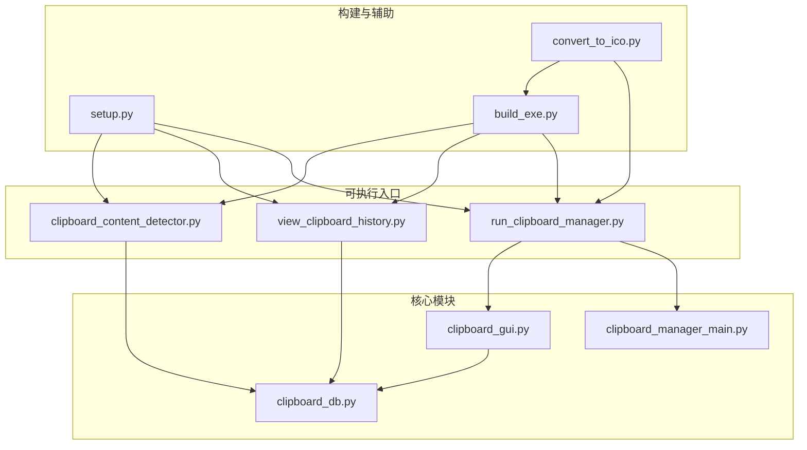
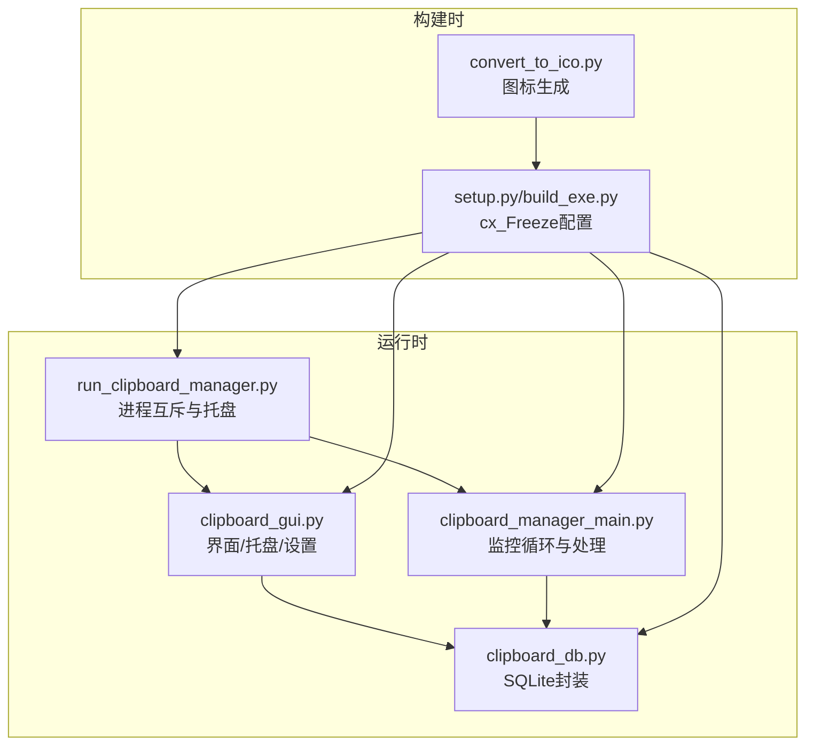
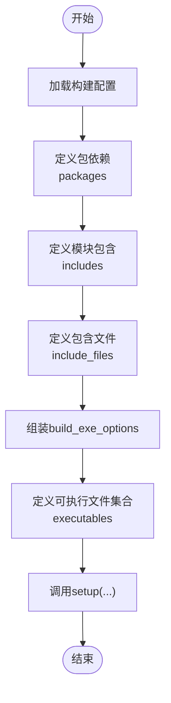
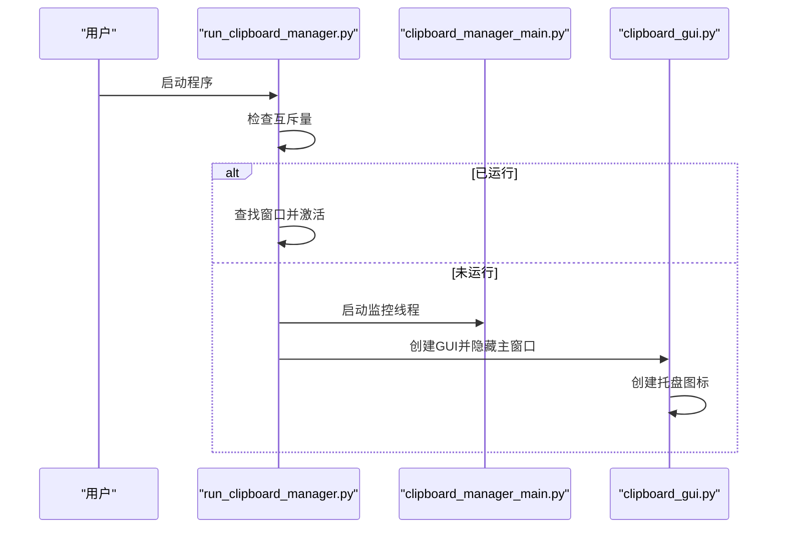
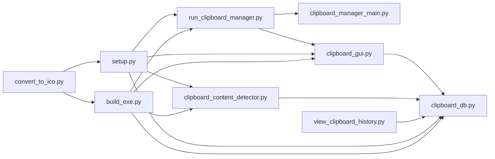

# 安装与配置

<cite>
**本文引用的文件**
- [setup.py](file://setup.py)
- [build_exe.py](file://build_exe.py)
- [run_clipboard_manager.py](file://run_clipboard_manager.py)
- [clipboard_manager_main.py](file://clipboard_manager_main.py)
- [clipboard_gui.py](file://clipboard_gui.py)
- [clipboard_db.py](file://clipboard_db.py)
- [clipboard_content_detector.py](file://clipboard_content_detector.py)
- [view_clipboard_history.py](file://view_clipboard_history.py)
- [convert_to_ico.py](file://convert_to_ico.py)
</cite>

## 目录
1. [简介](#简介)
2. [项目结构](#项目结构)
3. [核心组件](#核心组件)
4. [架构总览](#架构总览)
5. [详细组件分析](#详细组件分析)
6. [依赖关系分析](#依赖关系分析)
7. [性能与运行特性](#性能与运行特性)
8. [安装与配置指南](#安装与配置指南)
9. [故障排查](#故障排查)
10. [结论](#结论)

## 简介
本指南面向开发者与终端用户，提供完整的安装与配置说明，涵盖运行环境要求、三种使用方式（直接运行源码、通过setup.py安装、使用build_exe.py生成独立可执行文件）、包依赖与脚本入口配置、exe免环境运行原理、开机自启配置（注册表操作）、常见构建错误解决方案，以及便携模式与安装模式的配置建议。

## 项目结构
项目采用“功能模块化 + 可执行入口”的组织方式：
- 可执行入口：run_clipboard_manager.py、view_clipboard_history.py、clipboard_content_detector.py
- 核心业务：clipboard_manager_main.py（剪贴板监控与GUI主流程）、clipboard_gui.py（GUI界面与托盘）、clipboard_db.py（SQLite数据库封装）
- 构建工具：setup.py（cx_Freeze配置）、build_exe.py（替代构建脚本）
- 辅助工具：convert_to_ico.py（图标转换）

图表来源
- [run_clipboard_manager.py](file://run_clipboard_manager.py#L1-L71)
- [clipboard_manager_main.py](file://clipboard_manager_main.py#L1-L761)
- [clipboard_gui.py](file://clipboard_gui.py#L1-L800)
- [clipboard_db.py](file://clipboard_db.py#L1-L455)
- [clipboard_content_detector.py](file://clipboard_content_detector.py#L1-L274)
- [view_clipboard_history.py](file://view_clipboard_history.py#L1-L75)
- [setup.py](file://setup.py#L1-L84)
- [build_exe.py](file://build_exe.py#L1-L81)
- [convert_to_ico.py](file://convert_to_ico.py#L1-L48)

章节来源
- [run_clipboard_manager.py](file://run_clipboard_manager.py#L1-L71)
- [clipboard_manager_main.py](file://clipboard_manager_main.py#L1-L761)
- [clipboard_gui.py](file://clipboard_gui.py#L1-L800)
- [clipboard_db.py](file://clipboard_db.py#L1-L455)
- [clipboard_content_detector.py](file://clipboard_content_detector.py#L1-L274)
- [view_clipboard_history.py](file://view_clipboard_history.py#L1-L75)
- [setup.py](file://setup.py#L1-L84)
- [build_exe.py](file://build_exe.py#L1-L81)
- [convert_to_ico.py](file://convert_to_ico.py#L1-L48)

## 核心组件
- 剪贴板监控与处理：clipboard_manager_main.py负责监控剪贴板变化、处理文本与文件、写入数据库、提供GUI入口。
- GUI与托盘：clipboard_gui.py提供界面、托盘图标、开机自启与悬浮图标设置。
- 数据库封装：clipboard_db.py封装SQLite表结构、增删改查、设置项与过期清理。
- 构建配置：setup.py与build_exe.py定义包依赖、包含文件、脚本入口与输出可执行文件。
- 辅助工具：convert_to_ico.py将JPG转换为ICO图标，供构建与运行使用。

章节来源
- [clipboard_manager_main.py](file://clipboard_manager_main.py#L1-L761)
- [clipboard_gui.py](file://clipboard_gui.py#L1-L800)
- [clipboard_db.py](file://clipboard_db.py#L1-L455)
- [setup.py](file://setup.py#L1-L84)
- [build_exe.py](file://build_exe.py#L1-L81)
- [convert_to_ico.py](file://convert_to_ico.py#L1-L48)

## 架构总览

图表来源
- [run_clipboard_manager.py](file://run_clipboard_manager.py#L1-L71)
- [clipboard_manager_main.py](file://clipboard_manager_main.py#L1-L761)
- [clipboard_gui.py](file://clipboard_gui.py#L1-L800)
- [clipboard_db.py](file://clipboard_db.py#L1-L455)
- [setup.py](file://setup.py#L1-L84)
- [build_exe.py](file://build_exe.py#L1-L81)
- [convert_to_ico.py](file://convert_to_ico.py#L1-L48)

## 详细组件分析

### 组件A：构建配置（setup.py 与 build_exe.py）
- 包依赖与模块包含：明确声明tkinter、sqlite3、hashlib、win32clipboard、win32con、PIL、pystray等包与clipboard_db、clipboard_gui、clipboard_content_detector模块。
- 包含文件：2.ico、icon.ico、clipboard_history.db等资源文件。
- 可执行文件：定义三个目标：剪贴板管理器（GUI）、查看剪贴板历史（控制台）、剪贴板内容检测器（控制台），分别指定脚本入口、目标名、图标与基座（Win32GUI）。
- 构建选项：通过build_exe_options统一配置packages/includes/excludes/include_files。

图表来源
- [setup.py](file://setup.py#L1-L84)

章节来源
- [setup.py](file://setup.py#L1-L84)
- [build_exe.py](file://build_exe.py#L1-L81)

### 组件B：运行入口与互斥（run_clipboard_manager.py）
- 进程互斥：通过win32api/win32con创建命名互斥量，避免重复启动；若已运行则尝试激活已有窗口。
- 后台监控：在独立线程中启动剪贴板监控循环。
- GUI托盘：默认隐藏主窗口，创建系统托盘图标，支持显示界面与退出。

图表来源
- [run_clipboard_manager.py](file://run_clipboard_manager.py#L1-L71)
- [clipboard_manager_main.py](file://clipboard_manager_main.py#L717-L761)
- [clipboard_gui.py](file://clipboard_gui.py#L144-L171)

章节来源
- [run_clipboard_manager.py](file://run_clipboard_manager.py#L1-L71)

### 组件C：GUI与设置（clipboard_gui.py）
- 资源路径：兼容PyInstaller打包后的资源定位（resource_path）。
- 托盘图标：使用2.ico或生成简单图标，菜单包含显示界面与退出。
- 设置项：复制限制、保存天数、开机自启、悬浮图标等，持久化至数据库settings表。
- 开机自启：通过检查设置项决定是否启用自启（注册表操作由设置保存流程触发）。

章节来源
- [clipboard_gui.py](file://clipboard_gui.py#L1-L800)
- [clipboard_db.py](file://clipboard_db.py#L1-L455)

### 组件D：数据库封装（clipboard_db.py）
- 表结构：text_records、file_records、settings三张表；支持md5_hash、number、retention_days、auto_start、float_icon等字段。
- 功能：增删改查、统计、过期清理、设置读写。
- 兼容性：自动迁移新增字段与索引，保证升级后仍可用。

章节来源
- [clipboard_db.py](file://clipboard_db.py#L1-L455)

### 组件E：监控与检测（clipboard_manager_main.py 与 clipboard_content_detector.py）
- 监控循环：周期性检查剪贴板，区分文本与文件，计算MD5去重，写入数据库。
- 限制检查：基于settings表的max_copy_size、max_copy_count、unlimited_mode。
- 内容检测器：枚举剪贴板格式、识别文本/文件、打印内容摘要。

章节来源
- [clipboard_manager_main.py](file://clipboard_manager_main.py#L1-L761)
- [clipboard_content_detector.py](file://clipboard_content_detector.py#L1-L274)

## 依赖关系分析
- 运行时依赖：tkinter、sqlite3、hashlib、win32clipboard、win32con、PIL、pystray。
- 模块依赖：run_clipboard_manager.py依赖clipboard_manager_main与clipboard_gui；clipboard_gui依赖clipboard_db；clipboard_content_detector与view_clipboard_history依赖clipboard_db。
- 构建依赖：cx_Freeze用于打包；Pillow用于图标转换；pystray用于托盘；pypiwin32（win32clipboard/win32con）用于剪贴板访问。

图表来源
- [run_clipboard_manager.py](file://run_clipboard_manager.py#L1-L71)
- [clipboard_manager_main.py](file://clipboard_manager_main.py#L1-L761)
- [clipboard_gui.py](file://clipboard_gui.py#L1-L800)
- [clipboard_db.py](file://clipboard_db.py#L1-L455)
- [clipboard_content_detector.py](file://clipboard_content_detector.py#L1-L274)
- [view_clipboard_history.py](file://view_clipboard_history.py#L1-L75)
- [setup.py](file://setup.py#L1-L84)
- [build_exe.py](file://build_exe.py#L1-L81)
- [convert_to_ico.py](file://convert_to_ico.py#L1-L48)

## 性能与运行特性
- 监控频率：默认1秒检查一次，可通过命令行参数调整（run_clipboard_manager.py中传参）。
- 去重策略：文本按MD5，文件按MD5，避免重复入库与重复保存。
- 存储结构：SQLite轻量可靠，适合本地历史记录；文件按类型与日期分目录存放，便于管理。
- 资源占用：托盘运行时内存占用低，图标与悬浮图标透明度可调，减少视觉干扰。

[本节为通用说明，不直接分析具体文件]

## 安装与配置指南

### 运行环境要求
- Python版本：3.7及以上
- 操作系统：Windows（使用win32clipboard/win32con与pystray）
- 必要依赖包：tkinter、pypiwin32、pillow、pystray
- 数据库：SQLite（随项目自带clipboard_history.db）

章节来源
- [setup.py](file://setup.py#L21-L30)
- [build_exe.py](file://build_exe.py#L21-L30)
- [clipboard_manager_main.py](file://clipboard_manager_main.py#L13-L23)
- [clipboard_gui.py](file://clipboard_gui.py#L17-L26)

### 方式一：直接运行源码
- 启动GUI与监控：python run_clipboard_manager.py
- 仅监控模式：python run_clipboard_manager.py --monitor [-i 间隔秒]
- 查看历史（控制台）：python view_clipboard_history.py
- 内容检测（控制台）：python clipboard_content_detector.py

章节来源
- [run_clipboard_manager.py](file://run_clipboard_manager.py#L70-L71)
- [clipboard_manager_main.py](file://clipboard_manager_main.py#L731-L761)
- [view_clipboard_history.py](file://view_clipboard_history.py#L74-L75)
- [clipboard_content_detector.py](file://clipboard_content_detector.py#L273-L274)

### 方式二：通过setup.py安装（开发/打包）
- 安装依赖：pip install cx_Freeze pypiwin32 pillow pystray
- 构建命令：python setup.py build
- 生成exe：python setup.py bdist_msi 或 python setup.py bdist_dir
- 说明：setup.py定义了三个可执行目标，包含图标与数据库文件，Win32GUI基座用于GUI程序。

章节来源
- [setup.py](file://setup.py#L1-L84)

### 方式三：使用build_exe.py生成独立可执行文件
- 安装依赖：pip install cx_Freeze pypiwin32 pillow pystray
- 构建命令：python build_exe.py build
- 输出：dist目录下生成三个exe文件，包含图标与数据库文件
- 说明：与setup.py类似，但集中在一个脚本中，便于快速打包

章节来源
- [build_exe.py](file://build_exe.py#L1-L81)

### setup.py中的包依赖与脚本入口
- 包依赖：packages中包含tkinter、sqlite3、hashlib、win32clipboard、win32con、PIL、pystray
- 模块包含：includes中包含clipboard_db、clipboard_gui、clipboard_content_detector
- 包含文件：include_files中包含2.ico、icon.ico、clipboard_history.db
- 可执行文件：executables中定义三个目标，分别对应GUI、查看历史、内容检测
- 基座选择：Windows平台使用Win32GUI基座

章节来源
- [setup.py](file://setup.py#L14-L75)

### exe免环境运行原理
- 包含依赖：cx_Freeze将packages、includes、include_files打包进exe
- 资源定位：GUI中使用resource_path兼容PyInstaller/cx_Freeze打包后的资源路径
- 图标与数据库：2.ico、icon.ico、clipboard_history.db随exe一起分发

章节来源
- [clipboard_gui.py](file://clipboard_gui.py#L27-L36)
- [setup.py](file://setup.py#L14-L20)
- [build_exe.py](file://build_exe.py#L14-L20)

### 开机自启配置（注册表操作）
- 设置入口：GUI设置页提供“允许程序开机自启”开关
- 实现机制：保存auto_start到settings表；保存时根据设置调用注册表操作（由设置保存流程触发）
- 注意事项：需管理员权限或用户授权；建议在用户侧HKCU路径下配置

章节来源
- [clipboard_gui.py](file://clipboard_gui.py#L395-L403)
- [clipboard_db.py](file://clipboard_db.py#L387-L412)

### 图标转换与资源准备
- 使用convert_to_ico.py将2.jpg转换为2.ico与icon.ico
- 若缺少图标，GUI会生成简单图标作为后备

章节来源
- [convert_to_ico.py](file://convert_to_ico.py#L1-L48)
- [clipboard_gui.py](file://clipboard_gui.py#L144-L157)

### 便携模式与安装模式建议
- 便携模式：直接运行exe，数据库与资源位于当前目录，便于携带与分享
- 安装模式：使用MSI安装，自动创建桌面快捷方式与注册表项，便于日常使用
- 切换建议：开发调试用便携；日常使用建议安装

[本节为通用建议，不直接分析具体文件]

## 故障排查

### 缺少DLL或动态库
- 症状：运行exe时报错缺少DLL
- 排查：确认已安装pypiwin32（win32clipboard、win32con）
- 解决：pip install pypiwin32；或在构建时通过packages/include_files确保包含所需DLL

章节来源
- [setup.py](file://setup.py#L21-L30)
- [build_exe.py](file://build_exe.py#L21-L30)

### 图标转换失败
- 症状：无法生成2.ico或icon.ico
- 排查：确认Pillow已安装；确认2.jpg存在
- 解决：pip install pillow；确保convert_to_ico.py在项目根目录运行

章节来源
- [convert_to_ico.py](file://convert_to_ico.py#L1-L48)

### 托盘图标不可用
- 症状：托盘不显示或报ImportError
- 排查：确认已安装pystray与Pillow
- 解决：pip install pystray pillow；重启应用

章节来源
- [clipboard_gui.py](file://clipboard_gui.py#L17-L26)

### 开机自启无效
- 症状：开机不启动或启动异常
- 排查：检查设置页“允许程序开机自启”是否勾选；确认保存设置成功
- 解决：以管理员身份运行；检查注册表项是否正确写入

章节来源
- [clipboard_gui.py](file://clipboard_gui.py#L395-L403)
- [clipboard_db.py](file://clipboard_db.py#L387-L412)

### 数据库文件损坏或权限不足
- 症状：无法读取历史记录或崩溃
- 排查：确认clipboard_history.db存在且有读写权限
- 解决：删除旧db文件后重启应用，系统会重建默认表结构

章节来源
- [clipboard_db.py](file://clipboard_db.py#L18-L115)

### 监控无响应或频繁报错
- 症状：剪贴板监控不工作
- 排查：确认win32clipboard可用；检查权限与杀毒软件拦截
- 解决：以管理员权限运行；关闭可能拦截剪贴板的第三方软件

章节来源
- [clipboard_manager_main.py](file://clipboard_manager_main.py#L395-L496)
- [clipboard_content_detector.py](file://clipboard_content_detector.py#L87-L138)

## 结论
本项目提供了三种使用方式：直接运行源码、通过setup.py安装、使用build_exe.py生成独立可执行文件。其核心依赖与脚本入口在setup.py与build_exe.py中清晰定义，exe通过包含图标与数据库实现免环境运行。GUI支持托盘、开机自启与悬浮图标等实用功能，数据库封装提供稳定的数据管理能力。遇到常见问题时，按本指南逐一排查即可快速恢复。