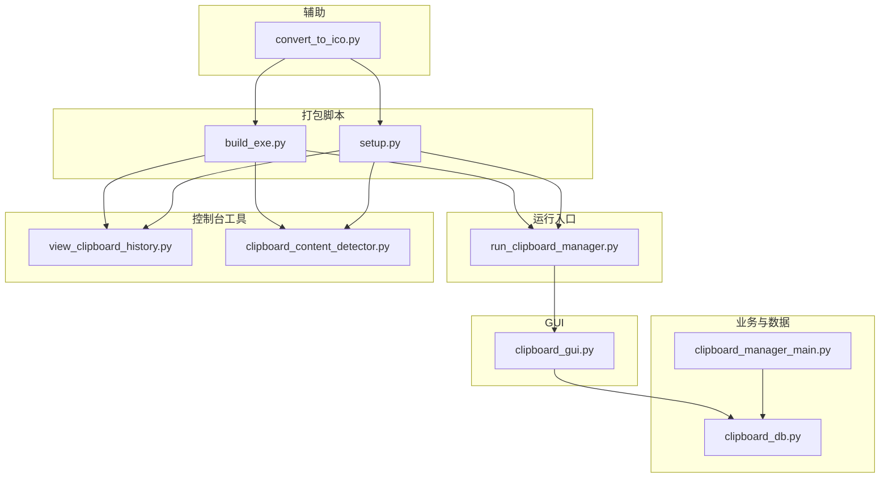
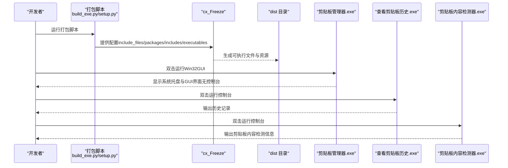
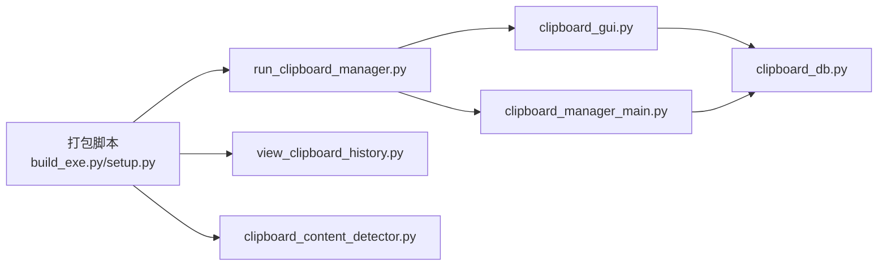

# 打包为可执行文件

<cite>
**本文引用的文件**
- [build_exe.py](file://build_exe.py)
- [setup.py](file://setup.py)
- [convert_to_ico.py](file://convert_to_ico.py)
- [run_clipboard_manager.py](file://run_clipboard_manager.py)
- [view_clipboard_history.py](file://view_clipboard_history.py)
- [clipboard_content_detector.py](file://clipboard_content_detector.py)
- [clipboard_gui.py](file://clipboard_gui.py)
- [clipboard_manager_main.py](file://clipboard_manager_main.py)
- [clipboard_db.py](file://clipboard_db.py)
</cite>

## 目录
1. [简介](#简介)
2. [项目结构](#项目结构)
3. [核心组件](#核心组件)
4. [架构总览](#架构总览)
5. [详细组件分析](#详细组件分析)
6. [依赖关系分析](#依赖关系分析)
7. [性能与打包注意事项](#性能与打包注意事项)
8. [故障排查指南](#故障排查指南)
9. [结论](#结论)
10. [附录](#附录)

## 简介
本指南面向希望将 Python 源码打包为 Windows 可执行文件（.exe）的用户，重点对比分析两个打包脚本：build_exe.py 与 setup.py 的异同与适用场景；详解 cx_Freeze 的关键配置项：include_files、packages、includes、executables；并给出运行步骤、常见错误的解决方案以及打包前后建议的操作流程。

## 项目结构
该项目包含多个 Python 源文件，其中与打包密切相关的有：
- 打包脚本：build_exe.py、setup.py
- 启动与运行入口：run_clipboard_manager.py
- 控制台工具：view_clipboard_history.py、clipboard_content_detector.py
- GUI 界面：clipboard_gui.py
- 主业务逻辑与数据库：clipboard_manager_main.py、clipboard_db.py
- 图标转换工具：convert_to_ico.py

图表来源
- [build_exe.py](file://build_exe.py#L1-L81)
- [setup.py](file://setup.py#L1-L84)
- [run_clipboard_manager.py](file://run_clipboard_manager.py#L1-L71)
- [view_clipboard_history.py](file://view_clipboard_history.py#L1-L75)
- [clipboard_content_detector.py](file://clipboard_content_detector.py#L1-L274)
- [clipboard_gui.py](file://clipboard_gui.py#L1-L170)
- [clipboard_manager_main.py](file://clipboard_manager_main.py#L1-L120)
- [clipboard_db.py](file://clipboard_db.py#L1-L120)
- [convert_to_ico.py](file://convert_to_ico.py#L1-L48)

章节来源
- [build_exe.py](file://build_exe.py#L1-L81)
- [setup.py](file://setup.py#L1-L84)

## 核心组件
- 打包脚本对比
  - build_exe.py：集中定义 include_files、packages、includes、executables，并通过 Executable 创建三个目标 exe（剪贴板管理器.exe、查看剪贴板历史.exe、剪贴板内容检测器.exe），适合一次性产出多目标。
  - setup.py：与 build_exe.py 功能等价，但将 Executable 列表定义在 setup.py 中，base 采用条件判断，同样产出三个目标 exe。
- 可执行入口
  - 剪贴板管理器.exe：由 run_clipboard_manager.py 启动，内部创建剪贴板监控线程并运行 GUI，使用 Win32GUI 基础隐藏控制台窗口。
  - 查看剪贴板历史.exe：由 view_clipboard_history.py 启动，纯控制台输出历史记录。
  - 剪贴板内容检测器.exe：由 clipboard_content_detector.py 启动，纯控制台输出剪贴板内容检测信息。
- 资源与依赖
  - include_files：包含图标文件与数据库文件，确保打包后可找到图标与数据库。
  - packages：包含 tkinter、sqlite3、hashlib、win32clipboard、win32con、PIL、pystray 等运行所需包。
  - includes：显式包含内部模块 clipboard_db、clipboard_gui、clipboard_content_detector，避免遗漏。
  - base='Win32GUI'：用于隐藏控制台窗口，适用于 GUI 应用。

章节来源
- [build_exe.py](file://build_exe.py#L14-L81)
- [setup.py](file://setup.py#L14-L84)
- [run_clipboard_manager.py](file://run_clipboard_manager.py#L32-L66)
- [view_clipboard_history.py](file://view_clipboard_history.py#L1-L75)
- [clipboard_content_detector.py](file://clipboard_content_detector.py#L218-L274)

## 架构总览
下面的序列图展示了从打包到运行三个独立程序的流程，以及 GUI 应用如何隐藏控制台窗口。

图表来源
- [build_exe.py](file://build_exe.py#L43-L81)
- [setup.py](file://setup.py#L43-L84)
- [run_clipboard_manager.py](file://run_clipboard_manager.py#L32-L66)

## 详细组件分析

### 打包脚本对比：build_exe.py vs setup.py
- 共同点
  - 都定义了 include_files、packages、includes、excludes（空列表）。
  - 都通过 Executable 定义三个目标 exe。
  - 都使用 cx_Freeze 的 setup 接口。
- 差异点
  - build_exe.py：将 Executable 实例分别赋值给变量，便于统一管理与扩展；base 参数在 GUI 目标上直接设置为 Win32GUI。
  - setup.py：将 Executable 列表直接写在 setup 中；base 通过条件判断在 Windows 平台设置为 Win32GUI，其他平台保持 None。
- 使用建议
  - 若需要更灵活地管理每个 Executable 的参数与图标，推荐使用 build_exe.py。
  - 若希望在不同平台使用不同的 base 策略，可优先考虑 setup.py。

章节来源
- [build_exe.py](file://build_exe.py#L14-L81)
- [setup.py](file://setup.py#L14-L84)

### cx_Freeze 关键配置详解
- include_files
  - 作用：将图标与数据库文件一并打包进最终 exe，避免运行时找不到资源。
  - 示例：包含 2.ico、icon.ico、clipboard_history.db。
- packages
  - 作用：声明打包时需要包含的第三方包，确保运行环境具备必要依赖。
  - 示例：tkinter、sqlite3、hashlib、win32clipboard、win32con、PIL、pystray。
- includes
  - 作用：显式包含内部模块，避免 cx_Freeze 误判为未使用而遗漏。
  - 示例：clipboard_db、clipboard_gui、clipboard_content_detector。
- executables
  - 作用：定义每个可执行文件的入口脚本、目标名称、图标与 base。
  - GUI 应用设置 base='Win32GUI'，隐藏控制台窗口。
  - 控制台工具不设置 base 或显式设置为 None。

章节来源
- [build_exe.py](file://build_exe.py#L14-L81)
- [setup.py](file://setup.py#L14-L84)

### 运行三个独立程序
- 剪贴板管理器.exe
  - 入口：run_clipboard_manager.py
  - 行为：启动剪贴板监控线程，创建 GUI 并默认隐藏主窗口（通过 Win32GUI 隐藏控制台）。
  - 交互：系统托盘图标显示界面，或使用 Alt+C 快捷键。
- 查看剪贴板历史.exe
  - 入口：view_clipboard_history.py
  - 行为：控制台输出最近文本与文件记录及统计信息。
- 剪贴板内容检测器.exe
  - 入口：clipboard_content_detector.py
  - 行为：控制台输出剪贴板内容变化检测信息（文本、文件列表、格式等）。

章节来源
- [run_clipboard_manager.py](file://run_clipboard_manager.py#L32-L66)
- [view_clipboard_history.py](file://view_clipboard_history.py#L21-L75)
- [clipboard_content_detector.py](file://clipboard_content_detector.py#L218-L274)

### base='Win32GUI' 的作用
- 当 base='Win32GUI' 时，Windows 下会以 GUI 模式运行，不会弹出控制台窗口。
- 适用于 GUI 应用（如剪贴板管理器.exe），避免用户看到黑窗。
- 控制台工具（查看历史、内容检测）通常不需要 base='Win32GUI'。

章节来源
- [build_exe.py](file://build_exe.py#L51-L72)
- [setup.py](file://setup.py#L51-L67)

### 图标与数据库资源处理
- 图标
  - 打包脚本包含 2.ico、icon.ico。
  - 如需从 JPG 生成 ICO，可使用 convert_to_ico.py。
- 数据库
  - 打包脚本包含 clipboard_history.db（若存在）。
  - GUI 与数据库模块在运行时通过资源路径查找数据库文件，确保打包后能找到。

章节来源
- [build_exe.py](file://build_exe.py#L15-L19)
- [setup.py](file://setup.py#L15-L19)
- [convert_to_ico.py](file://convert_to_ico.py#L1-L48)
- [clipboard_gui.py](file://clipboard_gui.py#L27-L36)
- [clipboard_db.py](file://clipboard_db.py#L13-L20)

## 依赖关系分析
- 打包脚本与目标程序的关系
  - build_exe.py/setup.py -> run_clipboard_manager.py（GUI 应用）
  - build_exe.py/setup.py -> view_clipboard_history.py（控制台工具）
  - build_exe.py/setup.py -> clipboard_content_detector.py（控制台工具）
- GUI 与数据库
  - clipboard_gui.py 依赖 clipboard_db.py（数据库操作）
  - clipboard_manager_main.py 也依赖 clipboard_db.py（数据库操作）

图表来源
- [build_exe.py](file://build_exe.py#L43-L81)
- [setup.py](file://setup.py#L43-L84)
- [run_clipboard_manager.py](file://run_clipboard_manager.py#L1-L71)
- [view_clipboard_history.py](file://view_clipboard_history.py#L1-L75)
- [clipboard_content_detector.py](file://clipboard_content_detector.py#L1-L274)
- [clipboard_gui.py](file://clipboard_gui.py#L1-L170)
- [clipboard_manager_main.py](file://clipboard_manager_main.py#L1-L120)
- [clipboard_db.py](file://clipboard_db.py#L1-L120)

## 性能与打包注意事项
- 打包前清理
  - 建议删除旧的 build 目录与 dist 目录，避免残留文件影响打包结果。
- 资源完整性
  - 确保 include_files 中包含的图标与数据库文件存在且路径正确。
- 依赖最小化
  - 仅包含必要的 packages 与 includes，减少体积与潜在冲突。
- 平台差异
  - base='Win32GUI' 仅在 Windows 生效；其他平台请确认 base 设置。
- 运行时路径
  - GUI 中使用资源路径函数确保在打包后仍能找到图标与数据库文件。

章节来源
- [build_exe.py](file://build_exe.py#L14-L81)
- [setup.py](file://setup.py#L14-L84)
- [clipboard_gui.py](file://clipboard_gui.py#L27-L36)
- [clipboard_db.py](file://clipboard_db.py#L13-L20)

## 故障排查指南
- 缺失 DLL 文件
  - 现象：运行时报错缺少 DLL。
  - 处理：在 packages 中补充缺失的包；或在 include_files 中加入必要的 DLL 文件。
- 图标转换失败
  - 现象：生成 ICO 失败或图标不显示。
  - 处理：使用 convert_to_ico.py 将 JPG 转换为 ICO；确保输入文件存在且 PIL 可用。
- 路径错误
  - 现象：找不到图标或数据库文件。
  - 处理：使用资源路径函数（如 clipboard_gui.py 中的 resource_path）；确保 include_files 路径正确。
- 打包后无法隐藏控制台
  - 现象：GUI 应用仍显示控制台。
  - 处理：确保 GUI 目标的 Executable 设置 base='Win32GUI'；Windows 平台才会生效。
- 重复打包导致异常
  - 现象：构建产物混乱或缓存问题。
  - 处理：先清理 build 与 dist 目录，再重新打包。

章节来源
- [convert_to_ico.py](file://convert_to_ico.py#L1-L48)
- [clipboard_gui.py](file://clipboard_gui.py#L27-L36)
- [build_exe.py](file://build_exe.py#L51-L72)
- [setup.py](file://setup.py#L51-L67)

## 结论
- 两种打包脚本均可生成三个独立程序，差异主要体现在 Executable 定义方式与 base 策略。
- 通过合理配置 include_files、packages、includes、executables，结合 base='Win32GUI'，可稳定产出 GUI 与控制台工具。
- 建议在打包前清理旧产物、验证资源路径、确保依赖齐全，并在运行后校验生成的 exe 是否符合预期。

## 附录
- 打包步骤建议
  1) 准备资源：确保 2.ico、icon.ico、clipboard_history.db 存在。
  2) 生成 ICO（可选）：使用 convert_to_ico.py 将 JPG 转换为 ICO。
  3) 选择打包脚本：build_exe.py 或 setup.py。
  4) 清理旧产物：删除 build 与 dist 目录。
  5) 运行打包脚本：生成 dist 目录下的三个 exe。
  6) 验证：运行三个 exe，检查 GUI 是否隐藏控制台、图标与数据库是否正常加载。
- 常用参考路径
  - 打包脚本：[build_exe.py](file://build_exe.py#L1-L81)、[setup.py](file://setup.py#L1-L84)
  - 运行入口：[run_clipboard_manager.py](file://run_clipboard_manager.py#L1-L71)
  - 控制台工具：[view_clipboard_history.py](file://view_clipboard_history.py#L1-L75)、[clipboard_content_detector.py](file://clipboard_content_detector.py#L1-L274)
  - GUI 与数据库：[clipboard_gui.py](file://clipboard_gui.py#L1-L170)、[clipboard_db.py](file://clipboard_db.py#L1-L120)