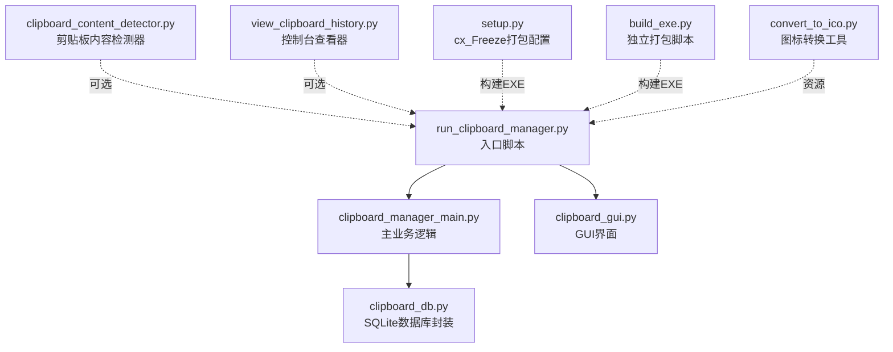
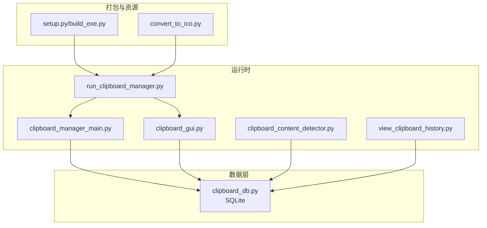
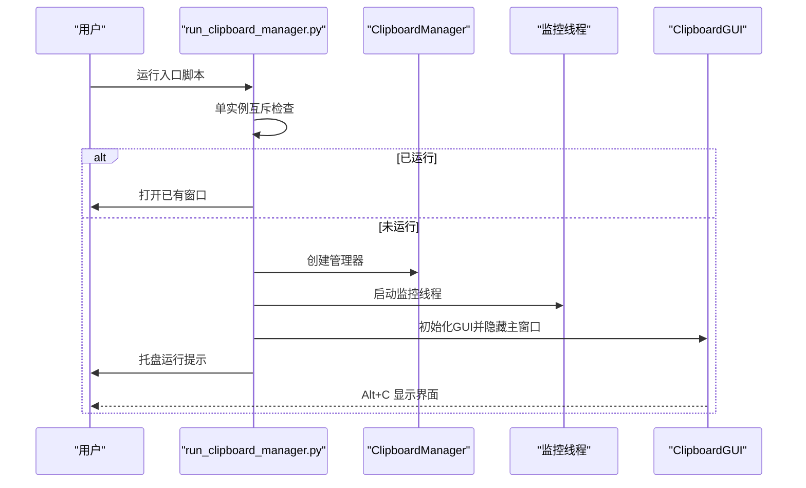
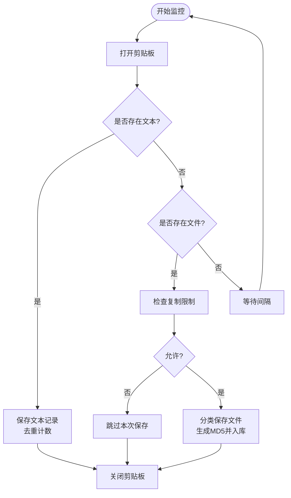
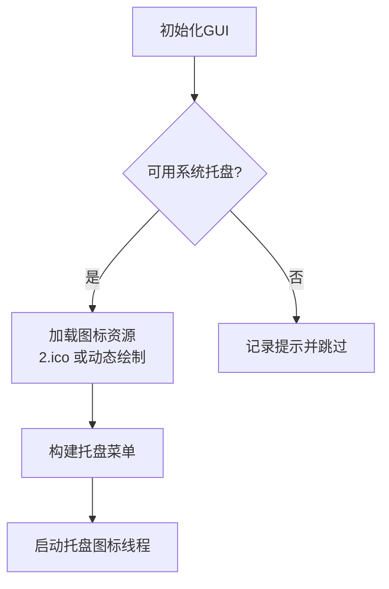
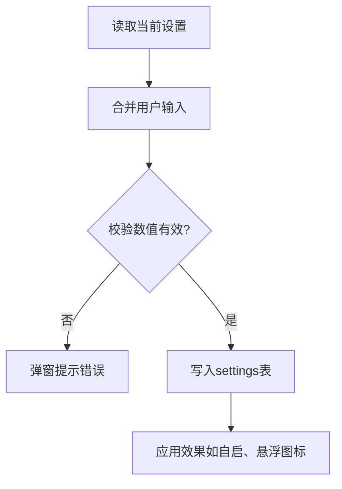
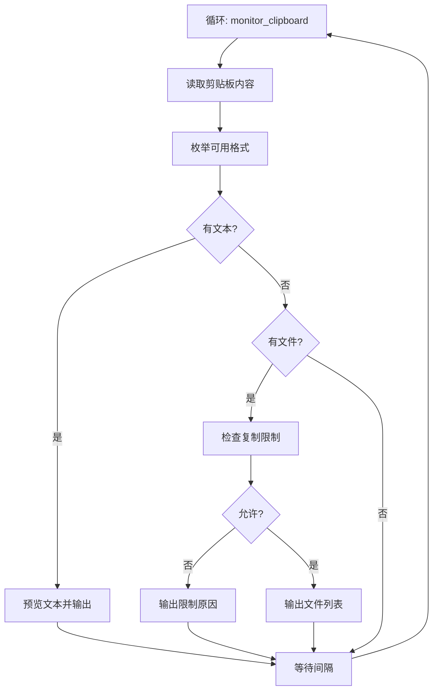
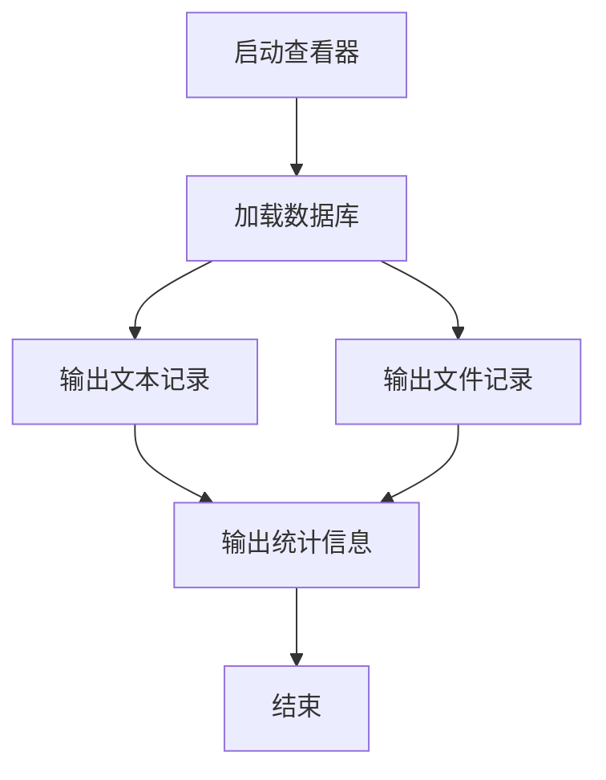
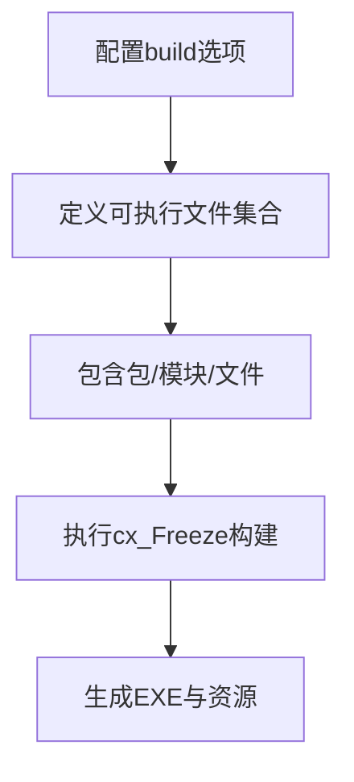
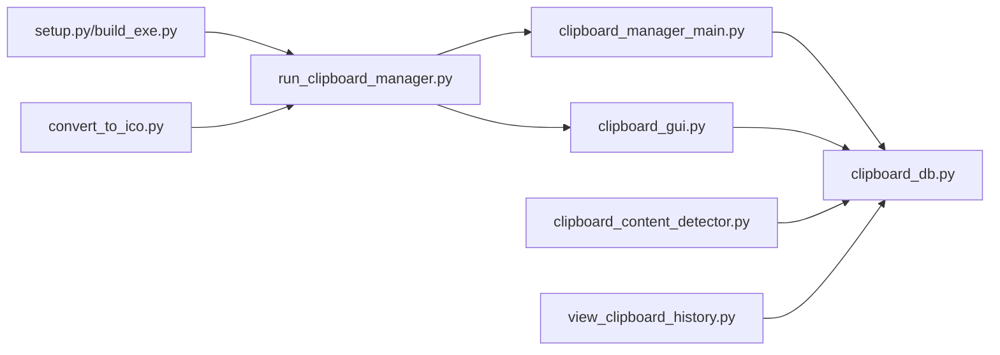

# 源码运行

<cite>
**本文引用的文件**
- [run_clipboard_manager.py](file://run_clipboard_manager.py)
- [clipboard_manager_main.py](file://clipboard_manager_main.py)
- [clipboard_gui.py](file://clipboard_gui.py)
- [clipboard_db.py](file://clipboard_db.py)
- [clipboard_content_detector.py](file://clipboard_content_detector.py)
- [view_clipboard_history.py](file://view_clipboard_history.py)
- [setup.py](file://setup.py)
- [build_exe.py](file://build_exe.py)
- [convert_to_ico.py](file://convert_to_ico.py)
- [check_db.py](file://check_db.py)
- [cleanup_duplicates.py](file://cleanup_duplicates.py)
- [check_indexes.py](file://check_indexes.py)
</cite>

## 目录
1. [简介](#简介)
2. [项目结构](#项目结构)
3. [核心组件](#核心组件)
4. [架构总览](#架构总览)
5. [详细组件分析](#详细组件分析)
6. [依赖关系分析](#依赖关系分析)
7. [性能与资源特性](#性能与资源特性)
8. [运行指南（Windows Python源码直跑）](#运行指南windows-python源码直跑)
9. [常见问题排查](#常见问题排查)
10. [结论](#结论)
11. [附录](#附录)

## 简介
本指南面向开发者与高级用户，提供在 Windows 上直接运行该项目 Python 源码的完整步骤，包括：
- Python 3.7+ 环境安装与配置
- 第三方依赖安装（tkinter、pypiwin32、Pillow、pystray）
- 克隆仓库后直接执行入口脚本启动程序
- 程序启动后的系统托盘图标行为与快捷键 Alt+C 的使用说明
- 常见问题的定位与解决思路（模块导入错误、GUI 无法显示、剪贴板权限问题等）
- 建议使用虚拟环境隔离依赖，并提供相应命令

## 项目结构
项目采用“多脚本 + 模块化”的组织方式，核心入口为 run_clipboard_manager.py，其余脚本分别承担 GUI、数据库、监控器、打包等功能。

图表来源
- [run_clipboard_manager.py](file://run_clipboard_manager.py#L1-L71)
- [clipboard_manager_main.py](file://clipboard_manager_main.py#L1-L120)
- [clipboard_gui.py](file://clipboard_gui.py#L1-L120)
- [clipboard_db.py](file://clipboard_db.py#L1-L120)
- [clipboard_content_detector.py](file://clipboard_content_detector.py#L1-L60)
- [view_clipboard_history.py](file://view_clipboard_history.py#L1-L40)
- [setup.py](file://setup.py#L1-L84)
- [build_exe.py](file://build_exe.py#L1-L81)
- [convert_to_ico.py](file://convert_to_ico.py#L1-L48)

章节来源
- [run_clipboard_manager.py](file://run_clipboard_manager.py#L1-L71)
- [clipboard_manager_main.py](file://clipboard_manager_main.py#L1-L120)
- [clipboard_gui.py](file://clipboard_gui.py#L1-L120)
- [clipboard_db.py](file://clipboard_db.py#L1-L120)
- [clipboard_content_detector.py](file://clipboard_content_detector.py#L1-L60)
- [view_clipboard_history.py](file://view_clipboard_history.py#L1-L40)
- [setup.py](file://setup.py#L1-L84)
- [build_exe.py](file://build_exe.py#L1-L81)
- [convert_to_ico.py](file://convert_to_ico.py#L1-L48)

## 核心组件
- 入口与进程控制：run_clipboard_manager.py
  - 单实例互斥检查、后台剪贴板监控线程、GUI 启动与托盘图标集成
- 主业务逻辑：clipboard_manager_main.py
  - 剪贴板内容检测（文本/文件）、去重与计数、数据库持久化、GUI 主界面
- GUI 界面：clipboard_gui.py
  - 记录浏览、搜索、统计、设置、托盘图标、悬浮图标、Alt+C 快捷键
- 数据层：clipboard_db.py
  - SQLite 表结构、增删改查、设置项、过期清理
- 剪贴板检测器：clipboard_content_detector.py
  - 控制台版剪贴板监控与内容展示
- 历史查看器：view_clipboard_history.py
  - 控制台输出历史记录与统计
- 打包工具：setup.py、build_exe.py
  - 使用 cx_Freeze 打包为 Windows EXE，包含图标与数据库文件
- 资源工具：convert_to_ico.py
  - 将 JPG 转换为 ICO 图标

章节来源
- [run_clipboard_manager.py](file://run_clipboard_manager.py#L1-L71)
- [clipboard_manager_main.py](file://clipboard_manager_main.py#L1-L120)
- [clipboard_gui.py](file://clipboard_gui.py#L1-L120)
- [clipboard_db.py](file://clipboard_db.py#L1-L120)
- [clipboard_content_detector.py](file://clipboard_content_detector.py#L1-L60)
- [view_clipboard_history.py](file://view_clipboard_history.py#L1-L40)
- [setup.py](file://setup.py#L1-L84)
- [build_exe.py](file://build_exe.py#L1-L81)
- [convert_to_ico.py](file://convert_to_ico.py#L1-L48)

## 架构总览

图表来源
- [run_clipboard_manager.py](file://run_clipboard_manager.py#L1-L71)
- [clipboard_manager_main.py](file://clipboard_manager_main.py#L1-L120)
- [clipboard_gui.py](file://clipboard_gui.py#L1-L120)
- [clipboard_db.py](file://clipboard_db.py#L1-L120)
- [clipboard_content_detector.py](file://clipboard_content_detector.py#L1-L60)
- [view_clipboard_history.py](file://view_clipboard_history.py#L1-L40)
- [setup.py](file://setup.py#L1-L84)
- [build_exe.py](file://build_exe.py#L1-L81)
- [convert_to_ico.py](file://convert_to_ico.py#L1-L48)

## 详细组件分析

### 组件A：入口与托盘集成（run_clipboard_manager.py）
- 功能要点
  - 单实例互斥：通过 Windows 互斥量避免重复启动
  - 后台监控：在守护线程中持续监控剪贴板变化
  - GUI 启动：默认隐藏主窗口，仅显示系统托盘图标
  - 用户提示：打印运行状态与交互说明
- 关键流程（启动序列）

图表来源
- [run_clipboard_manager.py](file://run_clipboard_manager.py#L1-L71)

章节来源
- [run_clipboard_manager.py](file://run_clipboard_manager.py#L1-L71)

### 组件B：主业务逻辑（clipboard_manager_main.py）
- 功能要点
  - 剪贴板内容识别：文本/文件（CF_UNICODETEXT/CF_HDROP）
  - 去重与计数：基于 MD5 或内容哈希，避免重复入库
  - 分类保存：按类型与日期归档文件，生成唯一文件名
  - 数据库操作：SQLite 表结构、查询、统计、设置
  - 监控循环：定时轮询剪贴板，处理新内容
- 关键流程（监控循环）

图表来源
- [clipboard_manager_main.py](file://clipboard_manager_main.py#L355-L496)

章节来源
- [clipboard_manager_main.py](file://clipboard_manager_main.py#L1-L120)
- [clipboard_manager_main.py](file://clipboard_manager_main.py#L355-L496)

### 组件C：GUI 界面（clipboard_gui.py）
- 功能要点
  - 记录浏览与搜索：文本/文件记录，支持排序与预览
  - 统计面板：记录数量、累计大小
  - 设置面板：复制限制、开机自启、悬浮图标、过期清理
  - 托盘图标：显示/退出菜单；图标资源优先使用 2.ico
  - 快捷键：Alt+C 切换显示/隐藏窗口
- 关键流程（托盘图标创建）

图表来源
- [clipboard_gui.py](file://clipboard_gui.py#L144-L171)

章节来源
- [clipboard_gui.py](file://clipboard_gui.py#L1-L120)
- [clipboard_gui.py](file://clipboard_gui.py#L144-L171)

### 组件D：数据库封装（clipboard_db.py）
- 功能要点
  - 表结构：text_records、file_records、settings
  - 增删改查：记录查询、搜索、统计、清理过期
  - 设置项：复制限制、保留天数、开机自启、悬浮图标
- 关键流程（设置更新）

图表来源
- [clipboard_db.py](file://clipboard_db.py#L359-L412)
- [clipboard_gui.py](file://clipboard_gui.py#L477-L533)

章节来源
- [clipboard_db.py](file://clipboard_db.py#L1-L120)
- [clipboard_db.py](file://clipboard_db.py#L359-L412)
- [clipboard_gui.py](file://clipboard_gui.py#L477-L533)

### 组件E：剪贴板检测器（clipboard_content_detector.py）
- 功能要点
  - 枚举剪贴板格式、读取文本/文件列表
  - 复制限制检查、格式化输出
  - 可作为独立控制台工具运行
- 关键流程（检测循环）

图表来源
- [clipboard_content_detector.py](file://clipboard_content_detector.py#L139-L218)

章节来源
- [clipboard_content_detector.py](file://clipboard_content_detector.py#L1-L120)
- [clipboard_content_detector.py](file://clipboard_content_detector.py#L139-L218)

### 组件F：历史查看器（view_clipboard_history.py）
- 功能要点
  - 控制台输出最近文本/文件记录与统计
- 关键流程（输出）

图表来源
- [view_clipboard_history.py](file://view_clipboard_history.py#L21-L75)

章节来源
- [view_clipboard_history.py](file://view_clipboard_history.py#L1-L75)

### 组件G：打包与图标（setup.py、build_exe.py、convert_to_ico.py）
- 功能要点
  - 使用 cx_Freeze 打包为 Windows EXE，包含图标与数据库文件
  - 支持独立打包脚本与统一配置脚本
  - 图标转换工具将 JPG 转为 ICO
- 关键流程（打包）

图表来源
- [setup.py](file://setup.py#L1-L84)
- [build_exe.py](file://build_exe.py#L1-L81)
- [convert_to_ico.py](file://convert_to_ico.py#L1-L48)

章节来源
- [setup.py](file://setup.py#L1-L84)
- [build_exe.py](file://build_exe.py#L1-L81)
- [convert_to_ico.py](file://convert_to_ico.py#L1-L48)

## 依赖关系分析
- 运行时依赖
  - Python 3.7+（Windows）
  - tkinter（GUI界面）
  - pypiwin32（Windows API调用，剪贴板读取）
  - Pillow（图像处理，系统托盘图标）
  - pystray（系统托盘）
- 模块依赖
  - run_clipboard_manager.py 依赖 clipboard_manager_main 与 clipboard_gui
  - clipboard_manager_main.py 依赖 clipboard_db
  - clipboard_gui.py 依赖 clipboard_db
  - clipboard_content_detector.py 依赖 clipboard_db
  - view_clipboard_history.py 依赖 clipboard_db
  - setup.py/build_exe.py 依赖 cx_Freeze
  - convert_to_ico.py 依赖 Pillow

图表来源
- [run_clipboard_manager.py](file://run_clipboard_manager.py#L1-L71)
- [clipboard_manager_main.py](file://clipboard_manager_main.py#L1-L120)
- [clipboard_gui.py](file://clipboard_gui.py#L1-L120)
- [clipboard_db.py](file://clipboard_db.py#L1-L120)
- [clipboard_content_detector.py](file://clipboard_content_detector.py#L1-L60)
- [view_clipboard_history.py](file://view_clipboard_history.py#L1-L40)
- [setup.py](file://setup.py#L1-L84)
- [build_exe.py](file://build_exe.py#L1-L81)
- [convert_to_ico.py](file://convert_to_ico.py#L1-L48)

章节来源
- [run_clipboard_manager.py](file://run_clipboard_manager.py#L1-L71)
- [clipboard_manager_main.py](file://clipboard_manager_main.py#L1-L120)
- [clipboard_gui.py](file://clipboard_gui.py#L1-L120)
- [clipboard_db.py](file://clipboard_db.py#L1-L120)
- [clipboard_content_detector.py](file://clipboard_content_detector.py#L1-L60)
- [view_clipboard_history.py](file://view_clipboard_history.py#L1-L40)
- [setup.py](file://setup.py#L1-L84)
- [build_exe.py](file://build_exe.py#L1-L81)
- [convert_to_ico.py](file://convert_to_ico.py#L1-L48)

## 性能与资源特性
- 监控频率：默认每秒轮询一次，可通过命令行参数调整（仅监控器模式）
- 数据库：SQLite，按需建立索引；文本记录按 MD5 去重，减少重复存储
- 文件保存：按类型与日期分目录，避免根目录膨胀
- GUI：使用 tkinter，托盘图标使用 Pillow 动态生成或 2.ico 资源
- 资源占用：后台线程常驻，CPU 占用低；IO 主要集中在剪贴板读取与磁盘写入

[本节为通用性能讨论，不直接分析具体文件]

## 运行指南（Windows Python源码直跑）

### 一、环境准备
- Python 3.7+（推荐 3.10+）
  - 官方下载地址：https://www.python.org/downloads/
  - 安装时勾选“Add to PATH”以便在命令行直接使用 python/pip
- Windows 系统要求
  - 64 位 Windows（便于安装 pypiwin32）
  - 管理员权限（安装依赖可能需要）

章节来源
- [run_clipboard_manager.py](file://run_clipboard_manager.py#L1-L71)

### 二、创建与激活虚拟环境（推荐）
- 创建虚拟环境
  - powershell: python -m venv venv
  - cmd: python -m venv venv
- 激活虚拟环境
  - powershell: .\venv\Scripts\Activate.ps1
  - cmd: venv\Scripts\activate.bat

章节来源
- [run_clipboard_manager.py](file://run_clipboard_manager.py#L1-L71)

### 三、安装第三方依赖
- 使用 pip 安装以下包（确保网络畅通）
  - tkinter：随 Python 安装，默认自带
  - pypiwin32：pip install pypiwin32
  - Pillow：pip install Pillow
  - pystray：pip install pystray
- 验证安装
  - 在 Python 中导入：import tkinter, win32clipboard, PIL, pystray

章节来源
- [clipboard_gui.py](file://clipboard_gui.py#L1-L40)
- [clipboard_manager_main.py](file://clipboard_manager_main.py#L1-L40)
- [run_clipboard_manager.py](file://run_clipboard_manager.py#L1-L20)

### 四、克隆仓库并启动
- 克隆仓库（任选其一）
  - git clone https://github.com/your-repo/copyhistory.git
- 进入项目目录
  - cd copyhistory
- 直接运行入口脚本
  - python run_clipboard_manager.py
- 后台监控器（可选）
  - python clipboard_manager_main.py --monitor
  - 可选参数：-i 间隔秒数

章节来源
- [run_clipboard_manager.py](file://run_clipboard_manager.py#L1-L71)
- [clipboard_manager_main.py](file://clipboard_manager_main.py#L731-L761)

### 五、系统托盘与快捷键
- 启动后仅显示系统托盘图标
- 点击托盘图标可显示 GUI 窗口
- 快捷键 Alt+C 可快速显示/隐藏 GUI 窗口
- 若托盘图标不可用，程序会打印提示并继续运行

章节来源
- [run_clipboard_manager.py](file://run_clipboard_manager.py#L55-L66)
- [clipboard_gui.py](file://clipboard_gui.py#L220-L226)

### 六、控制台工具（可选）
- 查看历史记录
  - python view_clipboard_history.py
- 剪贴板内容检测
  - python clipboard_content_detector.py

章节来源
- [view_clipboard_history.py](file://view_clipboard_history.py#L1-L75)
- [clipboard_content_detector.py](file://clipboard_content_detector.py#L218-L274)

### 七、打包为 EXE（可选）
- 使用内置打包脚本
  - python build_exe.py build
- 或使用 setup.py
  - python setup.py build
- 生成的 EXE 将包含图标与数据库文件

章节来源
- [build_exe.py](file://build_exe.py#L1-L81)
- [setup.py](file://setup.py#L1-L84)

## 常见问题排查

### 1. 模块导入错误
- 症状
  - ImportError: No module named 'win32clipboard'
  - ImportError: No module named 'PIL'
  - ImportError: No module named 'pystray'
- 排查与解决
  - 确认已安装对应包：pip install pypiwin32 Pillow pystray
  - 确认在正确的虚拟环境中执行
  - 如使用 64 位 Python，请确保安装 64 位依赖

章节来源
- [clipboard_gui.py](file://clipboard_gui.py#L1-L40)
- [clipboard_manager_main.py](file://clipboard_manager_main.py#L1-L40)

### 2. GUI 无法显示或托盘图标缺失
- 症状
  - 窗口不出现或托盘图标不可用
- 排查与解决
  - 确保 Pillow 与 pystray 已安装
  - 确认 2.ico 存在或允许动态生成图标
  - 在虚拟环境中重新安装依赖

章节来源
- [clipboard_gui.py](file://clipboard_gui.py#L144-L171)
- [convert_to_ico.py](file://convert_to_ico.py#L1-L48)

### 3. 剪贴板权限问题
- 症状
  - 读取剪贴板报错或无响应
- 排查与解决
  - 确保以管理员权限运行（某些场景需要）
  - 避免在同一进程中频繁 OpenClipboard/CloseClipboard
  - 检查杀毒软件是否拦截剪贴板访问

章节来源
- [clipboard_manager_main.py](file://clipboard_manager_main.py#L396-L496)
- [clipboard_content_detector.py](file://clipboard_content_detector.py#L87-L138)

### 4. 数据库异常或损坏
- 症状
  - 查询失败或记录异常
- 排查与解决
  - 使用检查脚本：python check_db.py
  - 检查索引：python check_indexes.py
  - 清理重复记录：python cleanup_duplicates.py

章节来源
- [check_db.py](file://check_db.py#L1-L31)
- [check_indexes.py](file://check_indexes.py#L1-L27)
- [cleanup_duplicates.py](file://cleanup_duplicates.py#L1-L67)

### 5. 文件保存路径与权限
- 症状
  - 文件无法保存或路径不存在
- 排查与解决
  - 确认 clipboard_files 目录可写
  - 检查目标路径权限与磁盘空间

章节来源
- [clipboard_manager_main.py](file://clipboard_manager_main.py#L411-L458)

## 结论
本指南提供了在 Windows 上直接运行该项目 Python 源码的完整路径，涵盖环境准备、依赖安装、启动流程、托盘与快捷键使用以及常见问题排查。建议在虚拟环境中运行，以降低系统级冲突风险；如需发布，可使用提供的打包脚本生成 EXE。

[本节为总结性内容，不直接分析具体文件]

## 附录

### A. 依赖清单与安装命令
- tkinter：随 Python 安装
- pypiwin32：pip install pypiwin32
- Pillow：pip install Pillow
- pystray：pip install pystray

章节来源
- [clipboard_gui.py](file://clipboard_gui.py#L1-L40)
- [clipboard_manager_main.py](file://clipboard_manager_main.py#L1-L40)

### B. 启动与监控命令参考
- 启动 GUI 并后台监控：python run_clipboard_manager.py
- 仅运行监控器：python clipboard_manager_main.py --monitor [-i 间隔]
- 查看历史记录：python view_clipboard_history.py
- 剪贴板检测：python clipboard_content_detector.py

章节来源
- [run_clipboard_manager.py](file://run_clipboard_manager.py#L1-L71)
- [clipboard_manager_main.py](file://clipboard_manager_main.py#L731-L761)
- [view_clipboard_history.py](file://view_clipboard_history.py#L1-L75)
- [clipboard_content_detector.py](file://clipboard_content_detector.py#L218-L274)

### C. 打包与图标
- 打包：python build_exe.py build 或 python setup.py build
- 图标转换：python convert_to_ico.py

章节来源
- [build_exe.py](file://build_exe.py#L1-L81)
- [setup.py](file://setup.py#L1-L84)
- [convert_to_ico.py](file://convert_to_ico.py#L1-L48)