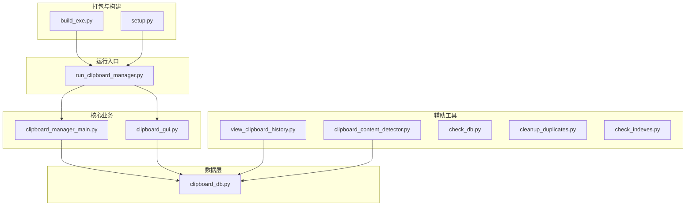
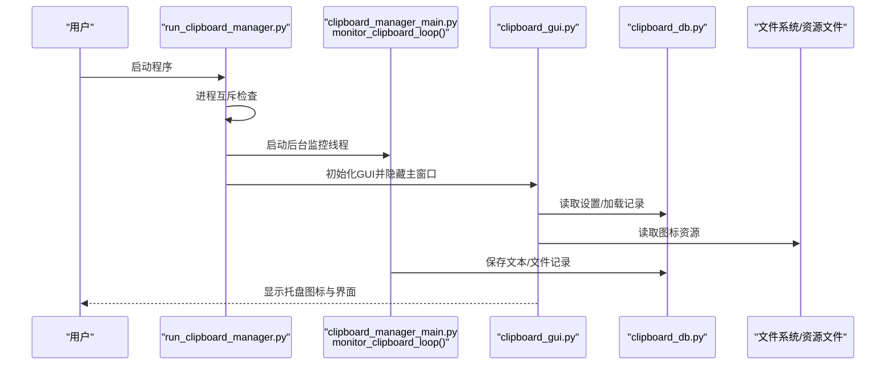
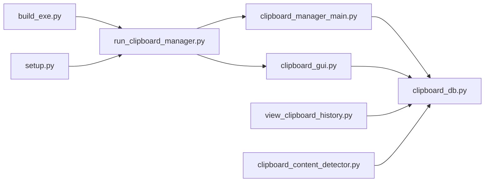

# 部署与运行

<cite>
**本文引用的文件**
- [build_exe.py](file://build_exe.py)
- [setup.py](file://setup.py)
- [run_clipboard_manager.py](file://run_clipboard_manager.py)
- [clipboard_manager_main.py](file://clipboard_manager_main.py)
- [clipboard_gui.py](file://clipboard_gui.py)
- [clipboard_db.py](file://clipboard_db.py)
- [view_clipboard_history.py](file://view_clipboard_history.py)
- [clipboard_content_detector.py](file://clipboard_content_detector.py)
- [check_db.py](file://check_db.py)
- [cleanup_duplicates.py](file://cleanup_duplicates.py)
- [check_indexes.py](file://check_indexes.py)
</cite>

## 目录
1. [简介](#简介)
2. [项目结构](#项目结构)
3. [核心组件](#核心组件)
4. [架构总览](#架构总览)
5. [详细组件分析](#详细组件分析)
6. [依赖关系分析](#依赖关系分析)
7. [性能与运行特性](#性能与运行特性)
8. [故障排查指南](#故障排查指南)
9. [结论](#结论)
10. [附录](#附录)

## 简介
本指南面向终端用户，提供“剪贴板管理器”的安装后使用流程与部署说明。内容覆盖：
- 如何通过打包脚本生成免Python环境的exe可执行文件，包含所有依赖库与资源文件
- 如何配置开机自启（基于Windows注册表HKEY_CURRENT_USER\Software\Microsoft\Windows\CurrentVersion\Run）
- 便携模式（Portable Mode）使用方式：将程序目录放入U盘随身携带，数据保存在本地db文件中
- 数据库文件clipboard_history.db的位置与备份方法
- 首次运行时的权限请求提示与防火墙注意事项

## 项目结构
该项目采用多文件模块化组织，主要由以下几类文件构成：
- 打包与构建：build_exe.py、setup.py
- 启动入口：run_clipboard_manager.py
- 核心业务：clipboard_manager_main.py（剪贴板监控、GUI主界面）、clipboard_gui.py（GUI界面与设置）
- 数据层：clipboard_db.py（SQLite数据库封装）
- 辅助工具：view_clipboard_history.py（控制台查看历史）、clipboard_content_detector.py（剪贴板内容检测器）、check_db.py、cleanup_duplicates.py、check_indexes.py（数据库维护脚本）

图表来源
- [build_exe.py](file://build_exe.py#L1-L81)
- [setup.py](file://setup.py#L1-L84)
- [run_clipboard_manager.py](file://run_clipboard_manager.py#L1-L71)
- [clipboard_manager_main.py](file://clipboard_manager_main.py#L1-L761)
- [clipboard_gui.py](file://clipboard_gui.py#L1-L800)
- [clipboard_db.py](file://clipboard_db.py#L1-L455)
- [view_clipboard_history.py](file://view_clipboard_history.py#L1-L75)
- [clipboard_content_detector.py](file://clipboard_content_detector.py#L1-L274)

章节来源
- [build_exe.py](file://build_exe.py#L1-L81)
- [setup.py](file://setup.py#L1-L84)

## 核心组件
- 打包脚本：build_exe.py与setup.py共同定义了打包目标、包含的包与模块、资源文件以及可执行文件清单，确保最终exe包含所有运行所需依赖。
- 启动入口：run_clipboard_manager.py负责进程互斥、后台监控线程启动与GUI初始化。
- 核心业务：
  - clipboard_manager_main.py：实现剪贴板监控、文本/文件记录保存、数据库交互与GUI主界面逻辑。
  - clipboard_gui.py：提供GUI界面、设置项（含开机自启、悬浮图标等）、托盘图标与统计展示。
- 数据层：clipboard_db.py封装SQLite数据库，提供表结构初始化、增删改查、设置读写与过期记录清理。
- 辅助工具：view_clipboard_history.py用于控制台查看历史；clipboard_content_detector.py用于检测剪贴板内容类型；check_db.py、cleanup_duplicates.py、check_indexes.py用于数据库维护。

章节来源
- [run_clipboard_manager.py](file://run_clipboard_manager.py#L1-L71)
- [clipboard_manager_main.py](file://clipboard_manager_main.py#L1-L761)
- [clipboard_gui.py](file://clipboard_gui.py#L1-L800)
- [clipboard_db.py](file://clipboard_db.py#L1-L455)
- [view_clipboard_history.py](file://view_clipboard_history.py#L1-L75)
- [clipboard_content_detector.py](file://clipboard_content_detector.py#L1-L274)
- [check_db.py](file://check_db.py#L1-L31)
- [cleanup_duplicates.py](file://cleanup_duplicates.py#L1-L67)
- [check_indexes.py](file://check_indexes.py#L1-L27)

## 架构总览
下图展示了从用户启动到剪贴板监控与GUI交互的整体流程，以及数据库与资源文件的参与关系。

图表来源
- [run_clipboard_manager.py](file://run_clipboard_manager.py#L1-L71)
- [clipboard_manager_main.py](file://clipboard_manager_main.py#L717-L761)
- [clipboard_gui.py](file://clipboard_gui.py#L1-L200)
- [clipboard_db.py](file://clipboard_db.py#L1-L120)

## 详细组件分析

### 打包与免Python环境运行
- 打包目标与资源：
  - 打包脚本会将图标文件、数据库文件（如存在）以及必要的Python包（如tkinter、sqlite3、hashlib、win32clipboard、win32con、PIL、pystray）一并打包进exe。
  - 可执行文件包括主程序、查看历史控制台版本、剪贴板内容检测器控制台版本。
- 依赖库与模块：
  - 包含的包与模块在两个打包脚本中均明确列出，确保exe内嵌tk、sqlite3、hashlib、win32clipboard、win32con、PIL、pystray等。
- 资源文件：
  - 图标文件与数据库文件会被包含在打包产物中，便于首次运行时直接使用。

章节来源
- [build_exe.py](file://build_exe.py#L1-L81)
- [setup.py](file://setup.py#L1-L84)

### 开机自启配置（Windows注册表）
- 设置入口：
  - GUI界面提供“开机自启”设置项，保存到数据库settings表中。
- 注册表实现：
  - 程序通过win32api/win32con等Windows API操作注册表HKEY_CURRENT_USER\Software\Microsoft\Windows\CurrentVersion\Run，实现开机自启的启用与禁用。
- 示例参考：
  - 由于本仓库未直接提供注册表操作代码片段，请参考以下路径以定位相关实现与调用点：
    - GUI设置保存逻辑：[clipboard_gui.py](file://clipboard_gui.py#L477-L533)
    - 设置读取与应用逻辑：[clipboard_gui.py](file://clipboard_gui.py#L89-L97)
    - 数据库设置字段：[clipboard_db.py](file://clipboard_db.py#L360-L412)

章节来源
- [clipboard_gui.py](file://clipboard_gui.py#L395-L533)
- [clipboard_db.py](file://clipboard_db.py#L360-L412)

### 便携模式（Portable Mode）
- 使用方式：
  - 将整个程序目录拷贝至U盘或其他移动介质，运行其中的exe即可。
  - 数据库文件clipboard_history.db位于程序目录根目录，随程序一起移动。
- 优点：
  - 无需安装，跨设备可直接使用。
  - 数据与程序解耦，便于备份与迁移。
- 缺点：
  - 需要每次在新机器上手动配置开机自启（若需要）。
  - 若U盘拔出，数据路径可能失效，需确保在同一路径下运行。

章节来源
- [clipboard_manager_main.py](file://clipboard_manager_main.py#L56-L111)
- [clipboard_db.py](file://clipboard_db.py#L1-L40)

### 数据库文件clipboard_history.db的位置与备份
- 位置：
  - 数据库文件clipboard_history.db位于程序目录根目录，随打包产物一同包含。
- 备份方法：
  - 直接复制clipboard_history.db文件到安全位置进行备份。
  - 可使用内置工具脚本辅助检查与维护：
    - 检查数据库内容：[check_db.py](file://check_db.py#L1-L31)
    - 清理重复MD5记录：[cleanup_duplicates.py](file://cleanup_duplicates.py#L1-L67)
    - 检查数据库索引：[check_indexes.py](file://check_indexes.py#L1-L27)

章节来源
- [check_db.py](file://check_db.py#L1-L31)
- [cleanup_duplicates.py](file://cleanup_duplicates.py#L1-L67)
- [check_indexes.py](file://check_indexes.py#L1-L27)

### 首次运行权限与防火墙注意事项
- 权限请求提示：
  - 程序通过win32clipboard访问系统剪贴板，首次运行可能触发系统权限弹窗，建议允许程序访问剪贴板。
- 防火墙：
  - 若程序需要网络功能（例如在线更新或远程服务），请在防火墙中放行对应端口或程序。
  - 当前仓库未包含网络功能实现，若未来引入网络功能，请在防火墙中放行相应规则。

章节来源
- [clipboard_manager_main.py](file://clipboard_manager_main.py#L395-L496)
- [clipboard_content_detector.py](file://clipboard_content_detector.py#L1-L120)

## 依赖关系分析
- 模块间依赖：
  - run_clipboard_manager.py依赖clipboard_manager_main.py与clipboard_gui.py，负责进程互斥与线程调度。
  - clipboard_manager_main.py与clipboard_gui.py均依赖clipboard_db.py进行数据库操作。
  - view_clipboard_history.py与clipboard_content_detector.py同样依赖clipboard_db.py。
- 打包依赖：
  - build_exe.py与setup.py声明了packages、includes、include_files等，确保exe包含运行所需的第三方库与资源文件。

图表来源
- [run_clipboard_manager.py](file://run_clipboard_manager.py#L1-L71)
- [clipboard_manager_main.py](file://clipboard_manager_main.py#L1-L120)
- [clipboard_gui.py](file://clipboard_gui.py#L1-L120)
- [clipboard_db.py](file://clipboard_db.py#L1-L120)
- [view_clipboard_history.py](file://view_clipboard_history.py#L1-L30)
- [clipboard_content_detector.py](file://clipboard_content_detector.py#L1-L40)
- [build_exe.py](file://build_exe.py#L1-L81)
- [setup.py](file://setup.py#L1-L84)

## 性能与运行特性
- 剪贴板监控：
  - 后台线程以固定间隔轮询剪贴板，避免阻塞GUI主线程。
- 数据库写入：
  - 文本记录按MD5去重，文件记录按MD5去重，减少重复存储。
- 设置项：
  - 支持无限模式与复制限制（数量与大小），可根据需要调整。
- GUI与托盘：
  - 默认隐藏主窗口，仅显示托盘图标，降低系统占用。

章节来源
- [clipboard_manager_main.py](file://clipboard_manager_main.py#L362-L394)
- [clipboard_manager_main.py](file://clipboard_manager_main.py#L112-L180)
- [clipboard_manager_main.py](file://clipboard_manager_main.py#L148-L180)
- [clipboard_gui.py](file://clipboard_gui.py#L1-L120)

## 故障排查指南
- 剪贴板访问异常：
  - 检查系统权限弹窗是否允许访问剪贴板。
  - 若出现异常，程序会在日志中打印错误信息，可结合日志定位问题。
- 数据库损坏或索引缺失：
  - 使用check_indexes.py检查索引是否存在。
  - 使用cleanup_duplicates.py清理重复MD5记录。
  - 使用check_db.py检查最近带MD5的记录与重复情况。
- 开机自启未生效：
  - 在GUI设置中勾选“允许程序开机自启”，保存后生效。
  - 若仍无效，检查注册表HKEY_CURRENT_USER\Software\Microsoft\Windows\CurrentVersion\Run中是否存在对应项。

章节来源
- [clipboard_manager_main.py](file://clipboard_manager_main.py#L488-L496)
- [check_indexes.py](file://check_indexes.py#L1-L27)
- [cleanup_duplicates.py](file://cleanup_duplicates.py#L1-L67)
- [check_db.py](file://check_db.py#L1-L31)
- [clipboard_gui.py](file://clipboard_gui.py#L477-L533)

## 结论
本项目通过打包脚本将Python应用转换为独立exe，内置所需依赖与资源文件，满足免Python环境运行的需求。配合GUI设置与数据库封装，用户可轻松实现开机自启、便携使用与数据备份。建议在U盘中携带程序目录，并在需要时通过GUI设置开启开机自启与悬浮图标，提升使用体验。

## 附录
- 打包命令参考：
  - 使用打包脚本生成exe，确保include_files包含图标与数据库文件，packages与includes包含必要模块。
- 运行命令参考：
  - 直接运行生成的exe；如需仅监控剪贴板，可在命令行传入相应参数（具体参数请参考主程序入口）。

章节来源
- [build_exe.py](file://build_exe.py#L1-L81)
- [setup.py](file://setup.py#L1-L84)
- [clipboard_manager_main.py](file://clipboard_manager_main.py#L731-L761)