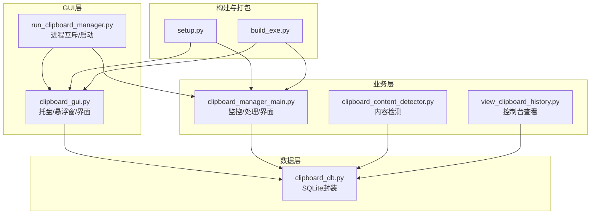
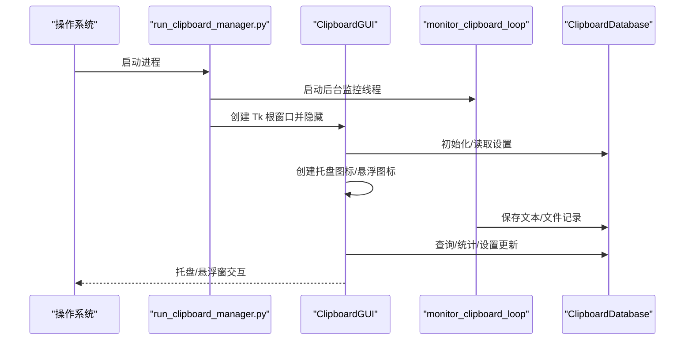
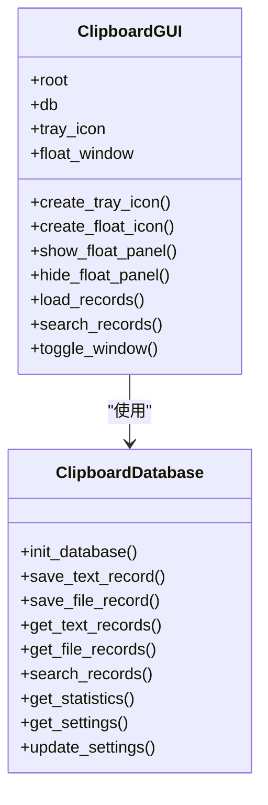
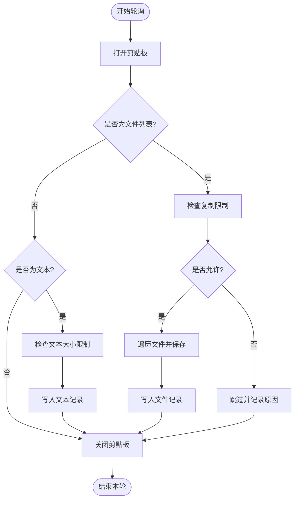
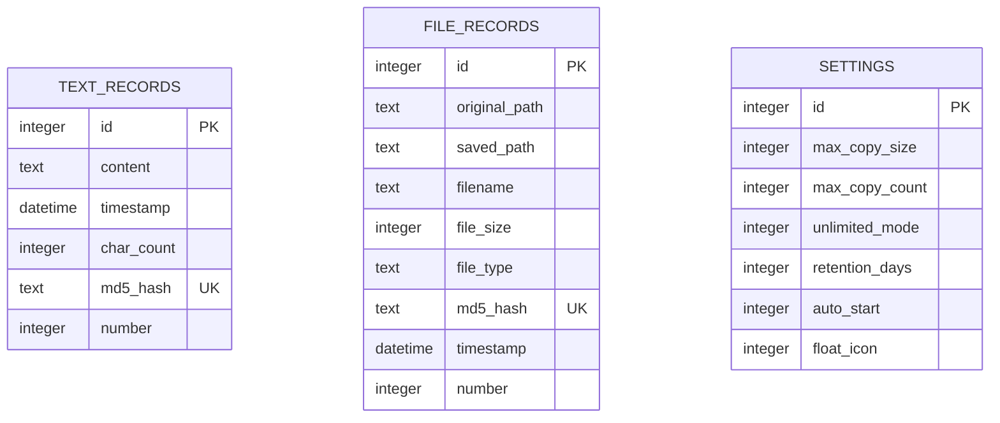
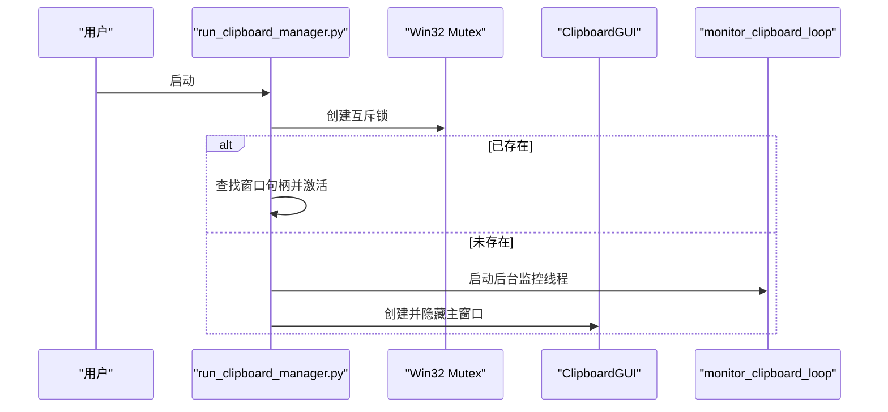
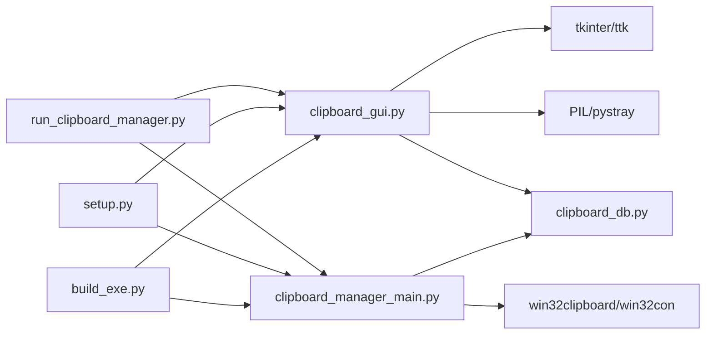

# GUI框架对比分析

<cite>
**本文引用的文件**
- [clipboard_gui.py](file://clipboard_gui.py)
- [clipboard_manager_main.py](file://clipboard_manager_main.py)
- [run_clipboard_manager.py](file://run_clipboard_manager.py)
- [setup.py](file://setup.py)
- [build_exe.py](file://build_exe.py)
- [clipboard_db.py](file://clipboard_db.py)
- [clipboard_content_detector.py](file://clipboard_content_detector.py)
- [view_clipboard_history.py](file://view_clipboard_history.py)
</cite>

## 目录
1. [简介](#简介)
2. [项目结构](#项目结构)
3. [核心组件](#核心组件)
4. [架构总览](#架构总览)
5. [详细组件分析](#详细组件分析)
6. [依赖关系分析](#依赖关系分析)
7. [性能考量](#性能考量)
8. [故障排查指南](#故障排查指南)
9. [结论](#结论)
10. [附录](#附录)

## 简介
本文件围绕 copyhistory 项目在 GUI 实现上的技术选型展开，系统性对比 tkinter 与主流 Python GUI 框架（PyQt/PySide、Kivy、wxPython）在学习曲线、功能特性、性能资源、社区维护等方面的差异，并结合项目实际需求（系统托盘、悬浮窗口、数据库交互等）论证选择 tkinter 的合理性与优势。文档旨在帮助读者快速理解项目现状与技术决策依据，同时提供可操作的优化建议与排障指引。

## 项目结构
copyhistory 采用“模块化 + 轻量 GUI”的组织方式：
- GUI 主入口与托盘/悬浮窗逻辑集中在 clipboard_gui.py
- 剪贴板监控与数据库交互集中在 clipboard_manager_main.py
- 启动器负责进程互斥、后台监控线程与 GUI 启动
- 打包配置位于 setup.py/build_exe.py
- 数据库模型与查询封装在 clipboard_db.py
- 其他辅助脚本提供控制台版本与内容检测能力

图表来源
- [clipboard_gui.py](file://clipboard_gui.py#L1-L200)
- [clipboard_manager_main.py](file://clipboard_manager_main.py#L1-L200)
- [run_clipboard_manager.py](file://run_clipboard_manager.py#L1-L71)
- [setup.py](file://setup.py#L1-L84)
- [build_exe.py](file://build_exe.py#L1-L81)
- [clipboard_db.py](file://clipboard_db.py#L1-L120)
- [clipboard_content_detector.py](file://clipboard_content_detector.py#L1-L120)
- [view_clipboard_history.py](file://view_clipboard_history.py#L1-L75)

章节来源
- [clipboard_gui.py](file://clipboard_gui.py#L1-L200)
- [clipboard_manager_main.py](file://clipboard_manager_main.py#L1-L200)
- [run_clipboard_manager.py](file://run_clipboard_manager.py#L1-L71)
- [setup.py](file://setup.py#L1-L84)
- [build_exe.py](file://build_exe.py#L1-L81)
- [clipboard_db.py](file://clipboard_db.py#L1-L120)
- [clipboard_content_detector.py](file://clipboard_content_detector.py#L1-L120)
- [view_clipboard_history.py](file://view_clipboard_history.py#L1-L75)

## 核心组件
- GUI 主类 ClipboardGUI：负责托盘图标、悬浮图标、悬浮面板、窗口生命周期、快捷键、数据库交互与界面渲染。
- 剪贴板管理器 ClipboardManager：负责监控剪贴板、处理文本/文件、去重与限流、写入数据库。
- 数据库封装 ClipboardDatabase：统一管理 SQLite 表结构、增删改查、统计与设置项。
- 启动器 run_clipboard_manager：进程互斥、后台监控线程、默认隐藏主窗口、托盘运行。
- 打包配置：setup.py/build_exe.py 统一包含 tkinter、sqlite3、win32clipboard、PIL、pystray 等依赖。

章节来源
- [clipboard_gui.py](file://clipboard_gui.py#L37-L200)
- [clipboard_manager_main.py](file://clipboard_manager_main.py#L355-L520)
- [clipboard_db.py](file://clipboard_db.py#L13-L120)
- [run_clipboard_manager.py](file://run_clipboard_manager.py#L1-L71)
- [setup.py](file://setup.py#L14-L68)
- [build_exe.py](file://build_exe.py#L14-L81)

## 架构总览
copyhistory 的运行时架构由“后台监控线程 + GUI 界面 + 数据库”三部分组成，GUI 通过托盘与悬浮窗实现低侵扰的常驻体验，数据库承担持久化与查询统计职责。

图表来源
- [run_clipboard_manager.py](file://run_clipboard_manager.py#L32-L71)
- [clipboard_manager_main.py](file://clipboard_manager_main.py#L717-L761)
- [clipboard_gui.py](file://clipboard_gui.py#L144-L173)
- [clipboard_db.py](file://clipboard_db.py#L116-L183)

章节来源
- [run_clipboard_manager.py](file://run_clipboard_manager.py#L32-L71)
- [clipboard_manager_main.py](file://clipboard_manager_main.py#L717-L761)
- [clipboard_gui.py](file://clipboard_gui.py#L144-L173)
- [clipboard_db.py](file://clipboard_db.py#L116-L183)

## 详细组件分析

### 组件A：ClipboardGUI（托盘/悬浮窗/界面）
- 托盘图标：基于 pystray 与 PIL，支持显示/退出菜单；在独立线程中运行，避免阻塞 GUI。
- 悬浮图标：Toplevel 无边框窗口，置顶、半透明，绑定悬停/点击/双击事件，实现“最近记录悬浮面板”。
- 界面布局：ttk Notebook + Treeview + Scrollbar，支持搜索、排序、复制/删除、双击查看详情。
- 快捷键与焦点：Alt+C 切换窗口显示；焦点事件用于判断是否隐藏窗口。
- 数据库交互：记录加载、搜索、统计展示、设置读写。

图表来源
- [clipboard_gui.py](file://clipboard_gui.py#L37-L200)
- [clipboard_gui.py](file://clipboard_gui.py#L1173-L1635)
- [clipboard_db.py](file://clipboard_db.py#L116-L200)

章节来源
- [clipboard_gui.py](file://clipboard_gui.py#L144-L173)
- [clipboard_gui.py](file://clipboard_gui.py#L1173-L1635)
- [clipboard_db.py](file://clipboard_db.py#L116-L200)

### 组件B：ClipboardManager（剪贴板监控与处理）
- 监控循环：定时轮询剪贴板，识别文本/文件格式，去重与限流，写入数据库。
- 限流策略：基于设置项限制文件数量与总大小，支持“无限模式”。
- 文件分类：按扩展名归类，生成带 MD5 的唯一文件名，避免重复拷贝。
- 文本处理：计算 MD5 去重，记录时间戳与字符数。

图表来源
- [clipboard_manager_main.py](file://clipboard_manager_main.py#L395-L496)
- [clipboard_manager_main.py](file://clipboard_manager_main.py#L362-L394)
- [clipboard_db.py](file://clipboard_db.py#L116-L183)

章节来源
- [clipboard_manager_main.py](file://clipboard_manager_main.py#L362-L496)
- [clipboard_manager_main.py](file://clipboard_manager_main.py#L355-L520)
- [clipboard_db.py](file://clipboard_db.py#L116-L183)

### 组件C：ClipboardDatabase（数据模型与查询）
- 表结构：text_records、file_records、settings，支持 md5 去重与 number 计数。
- 查询接口：分页/排序/搜索/统计/设置读写。
- 过期清理：按 retention_days 删除旧记录并同步删除磁盘文件。

图表来源
- [clipboard_db.py](file://clipboard_db.py#L18-L112)
- [clipboard_db.py](file://clipboard_db.py#L359-L412)

章节来源
- [clipboard_db.py](file://clipboard_db.py#L18-L112)
- [clipboard_db.py](file://clipboard_db.py#L359-L412)

### 组件D：启动器与打包（进程互斥与可执行文件）
- 进程互斥：使用 Win32 Mutex 防止重复启动，若已运行则激活已有窗口。
- 打包配置：包含 tkinter、sqlite3、win32clipboard、PIL、pystray 等依赖，输出多个可执行文件。

图表来源
- [run_clipboard_manager.py](file://run_clipboard_manager.py#L17-L46)
- [run_clipboard_manager.py](file://run_clipboard_manager.py#L55-L71)

章节来源
- [run_clipboard_manager.py](file://run_clipboard_manager.py#L17-L46)
- [run_clipboard_manager.py](file://run_clipboard_manager.py#L55-L71)
- [setup.py](file://setup.py#L14-L68)
- [build_exe.py](file://build_exe.py#L14-L81)

## 依赖关系分析
- GUI 依赖：tkinter、ttk、sqlite3、threading、PIL、pystray、win32clipboard/win32con。
- 业务依赖：clipboard_db、clipboard_manager_main。
- 打包依赖：cx_Freeze、include_files/packages/includes/excludes。

图表来源
- [clipboard_gui.py](file://clipboard_gui.py#L7-L26)
- [clipboard_manager_main.py](file://clipboard_manager_main.py#L18-L23)
- [run_clipboard_manager.py](file://run_clipboard_manager.py#L8-L16)
- [setup.py](file://setup.py#L14-L68)
- [build_exe.py](file://build_exe.py#L14-L81)

章节来源
- [clipboard_gui.py](file://clipboard_gui.py#L7-L26)
- [clipboard_manager_main.py](file://clipboard_manager_main.py#L18-L23)
- [run_clipboard_manager.py](file://run_clipboard_manager.py#L8-L16)
- [setup.py](file://setup.py#L14-L68)
- [build_exe.py](file://build_exe.py#L14-L81)

## 性能考量
- 轻量级 GUI：tkinter 作为 Python 内置库，启动快、资源占用低，适合常驻内存工具类应用。
- 后台监控：监控线程设为守护线程，避免阻塞 GUI 退出；数据库操作采用事务与索引，减少 IO 压力。
- 悬浮面板：仅在需要时创建，隐藏时销毁，降低内存与 CPU 占用。
- 打包体积：通过 cx_Freeze 精简 include，仅包含必要模块，减小最终可执行文件体积。

章节来源
- [clipboard_gui.py](file://clipboard_gui.py#L1173-L1635)
- [clipboard_manager_main.py](file://clipboard_manager_main.py#L717-L761)
- [clipboard_db.py](file://clipboard_db.py#L18-L112)
- [setup.py](file://setup.py#L14-L68)
- [build_exe.py](file://build_exe.py#L14-L81)

## 故障排查指南
- 托盘/悬浮窗不可用：确认已安装 PIL 与 pystray；若缺失，程序会打印提示信息。
- 窗口无法显示：Alt+C 快捷键无效时，检查焦点设置与事件绑定。
- 悬浮面板不出现：检查鼠标悬停/点击事件绑定与位置计算逻辑。
- 数据库异常：检查表结构初始化与索引创建；确认 settings 表字段存在。
- 打包失败：核对 include_files/packages/includes/excludes 是否包含所需模块与资源。

章节来源
- [clipboard_gui.py](file://clipboard_gui.py#L18-L26)
- [clipboard_gui.py](file://clipboard_gui.py#L173-L200)
- [clipboard_gui.py](file://clipboard_gui.py#L1173-L1635)
- [clipboard_db.py](file://clipboard_db.py#L18-L112)
- [setup.py](file://setup.py#L14-L68)
- [build_exe.py](file://build_exe.py#L14-L81)

## 结论
copyhistory 选择 tkinter 的理由如下：
- 学习曲线低：作为 Python 内置库，入门门槛低，开发效率高。
- 功能满足：托盘、悬浮窗、树形视图、滚动条、笔记控件等足以支撑项目需求。
- 轻量稳定：GUI 资源占用低，适合常驻内存工具；数据库与线程模型清晰可靠。
- 生态集成：与 win32clipboard、PIL、pystray 等生态无缝衔接，打包简单。
- 其他框架的局限：
  - PyQt/PySide：功能强大但体量大，依赖较多，不适合轻量工具。
  - Kivy：专为触摸应用设计，桌面体验欠佳。
  - wxPython：跨平台兼容性好，但桌面原生感与现代控件丰富度不及 tkinter。

因此，copyhistory 在保持功能完备的同时，最大化地降低了复杂度与资源消耗，tkinter 是最契合项目定位的选择。

## 附录
- 项目特性与 tkinter 的匹配度
  - 系统托盘：pystray + PIL 实现，轻量可靠。
  - 悬浮窗口：Toplevel + 事件绑定，灵活可控。
  - 数据库交互：SQLite + 自封装，简洁高效。
  - 打包发布：cx_Freeze + include 精简，部署便捷。

章节来源
- [clipboard_gui.py](file://clipboard_gui.py#L144-L173)
- [clipboard_gui.py](file://clipboard_gui.py#L1173-L1635)
- [clipboard_db.py](file://clipboard_db.py#L116-L183)
- [setup.py](file://setup.py#L14-L68)
- [build_exe.py](file://build_exe.py#L14-L81)