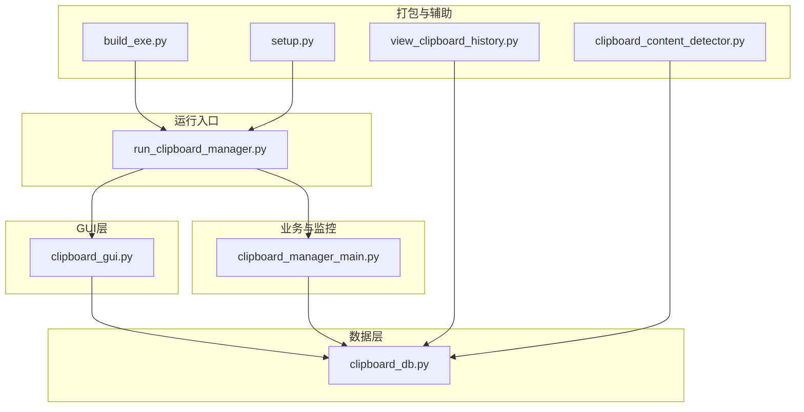
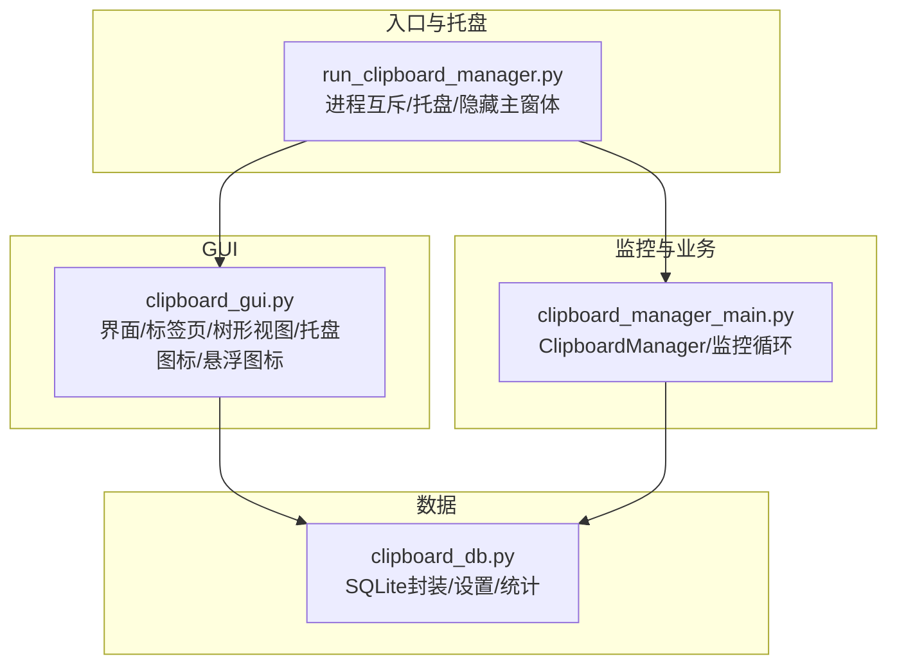
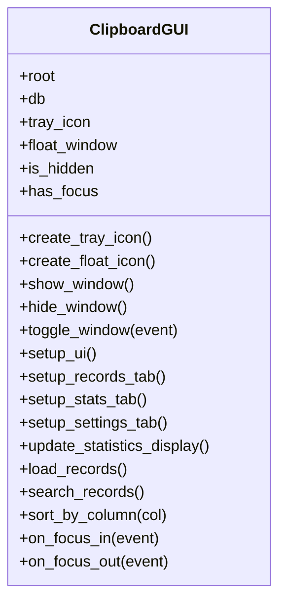
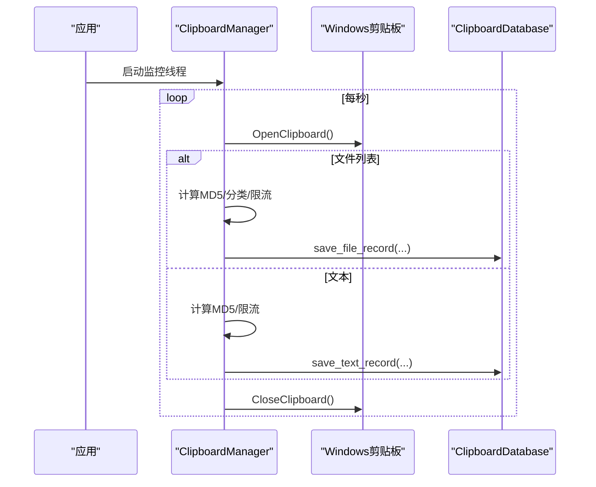
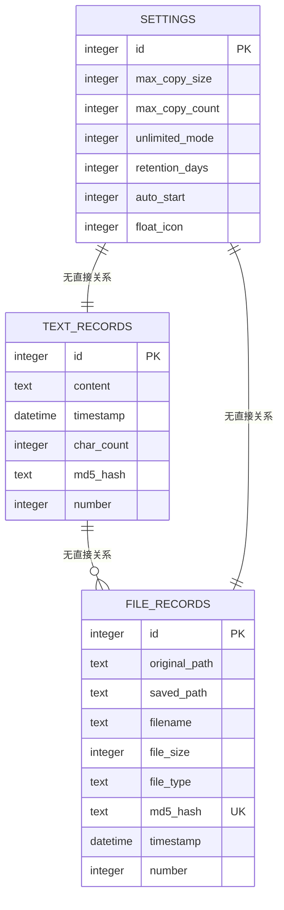
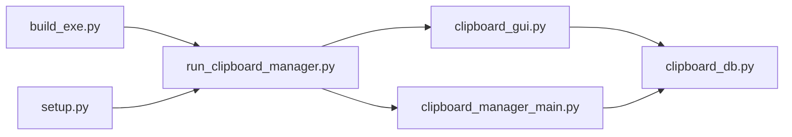

# GUI框架选择

<cite>
**本文引用的文件**
- [clipboard_gui.py](file://clipboard_gui.py)
- [run_clipboard_manager.py](file://run_clipboard_manager.py)
- [clipboard_manager_main.py](file://clipboard_manager_main.py)
- [clipboard_db.py](file://clipboard_db.py)
- [build_exe.py](file://build_exe.py)
- [setup.py](file://setup.py)
- [view_clipboard_history.py](file://view_clipboard_history.py)
- [clipboard_content_detector.py](file://clipboard_content_detector.py)
</cite>

## 目录
1. [简介](#简介)
2. [项目结构](#项目结构)
3. [核心组件](#核心组件)
4. [架构总览](#架构总览)
5. [详细组件分析](#详细组件分析)
6. [依赖关系分析](#依赖关系分析)
7. [性能考量](#性能考量)
8. [故障排查指南](#故障排查指南)
9. [结论](#结论)
10. [附录](#附录)

## 简介
本项目围绕“剪贴板历史记录”这一桌面工具目标，采用tkinter作为GUI框架，结合系统托盘（pystray）、Pillow图像处理与SQLite数据库，构建了具备监控、存储、查询与可视化展示能力的桌面应用。本文将从技术决策角度评估tkinter在该项目中的优势与局限，对比PyQt/Kivy等替代方案，并总结项目如何通过ttk主题与自绘手段缓解外观与布局问题，以及pystray在系统托盘中的集成方式与事件处理机制。最后给出面向类似项目的GUI框架选型决策树，帮助开发者在功能、性能与学习成本之间做出平衡。

## 项目结构
项目由多个脚本组成，分别承担不同职责：
- GUI入口与托盘：run_clipboard_manager.py
- 主GUI界面：clipboard_gui.py
- 剪贴板监控与业务逻辑：clipboard_manager_main.py
- 数据库封装：clipboard_db.py
- 打包配置：build_exe.py、setup.py
- 辅助工具：view_clipboard_history.py、clipboard_content_detector.py

图表来源
- [run_clipboard_manager.py](file://run_clipboard_manager.py#L1-L71)
- [clipboard_gui.py](file://clipboard_gui.py#L1-L1730)
- [clipboard_manager_main.py](file://clipboard_manager_main.py#L1-L761)
- [clipboard_db.py](file://clipboard_db.py#L1-L455)
- [build_exe.py](file://build_exe.py#L1-L81)
- [setup.py](file://setup.py#L1-L84)
- [view_clipboard_history.py](file://view_clipboard_history.py#L1-L75)
- [clipboard_content_detector.py](file://clipboard_content_detector.py#L1-L274)

章节来源
- [run_clipboard_manager.py](file://run_clipboard_manager.py#L1-L71)
- [clipboard_gui.py](file://clipboard_gui.py#L1-L1730)
- [clipboard_manager_main.py](file://clipboard_manager_main.py#L1-L761)
- [clipboard_db.py](file://clipboard_db.py#L1-L455)
- [build_exe.py](file://build_exe.py#L1-L81)
- [setup.py](file://setup.py#L1-L84)
- [view_clipboard_history.py](file://view_clipboard_history.py#L1-L75)
- [clipboard_content_detector.py](file://clipboard_content_detector.py#L1-L274)

## 核心组件
- GUI界面与托盘：ClipboardGUI类负责窗口布局、标签页、树形视图、搜索、统计、设置、系统托盘与悬浮图标等。
- 剪贴板监控与业务：ClipboardManager类负责监控剪贴板变化、识别文本/文件、限流策略、去重与入库。
- 数据访问：ClipboardDatabase类封装SQLite表结构、增删改查、统计与设置项。
- 入口与生命周期：run_clipboard_manager.py负责进程互斥、后台监控线程、隐藏主窗体与托盘交互。
- 打包与部署：build_exe.py/setup.py配置cx_Freeze打包，包含tkinter、sqlite3、win32clipboard、PIL、pystray等依赖。

章节来源
- [clipboard_gui.py](file://clipboard_gui.py#L1-L1730)
- [clipboard_manager_main.py](file://clipboard_manager_main.py#L1-L761)
- [clipboard_db.py](file://clipboard_db.py#L1-L455)
- [run_clipboard_manager.py](file://run_clipboard_manager.py#L1-L71)
- [build_exe.py](file://build_exe.py#L1-L81)
- [setup.py](file://setup.py#L1-L84)

## 架构总览
整体采用“入口/托盘 + GUI + 监控线程 + 数据库”的分层架构。GUI与监控线程通过ClipboardDatabase进行数据交互，托盘与悬浮图标提供低占用的桌面常驻体验。

图表来源
- [run_clipboard_manager.py](file://run_clipboard_manager.py#L1-L71)
- [clipboard_gui.py](file://clipboard_gui.py#L1-L1730)
- [clipboard_manager_main.py](file://clipboard_manager_main.py#L1-L761)
- [clipboard_db.py](file://clipboard_db.py#L1-L455)

## 详细组件分析

### GUI与系统托盘：ClipboardGUI
- 窗口与布局：使用ttk.Frame/ttk.LabelFrame/ttk.Notebook组织界面，Grid布局为主，权重配置保证响应式。
- 树形视图与排序：ttk.Treeview展示文本/文件记录，支持列点击排序与指示器更新。
- 搜索与统计：搜索框与刷新按钮，统计页使用Text+Scrollbar展示汇总信息。
- 设置页：包含复制限制、保存天数、开机自启、悬浮图标等开关与输入项。
- 系统托盘：基于pystray创建托盘图标，菜单项包含“显示界面/退出”，在独立线程中运行。
- 悬浮图标：Toplevel窗口实现半透明、置顶、可拖动的悬浮图标，支持悬停显示最近记录面板，自绘圆角背景与交互。

图表来源
- [clipboard_gui.py](file://clipboard_gui.py#L1-L1730)

章节来源
- [clipboard_gui.py](file://clipboard_gui.py#L1-L1730)

### 剪贴板监控与业务：ClipboardManager
- 监控循环：定时轮询剪贴板，区分文本与文件，避免重复保存（基于MD5），并应用复制限制（数量/大小/无限模式）。
- 文件分类：依据扩展名归类到文档/图片/视频/音频/PDF/办公/压缩/其它等类型。
- 数据持久化：将文本与文件记录写入SQLite，维护number计数与时间戳。

图表来源
- [clipboard_manager_main.py](file://clipboard_manager_main.py#L1-L761)

章节来源
- [clipboard_manager_main.py](file://clipboard_manager_main.py#L1-L761)

### 数据层：ClipboardDatabase
- 表结构：text_records、file_records、settings三张表，支持md5去重、number计数、retention_days、auto_start、float_icon等字段。
- 查询与统计：提供文本/文件记录的分页/排序查询、全文检索、统计汇总与过期清理。
- 设置管理：统一读取/更新设置项，支持开机自启与悬浮图标开关。

图表来源
- [clipboard_db.py](file://clipboard_db.py#L1-L455)

章节来源
- [clipboard_db.py](file://clipboard_db.py#L1-L455)

### 打包与部署：build_exe.py / setup.py
- 包含tkinter、sqlite3、hashlib、win32clipboard、win32con、PIL、pystray等包与模块。
- 包含图标与数据库文件，Win32GUI基座用于GUI可执行文件。
- 生成“剪贴板管理器.exe”、“查看剪贴板历史.exe”、“剪贴板内容检测器.exe”。

章节来源
- [build_exe.py](file://build_exe.py#L1-L81)
- [setup.py](file://setup.py#L1-L84)

### 辅助工具：view_clipboard_history.py / clipboard_content_detector.py
- view_clipboard_history.py：控制台输出最近文本/文件记录与统计信息。
- clipboard_content_detector.py：枚举剪贴板格式、读取文本/文件列表、打印内容摘要与复制限制检查。

章节来源
- [view_clipboard_history.py](file://view_clipboard_history.py#L1-L75)
- [clipboard_content_detector.py](file://clipboard_content_detector.py#L1-L274)

## 依赖关系分析
- GUI与业务解耦：GUI通过ClipboardDatabase访问数据，业务逻辑在ClipboardManager中集中处理。
- 托盘与GUI耦合：ClipboardGUI创建pystray托盘图标，菜单回调与GUI显示/退出联动。
- 监控线程：run_clipboard_manager.py启动后台线程，避免阻塞GUI主线程。
- 打包依赖：cx_Freeze包含tkinter、sqlite3、win32clipboard、PIL、pystray，确保可执行文件自包含。

图表来源
- [clipboard_gui.py](file://clipboard_gui.py#L1-L1730)
- [clipboard_manager_main.py](file://clipboard_manager_main.py#L1-L761)
- [clipboard_db.py](file://clipboard_db.py#L1-L455)
- [run_clipboard_manager.py](file://run_clipboard_manager.py#L1-L71)
- [build_exe.py](file://build_exe.py#L1-L81)
- [setup.py](file://setup.py#L1-L84)

章节来源
- [clipboard_gui.py](file://clipboard_gui.py#L1-L1730)
- [clipboard_manager_main.py](file://clipboard_manager_main.py#L1-L761)
- [clipboard_db.py](file://clipboard_db.py#L1-L455)
- [run_clipboard_manager.py](file://run_clipboard_manager.py#L1-L71)
- [build_exe.py](file://build_exe.py#L1-L81)
- [setup.py](file://setup.py#L1-L84)

## 性能考量
- GUI线程模型：tkinter事件循环与后台监控线程分离，避免界面卡顿。
- 数据库访问：使用SQLite，查询与插入均在本地，分页/排序在服务端完成，减少GUI渲染压力。
- 托盘与悬浮图标：托盘在独立线程运行，悬浮图标使用Toplevel窗口与自绘背景，尽量降低资源占用。
- 打包体积：通过cx_Freeze仅打包必要模块与资源，减少体积。

[本节为通用指导，不直接分析具体文件]

## 故障排查指南
- 托盘不可用：若未安装pystray/Pillow，会打印提示信息。可在运行前安装依赖以启用托盘与图标绘制。
- 界面无法显示：确认run_clipboard_manager.py中主窗口被隐藏且托盘已创建；Alt+C快捷键可切换显示。
- 悬浮图标异常：检查图片资源是否存在，若加载失败会回退为纯色背景与文本；确认鼠标事件绑定正常。
- 监控无反应：检查监控线程是否启动、剪贴板权限与Windows剪贴板格式支持；查看控制台输出的错误信息。
- 打包后缺失资源：确认build_exe.py/setup.py中include_files包含图标与数据库文件。

章节来源
- [clipboard_gui.py](file://clipboard_gui.py#L1-L1730)
- [run_clipboard_manager.py](file://run_clipboard_manager.py#L1-L71)
- [build_exe.py](file://build_exe.py#L1-L81)
- [setup.py](file://setup.py#L1-L84)

## 结论
本项目选择tkinter作为GUI框架，主要基于以下考虑：
- 零依赖与跨平台：tkinter为Python标准库，便于打包与部署，满足桌面工具的快速交付需求。
- 轻量与易用：界面组件丰富（ttk、Treeview、Notebook等），配合Grid布局与事件绑定，快速搭建功能完备的桌面应用。
- 与系统深度集成：结合pystray实现系统托盘，结合Pillow实现自绘与图标，结合win32clipboard实现剪贴板监控，形成完整的桌面工具链。
- 可扩展性：通过ClipboardDatabase抽象数据访问，ClipboardManager封装业务逻辑，GUI仅负责展示与交互，便于后续迭代。

局限性方面：
- 原生控件外观相对朴素，复杂布局与现代UI组件支持有限。
- 项目通过ttk主题与自绘（圆角背景、半透明、圆角面板）缓解外观问题；悬浮图标采用Toplevel窗口与自绘背景，提升可用性与美观度。

对比PyQt/Kivy：
- PyQt：功能更强大、组件更现代，但学习曲线更高、打包体积更大，适合复杂桌面应用。
- Kivy：更适合触屏与跨平台移动场景，桌面工具适配成本较高。
- 本项目定位为轻量桌面工具，tkinter在“快速开发、零依赖、跨平台、托盘集成”方面更契合。

[本节为总结性内容，不直接分析具体文件]

## 附录

### GUI框架选型决策树（适用于桌面工具）
- 是否需要跨平台且零依赖？
  - 是：优先考虑tkinter（Python标准库）。
  - 否：可考虑PyQt/Kivy。
- 是否需要现代化UI与复杂布局？
  - 是：PyQt/Kivy更合适。
  - 否：tkinter足以胜任。
- 是否需要系统托盘与低开销常驻？
  - 是：tkinter + pystray组合成熟稳定。
  - 否：可简化方案。
- 学习成本与开发周期要求？
  - 高：tkinter上手快，适合快速原型与小工具。
  - 低：PyQt/Kivy学习成本高，适合长期维护的大项目。

[本节为概念性流程图，不直接映射具体源码]