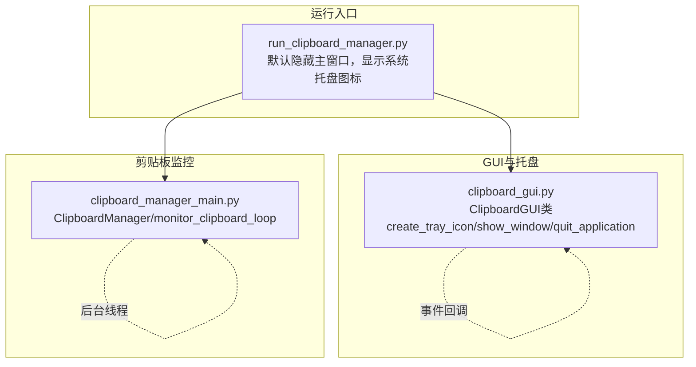
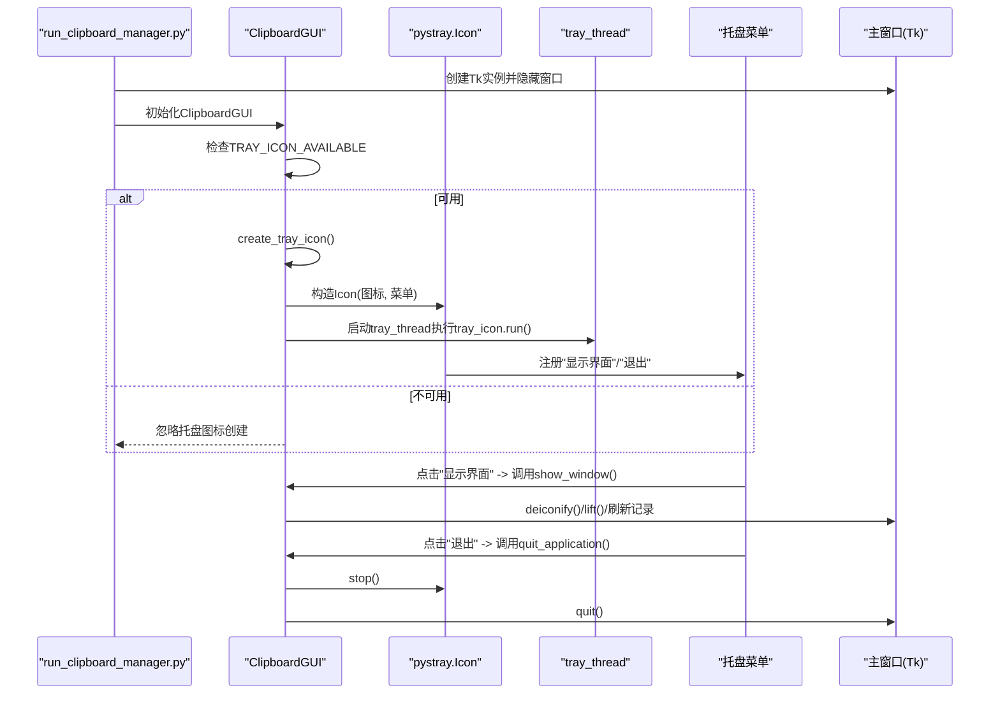
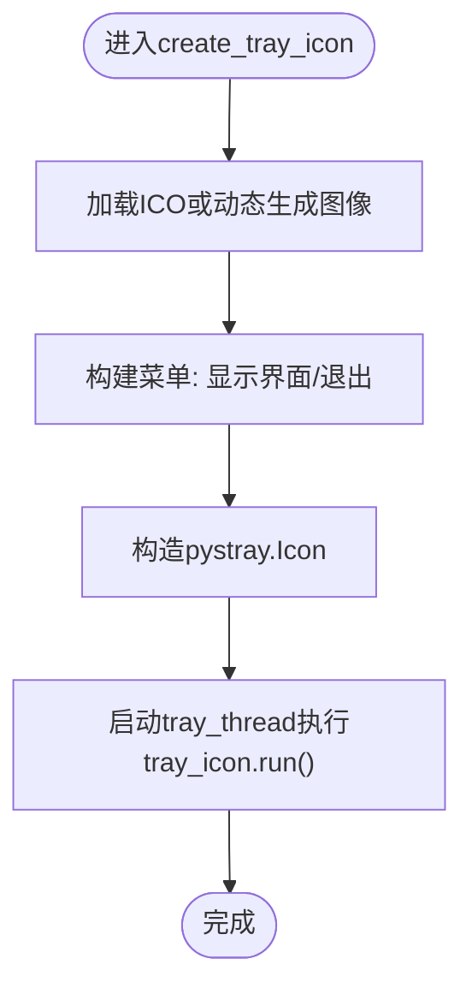
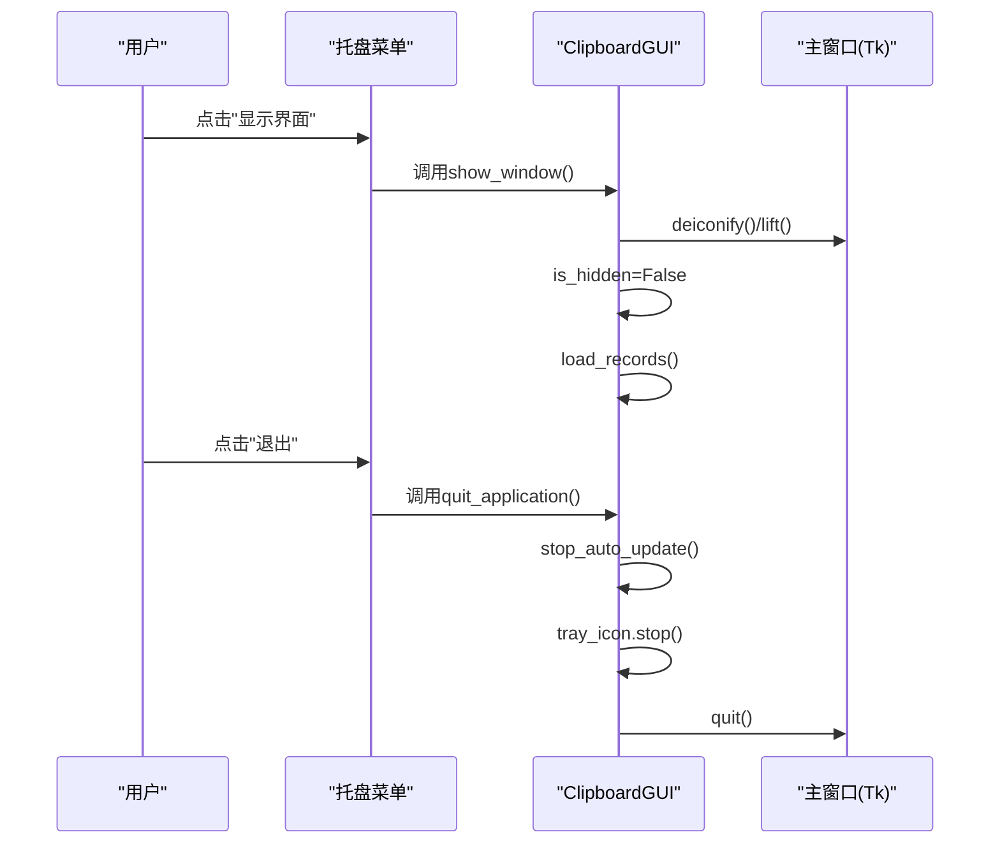
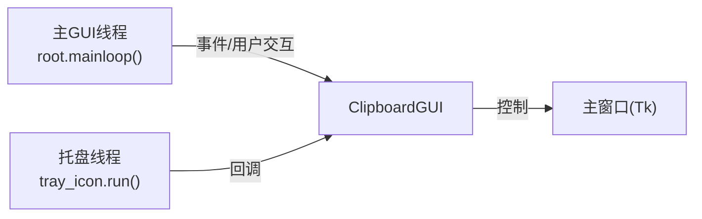
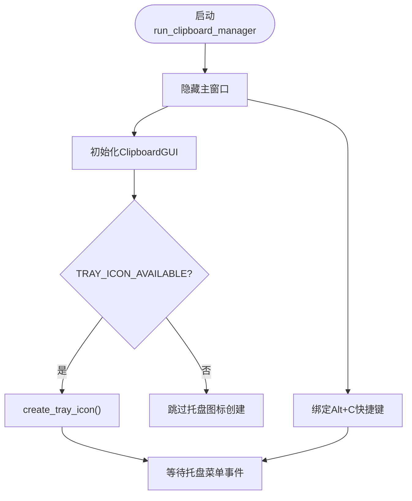
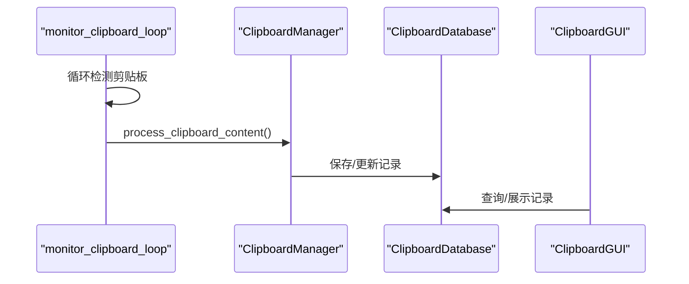
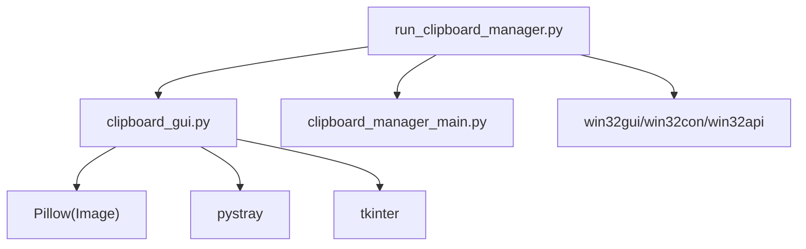

# pystray系统托盘集成

<cite>
**本文引用的文件**
- [clipboard_gui.py](file://clipboard_gui.py)
- [run_clipboard_manager.py](file://run_clipboard_manager.py)
- [clipboard_manager_main.py](file://clipboard_manager_main.py)
</cite>

## 目录
1. [简介](#简介)
2. [项目结构](#项目结构)
3. [核心组件](#核心组件)
4. [架构总览](#架构总览)
5. [详细组件分析](#详细组件分析)
6. [依赖关系分析](#依赖关系分析)
7. [性能考量](#性能考量)
8. [故障排查指南](#故障排查指南)
9. [结论](#结论)

## 简介
本文件围绕copyhistory项目中pystray库在系统托盘功能上的实现进行深入解析，重点说明：
- pystray如何弥补tkinter在系统托盘支持方面的不足，实现应用“最小化到托盘”而非“最小化到任务栏”
- 如何在clipboard_gui.py中通过create_tray_icon方法使用PIL加载ICO图标或动态生成图像作为托盘图标
- 如何构建包含“显示界面”和“退出”的右键菜单
- pystray与tkinter事件处理的集成机制：在独立线程中运行托盘图标（tray_thread），避免阻塞主GUI线程
- 通过回调函数（如show_window和quit_application）实现托盘菜单与主窗口的通信
- 异常处理策略：当pystray或Pillow未安装时的优雅降级（TRAY_ICON_AVAILABLE标志）
- 集成方式的稳定性、资源消耗与跨平台兼容性评估

## 项目结构
copyhistory项目采用模块化设计，系统托盘功能主要集中在clipboard_gui.py中，运行入口位于run_clipboard_manager.py，剪贴板监控与GUI主界面分别由clipboard_manager_main.py提供。

图表来源
- [run_clipboard_manager.py](file://run_clipboard_manager.py#L55-L66)
- [clipboard_gui.py](file://clipboard_gui.py#L144-L171)
- [clipboard_manager_main.py](file://clipboard_manager_main.py#L717-L759)

章节来源
- [run_clipboard_manager.py](file://run_clipboard_manager.py#L55-L66)
- [clipboard_gui.py](file://clipboard_gui.py#L144-L171)
- [clipboard_manager_main.py](file://clipboard_manager_main.py#L717-L759)

## 核心组件
- ClipboardGUI：负责GUI界面、托盘图标创建与事件回调、窗口显示/隐藏控制
- pystray.Icon：封装托盘图标、菜单项与运行线程
- PIL.Image：加载ICO或动态生成托盘图标
- run_clipboard_manager：默认隐藏主窗口，仅保留托盘图标，提供快捷键Alt+C切换显示

章节来源
- [clipboard_gui.py](file://clipboard_gui.py#L144-L171)
- [clipboard_gui.py](file://clipboard_gui.py#L1696-L1722)
- [run_clipboard_manager.py](file://run_clipboard_manager.py#L55-L66)

## 架构总览
pystray系统托盘集成的关键流程如下：
- 应用启动时，run_clipboard_manager默认隐藏主窗口，仅显示托盘图标
- ClipboardGUI在初始化时检测TRAY_ICON_AVAILABLE，若可用则调用create_tray_icon创建托盘图标
- 托盘图标菜单包含“显示界面”和“退出”，分别绑定到show_window与quit_application
- 托盘图标在独立线程中运行，避免阻塞主GUI线程
- 用户通过托盘菜单或快捷键Alt+C与主窗口交互

图表来源
- [run_clipboard_manager.py](file://run_clipboard_manager.py#L55-L66)
- [clipboard_gui.py](file://clipboard_gui.py#L144-L171)
- [clipboard_gui.py](file://clipboard_gui.py#L1696-L1722)

## 详细组件分析

### 托盘图标创建与菜单构建（create_tray_icon）
- 图标来源优先使用资源路径下的ICO文件；若不存在则使用PIL动态生成一个64x64的RGB图像，并绘制圆形与字母“C”
- 菜单项包含“显示界面”（默认项）和“退出”，分别绑定到show_window与quit_application
- 托盘图标在独立线程中运行，使用daemon=True避免主线程退出后线程悬挂

图表来源
- [clipboard_gui.py](file://clipboard_gui.py#L144-L171)

章节来源
- [clipboard_gui.py](file://clipboard_gui.py#L144-L171)

### 托盘菜单回调与GUI事件集成（show_window/quit_application）
- show_window：显示主窗口、提升置顶、标记is_hidden为False，并立即刷新记录
- quit_application：停止自动更新、停止托盘图标、退出主循环
- toggle_window：基于is_hidden状态切换显示/隐藏

图表来源
- [clipboard_gui.py](file://clipboard_gui.py#L1696-L1722)

章节来源
- [clipboard_gui.py](file://clipboard_gui.py#L1696-L1722)

### 线程模型与事件处理（tray_thread）
- 托盘图标在独立线程中运行，使用daemon=True，避免阻塞主GUI线程
- 主GUI线程负责用户交互与界面刷新；托盘线程负责监听菜单点击事件并触发回调
- 通过回调函数与主窗口状态同步（如is_hidden、记录刷新）

图表来源
- [clipboard_gui.py](file://clipboard_gui.py#L144-L171)
- [clipboard_gui.py](file://clipboard_gui.py#L1696-L1722)

章节来源
- [clipboard_gui.py](file://clipboard_gui.py#L144-L171)
- [clipboard_gui.py](file://clipboard_gui.py#L1696-L1722)

### 入口与最小化到托盘（run_clipboard_manager）
- run_clipboard_manager默认隐藏主窗口，仅显示系统托盘图标
- 提供Alt+C快捷键切换窗口显示状态
- 通过win32gui尝试激活已运行实例

图表来源
- [run_clipboard_manager.py](file://run_clipboard_manager.py#L55-L66)
- [clipboard_gui.py](file://clipboard_gui.py#L144-L171)

章节来源
- [run_clipboard_manager.py](file://run_clipboard_manager.py#L55-L66)
- [clipboard_gui.py](file://clipboard_gui.py#L144-L171)

### 剪贴板监控与GUI分离（clipboard_manager_main）
- 剪贴板监控在独立线程中运行，不依赖托盘线程
- GUI与监控线程解耦，避免相互阻塞
- 通过数据库接口共享数据状态

图表来源
- [clipboard_manager_main.py](file://clipboard_manager_main.py#L717-L759)

章节来源
- [clipboard_manager_main.py](file://clipboard_manager_main.py#L717-L759)

## 依赖关系分析
- 外部库依赖
  - pystray：系统托盘图标与菜单
  - Pillow(PIL)：图像加载与动态生成
  - tkinter：GUI界面与窗口控制
  - win32gui/win32con/win32api：进程互斥与窗口激活（入口脚本）
- 内部模块依赖
  - run_clipboard_manager导入ClipboardGUI与monitor_clipboard_loop
  - ClipboardGUI依赖ClipboardDatabase（来自clipboard_db.py，但其导入路径在clipboard_gui.py中）

图表来源
- [run_clipboard_manager.py](file://run_clipboard_manager.py#L1-L20)
- [clipboard_gui.py](file://clipboard_gui.py#L1-L26)
- [clipboard_manager_main.py](file://clipboard_manager_main.py#L1-L20)

章节来源
- [run_clipboard_manager.py](file://run_clipboard_manager.py#L1-L20)
- [clipboard_gui.py](file://clipboard_gui.py#L1-L26)
- [clipboard_manager_main.py](file://clipboard_manager_main.py#L1-L20)

## 性能考量
- 线程模型
  - 托盘线程daemon=True，避免主线程退出后线程悬挂
  - 剪贴板监控线程daemon=True，避免阻塞GUI
- 资源占用
  - 托盘图标为轻量级，PIL动态生成图像尺寸较小（64x64）
  - 数据库访问在GUI线程中进行，建议在高频刷新场景下考虑异步或批量刷新策略
- 跨平台兼容性
  - pystray与Pillow在Windows上表现稳定；若在其他平台部署，需验证托盘图标与菜单行为差异
  - 若缺少pystray/Pillow，系统会优雅降级（TRAY_ICON_AVAILABLE=False），不影响核心功能

[本节为通用指导，不直接分析具体文件]

## 故障排查指南
- 托盘图标不可用
  - 现象：控制台打印提示安装pystray与Pillow
  - 处理：安装依赖库后重启应用
  - 参考路径：[clipboard_gui.py](file://clipboard_gui.py#L18-L26)
- 托盘图标创建失败
  - 现象：捕获异常并打印错误信息
  - 处理：检查ICO文件是否存在、权限是否正确；确认PIL可用
  - 参考路径：[clipboard_gui.py](file://clipboard_gui.py#L144-L171)
- 退出异常
  - 现象：退出时未停止托盘图标导致残留
  - 处理：确保quit_application中调用tray_icon.stop()
  - 参考路径：[clipboard_gui.py](file://clipboard_gui.py#L1709-L1715)
- 窗口显示/隐藏异常
  - 现象：toggle_window无法正确切换
  - 处理：检查is_hidden状态与show_window/hide_window逻辑
  - 参考路径：[clipboard_gui.py](file://clipboard_gui.py#L1696-L1722)
- 入口脚本无法激活已有实例
  - 现象：多开或无法唤起已有窗口
  - 处理：检查互斥锁名称与win32api调用
  - 参考路径：[run_clipboard_manager.py](file://run_clipboard_manager.py#L17-L45)

章节来源
- [clipboard_gui.py](file://clipboard_gui.py#L18-L26)
- [clipboard_gui.py](file://clipboard_gui.py#L144-L171)
- [clipboard_gui.py](file://clipboard_gui.py#L1696-L1722)
- [clipboard_gui.py](file://clipboard_gui.py#L1709-L1715)
- [run_clipboard_manager.py](file://run_clipboard_manager.py#L17-L45)

## 结论
copyhistory项目通过pystray与Pillow实现了稳定的系统托盘功能，有效弥补了tkinter在系统托盘支持方面的不足。核心优势包括：
- 优雅降级：缺失依赖时仍可正常运行，仅禁用托盘图标
- 线程解耦：托盘线程与GUI线程分离，避免阻塞
- 事件集成：通过回调函数实现托盘菜单与主窗口的顺畅通信
- 最小化到托盘：默认隐藏主窗口，仅保留托盘图标，满足后台运行需求

在实际部署中，建议：
- 在目标平台验证pystray与Pillow的可用性
- 关注托盘图标渲染与菜单行为的跨平台差异
- 对高频刷新场景优化数据库访问与GUI刷新策略