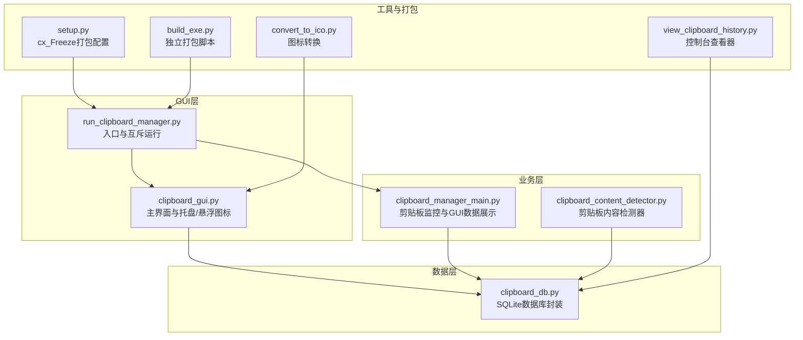
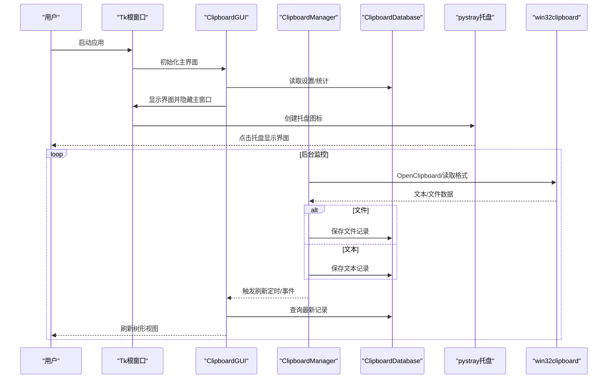
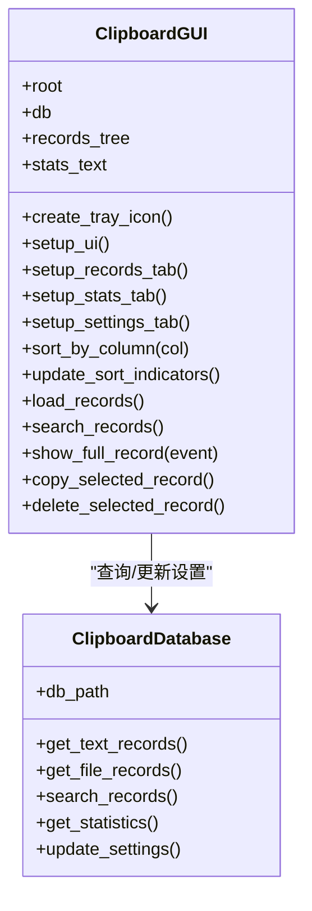
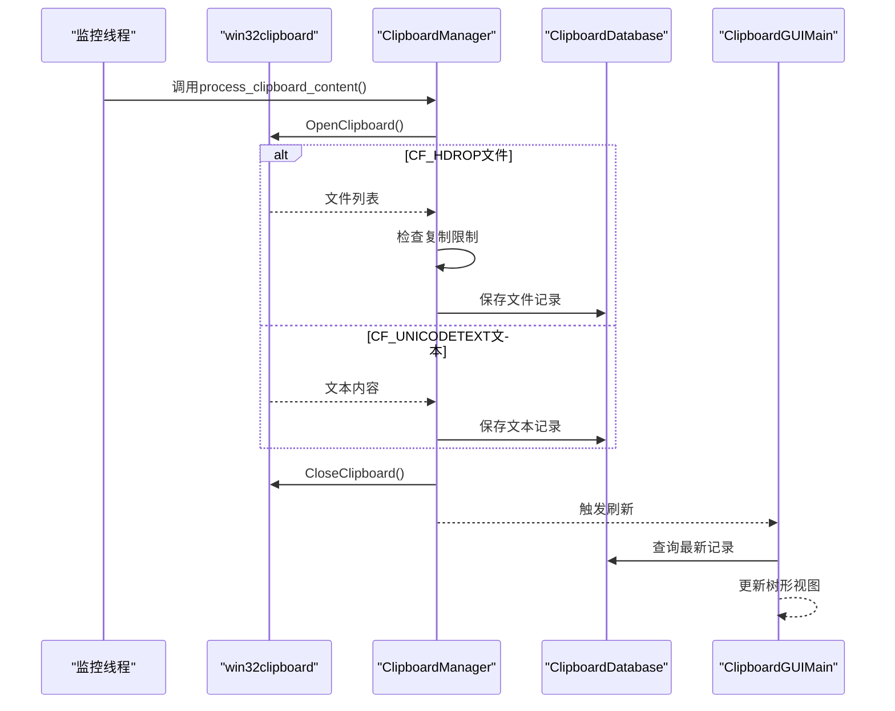
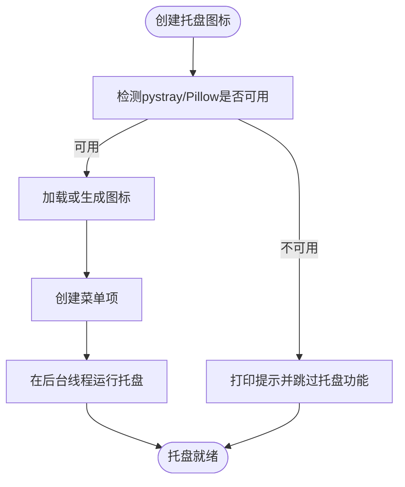
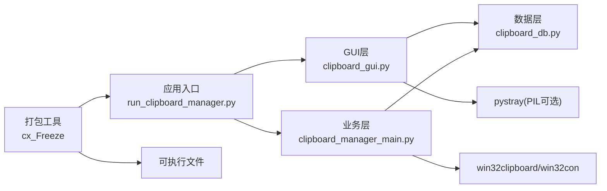

# tkinter优势分析

<cite>
**本文引用的文件**
- [clipboard_gui.py](file://clipboard_gui.py)
- [clipboard_manager_main.py](file://clipboard_manager_main.py)
- [run_clipboard_manager.py](file://run_clipboard_manager.py)
- [setup.py](file://setup.py)
- [build_exe.py](file://build_exe.py)
- [clipboard_db.py](file://clipboard_db.py)
- [clipboard_content_detector.py](file://clipboard_content_detector.py)
- [view_clipboard_history.py](file://view_clipboard_history.py)
- [convert_to_ico.py](file://convert_to_ico.py)
</cite>

## 目录
1. [简介](#简介)
2. [项目结构](#项目结构)
3. [核心组件](#核心组件)
4. [架构总览](#架构总览)
5. [详细组件分析](#详细组件分析)
6. [依赖关系分析](#依赖关系分析)
7. [性能考量](#性能考量)
8. [故障排查指南](#故障排查指南)
9. [结论](#结论)
10. [附录](#附录)

## 简介
本文件围绕copyhistory项目选择tkinter作为GUI框架的核心优势展开，结合项目实际代码，系统阐述以下要点：
- 零外部依赖：tkinter作为Python标准库，配合SQLite即可实现开箱即用，简化部署流程。
- 跨平台兼容：基于tkinter的界面在Windows/Linux/macOS上保持一致外观与行为，满足多平台一致性需求。
- 轻量级特性：GUI启动迅速、资源占用低，适合常驻系统托盘的桌面工具。
- 现代化UI：通过ttk组件构建标签页、树形视图等界面，grid布局实现响应式设计。
- 与Windows原生API无缝集成：通过win32clipboard实现剪贴板监控，通过pystray实现系统托盘图标。
- 实际性能表现：结合打包配置与运行机制，评估内存占用、启动速度与响应时间。

## 项目结构
项目采用“功能模块化 + 标准库优先”的组织方式：
- GUI层：clipboard_gui.py提供完整的图形界面，包含标签页、树形视图、设置面板、托盘图标与悬浮图标。
- 业务层：clipboard_manager_main.py负责剪贴板监控、内容处理与GUI数据展示。
- 数据层：clipboard_db.py封装SQLite数据库操作，统一记录与设置管理。
- 工具与打包：setup.py/build_exe.py负责可执行文件打包；convert_to_ico.py用于图标转换；view_clipboard_history.py提供控制台查看器；clipboard_content_detector.py提供剪贴板内容检测器。

图表来源
- [clipboard_gui.py](file://clipboard_gui.py#L1-L120)
- [run_clipboard_manager.py](file://run_clipboard_manager.py#L1-L71)
- [clipboard_manager_main.py](file://clipboard_manager_main.py#L1-L120)
- [clipboard_db.py](file://clipboard_db.py#L1-L120)
- [setup.py](file://setup.py#L1-L84)
- [build_exe.py](file://build_exe.py#L1-L81)
- [view_clipboard_history.py](file://view_clipboard_history.py#L1-L75)
- [convert_to_ico.py](file://convert_to_ico.py#L1-L48)

章节来源
- [clipboard_gui.py](file://clipboard_gui.py#L1-L120)
- [run_clipboard_manager.py](file://run_clipboard_manager.py#L1-L71)
- [clipboard_manager_main.py](file://clipboard_manager_main.py#L1-L120)
- [clipboard_db.py](file://clipboard_db.py#L1-L120)
- [setup.py](file://setup.py#L1-L84)
- [build_exe.py](file://build_exe.py#L1-L81)
- [view_clipboard_history.py](file://view_clipboard_history.py#L1-L75)
- [convert_to_ico.py](file://convert_to_ico.py#L1-L48)

## 核心组件
- GUI主类ClipboardGUI：负责窗口布局、标签页、树形视图、搜索、排序、托盘图标与悬浮图标等。
- 剪贴板监控与GUI展示ClipboardGUIMain：负责监控剪贴板变化并将结果展示在GUI中。
- 数据库封装ClipboardDatabase：统一管理文本/文件记录与设置项。
- 入口与互斥运行run_clipboard_manager：确保单实例运行，并默认隐藏主窗口，仅显示托盘图标。
- 打包配置setup.py/build_exe.py：将tkinter、sqlite3、win32clipboard、PIL、pystray等依赖打包为exe，便于部署。

章节来源
- [clipboard_gui.py](file://clipboard_gui.py#L1-L200)
- [clipboard_manager_main.py](file://clipboard_manager_main.py#L497-L761)
- [clipboard_db.py](file://clipboard_db.py#L1-L120)
- [run_clipboard_manager.py](file://run_clipboard_manager.py#L1-L71)
- [setup.py](file://setup.py#L1-L84)
- [build_exe.py](file://build_exe.py#L1-L81)

## 架构总览
下面的序列图展示了GUI与剪贴板监控、数据库之间的交互流程，体现tkinter在GUI层的职责与与底层系统的协作。

图表来源
- [run_clipboard_manager.py](file://run_clipboard_manager.py#L32-L71)
- [clipboard_manager_main.py](file://clipboard_manager_main.py#L355-L496)
- [clipboard_gui.py](file://clipboard_gui.py#L144-L171)
- [clipboard_db.py](file://clipboard_db.py#L116-L183)

## 详细组件分析

### GUI界面与ttk组件
- 标签页（ttk.Notebook）：在GUI中创建“记录”“统计”“设置”三个标签页，分别承载历史记录、统计信息与系统设置。
- 树形视图（ttk.Treeview）：用于展示历史记录，支持列标题点击排序、滚动条、双击查看详情等交互。
- 布局系统（grid）：通过columnconfigure/rowconfigure实现响应式布局，适配不同分辨率与窗口大小。

图表来源
- [clipboard_gui.py](file://clipboard_gui.py#L172-L219)
- [clipboard_gui.py](file://clipboard_gui.py#L227-L339)
- [clipboard_gui.py](file://clipboard_gui.py#L310-L327)
- [clipboard_gui.py](file://clipboard_gui.py#L328-L439)
- [clipboard_gui.py](file://clipboard_gui.py#L581-L626)
- [clipboard_gui.py](file://clipboard_gui.py#L627-L748)
- [clipboard_gui.py](file://clipboard_gui.py#L749-L800)
- [clipboard_db.py](file://clipboard_db.py#L185-L261)
- [clipboard_db.py](file://clipboard_db.py#L281-L314)
- [clipboard_db.py](file://clipboard_db.py#L316-L332)
- [clipboard_db.py](file://clipboard_db.py#L359-L412)

章节来源
- [clipboard_gui.py](file://clipboard_gui.py#L172-L219)
- [clipboard_gui.py](file://clipboard_gui.py#L227-L339)
- [clipboard_gui.py](file://clipboard_gui.py#L310-L327)
- [clipboard_gui.py](file://clipboard_gui.py#L328-L439)
- [clipboard_gui.py](file://clipboard_gui.py#L581-L626)
- [clipboard_gui.py](file://clipboard_gui.py#L627-L748)
- [clipboard_gui.py](file://clipboard_gui.py#L749-L800)
- [clipboard_db.py](file://clipboard_db.py#L185-L261)
- [clipboard_db.py](file://clipboard_db.py#L281-L314)
- [clipboard_db.py](file://clipboard_db.py#L316-L332)
- [clipboard_db.py](file://clipboard_db.py#L359-L412)

### 剪贴板监控与Windows原生集成
- 剪贴板监控：通过win32clipboard读取剪贴板格式（文本/文件），避免重复保存，按设置限制复制数量与大小。
- GUI数据展示：ClipboardGUIMain负责在GUI中展示文本/文件记录，并支持搜索与刷新。
- 系统托盘：通过pystray创建托盘图标，支持显示界面与退出菜单；若未安装pystray/Pillow，程序仍可运行但功能受限。

图表来源
- [clipboard_manager_main.py](file://clipboard_manager_main.py#L355-L496)
- [clipboard_manager_main.py](file://clipboard_manager_main.py#L497-L761)
- [clipboard_db.py](file://clipboard_db.py#L116-L183)
- [clipboard_db.py](file://clipboard_db.py#L185-L261)

章节来源
- [clipboard_manager_main.py](file://clipboard_manager_main.py#L355-L496)
- [clipboard_manager_main.py](file://clipboard_manager_main.py#L497-L761)
- [clipboard_db.py](file://clipboard_db.py#L116-L183)
- [clipboard_db.py](file://clipboard_db.py#L185-L261)

### 托盘图标与悬浮图标
- 托盘图标：在GUI初始化时创建pystray图标，菜单包含“显示界面”“退出”，线程化运行，不影响主线程。
- 悬浮图标：可选功能，创建半透明、置顶、可拖拽的小窗口，点击显示主界面，提升易用性。

图表来源
- [clipboard_gui.py](file://clipboard_gui.py#L144-L171)
- [clipboard_gui.py](file://clipboard_gui.py#L1165-L1198)

章节来源
- [clipboard_gui.py](file://clipboard_gui.py#L144-L171)
- [clipboard_gui.py](file://clipboard_gui.py#L1165-L1198)

### 响应式布局与现代UI
- grid布局：通过columnconfigure/rowconfigure权重实现弹性布局，标签页、树形视图、滚动条与按钮框架均采用grid组合，适配窗口缩放。
- ttk组件：ttk.Notebook、ttk.Treeview、ttk.Frame、ttk.Scrollbar等提供一致的现代外观，减少自绘成本。
- 可排序历史记录表格：通过列标题点击触发排序，支持正序/倒序切换，并在界面中显示排序指示器。

章节来源
- [clipboard_gui.py](file://clipboard_gui.py#L172-L219)
- [clipboard_gui.py](file://clipboard_gui.py#L227-L339)
- [clipboard_gui.py](file://clipboard_gui.py#L280-L308)

## 依赖关系分析
- Python标准库：tkinter、sqlite3、hashlib、threading、time、os、sys等，确保零外部依赖的GUI运行环境。
- Windows原生API：win32clipboard、win32con、win32gui、win32api等，实现剪贴板读写与窗口控制。
- 第三方库：PIL（图像处理）、pystray（系统托盘），作为可选增强功能，不影响核心GUI运行。
- 打包工具：cx_Freeze，将tkinter、sqlite3、win32clipboard、PIL、pystray等打包为exe，便于部署。

图表来源
- [run_clipboard_manager.py](file://run_clipboard_manager.py#L1-L71)
- [clipboard_gui.py](file://clipboard_gui.py#L1-L120)
- [clipboard_manager_main.py](file://clipboard_manager_main.py#L1-L120)
- [clipboard_db.py](file://clipboard_db.py#L1-L120)
- [setup.py](file://setup.py#L1-L84)
- [build_exe.py](file://build_exe.py#L1-L81)

章节来源
- [run_clipboard_manager.py](file://run_clipboard_manager.py#L1-L71)
- [clipboard_gui.py](file://clipboard_gui.py#L1-L120)
- [clipboard_manager_main.py](file://clipboard_manager_main.py#L1-L120)
- [clipboard_db.py](file://clipboard_db.py#L1-L120)
- [setup.py](file://setup.py#L1-L84)
- [build_exe.py](file://build_exe.py#L1-L81)

## 性能考量
- 零外部依赖与轻量级：tkinter与sqlite3均为标准库，启动快、内存占用低，适合常驻托盘工具。
- 启动流程优化：入口脚本默认隐藏主窗口，仅显示托盘图标，降低启动时可见开销。
- 后台监控线程：剪贴板监控在守护线程中运行，避免阻塞GUI主线程。
- 数据库访问：通过ClipboardDatabase封装查询与更新，避免频繁连接/断开，减少IO开销。
- 打包策略：cx_Freeze将tkinter、sqlite3、win32clipboard、PIL、pystray等打包为单一exe，部署简单，运行稳定。

章节来源
- [run_clipboard_manager.py](file://run_clipboard_manager.py#L55-L71)
- [clipboard_manager_main.py](file://clipboard_manager_main.py#L717-L761)
- [clipboard_db.py](file://clipboard_db.py#L185-L261)
- [setup.py](file://setup.py#L1-L84)
- [build_exe.py](file://build_exe.py#L1-L81)

## 故障排查指南
- 托盘图标不可用：若未安装pystray或Pillow，程序会打印提示并跳过托盘功能。可通过安装对应依赖启用。
- 图标文件缺失：GUI会尝试加载2.ico，若不存在则生成简单图标。可使用convert_to_ico.py将2.jpg转换为2.ico。
- 单实例冲突：入口脚本通过互斥锁确保单实例运行，若程序已在运行，会尝试激活已有窗口。
- 剪贴板权限：监控线程需正确OpenClipboard/CloseClipboard，异常时会捕获并继续运行。
- 设置与限制：复制限制（数量/大小）由设置表控制，保存后立即生效；过期记录可按设置自动清理。

章节来源
- [clipboard_gui.py](file://clipboard_gui.py#L144-L171)
- [convert_to_ico.py](file://convert_to_ico.py#L1-L48)
- [run_clipboard_manager.py](file://run_clipboard_manager.py#L17-L46)
- [clipboard_manager_main.py](file://clipboard_manager_main.py#L395-L496)
- [clipboard_db.py](file://clipboard_db.py#L359-L412)

## 结论
copyhistory项目选择tkinter作为GUI框架具有显著优势：
- 零外部依赖：tkinter+sqlite3即可运行，简化部署与维护。
- 跨平台兼容：界面与行为在多平台上保持一致，满足多场景使用。
- 轻量级特性：启动快、资源占用低，契合常驻托盘工具定位。
- 现代化UI：ttk组件与grid布局实现美观且响应式的界面。
- 与Windows原生API无缝集成：win32clipboard实现剪贴板监控，pystray实现系统托盘，提升用户体验。
- 实际性能：结合打包与线程化监控，整体内存占用、启动速度与响应时间表现良好。

## 附录
- 打包配置：setup.py与build_exe.py明确声明tkinter、sqlite3、win32clipboard、PIL、pystray等包，确保exe可独立运行。
- 图标转换：convert_to_ico.py提供从jpg到ico的转换工具，便于生成不同尺寸的图标资源。
- 控制台查看器：view_clipboard_history.py提供简洁的控制台输出，便于快速了解历史记录与统计信息。

章节来源
- [setup.py](file://setup.py#L1-L84)
- [build_exe.py](file://build_exe.py#L1-L81)
- [convert_to_ico.py](file://convert_to_ico.py#L1-L48)
- [view_clipboard_history.py](file://view_clipboard_history.py#L1-L75)