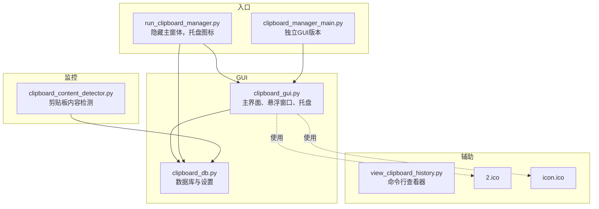
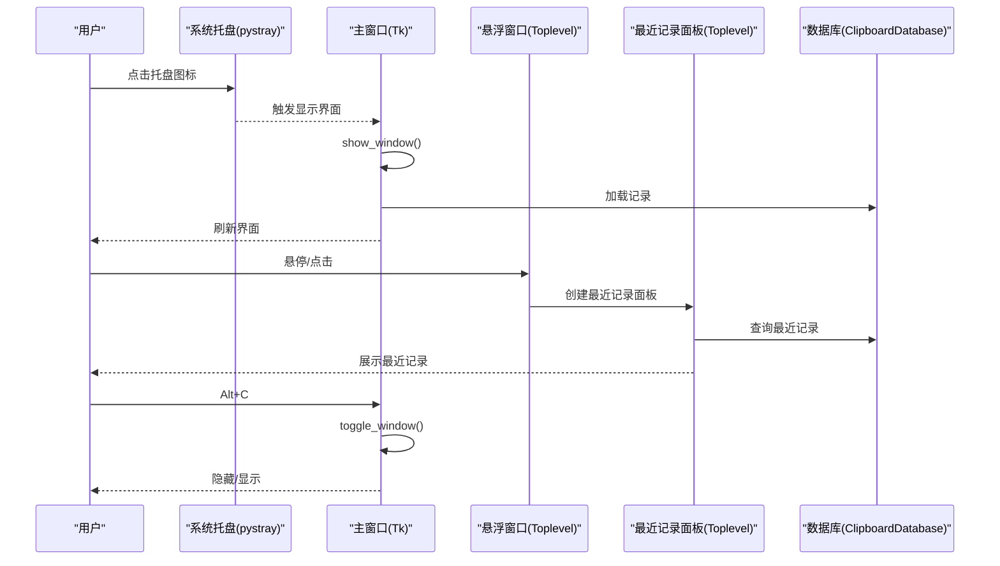
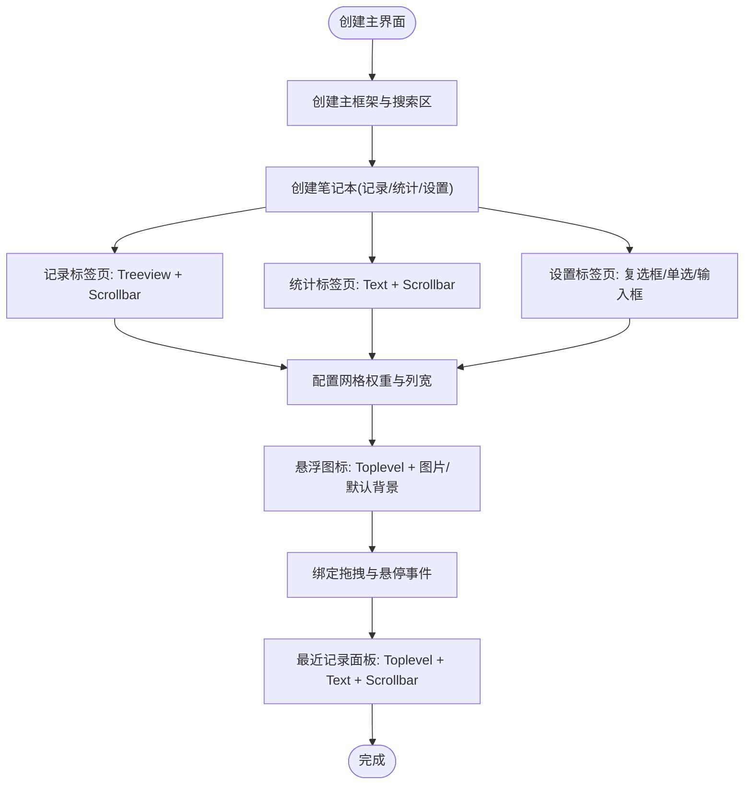
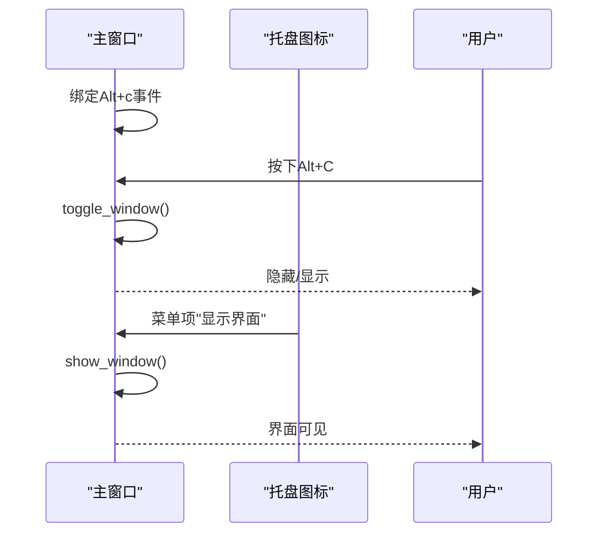
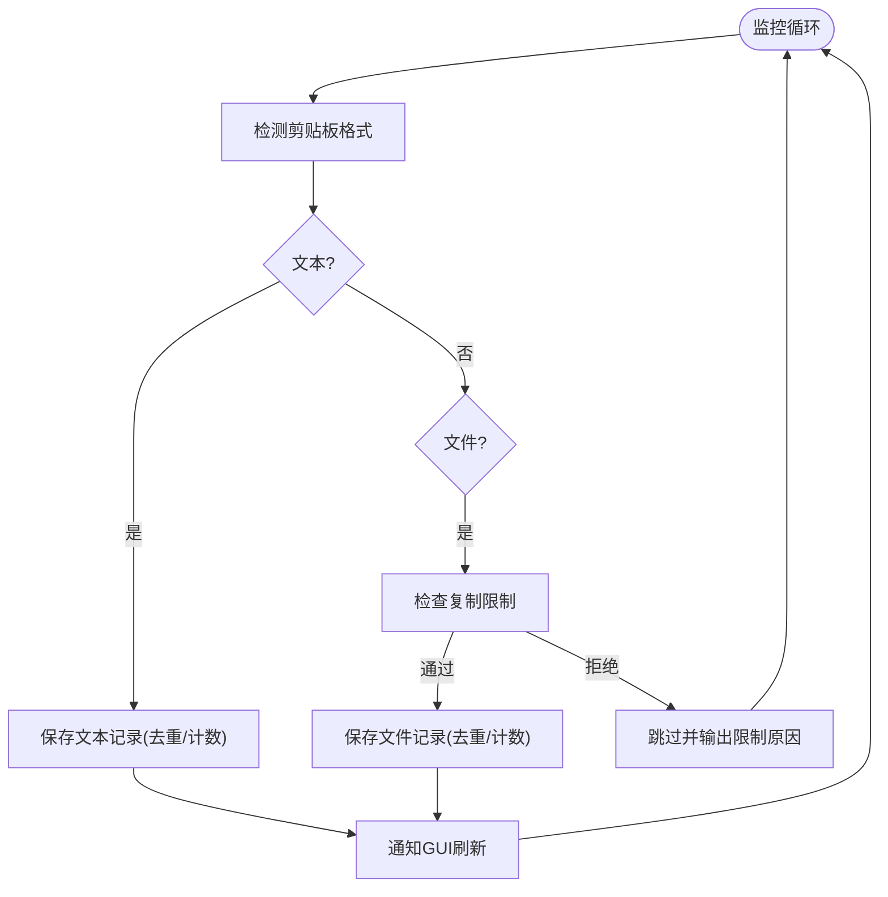
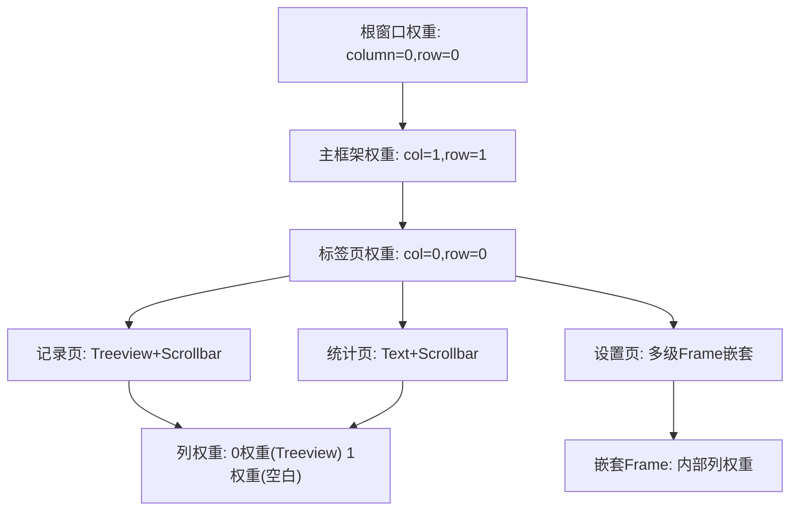
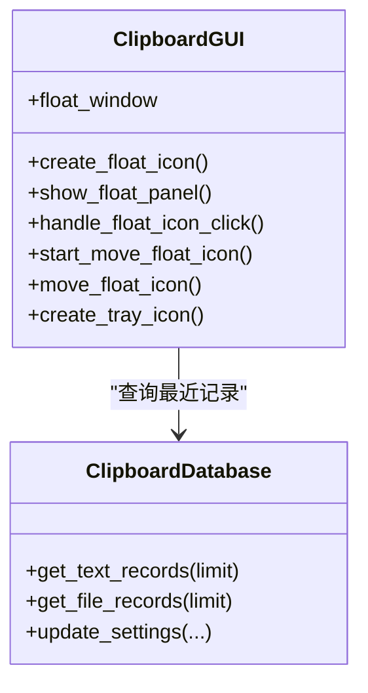
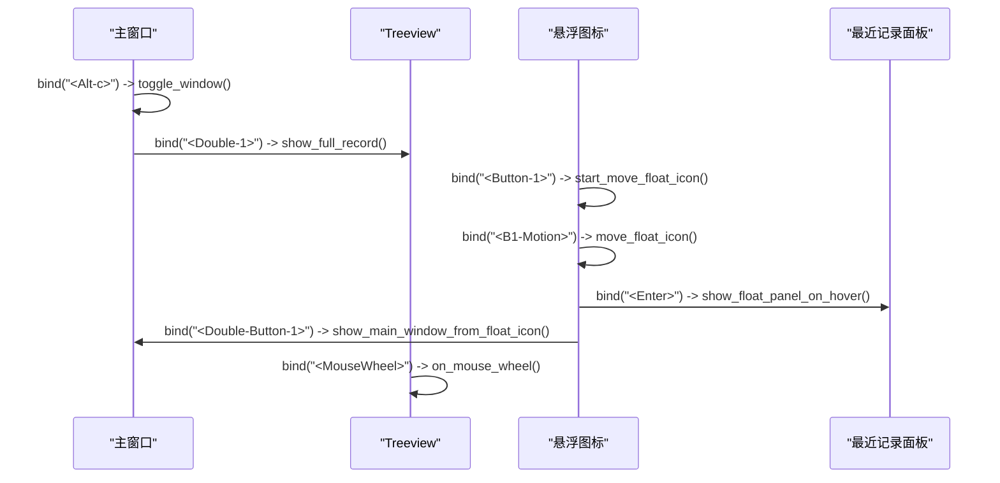
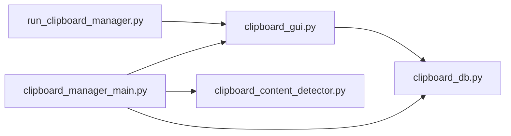

# tkinter局限性与缓解策略

<cite>
**本文引用的文件**
- [clipboard_gui.py](file://clipboard_gui.py)
- [clipboard_manager_main.py](file://clipboard_manager_main.py)
- [run_clipboard_manager.py](file://run_clipboard_manager.py)
- [clipboard_db.py](file://clipboard_db.py)
- [clipboard_content_detector.py](file://clipboard_content_detector.py)
- [view_clipboard_history.py](file://view_clipboard_history.py)
- [2.ico](file://2.ico)
- [icon.ico](file://icon.ico)
</cite>

## 目录
1. [引言](#引言)
2. [项目结构](#项目结构)
3. [核心组件](#核心组件)
4. [架构总览](#架构总览)
5. [详细组件分析](#详细组件分析)
6. [依赖关系分析](#依赖关系分析)
7. [性能考量](#性能考量)
8. [故障排查指南](#故障排查指南)
9. [结论](#结论)
10. [附录](#附录)

## 引言
本文件围绕tkinter在现代化GUI开发中的常见局限性展开，结合copyhistory项目的实践，系统说明如何通过ttk主题与样式、网格布局权重、自定义悬浮窗口与系统托盘、事件绑定与回调等技术手段缓解这些局限。重点覆盖：
- 原生控件外观陈旧、缺乏现代视觉效果：通过ttk控件与布局权重提升一致性与可读性。
- 复杂布局实现困难：通过columnconfigure/rowconfigure与嵌套框架构建多区域界面。
- 功能组件缺失：通过Canvas与Label组合实现悬浮窗口，通过pystray实现系统托盘。
- 事件处理模型复杂：通过bind与回调函数处理键盘快捷键与鼠标事件。
- 实际效果与维护成本：总结项目中的优化成效与潜在开销。

## 项目结构
copyhistory采用“监控+GUI”双入口设计：
- 监控入口：clipboard_manager_main.py提供独立GUI版本与纯监控版本。
- GUI入口：run_clipboard_manager.py默认隐藏主窗口，仅显示系统托盘图标，通过Alt+C快速唤起。
- 数据层：clipboard_db.py封装SQLite数据库与设置项。
- 辅助工具：clipboard_content_detector.py用于检测剪贴板内容类型；view_clipboard_history.py提供命令行查看器。

图表来源
- [run_clipboard_manager.py](file://run_clipboard_manager.py#L32-L66)
- [clipboard_manager_main.py](file://clipboard_manager_main.py#L504-L761)
- [clipboard_gui.py](file://clipboard_gui.py#L1-L120)
- [clipboard_db.py](file://clipboard_db.py#L1-L120)
- [clipboard_content_detector.py](file://clipboard_content_detector.py#L1-L60)
- [view_clipboard_history.py](file://view_clipboard_history.py#L1-L40)
- [2.ico](file://2.ico)
- [icon.ico](file://icon.ico)

章节来源
- [run_clipboard_manager.py](file://run_clipboard_manager.py#L32-L66)
- [clipboard_manager_main.py](file://clipboard_manager_main.py#L504-L761)
- [clipboard_gui.py](file://clipboard_gui.py#L1-L120)
- [clipboard_db.py](file://clipboard_db.py#L1-L120)
- [clipboard_content_detector.py](file://clipboard_content_detector.py#L1-L60)
- [view_clipboard_history.py](file://view_clipboard_history.py#L1-L40)

## 核心组件
- 主界面与悬浮窗口：基于ttk控件与Toplevel实现，支持置顶、透明度、拖拽、悬停显示最近记录面板。
- 系统托盘：通过pystray在Windows上创建托盘图标，支持显示界面与退出。
- 剪贴板监控：基于win32clipboard检测文本/文件变化，结合数据库去重与限制策略。
- 数据层：SQLite表结构与设置项，支持文本/文件记录、统计、过期清理等。

章节来源
- [clipboard_gui.py](file://clipboard_gui.py#L1170-L1369)
- [clipboard_gui.py](file://clipboard_gui.py#L144-L171)
- [clipboard_manager_main.py](file://clipboard_manager_main.py#L355-L761)
- [clipboard_db.py](file://clipboard_db.py#L1-L120)

## 架构总览

图表来源
- [clipboard_gui.py](file://clipboard_gui.py#L144-L171)
- [clipboard_gui.py](file://clipboard_gui.py#L1690-L1730)
- [clipboard_gui.py](file://clipboard_gui.py#L1170-L1369)
- [clipboard_db.py](file://clipboard_db.py#L185-L261)

## 详细组件分析

### 组件A：主界面与悬浮窗口（ttk主题与布局）
- 界面主体采用ttk.Frame/LabelFrame/Notebook组织多标签页，统一风格与可读性。
- grid布局权重配置：通过columnconfigure/rowconfigure实现响应式布局，保证主框架、各标签页、树形视图与滚动条的自适应。
- 悬浮窗口：使用Toplevel创建无边框、置顶、低透明度窗口，内置图片或默认背景，支持拖拽与悬停显示最近记录面板。
- 事件绑定：双击树形视图显示完整内容；鼠标滚轮事件透传；Alt+C快捷键切换窗口显示。

图表来源
- [clipboard_gui.py](file://clipboard_gui.py#L172-L219)
- [clipboard_gui.py](file://clipboard_gui.py#L227-L279)
- [clipboard_gui.py](file://clipboard_gui.py#L1170-L1369)
- [clipboard_gui.py](file://clipboard_gui.py#L1690-L1730)

章节来源
- [clipboard_gui.py](file://clipboard_gui.py#L172-L219)
- [clipboard_gui.py](file://clipboard_gui.py#L227-L279)
- [clipboard_gui.py](file://clipboard_gui.py#L1170-L1369)
- [clipboard_gui.py](file://clipboard_gui.py#L1690-L1730)

### 组件B：系统托盘与快捷键（事件处理模型）
- 系统托盘：在支持pystray/Pillow时创建托盘图标，菜单包含“显示界面/退出”，线程安全运行。
- 快捷键：绑定Alt+c/A lt-C触发toggle_window；焦点事件(FocusIn/FocusOut)用于控制自动刷新与交互。
- 窗口协议：WM_DELETE_WINDOW改为隐藏而非退出，配合托盘图标实现常驻。

图表来源
- [clipboard_gui.py](file://clipboard_gui.py#L220-L226)
- [clipboard_gui.py](file://clipboard_gui.py#L69-L75)
- [clipboard_gui.py](file://clipboard_gui.py#L1690-L1730)
- [run_clipboard_manager.py](file://run_clipboard_manager.py#L32-L66)

章节来源
- [clipboard_gui.py](file://clipboard_gui.py#L220-L226)
- [clipboard_gui.py](file://clipboard_gui.py#L69-L75)
- [clipboard_gui.py](file://clipboard_gui.py#L1690-L1730)
- [run_clipboard_manager.py](file://run_clipboard_manager.py#L32-L66)

### 组件C：剪贴板监控与数据层（功能扩展与限制）
- 监控：基于win32clipboard检测文本/文件格式，计算MD5避免重复，执行复制限制检查（数量/大小），保存至数据库。
- 数据层：SQLite表含text_records/file_records/settings，支持去重、计数、统计、过期清理、设置持久化。
- 界面联动：GUI定时刷新记录，悬浮面板展示最近记录，双击树形视图显示完整内容。

图表来源
- [clipboard_manager_main.py](file://clipboard_manager_main.py#L395-L496)
- [clipboard_manager_main.py](file://clipboard_manager_main.py#L717-L761)
- [clipboard_db.py](file://clipboard_db.py#L116-L183)
- [clipboard_db.py](file://clipboard_db.py#L387-L412)

章节来源
- [clipboard_manager_main.py](file://clipboard_manager_main.py#L395-L496)
- [clipboard_manager_main.py](file://clipboard_manager_main.py#L717-L761)
- [clipboard_db.py](file://clipboard_db.py#L116-L183)
- [clipboard_db.py](file://clipboard_db.py#L387-L412)

### 组件D：复杂布局实现（grid权重与嵌套框架）
- 主框架：root.columnconfigure(0, weight=1)/rowconfigure(0, weight=1)，main_frame.columnconfigure(1, weight=1)/rowconfigure(1, weight=1)。
- 标签页：records_frame/stats_frame/settings_frame均配置column/row权重，确保Treeview与滚动条自适应。
- 设置页：使用LabelFrame/Frame嵌套，内部再columnconfigure(weight=1)以实现输入控件随窗口拉伸。
- 记录页：Treeview+Scrollbar并排布局，右侧滚动条独立配置yscroll。

图表来源
- [clipboard_gui.py](file://clipboard_gui.py#L208-L219)
- [clipboard_gui.py](file://clipboard_gui.py#L276-L279)
- [clipboard_gui.py](file://clipboard_gui.py#L338-L435)

章节来源
- [clipboard_gui.py](file://clipboard_gui.py#L208-L219)
- [clipboard_gui.py](file://clipboard_gui.py#L276-L279)
- [clipboard_gui.py](file://clipboard_gui.py#L338-L435)

### 组件E：功能组件缺失的缓解（悬浮窗口与系统托盘）
- 悬浮窗口：Toplevel无边框、置顶、低透明度，支持拖拽、悬停显示最近记录面板，面板内使用Text+Scrollbar展示最近记录。
- 系统托盘：pystray创建托盘图标，菜单项“显示界面/退出”，线程运行避免阻塞GUI。
- 图标资源：优先加载2.ico/2.jpg，失败时回退到默认背景与文本。

图表来源
- [clipboard_gui.py](file://clipboard_gui.py#L1170-L1369)
- [clipboard_gui.py](file://clipboard_gui.py#L144-L171)
- [clipboard_db.py](file://clipboard_db.py#L185-L261)

章节来源
- [clipboard_gui.py](file://clipboard_gui.py#L1170-L1369)
- [clipboard_gui.py](file://clipboard_gui.py#L144-L171)
- [clipboard_db.py](file://clipboard_db.py#L185-L261)

### 组件F：事件处理模型（bind与回调）
- 键盘：Alt+c/A lt-C绑定toggle_window；焦点事件(FocusIn/FocusOut)影响自动刷新与交互。
- 鼠标：Treeview双击显示完整内容；悬浮图标绑定拖拽、悬停、点击与双击事件；面板底部标签绑定点击显示主窗口。
- 滚轮：Treeview绑定MouseWheel事件，透传给默认处理程序。

图表来源
- [clipboard_gui.py](file://clipboard_gui.py#L220-L226)
- [clipboard_gui.py](file://clipboard_gui.py#L269-L275)
- [clipboard_gui.py](file://clipboard_gui.py#L1218-L1228)
- [clipboard_gui.py](file://clipboard_gui.py#L1242-L1253)

章节来源
- [clipboard_gui.py](file://clipboard_gui.py#L220-L226)
- [clipboard_gui.py](file://clipboard_gui.py#L269-L275)
- [clipboard_gui.py](file://clipboard_gui.py#L1218-L1228)
- [clipboard_gui.py](file://clipboard_gui.py#L1242-L1253)

## 依赖关系分析
- 运行入口：run_clipboard_manager.py负责互斥运行、后台启动监控线程、隐藏主窗口并显示托盘图标。
- 独立GUI：clipboard_manager_main.py提供完整GUI版本，包含两个标签页与右键菜单。
- 数据依赖：clipboard_gui.py与clipboard_manager_main.py均依赖clipboard_db.py进行数据库操作。
- 监控依赖：clipboard_manager_main.py与clipboard_content_detector.py共同依赖win32clipboard进行剪贴板检测。

图表来源
- [run_clipboard_manager.py](file://run_clipboard_manager.py#L32-L66)
- [clipboard_manager_main.py](file://clipboard_manager_main.py#L504-L761)
- [clipboard_gui.py](file://clipboard_gui.py#L1-L120)
- [clipboard_db.py](file://clipboard_db.py#L1-L120)
- [clipboard_content_detector.py](file://clipboard_content_detector.py#L1-L60)

章节来源
- [run_clipboard_manager.py](file://run_clipboard_manager.py#L32-L66)
- [clipboard_manager_main.py](file://clipboard_manager_main.py#L504-L761)
- [clipboard_gui.py](file://clipboard_gui.py#L1-L120)
- [clipboard_db.py](file://clipboard_db.py#L1-L120)
- [clipboard_content_detector.py](file://clipboard_content_detector.py#L1-L60)

## 性能考量
- 定时刷新：主界面每2秒刷新一次记录，避免频繁数据库查询；仅在窗口有焦点且无用户操作时才更新，减少干扰。
- 悬浮面板：最近记录查询限制为50条，降低面板渲染压力。
- 监控频率：默认1秒检测一次，可通过命令行参数调整；在大量文件场景下建议适当增大间隔。
- I/O优化：数据库采用唯一索引与去重策略，避免重复写入；过期清理按天执行，减少冗余文件与记录。

章节来源
- [clipboard_gui.py](file://clipboard_gui.py#L1690-L1696)
- [clipboard_gui.py](file://clipboard_gui.py#L1260-L1277)
- [clipboard_manager_main.py](file://clipboard_manager_main.py#L717-L761)
- [clipboard_db.py](file://clipboard_db.py#L387-L412)

## 故障排查指南
- 系统托盘不可用：若缺少pystray/Pillow，程序会打印提示信息。安装依赖后重启即可启用托盘功能。
- 悬浮图标异常：检查2.jpg是否存在；若不存在则回退到默认背景与文本。确认Toplevel属性设置（无边框、置顶、透明度）。
- 快捷键无效：确保窗口获得焦点；Alt+c大小写均可触发；确认bind已正确绑定。
- 记录不刷新：检查自动更新任务是否仍在运行；确认WM_DELETE_WINDOW已改为隐藏而非退出。
- 监控未生效：确认监控线程已启动；检查win32clipboard权限与异常捕获。

章节来源
- [clipboard_gui.py](file://clipboard_gui.py#L144-L171)
- [clipboard_gui.py](file://clipboard_gui.py#L1170-L1217)
- [clipboard_gui.py](file://clipboard_gui.py#L220-L226)
- [clipboard_gui.py](file://clipboard_gui.py#L69-L75)
- [run_clipboard_manager.py](file://run_clipboard_manager.py#L32-L66)

## 结论
copyhistory通过以下策略有效缓解了tkinter在现代化GUI开发中的局限：
- 视觉与布局：广泛使用ttk控件与合理的grid权重配置，显著提升了界面一致性与可读性。
- 复杂布局：通过嵌套框架与权重设置，轻松实现多区域界面的自适应布局。
- 功能扩展：以Toplevel为基础构建悬浮窗口与最近记录面板，结合pystray实现系统托盘，弥补原生控件功能不足。
- 事件模型：通过bind与回调函数清晰地处理键盘与鼠标事件，保证交互体验流畅。
- 实际效果：界面简洁、功能完备、可扩展性强；维护成本主要集中在第三方依赖与跨平台兼容性上。

## 附录
- 命令行查看器：view_clipboard_history.py提供文本/文件记录与统计信息的命令行展示。
- 资源文件：2.ico与icon.ico用于托盘与窗口图标；2.jpg用于悬浮图标图片资源。

章节来源
- [view_clipboard_history.py](file://view_clipboard_history.py#L1-L75)
- [2.ico](file://2.ico)
- [icon.ico](file://icon.ico)