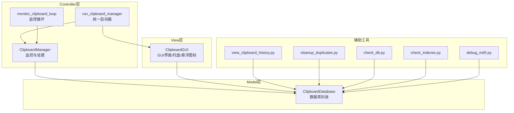
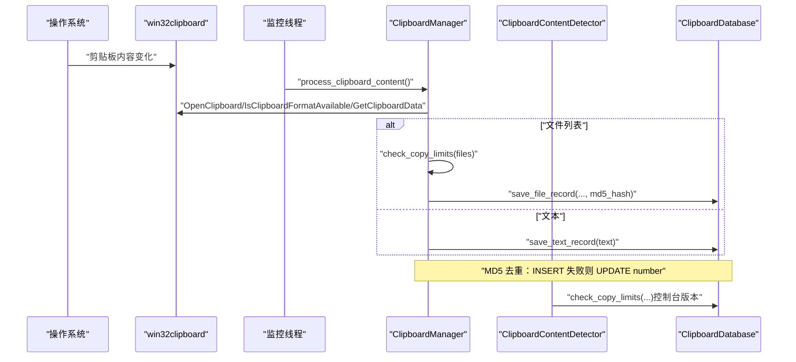
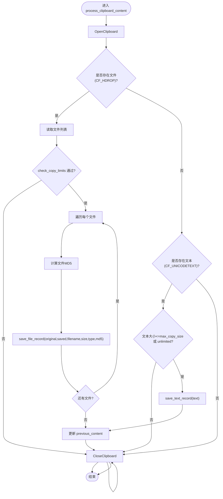
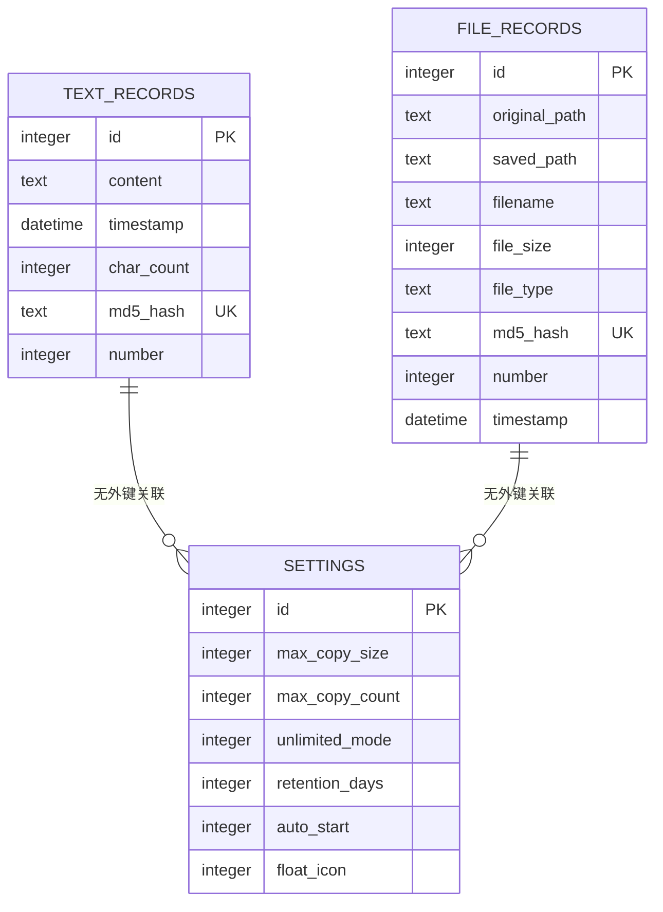
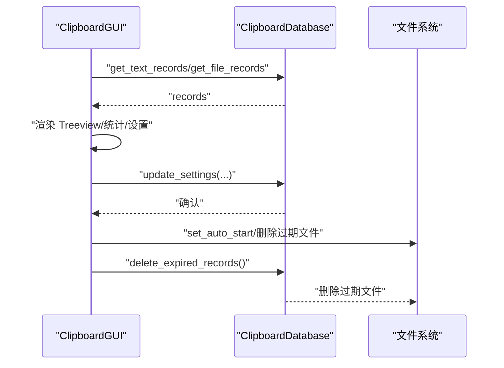
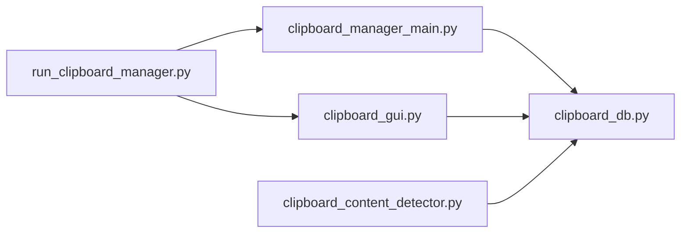
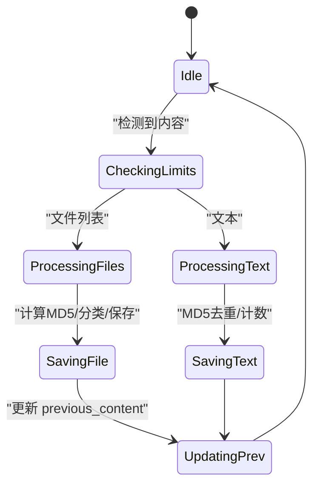
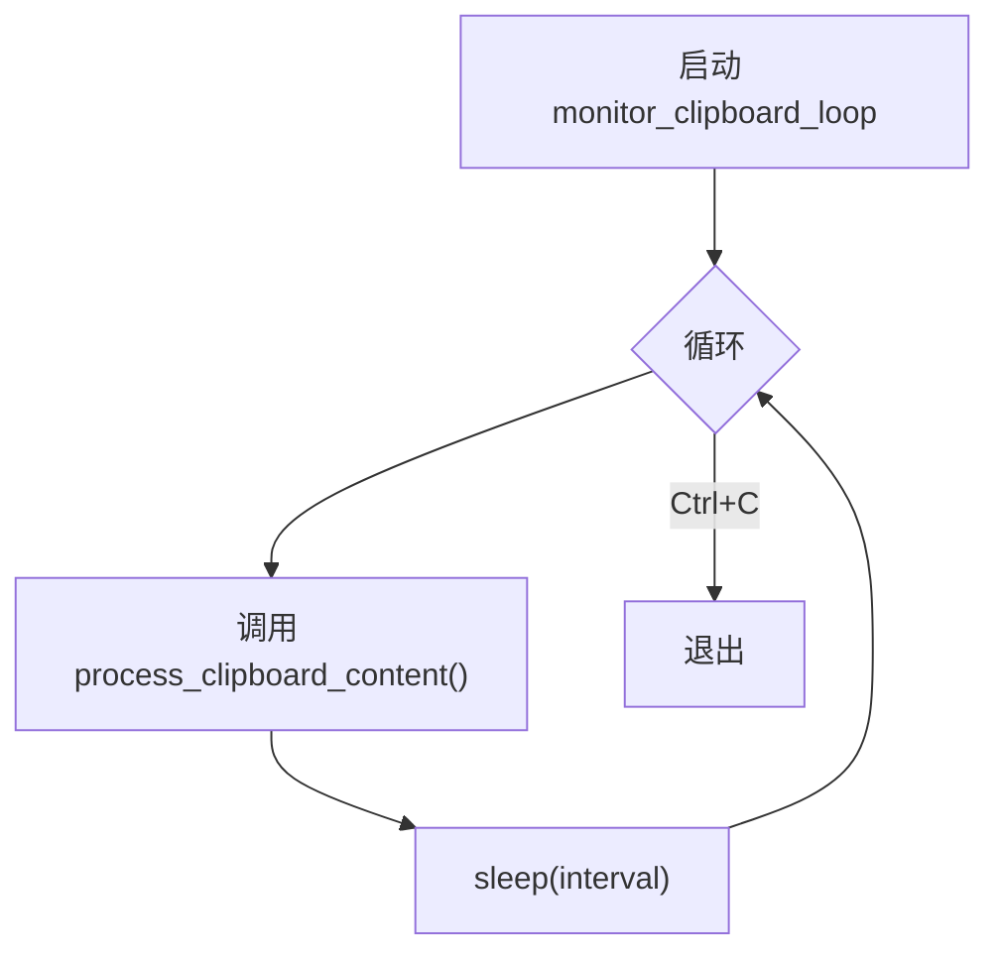

# Controller层逻辑

<cite>
**本文引用的文件**
- [clipboard_manager_main.py](file://clipboard_manager_main.py)
- [clipboard_content_detector.py](file://clipboard_content_detector.py)
- [clipboard_db.py](file://clipboard_db.py)
- [clipboard_gui.py](file://clipboard_gui.py)
- [run_clipboard_manager.py](file://run_clipboard_manager.py)
- [view_clipboard_history.py](file://view_clipboard_history.py)
- [cleanup_duplicates.py](file://cleanup_duplicates.py)
- [check_db.py](file://check_db.py)
- [check_indexes.py](file://check_indexes.py)
- [debug_md5.py](file://debug_md5.py)
</cite>

## 目录
1. [简介](#简介)
2. [项目结构](#项目结构)
3. [核心组件](#核心组件)
4. [架构总览](#架构总览)
5. [详细组件分析](#详细组件分析)
6. [依赖关系分析](#依赖关系分析)
7. [性能考量](#性能考量)
8. [故障排查指南](#故障排查指南)
9. [结论](#结论)
10. [附录](#附录)

## 简介
本文件系统性分析 copyhistory 项目的 Controller 层核心逻辑，聚焦 ClipboardManager 如何协调剪贴板监控、内容检测与业务调度；详解 monitor_clipboard_loop 如何通过 win32clipboard 实现变化监听并结合多线程模型保证 UI 响应；梳理内容检测流程（ClipboardContentDetector 的识别与配置限制 max_copy_size 的决策）、MD5 哈希与去重判断的执行时机及与 Model 层协作；阐述开机自启、自动清理过期记录等后台任务的触发条件与执行逻辑；最后以状态机与控制流图可视化核心业务流程，并给出事件驱动架构下的状态管理与异常处理策略，以及 Controller 向 View 层的数据更新通知与 GUI 功能调用反向操作支持。

## 项目结构
- Controller 层关键入口：
  - clipboard_manager_main.py：剪贴板监控与处理主逻辑、GUI 主界面、监控循环
  - clipboard_content_detector.py：独立的剪贴板内容检测器（控制台）
  - run_clipboard_manager.py：统一启动器，负责互斥运行、后台监控与 GUI 启动
- Model 层：
  - clipboard_db.py：SQLite 数据库封装、记录保存、查询、统计、设置、过期清理
- View 层：
  - clipboard_gui.py：GUI 界面、托盘图标、悬浮图标、自动更新、设置持久化
- 辅助工具：
  - view_clipboard_history.py、cleanup_duplicates.py、check_db.py、check_indexes.py、debug_md5.py

图表来源
- [clipboard_manager_main.py](file://clipboard_manager_main.py#L717-L761)
- [run_clipboard_manager.py](file://run_clipboard_manager.py#L32-L66)
- [clipboard_gui.py](file://clipboard_gui.py#L1-L120)
- [clipboard_db.py](file://clipboard_db.py#L1-L120)

章节来源
- [clipboard_manager_main.py](file://clipboard_manager_main.py#L1-L120)
- [run_clipboard_manager.py](file://run_clipboard_manager.py#L1-L71)

## 核心组件
- ClipboardManager：负责剪贴板内容检测、限制校验、文件/文本处理、MD5 去重与数据库写入
- ClipboardDatabase：负责数据库初始化、记录增删改查、统计、设置读取与更新、过期清理
- ClipboardGUI：负责 GUI 界面、托盘图标、悬浮图标、自动更新、设置持久化与用户交互
- run_clipboard_manager：进程互斥、后台监控线程、GUI 启动与托盘集成
- ClipboardContentDetector（控制台）：独立的剪贴板内容检测与限制检查

章节来源
- [clipboard_manager_main.py](file://clipboard_manager_main.py#L355-L761)
- [clipboard_db.py](file://clipboard_db.py#L1-L200)
- [clipboard_gui.py](file://clipboard_gui.py#L1-L200)
- [run_clipboard_manager.py](file://run_clipboard_manager.py#L1-L71)
- [clipboard_content_detector.py](file://clipboard_content_detector.py#L1-L120)

## 架构总览
Controller 层采用“事件驱动 + 后台监控”的架构：
- 后台线程持续调用 monitor_clipboard_loop，周期性触发 ClipboardManager.process_clipboard_content
- process_clipboard_content 通过 win32clipboard 判断文本/文件类型，调用限制检查与 MD5 去重，最终写入 ClipboardDatabase
- GUI 通过 ClipboardDatabase 提供的查询接口渲染视图，支持搜索、排序、统计、设置持久化
- 设置项（如 auto_start、retention_days、float_icon）由 GUI 写入数据库，影响后台任务（开机自启、过期清理）

图表来源
- [clipboard_manager_main.py](file://clipboard_manager_main.py#L395-L496)
- [clipboard_content_detector.py](file://clipboard_content_detector.py#L143-L181)
- [clipboard_db.py](file://clipboard_db.py#L116-L183)

## 详细组件分析

### ClipboardManager：剪贴板监控与业务调度
- 监控循环：monitor_clipboard_loop 在独立线程中周期性调用 process_clipboard_content，避免阻塞 GUI
- 内容检测：
  - 优先检测 CF_HDROP（文件列表），若存在则逐个计算 MD5、分类保存、去重计数
  - 若无文件则检测 CF_UNICODETEXT（文本），按字符数限制与 MD5 去重写入
- 限制检查：check_copy_limits 统一校验 unlimited_mode、max_copy_count、单文件与总大小限制
- 去重与计数：save_text_record/save_file_record 使用 md5_hash 唯一键约束，冲突时仅更新 number 与时间戳
- 异常处理：OpenClipboard/CloseClipboard 包裹，避免异常中断监控

图表来源
- [clipboard_manager_main.py](file://clipboard_manager_main.py#L395-L496)
- [clipboard_manager_main.py](file://clipboard_manager_main.py#L362-L394)
- [clipboard_db.py](file://clipboard_db.py#L116-L183)

章节来源
- [clipboard_manager_main.py](file://clipboard_manager_main.py#L355-L761)
- [clipboard_db.py](file://clipboard_db.py#L116-L183)

### ClipboardContentDetector：内容检测与限制检查（控制台）
- 通过 win32clipboard 枚举格式、读取文本/文件列表
- 提供 check_copy_limits 与 format_file_size，便于控制台输出与后续集成
- 支持长时间文本使用 MD5 作为内容键，避免重复显示

章节来源
- [clipboard_content_detector.py](file://clipboard_content_detector.py#L1-L274)

### ClipboardDatabase：Model 层与去重协作
- 表结构：text_records（含 md5_hash、number）、file_records（含 md5_hash、number）、settings（max_copy_size、max_copy_count、unlimited_mode、retention_days、auto_start、float_icon）
- 去重策略：INSERT 失败（UNIQUE 冲突）时 UPDATE number 与时间戳，保证去重与计数
- 设置持久化：get_settings/update_settings，支持开机自启、过期天数、悬浮图标等
- 过期清理：delete_expired_records，按 retention_days 删除记录并删除对应文件

图表来源
- [clipboard_db.py](file://clipboard_db.py#L18-L115)
- [clipboard_db.py](file://clipboard_db.py#L360-L412)

章节来源
- [clipboard_db.py](file://clipboard_db.py#L1-L200)
- [clipboard_db.py](file://clipboard_db.py#L360-L455)

### GUI 与 Controller 协作：数据更新通知与反向操作
- GUI 侧：
  - ClipboardGUI：托盘图标、悬浮图标、自动更新（每 2 秒），搜索、排序、统计、设置持久化
  - 通过 ClipboardDatabase 提供的查询接口渲染视图
- 反向操作：
  - 右键菜单打开文件位置、双击显示完整内容、删除记录、复制内容
  - 设置变更触发开机自启与过期清理逻辑

图表来源
- [clipboard_gui.py](file://clipboard_gui.py#L1-L200)
- [clipboard_gui.py](file://clipboard_gui.py#L1133-L1163)
- [clipboard_gui.py](file://clipboard_gui.py#L1676-L1696)
- [clipboard_db.py](file://clipboard_db.py#L413-L455)

章节来源
- [clipboard_gui.py](file://clipboard_gui.py#L1-L200)
- [clipboard_gui.py](file://clipboard_gui.py#L1133-L1163)
- [clipboard_gui.py](file://clipboard_gui.py#L1676-L1696)
- [clipboard_db.py](file://clipboard_db.py#L413-L455)

### 后台任务：开机自启与自动清理
- 开机自启：GUI 保存 auto_start 到 settings，set_auto_start 写入注册表 HKCU\Software\Microsoft\Windows\CurrentVersion\Run
- 自动清理：当 retention_days > 0 时，保存设置后立即调用 delete_expired_records，按时间阈值删除记录与文件

章节来源
- [clipboard_gui.py](file://clipboard_gui.py#L1133-L1163)
- [clipboard_db.py](file://clipboard_db.py#L413-L455)

### 事件驱动与状态管理
- 监控线程：daemon=True，随主线程退出而终止，避免僵尸进程
- GUI 自动更新：root.after(2000) 定时更新，受 is_hidden、user_action_in_progress、has_focus 控制，避免干扰用户
- 状态标志：ClipboardManager.previous_content 用于去重判定；GUI 的 user_action_in_progress 防止 UI 刷新与用户操作冲突

章节来源
- [clipboard_manager_main.py](file://clipboard_manager_main.py#L717-L761)
- [clipboard_gui.py](file://clipboard_gui.py#L1676-L1696)

### 异常处理策略
- 剪贴板访问：OpenClipboard/CloseClipboard 包裹，捕获非“OpenClipboard”异常，避免监控中断
- 文件 IO：计算 MD5、复制文件、删除过期文件均包含 try-except，打印错误但不中断整体流程
- GUI：托盘图标、悬浮图标创建失败时降级提示，不影响主流程

章节来源
- [clipboard_manager_main.py](file://clipboard_manager_main.py#L395-L496)
- [clipboard_gui.py](file://clipboard_gui.py#L144-L171)

## 依赖关系分析
- 运行入口：
  - run_clipboard_manager.py：互斥运行、后台监控线程、GUI 启动
  - clipboard_manager_main.py：CLI 模式与 GUI 模式的统一入口
- 组件耦合：
  - ClipboardManager 依赖 ClipboardDatabase（去重、计数、限制）
  - ClipboardGUI 依赖 ClipboardDatabase（查询、统计、设置）
  - ClipboardContentDetector 依赖 ClipboardDatabase（限制检查）
- 外部依赖：
  - win32clipboard/win32con：剪贴板 API
  - sqlite3：本地数据库
  - tkinter/pystray/PIL：GUI/托盘/悬浮图标
  - winreg：注册表（开机自启）

图表来源
- [run_clipboard_manager.py](file://run_clipboard_manager.py#L32-L66)
- [clipboard_manager_main.py](file://clipboard_manager_main.py#L731-L761)
- [clipboard_gui.py](file://clipboard_gui.py#L1-L120)
- [clipboard_content_detector.py](file://clipboard_content_detector.py#L1-L60)

章节来源
- [run_clipboard_manager.py](file://run_clipboard_manager.py#L1-L71)
- [clipboard_manager_main.py](file://clipboard_manager_main.py#L731-L761)
- [clipboard_gui.py](file://clipboard_gui.py#L1-L120)
- [clipboard_content_detector.py](file://clipboard_content_detector.py#L1-L60)

## 性能考量
- 监控频率：monitor_clipboard_loop 默认 1 秒一次，可在 CLI 模式下通过 -i 参数调整
- 去重优化：数据库使用 md5_hash 唯一键约束，INSERT 失败时 UPDATE number，避免重复写入
- GUI 更新：root.after(2000) 定时刷新，避免频繁数据库查询；has_focus 时暂停刷新
- 文件处理：大文件复制采用 shutil.copy2，MD5 分块读取，降低内存占用

章节来源
- [clipboard_manager_main.py](file://clipboard_manager_main.py#L717-L761)
- [clipboard_db.py](file://clipboard_db.py#L116-L183)
- [clipboard_gui.py](file://clipboard_gui.py#L1676-L1696)

## 故障排查指南
- 剪贴板访问失败：
  - 检查 OpenClipboard/CloseClipboard 是否正确包裹
  - 确认无其他进程占用剪贴板
- MD5 重复未合并：
  - 使用 debug_md5.py 验证 MD5 计算与去重逻辑
  - 使用 check_db.py 检查 md5_hash 字段与重复记录
  - 使用 cleanup_duplicates.py 手动合并重复记录
- 数据库索引缺失：
  - 使用 check_indexes.py 检查 text_records/file_records 索引
- 过期清理无效：
  - 确认 retention_days 设置为正数
  - 检查 delete_expired_records 执行日志
- GUI 无法显示：
  - 检查托盘图标依赖（pystray/Pillow）是否安装
  - 检查悬浮图标创建失败降级提示

章节来源
- [debug_md5.py](file://debug_md5.py#L1-L56)
- [check_db.py](file://check_db.py#L1-L31)
- [cleanup_duplicates.py](file://cleanup_duplicates.py#L1-L67)
- [check_indexes.py](file://check_indexes.py#L1-L27)
- [clipboard_gui.py](file://clipboard_gui.py#L144-L171)

## 结论
Controller 层通过 ClipboardManager 将 win32clipboard 事件与数据库写入解耦，借助多线程监控与 GUI 自动更新实现高响应性；通过 md5 去重与计数提升存储效率；通过设置持久化实现开机自启与过期清理等后台任务。整体采用事件驱动与状态标志控制，异常处理稳健，具备良好的可维护性与扩展性。

## 附录

### 状态机图：ClipboardManager 内容处理状态

图表来源
- [clipboard_manager_main.py](file://clipboard_manager_main.py#L395-L496)

### 控制流图：monitor_clipboard_loop

图表来源
- [clipboard_manager_main.py](file://clipboard_manager_main.py#L717-L730)