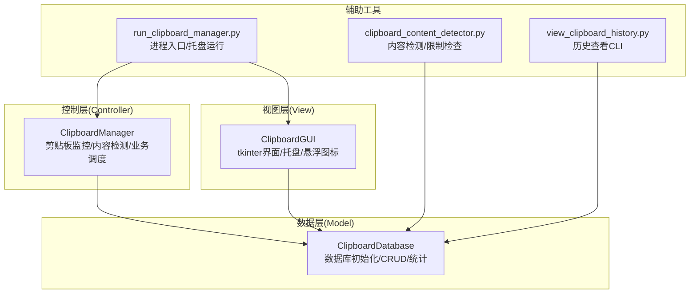
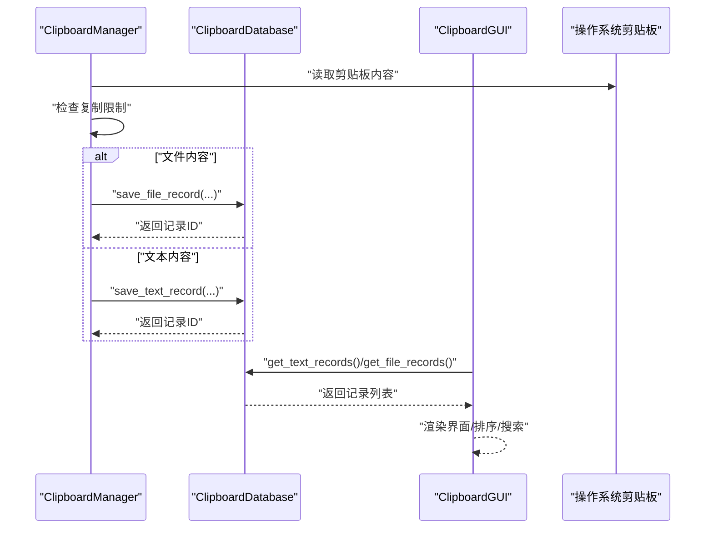
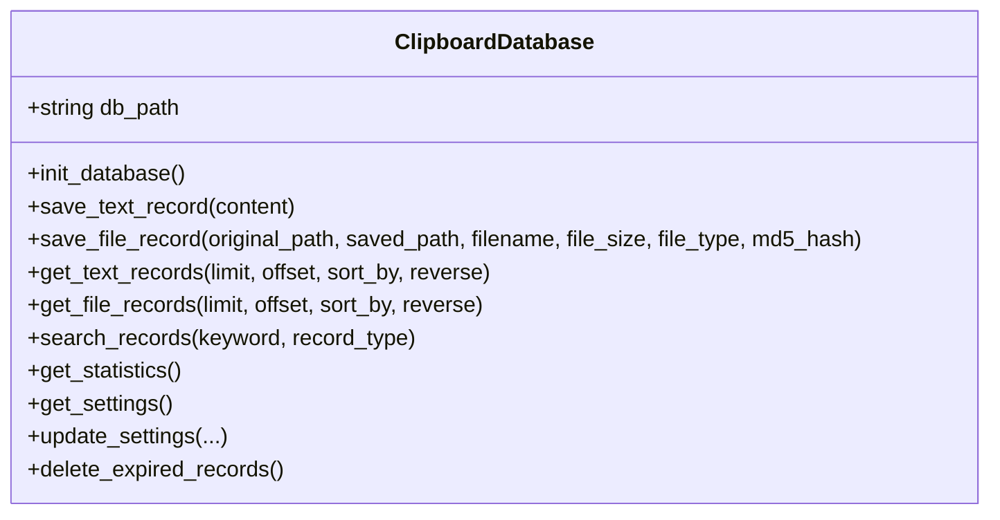
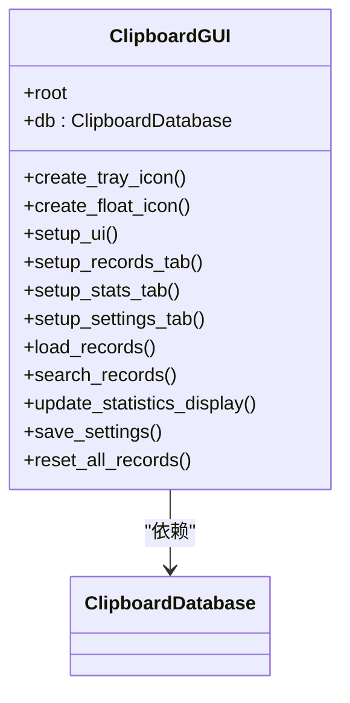
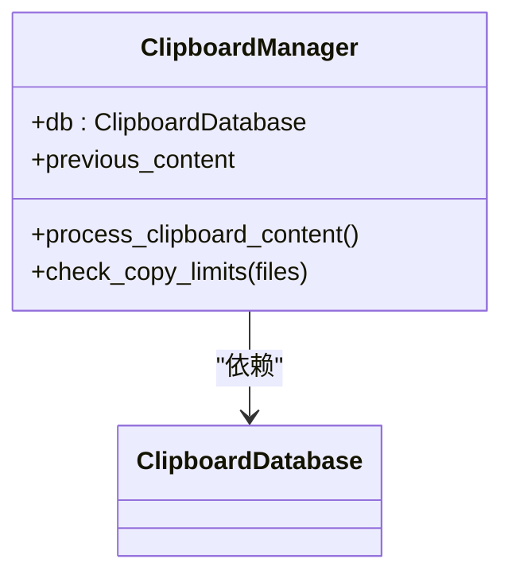
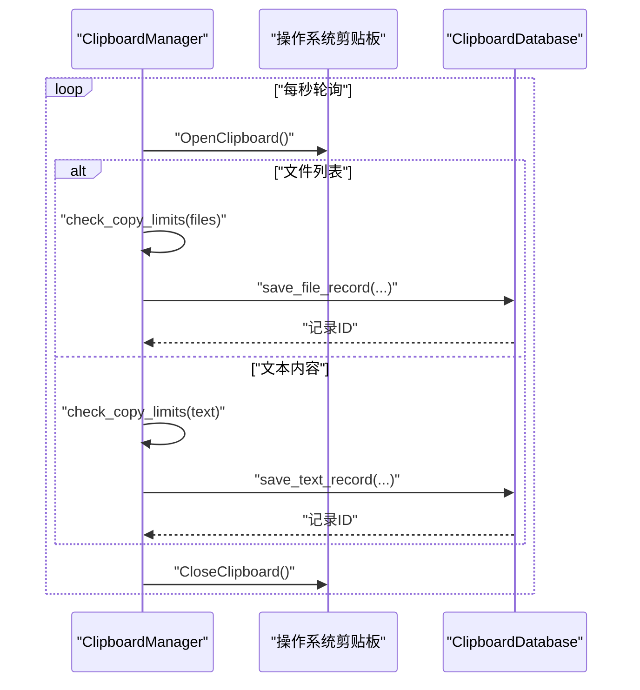
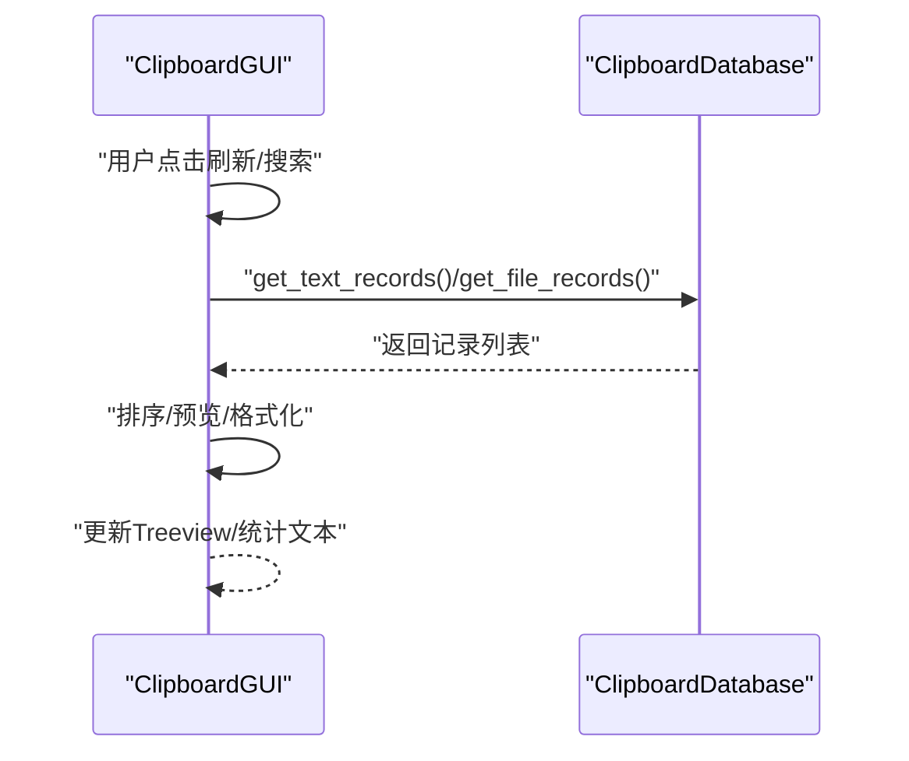
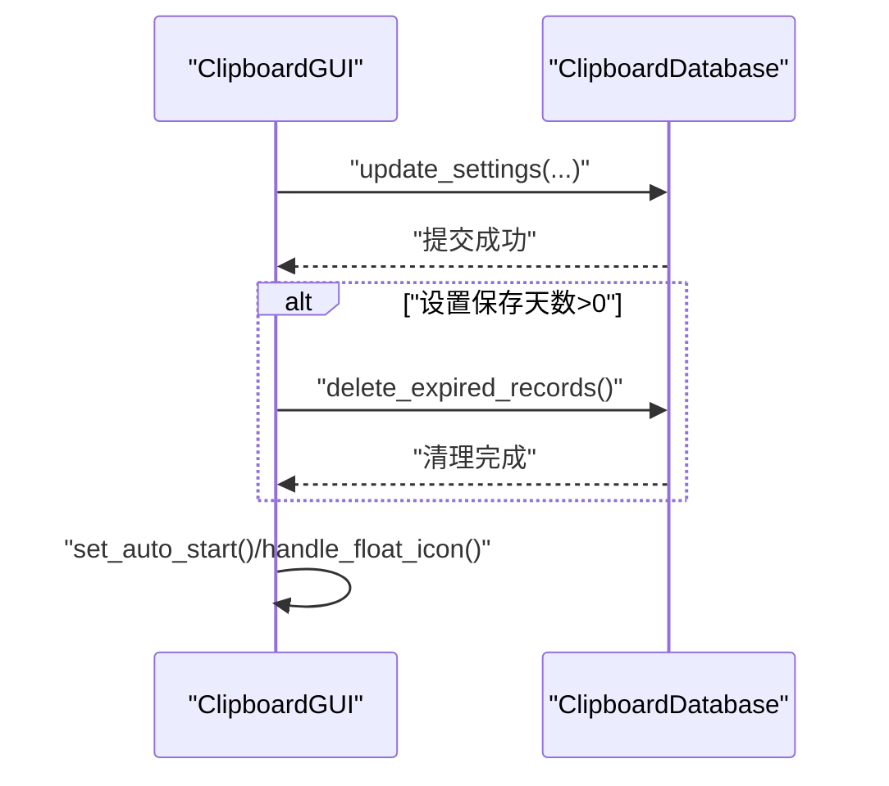
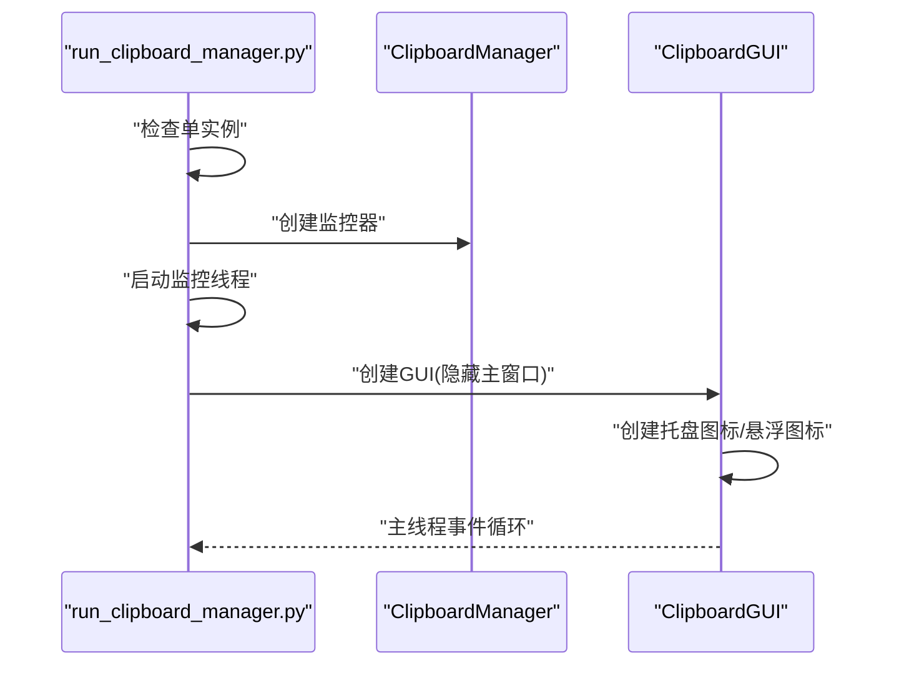
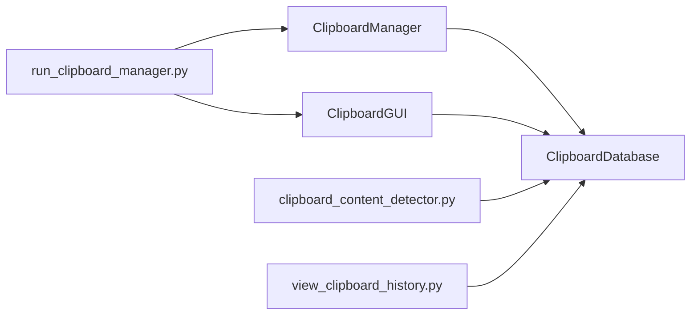

# MVC架构设计

<cite>
**本文引用的文件**
- [clipboard_db.py](file://clipboard_db.py)
- [clipboard_gui.py](file://clipboard_gui.py)
- [clipboard_manager_main.py](file://clipboard_manager_main.py)
- [clipboard_content_detector.py](file://clipboard_content_detector.py)
- [run_clipboard_manager.py](file://run_clipboard_manager.py)
- [view_clipboard_history.py](file://view_clipboard_history.py)
</cite>

## 目录
1. [简介](#简介)
2. [项目结构](#项目结构)
3. [核心组件](#核心组件)
4. [架构总览](#架构总览)
5. [详细组件分析](#详细组件分析)
6. [依赖分析](#依赖分析)
7. [性能考虑](#性能考虑)
8. [故障排查指南](#故障排查指南)
9. [结论](#结论)
10. [附录](#附录)

## 简介
本项目采用经典的MVC（Model-View-Controller）架构设计，围绕“剪贴板历史记录”这一核心业务目标，将数据持久化、界面展示与业务控制三者分离：
- Model（模型）：负责SQLite数据库的初始化、CRUD操作、数据校验与统计等纯数据逻辑，由 ClipboardDatabase 承担。
- View（视图）：负责tkinter界面布局、用户交互响应、系统托盘集成与悬浮图标等展示逻辑，由 ClipboardGUI 承担。
- Controller（控制器）：负责剪贴板监控循环、内容检测与业务逻辑调度，由 ClipboardManager 承担。

通过清晰的职责划分，系统实现了关注点分离、可维护性提升与测试便利性增强。本文将深入分析各层之间的依赖关系与通信机制，并结合时序图与类图帮助读者理解整体架构。

## 项目结构
项目采用按职责分层的文件组织方式，核心文件如下：
- 数据层：clipboard_db.py
- 视图层：clipboard_gui.py
- 控制层：clipboard_manager_main.py
- 辅助工具：clipboard_content_detector.py、run_clipboard_manager.py、view_clipboard_history.py

图表来源
- [clipboard_db.py](file://clipboard_db.py#L1-L455)
- [clipboard_gui.py](file://clipboard_gui.py#L1-L1730)
- [clipboard_manager_main.py](file://clipboard_manager_main.py#L1-L761)
- [clipboard_content_detector.py](file://clipboard_content_detector.py#L1-L274)
- [run_clipboard_manager.py](file://run_clipboard_manager.py#L1-L71)
- [view_clipboard_history.py](file://view_clipboard_history.py#L1-L75)

章节来源
- [clipboard_db.py](file://clipboard_db.py#L1-L455)
- [clipboard_gui.py](file://clipboard_gui.py#L1-L1730)
- [clipboard_manager_main.py](file://clipboard_manager_main.py#L1-L761)
- [clipboard_content_detector.py](file://clipboard_content_detector.py#L1-L274)
- [run_clipboard_manager.py](file://run_clipboard_manager.py#L1-L71)
- [view_clipboard_history.py](file://view_clipboard_history.py#L1-L75)

## 核心组件
- ClipboardDatabase（Model）
  - 负责数据库初始化、表结构演进、文本/文件记录的增删改查、搜索、统计与设置管理。
  - 关键方法：init_database、save_text_record、save_file_record、get_text_records、get_file_records、search_records、get_statistics、get_settings、update_settings、delete_expired_records 等。
- ClipboardGUI（View）
  - 负责主窗口布局、笔记本页签、树形视图、搜索与排序、统计展示、设置编辑、系统托盘与悬浮图标。
  - 关键方法：setup_ui、setup_records_tab、setup_stats_tab、setup_settings_tab、load_records、search_records、update_statistics_display、create_tray_icon、create_float_icon 等。
- ClipboardManager（Controller）
  - 负责剪贴板监控循环、内容检测（文本/文件）、复制限制检查、调用Model进行数据持久化。
  - 关键方法：process_clipboard_content、check_copy_limits 等。
- ClipboardGUIMain（View）
  - 与 clipboard_manager_main.py 中的 GUI 主界面类，负责独立GUI模式下的界面与数据加载。
- clipboard_content_detector.py
  - 提供剪贴板内容检测、格式识别、复制限制检查与格式化输出，供 CLI 或其他场景使用。
- run_clipboard_manager.py
  - 进程入口，负责单实例检查、后台监控线程启动与GUI托盘运行。
- view_clipboard_history.py
  - CLI 历史查看工具，直接调用 ClipboardDatabase 查询并打印结果。

章节来源
- [clipboard_db.py](file://clipboard_db.py#L1-L455)
- [clipboard_gui.py](file://clipboard_gui.py#L1-L1730)
- [clipboard_manager_main.py](file://clipboard_manager_main.py#L1-L761)
- [clipboard_content_detector.py](file://clipboard_content_detector.py#L1-L274)
- [run_clipboard_manager.py](file://run_clipboard_manager.py#L1-L71)
- [view_clipboard_history.py](file://view_clipboard_history.py#L1-L75)

## 架构总览
MVC 三层协作流程：
- Controller（ClipboardManager）在后台线程中持续监控剪贴板，检测到变化后进行复制限制检查与内容分类，随后调用 Model（ClipboardDatabase）执行持久化。
- View（ClipboardGUI）通过 Model 获取数据并渲染界面；用户操作触发 View 调用 Model 的更新/删除/清空等方法。
- Model 仅负责数据与事务，不参与界面逻辑；View 仅负责展示与交互，不直接访问剪贴板；Controller 仅负责业务调度与监控循环。

图表来源
- [clipboard_manager_main.py](file://clipboard_manager_main.py#L355-L496)
- [clipboard_db.py](file://clipboard_db.py#L116-L205)
- [clipboard_gui.py](file://clipboard_gui.py#L581-L648)

## 详细组件分析

### Model 层：ClipboardDatabase
- 职责边界
  - 数据库初始化与表结构演进（含字段/索引兼容性处理）。
  - 文本记录与文件记录的CRUD、去重（基于md5_hash）、统计与搜索。
  - 设置项管理（最大复制大小、数量、保留天数、开机自启、悬浮图标等）。
- 关键实现要点
  - 通过唯一索引避免重复保存相同内容，更新时递增计数字段。
  - 支持按多种字段排序与分页查询，便于View侧高效渲染。
  - 提供删除过期记录能力，结合设置项实现生命周期管理。
- 错误处理
  - IntegrityError 处理用于重复MD5场景的更新逻辑。
  - 文件删除异常捕获并打印，不影响主流程。
- 性能特性
  - 使用本地时间戳，减少时区转换开销。
  - 通过LIMIT与ORDER BY配合，降低一次性查询量。

图表来源
- [clipboard_db.py](file://clipboard_db.py#L1-L455)

章节来源
- [clipboard_db.py](file://clipboard_db.py#L1-L455)

### View 层：ClipboardGUI
- 职责边界
  - 界面布局与交互：搜索、排序、统计、设置编辑、记录列表展示。
  - 系统托盘与悬浮图标：托盘菜单、图标点击/悬停显示、主窗体切换。
  - 用户操作触发：复制选中内容、删除记录、重置数据、保存设置等。
- 关键实现要点
  - 使用ttk组件构建多标签页界面，Treeview展示记录，Scrollable Text显示统计。
  - 排序通过列标题点击切换，内部将界面列名映射到数据库字段。
  - 设置项与Model交互，保存后可触发过期清理、开机自启与悬浮图标处理。
  - 托盘与悬浮图标通过线程异步运行，避免阻塞主线程。
- 与Model的交互
  - 读取：load_records、search_records、update_statistics_display 调用 Model 的查询与统计接口。
  - 写入：save_settings、reset_all_records、delete_selected_record 等调用 Model 的更新/删除/清空接口。
- 与Controller的间接关系
  - 通过 run_clipboard_manager.py 启动后台监控线程，View在用户操作或定时刷新时从Model获取最新数据。

图表来源
- [clipboard_gui.py](file://clipboard_gui.py#L1-L1730)

章节来源
- [clipboard_gui.py](file://clipboard_gui.py#L1-L1730)

### Controller 层：ClipboardManager
- 职责边界
  - 剪贴板监控循环：周期性检测剪贴板变化，避免重复保存。
  - 内容检测与分类：区分文本与文件，分别处理。
  - 复制限制检查：数量、单文件大小、总大小限制。
  - 调用Model：将合法内容持久化到数据库。
- 关键实现要点
  - 使用win32clipboard读取剪贴板格式，判断CF_UNICODETEXT或CF_HDROP。
  - 文件保存时计算MD5，按日期与类型分类存储，避免重复拷贝。
  - 文本内容按字符数限制，受设置项约束。
  - 通过线程安全地运行监控循环，避免阻塞GUI。
- 与Model的交互
  - 读取设置：get_settings。
  - 写入数据：save_text_record/save_file_record。
  - 业务调度：previous_content 去重标识，避免重复处理。

图表来源
- [clipboard_manager_main.py](file://clipboard_manager_main.py#L355-L496)

章节来源
- [clipboard_manager_main.py](file://clipboard_manager_main.py#L1-L761)

### 时序图：剪贴板监控与数据持久化

图表来源
- [clipboard_manager_main.py](file://clipboard_manager_main.py#L395-L496)
- [clipboard_db.py](file://clipboard_db.py#L116-L183)

### 时序图：View 从 Model 获取数据并渲染

图表来源
- [clipboard_gui.py](file://clipboard_gui.py#L581-L648)
- [clipboard_db.py](file://clipboard_db.py#L185-L261)

### 时序图：View 保存设置与触发清理

图表来源
- [clipboard_gui.py](file://clipboard_gui.py#L477-L533)
- [clipboard_db.py](file://clipboard_db.py#L413-L455)

### 时序图：进程入口与托盘运行

图表来源
- [run_clipboard_manager.py](file://run_clipboard_manager.py#L1-L71)
- [clipboard_manager_main.py](file://clipboard_manager_main.py#L717-L761)
- [clipboard_gui.py](file://clipboard_gui.py#L144-L171)

## 依赖分析
- 组件耦合与内聚
  - Model 与 View 通过接口契约解耦：View 仅调用 Model 的查询/统计/设置接口，不关心数据库实现细节。
  - Controller 与 Model 通过明确的方法签名耦合，职责清晰，便于单元测试。
  - View 与 Controller 通过 run_clipboard_manager.py 间接耦合，避免直接交叉依赖。
- 外部依赖
  - win32clipboard/win32con：Windows剪贴板API。
  - sqlite3：本地数据库。
  - tkinter/pystray/PIL：GUI与托盘图标。
- 循环依赖风险
  - 当前未发现循环导入；clipboard_gui.py 直接导入 clipboard_db.py，属于View对Model的合理依赖。
  - clipboard_manager_main.py 中的 GUI 类与 Manager 类相互独立，通过 run_clipboard_manager.py 协调。

图表来源
- [clipboard_manager_main.py](file://clipboard_manager_main.py#L1-L761)
- [clipboard_gui.py](file://clipboard_gui.py#L1-L1730)
- [run_clipboard_manager.py](file://run_clipboard_manager.py#L1-L71)
- [clipboard_content_detector.py](file://clipboard_content_detector.py#L1-L274)
- [view_clipboard_history.py](file://view_clipboard_history.py#L1-L75)

章节来源
- [clipboard_manager_main.py](file://clipboard_manager_main.py#L1-L761)
- [clipboard_gui.py](file://clipboard_gui.py#L1-L1730)
- [run_clipboard_manager.py](file://run_clipboard_manager.py#L1-L71)
- [clipboard_content_detector.py](file://clipboard_content_detector.py#L1-L274)
- [view_clipboard_history.py](file://view_clipboard_history.py#L1-L75)

## 性能考虑
- 查询优化
  - Model 层提供按字段排序与LIMIT查询，View侧可避免一次性加载过多数据。
  - 搜索接口支持模糊匹配，建议在高频场景下限制返回条数。
- 存储与去重
  - 通过md5_hash唯一索引避免重复记录，减少数据库写入与存储空间占用。
  - 文件保存按类型与日期分目录，利于后续清理与检索。
- 线程与阻塞
  - 监控循环与GUI主线程分离，避免界面卡顿。
  - 托盘与悬浮图标在独立线程运行，注意资源释放与异常捕获。
- I/O与磁盘
  - 文件复制与MD5计算可能成为瓶颈，建议在批量文件场景下增加进度反馈与限速策略（当前实现未包含）。

## 故障排查指南
- 剪贴板访问失败
  - 现象：读取剪贴板时报错或无法获取内容。
  - 排查：确认OpenClipboard/CloseClipboard配对调用；避免并发访问冲突。
  - 参考路径
    - [clipboard_manager_main.py](file://clipboard_manager_main.py#L395-L496)
    - [clipboard_content_detector.py](file://clipboard_content_detector.py#L87-L137)
- 重复保存与计数异常
  - 现象：相同内容多次出现或计数不增。
  - 排查：检查md5_hash唯一索引是否生效；确认IntegrityError分支是否正确更新number字段。
  - 参考路径
    - [clipboard_db.py](file://clipboard_db.py#L116-L183)
- 设置未生效或过期清理未触发
  - 现象：修改保存天数后未清理旧记录。
  - 排查：确认save_settings是否调用update_settings；确认retention_days>0时触发delete_expired_records。
  - 参考路径
    - [clipboard_gui.py](file://clipboard_gui.py#L477-L533)
    - [clipboard_db.py](file://clipboard_db.py#L413-L455)
- 托盘图标不可用
  - 现象：缺少pystray/Pillow导致托盘功能不可用。
  - 排查：安装依赖库；确认托盘线程正常启动。
  - 参考路径
    - [clipboard_gui.py](file://clipboard_gui.py#L1-L36)
    - [run_clipboard_manager.py](file://run_clipboard_manager.py#L1-L71)

章节来源
- [clipboard_manager_main.py](file://clipboard_manager_main.py#L395-L496)
- [clipboard_content_detector.py](file://clipboard_content_detector.py#L87-L137)
- [clipboard_db.py](file://clipboard_db.py#L116-L183)
- [clipboard_gui.py](file://clipboard_gui.py#L1-L36)
- [run_clipboard_manager.py](file://run_clipboard_manager.py#L1-L71)

## 结论
本项目在MVC架构上实现了清晰的职责分离：
- Model 层专注数据与事务，具备良好的可测试性与可维护性；
- View 层专注于界面与交互，通过与Model的契约式调用实现松耦合；
- Controller 层承担业务调度与监控循环，避免了跨层调用与复杂耦合。

尽管部分文件中存在少量跨层调用（如View中直接连接数据库查询），但整体仍遵循MVC原则，且通过run_clipboard_manager.py等入口协调，保持了较好的结构清晰度。建议未来进一步强化边界，例如将View对Model的直接查询封装为服务层接口，以进一步降低耦合度。

## 附录
- 术语
  - Model：数据与业务规则的抽象，负责数据持久化与校验。
  - View：用户界面与交互，负责展示与事件响应。
  - Controller：业务调度与流程控制，协调Model与View。
- 相关文件清单
  - 数据层：clipboard_db.py
  - 视图层：clipboard_gui.py、clipboard_manager_main.py（GUI类）
  - 控制层：clipboard_manager_main.py（Manager类）、clipboard_content_detector.py
  - 入口与工具：run_clipboard_manager.py、view_clipboard_history.py