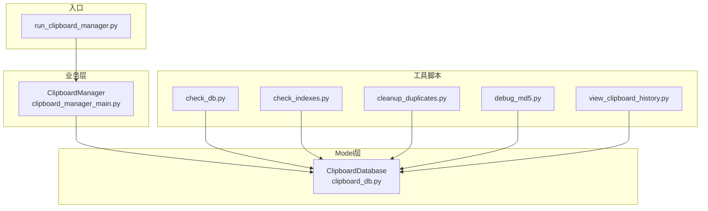
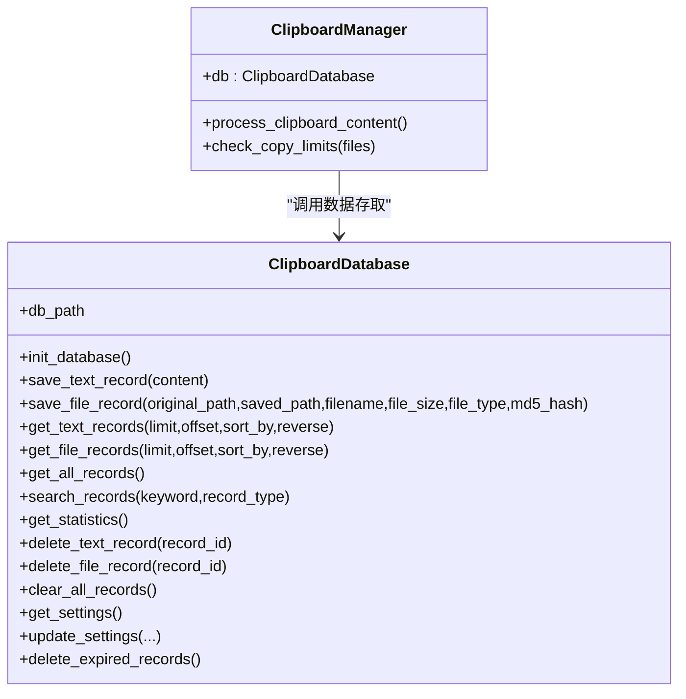
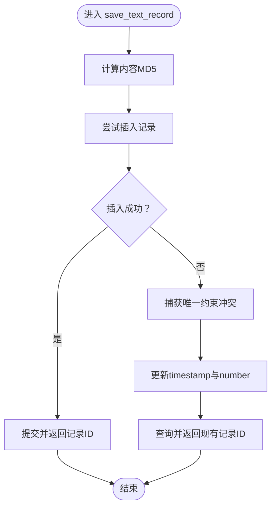
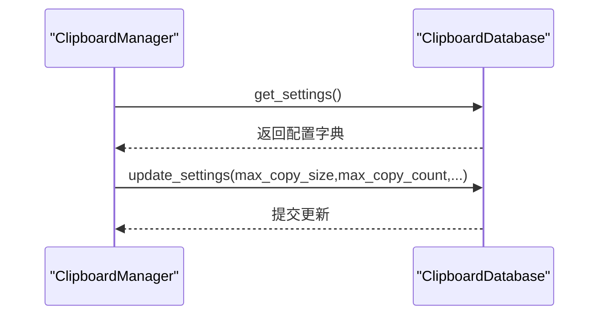
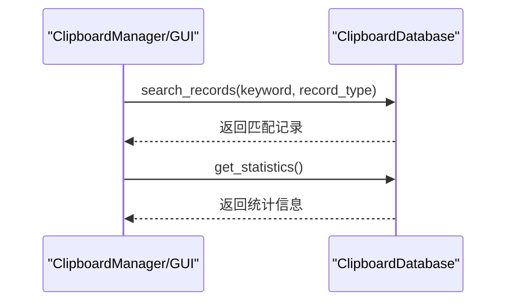
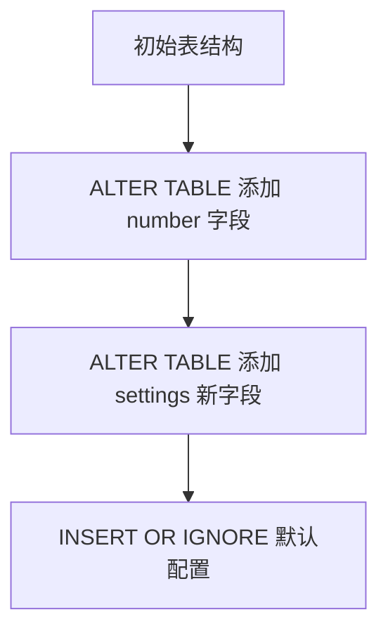
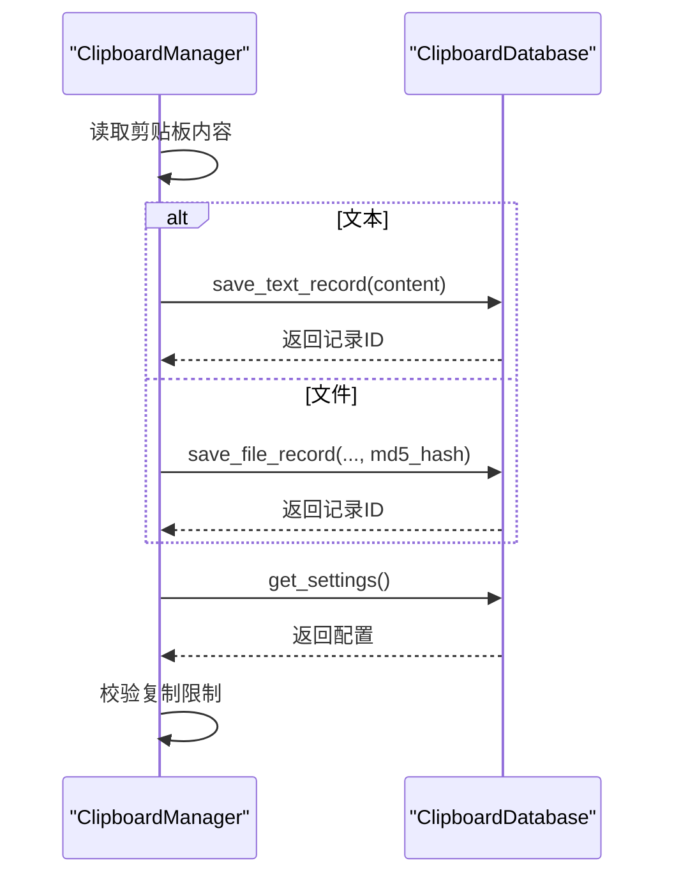
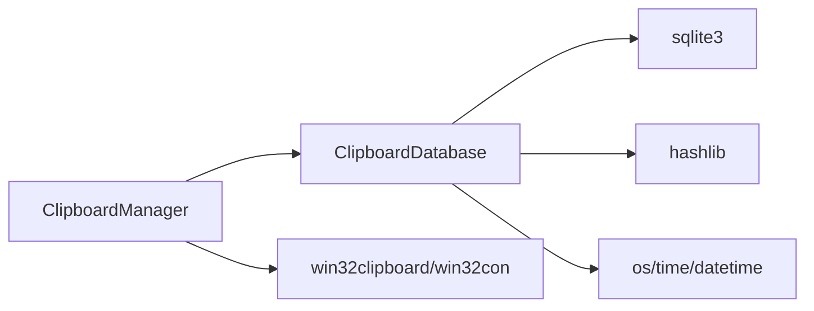

# Model层设计

<cite>
**本文引用的文件**
- [clipboard_db.py](file://clipboard_db.py)
- [clipboard_manager_main.py](file://clipboard_manager_main.py)
- [check_db.py](file://check_db.py)
- [check_indexes.py](file://check_indexes.py)
- [cleanup_duplicates.py](file://cleanup_duplicates.py)
- [debug_md5.py](file://debug_md5.py)
- [view_clipboard_history.py](file://view_clipboard_history.py)
- [run_clipboard_manager.py](file://run_clipboard_manager.py)
</cite>

## 目录
1. [简介](#简介)
2. [项目结构](#项目结构)
3. [核心组件](#核心组件)
4. [架构总览](#架构总览)
5. [详细组件分析](#详细组件分析)
6. [依赖关系分析](#依赖关系分析)
7. [性能考量](#性能考量)
8. [故障排查指南](#故障排查指南)
9. [结论](#结论)
10. [附录](#附录)

## 简介
本文件聚焦于copyhistory项目的Model层设计与实现，重点剖析ClipboardDatabase类作为数据访问对象（DAO）的核心职责与实现细节。文档涵盖：
- SQLite数据库初始化与表结构演进（text_records、file_records、settings）
- CRUD操作封装与数据完整性保障（含MD5去重与唯一索引）
- 配置管理（get_settings、update_settings）
- 数据查询、搜索与统计（search_records、get_statistics）
- 数据库迁移策略（通过ALTER TABLE动态添加字段）
- 与ClipboardManager等上层组件的交互流程
- 数据库模式图与类方法调用序列图

## 项目结构
该项目采用“分层+脚本化工具”的组织方式：
- Model层：clipboard_db.py 定义ClipboardDatabase类，负责SQLite数据库的初始化、表结构维护、CRUD与查询统计
- 业务层：clipboard_manager_main.py 定义ClipboardManager，负责剪贴板监控、内容处理、调用Model层进行数据存取
- 工具脚本：check_db.py、check_indexes.py、cleanup_duplicates.py、debug_md5.py、view_clipboard_history.py等，辅助验证与调试数据库状态
- 启动入口：run_clipboard_manager.py 提供系统托盘运行入口



图表来源
- [clipboard_db.py](file://clipboard_db.py#L1-L115)
- [clipboard_manager_main.py](file://clipboard_manager_main.py#L355-L496)
- [run_clipboard_manager.py](file://run_clipboard_manager.py#L32-L68)
- [check_db.py](file://check_db.py#L9-L31)
- [check_indexes.py](file://check_indexes.py#L9-L27)
- [cleanup_duplicates.py](file://cleanup_duplicates.py#L9-L67)
- [debug_md5.py](file://debug_md5.py#L11-L56)
- [view_clipboard_history.py](file://view_clipboard_history.py#L21-L75)

章节来源
- [clipboard_db.py](file://clipboard_db.py#L1-L115)
- [clipboard_manager_main.py](file://clipboard_manager_main.py#L355-L496)
- [run_clipboard_manager.py](file://run_clipboard_manager.py#L32-L68)

## 核心组件
ClipboardDatabase类承担以下职责：
- 数据库初始化与表结构演进：创建text_records、file_records、settings三张表，并通过ALTER TABLE为已有表动态添加字段，确保向后兼容
- 数据持久化：提供save_text_record、save_file_record的去重写入逻辑
- 查询与统计：提供文本/文件记录的分页查询、联合查询、搜索、统计信息获取
- 配置管理：提供get_settings与update_settings，支持应用运行参数
- 数据清理：提供删除过期记录的逻辑，结合settings.retention_days实现生命周期管理

章节来源
- [clipboard_db.py](file://clipboard_db.py#L18-L115)
- [clipboard_db.py](file://clipboard_db.py#L116-L184)
- [clipboard_db.py](file://clipboard_db.py#L185-L358)
- [clipboard_db.py](file://clipboard_db.py#L359-L455)

## 架构总览
ClipboardDatabase作为Model层的核心，向上层ClipboardManager提供统一的数据访问接口；工具脚本用于验证数据库状态、索引与重复数据问题。



图表来源
- [clipboard_db.py](file://clipboard_db.py#L13-L455)
- [clipboard_manager_main.py](file://clipboard_manager_main.py#L355-L496)

## 详细组件分析

### ClipboardDatabase类设计与实现
- 数据库初始化与表结构
  - text_records：包含content、timestamp、char_count、md5_hash、number等字段；通过ALTER TABLE动态添加md5_hash与number字段，并为md5_hash创建唯一索引（条件唯一索引，避免NULL值干扰）
  - file_records：包含original_path、saved_path、filename、file_size、file_type、md5_hash、timestamp、number等字段；md5_hash设为UNIQUE
  - settings：包含max_copy_size、max_copy_count、unlimited_mode、retention_days、auto_start、float_icon等字段；id为1的约束保证单实例配置
  - 初始化时通过INSERT OR IGNORE插入默认配置，确保首次运行可用

- CRUD封装
  - 保存文本记录：计算MD5，尝试插入；若唯一约束冲突，则更新timestamp与number
  - 保存文件记录：同样基于md5_hash去重，冲突时更新timestamp与number
  - 分页与排序：支持按timestamp/content/char_count/number等字段排序，LIMIT/OFFSET控制分页
  - 联合查询与搜索：get_all_records使用UNION ALL合并两类记录；search_records支持按文本内容或文件名模糊匹配
  - 统计信息：get_statistics统计文本数量、文件数量与总大小
  - 删除与清空：delete_text_record/delete_file_record/clear_all_records提供数据清理能力
  - 配置管理：get_settings返回字典；update_settings按需更新字段
  - 过期清理：delete_expired_records依据settings.retention_days删除过期记录，并同步删除磁盘文件

- 数据完整性保障
  - 唯一索引/唯一约束：text_records的md5_hash唯一索引与file_records的md5_hash唯一约束共同实现去重
  - 唯一ID约束：settings.id=1确保配置表的单实例
  - 事务边界：每个方法内独立连接与提交，保证原子性；过期清理中先查询再删除，避免并发问题

- 时间与时区
  - 保存时使用本地时间字符串，查询与排序均基于本地时间

章节来源
- [clipboard_db.py](file://clipboard_db.py#L18-L115)
- [clipboard_db.py](file://clipboard_db.py#L116-L184)
- [clipboard_db.py](file://clipboard_db.py#L185-L358)
- [clipboard_db.py](file://clipboard_db.py#L359-L455)

### MD5哈希去重逻辑
- save_text_record
  - 计算content的MD5，插入时若唯一约束冲突（IntegrityError），则更新timestamp与number字段，达到“去重+计数”效果
- save_file_record
  - 基于md5_hash唯一约束，冲突时更新timestamp与number
- 唯一索引与唯一约束
  - text_records：md5_hash唯一索引（WHERE md5_hash IS NOT NULL）
  - file_records：md5_hash唯一约束
- 重复数据处理脚本
  - cleanup_duplicates.py可检测并合并重复MD5记录，保留最新记录并累加number，随后删除冗余记录



图表来源
- [clipboard_db.py](file://clipboard_db.py#L116-L151)
- [cleanup_duplicates.py](file://cleanup_duplicates.py#L9-L67)

章节来源
- [clipboard_db.py](file://clipboard_db.py#L116-L151)
- [cleanup_duplicates.py](file://cleanup_duplicates.py#L9-L67)
- [debug_md5.py](file://debug_md5.py#L11-L56)

### 配置管理（get_settings、update_settings）
- get_settings：从settings表读取max_copy_size、max_copy_count、unlimited_mode、retention_days、auto_start、float_icon，返回字典；若无记录则返回默认值
- update_settings：按需更新上述字段，内部将布尔值转换为整数存储
- 业务侧使用：ClipboardManager.check_copy_limits会读取settings决定是否允许复制



图表来源
- [clipboard_manager_main.py](file://clipboard_manager_main.py#L362-L394)
- [clipboard_db.py](file://clipboard_db.py#L359-L412)

章节来源
- [clipboard_db.py](file://clipboard_db.py#L359-L412)
- [clipboard_manager_main.py](file://clipboard_manager_main.py#L362-L394)

### 查询、搜索与统计（search_records、get_statistics）
- search_records
  - 支持按文本内容或文件名模糊匹配，返回联合结果集并按timestamp降序
- get_statistics
  - 统计text_records数量、file_records数量与总大小
- get_text_records/get_file_records
  - 支持limit/offset与多字段排序，便于分页展示



图表来源
- [clipboard_db.py](file://clipboard_db.py#L281-L333)
- [clipboard_db.py](file://clipboard_db.py#L185-L261)

章节来源
- [clipboard_db.py](file://clipboard_db.py#L185-L333)
- [view_clipboard_history.py](file://view_clipboard_history.py#L21-L75)

### 数据库迁移策略（ALTER TABLE）
- 版本演进
  - 初始版本：text_records包含content、timestamp、char_count；file_records包含original_path、saved_path、filename、file_size、file_type、md5_hash、timestamp
  - 升级后：通过ALTER TABLE为text_records/file_records添加number字段；为settings添加retention_days、auto_start、float_icon字段
- 兼容性
  - 使用try/except捕获“字段已存在”异常，确保多次运行不报错
  - 通过INSERT OR IGNORE确保默认配置存在



图表来源
- [clipboard_db.py](file://clipboard_db.py#L33-L114)

章节来源
- [clipboard_db.py](file://clipboard_db.py#L33-L114)

### 与ClipboardManager的交互
- ClipboardManager在process_clipboard_content中：
  - 读取剪贴板文本或文件列表
  - 对文件计算MD5、分类、复制到目标目录
  - 调用ClipboardDatabase.save_text_record/save_file_record写入数据库
  - 通过check_copy_limits读取settings进行容量/数量限制校验
- GUI层通过ClipboardDatabase.get_text_records/get_file_records/search_records等方法展示与检索历史



图表来源
- [clipboard_manager_main.py](file://clipboard_manager_main.py#L395-L496)
- [clipboard_db.py](file://clipboard_db.py#L116-L184)
- [clipboard_db.py](file://clipboard_db.py#L359-L412)

章节来源
- [clipboard_manager_main.py](file://clipboard_manager_main.py#L395-L496)

## 依赖关系分析
- 组件耦合
  - ClipboardManager强依赖ClipboardDatabase，形成清晰的分层
  - 工具脚本与Model层松耦合，仅通过数据库文件交互
- 外部依赖
  - sqlite3：标准库，无需额外安装
  - hashlib：标准库，用于MD5计算
  - os/time/datetime：标准库，用于文件与时间处理



图表来源
- [clipboard_manager_main.py](file://clipboard_manager_main.py#L1-L55)
- [clipboard_db.py](file://clipboard_db.py#L1-L12)

章节来源
- [clipboard_manager_main.py](file://clipboard_manager_main.py#L1-L55)
- [clipboard_db.py](file://clipboard_db.py#L1-L12)

## 性能考量
- 唯一索引与约束
  - text_records的md5_hash唯一索引与file_records的md5_hash唯一约束显著降低重复写入成本
- 查询优化
  - 模糊匹配LIKE可能无法利用索引，建议在高频搜索场景下考虑全文索引或专用搜索引擎
- 分页与排序
  - get_text_records/get_file_records支持LIMIT/OFFSET，建议配合索引字段排序
- 过期清理
  - delete_expired_records按timestamp范围删除，建议定期执行并监控删除量

[本节为通用指导，不直接分析具体文件]

## 故障排查指南
- 验证MD5去重
  - 使用debug_md5.py对相同文本进行两次保存，观察number字段是否递增且记录ID一致
- 检查数据库内容
  - 使用check_db.py查看最近带MD5的记录与重复MD5组
- 检查索引
  - 使用check_indexes.py确认text_records/file_records的索引是否存在
- 清理重复数据
  - 使用cleanup_duplicates.py合并重复MD5记录，保留最新记录并累加number
- 查看历史
  - 使用view_clipboard_history.py快速浏览最近文本/文件记录与统计信息

章节来源
- [debug_md5.py](file://debug_md5.py#L11-L56)
- [check_db.py](file://check_db.py#L9-L31)
- [check_indexes.py](file://check_indexes.py#L9-L27)
- [cleanup_duplicates.py](file://cleanup_duplicates.py#L9-L67)
- [view_clipboard_history.py](file://view_clipboard_history.py#L21-L75)

## 结论
ClipboardDatabase通过简洁而稳健的SQLite实现，完成了数据持久化、去重、查询与配置管理等核心职责。其基于ALTER TABLE的迁移策略确保了版本演进的平滑性；MD5哈希与唯一索引有效保障了数据完整性与一致性。结合ClipboardManager的业务逻辑，形成了从剪贴板监控到历史管理的完整闭环。建议后续在高频搜索场景引入更高效的索引或搜索引擎，并完善异常日志与监控指标以提升可观测性。

[本节为总结性内容，不直接分析具体文件]

## 附录

### 数据库模式图
```mermaid
erDiagram
TEXT_RECORDS {
integer id PK
text content
datetime timestamp
integer char_count
text md5_hash
integer number
}
FILE_RECORDS {
integer id PK
text original_path
text saved_path
text filename
integer file_size
text file_type
text md5_hash UK
datetime timestamp
integer number
}
SETTINGS {
integer id PK CK
integer max_copy_size
integer max_copy_count
integer unlimited_mode
integer retention_days
integer auto_start
integer float_icon
}
```

图表来源
- [clipboard_db.py](file://clipboard_db.py#L24-L114)